# 如何建立数据科学投资组合

> 原文：[`www.kdnuggets.com/2018/07/build-data-science-portfolio.html`](https://www.kdnuggets.com/2018/07/build-data-science-portfolio.html)

 评论

**作者：[Michael Galarnyk](https://www.linkedin.com/in/michaelgalarnyk/)，数据科学家**

投资组合是一种展示你是数据科学领域独角兽的方式。

* * *

## 我们的前三大课程推荐

 1\. [Google 网络安全证书](https://www.kdnuggets.com/google-cybersecurity) - 快速进入网络安全职业道路

 2\. [Google 数据分析专业证书](https://www.kdnuggets.com/google-data-analytics) - 提升你的数据分析能力

 3\. [Google IT 支持专业证书](https://www.kdnuggets.com/google-itsupport) - 支持你所在组织的 IT

* * *

**如何在数据科学领域找到工作？** 知道足够的统计学、机器学习、编程等技能以获得工作是困难的。最近我发现，很多人**可能** **具备了获得工作的必要技能，但没有投资组合**。尽管简历很重要，但拥有数据科学技能的公开证据的投资组合可以对你的求职前景产生奇妙的影响。即使你有推荐，**能够展示你的能力而不仅仅是告诉潜在雇主你能做些什么也是重要的**。本文将包含链接，介绍各种数据科学专业人士（数据科学经理、数据科学家、社交媒体达人或这些的组合）及其他人谈论投资组合应包含的内容以及如何引起注意。好了，我们开始吧！

### **投资组合的重要性**

除了通过制作投资组合来学习的好处外，投资组合还很重要，因为它可以帮助你获得就业机会。本文的目的在于将投资组合定义为你数据科学技能的公开证据。这个定义来源于[David Robinson](https://twitter.com/drob)，他是 DataCamp 的首席数据科学家，在接受[Marissa Gemma](https://www.twitter.com/marissagemma)采访时提到的，他被问到如何找到第一份行业工作时说，

> 对我来说，最有效的策略是进行公开工作。我在博士后期写博客和做了大量的开源开发，这些工作帮助提供了我数据科学技能的公开证据。但我获得的第一个行业职位的方式是公开工作的一个特别值得注意的例子。在我的博士期间，我是编程网站 Stack Overflow 的活跃回答者，公司的一位工程师看到我的一个回答（一个解释贝塔分布直观的回答）。他对这个回答印象深刻，于是通过[Twitter]联系了我，经过几次面试后，[我被录用了](http://varianceexplained.org/r/year_data_scientist/)。

你可能会认为这是一种偶然事件，但你会发现你越活跃，发生这种事情的机会就越大。从[David 的博客文章](http://varianceexplained.org/r/start-blog/)中，

> 你做的公开工作越多，发生这种意外事件的机会就越高：有人注意到你的工作并将你引向一个工作机会，或者有人在面试你时听说了你做过的工作。

人们常常忘记，软件工程师和数据科学家也会在谷歌上搜索他们的问题。如果这些人通过阅读你的公开工作来解决了他们的问题，他们可能会对你有更好的看法并联系你。

### **应对经验要求的作品集**

即使是入门级职位，大多数公司也希望拥有至少有一点实际经验的人。你可能见过如下的表情包。

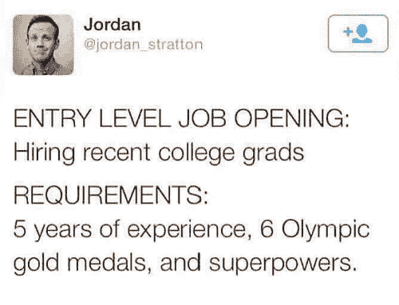

问题是，如果你需要经验才能获得第一份工作，那么你怎么获得经验？如果有答案，那就是**项目**。项目可能是工作经验的最佳替代品，或者正如[Will Stanton](https://will-stanton.com/2015/07/15/creating-a-great-data-science-resume/)所说，

> 如果你没有数据科学家的任何经验，那么你绝对*必须*做独立项目。

事实上，当[Jonathan Nolis](https://medium.com/@skyetetra)[面试候选人](https://medium.com/@skyetetra/hiring-data-scientists-my-interview-questions-56d5ae3fc621)时，他希望听到你最近遇到的一个问题/项目的描述。

> 我想了解他们最近做的一个项目。我会问他们项目是如何开始的，如何确定值得投入时间和精力，他们的过程以及他们的结果。我还会问他们从项目中学到了什么。我从这个问题的回答中获益良多：如果他们能讲述一个故事，问题如何与更大的背景相关，以及他们如何解决困难的工作。

如果你没有一些与数据科学相关的工作经验，最佳选择是谈论你曾经做过的数据科学项目。

### **应包括在作品集中的项目类型**

数据科学是一个非常广泛的领域，很难知道招聘经理希望看到什么样的项目。 [William Chen](https://twitter.com/wzchen)，Quora 的数据科学经理，在 Kaggle 的 CareerCon 2018 上分享了他的想法（[视频](https://youtu.be/xrhPjE7wHas?t=30m9s)）。

> 我喜欢那些展示出他们对数据有深入兴趣的项目，超越了家庭作业的范围。任何探索有趣数据集并找到有趣结果的课程期末项目……投入精力在撰写报告上……我真的很喜欢看到那些很好的报告，其中人们发现了有趣且新颖的东西……有一些可视化并分享他们的工作。

很多人认识到创建项目的价值，但许多人会想知道从哪里获得有趣的数据集以及如何处理这些数据。 [Jason Goodman](https://medium.com/@jasonkgoodman)，Airbnb 的数据科学家，写了一篇文章 [关于构建数据作品集项目的建议](https://medium.com/@jasonkgoodman/advice-on-building-data-portfolio-projects-c5f96d8a0627)，在文章中他讨论了许多不同的项目想法，并给出了关于应该使用哪些数据集的好建议。他还赞同了威廉（William）的一个观点，即处理有趣的数据。

> 我发现最好的作品集项目更多地涉及处理有趣的数据，而不是做复杂的建模。很多人使用财务信息或 Twitter 数据进行项目；这些数据可以工作，但本身并不特别有趣，因此你面临的挑战更大。

文章中的另一个观点是，网络爬取是获取有趣数据的好方法。如果你有兴趣学习如何通过 Python 进行网络爬取以构建自己的数据集，你可以查看我的文章 [这里](https://towardsdatascience.com/using-scrapy-to-build-your-own-dataset-64ea2d7d4673)。如果你来自学术界，重要的是要注意你的论文可以作为一个项目（一个非常大的项目）。你可以在 [这里](https://youtu.be/xrhPjE7wHas?t=31m15s) 听到 [William Chen](https://twitter.com/wzchen) 谈论这个话题。

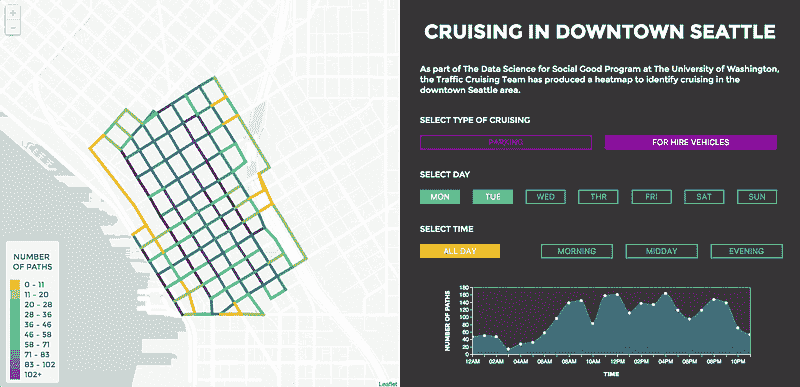

Traffic Cruising Data Science for Social Good Project ([`github.com/uwescience/TrafficCruising-DSSG2017`](https://github.com/uwescience/TrafficCruising-DSSG2017))。这是一个我个人觉得有趣的项目示例，但外面还有很多有趣的项目。致谢 ([Orysya Stus](https://github.com/OrysyaStus), [Brett Bejcek](https://github.com/bmbejcek), [Michael Vlah](https://github.com/vlahm), [Anamol Pundle](https://github.com/anamol))

### **不应包括在作品集中的项目类型**

我发现一个非常常见的建议（在这篇博客文章中出现了多次）是你的作品集中不要包含常见的项目。

[杰雷米·哈里斯](https://towardsdatascience.com/@jeremie_sharpestminds)在[《成为数据科学家最容易失败的四种方式》](https://towardsdatascience.com/the-4-fastest-ways-not-to-get-hired-as-a-data-scientist-565b42bd011e)中说，

> 很难想到比在你的个人项目中展示你在琐碎的概念验证数据集上做的工作更快地让你的简历被放入“绝对不行”堆的方式。
> 
> 当你感到困惑时，这里有一些项目，它们对你造成的伤害大于帮助：
> 
> * 使用[Titanic 数据集](https://www.kaggle.com/c/titanic)进行生存分类。
> 
> * 手写数字分类使用了[MNIST 数据集](https://www.tensorflow.org/versions/r1.2/get_started/mnist/pros)。
> 
> * 使用[鸢尾花数据集](https://archive.ics.uci.edu/ml/datasets/iris)进行花卉种类分类。

下图展示了泰坦尼克号 (A)、MNIST (B) 和鸢尾花 (C) 数据集的部分分类示例。没有很多方法可以利用这些数据集让你在其他申请者中脱颖而出。确保列出新颖的项目。

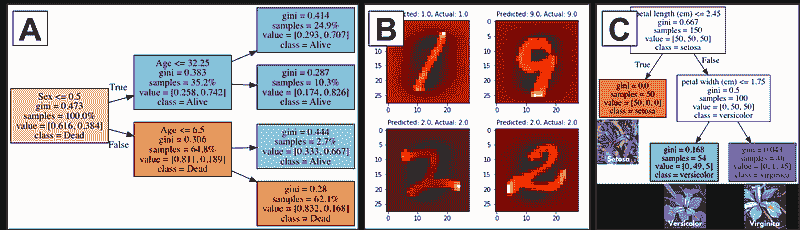

泰坦尼克号 (A)、MNIST (B) 和鸢尾花 (C) 分类

### **作品集是迭代的**

[法维奥·瓦兹克斯](https://towardsdatascience.com/@faviovazquez)有一篇[优秀的文章](https://towardsdatascience.com/how-to-get-a-job-as-a-data-scientist-f417078fe13e)，讲述了他如何获得数据科学家的工作。当然，他的一个建议是拥有一个作品集。

> 拥有一个作品集。如果你在寻找一个严肃的付费数据科学工作，做一些实际数据的项目。如果可以的话，把它们发布到 GitHub 上。除了 Kaggle 比赛外，找到你喜欢的东西或你想解决的问题，并利用你的知识来做这些事情。

另一个有趣的发现是，在求职过程中，你必须不断改进。

> 我申请了差不多 125 个工作（真的，也许你申请了更多），只收到大约 25 到 30 个回复。有些回复只是：谢谢，但不行。我得到过将近 15 次面试。我从每一次中学到了很多。变得更好。我不得不面对许多拒绝，这实际上是我没准备好的。但我喜欢接受面试的过程（老实说，并不是所有的面试）。我学习了很多，每天编程，阅读了许多文章和帖子。这些都帮助了我很多。

随着你学习的深入和自我提升，你的作品集也应该进行更新。这种观点在许多其他建议文章中都有提到。正如[杰森·古德曼](https://medium.com/@jasonkgoodman)所说，

> 当你公开发布一个项目时，它并没有完成。不要害怕在项目发布后继续添加或编辑它们！

这条建议在你寻找工作时尤其重要。很多成功人士的故事，例如 [凯利·彭](https://towardsdatascience.com/@kellypeng17)，她是 Airbnb 的数据科学家，她真的坚持不懈，不断工作和提升自己。在 [她的一篇博客文章](https://towardsdatascience.com/how-to-land-a-data-scientist-job-at-your-dream-company-my-journey-to-airbnb-f6a1e99892e8)中，她详细介绍了她申请和面试过的很多地方。

> 申请数量：475
> 
> 电话面试次数：50
> 
> 完成的数据科学家庭挑战：9
> 
> 现场面试次数：8
> 
> 录用：2
> 
> 花费时间：6 个月

她显然申请了很多工作并坚持不懈。在她的文章中，她甚至提到你需要从面试经验中不断学习。

> 记下你被问到的所有面试问题，特别是那些你未能回答的问题。你可以再次失败，但不要在同一个地方失败。你应该始终学习和提升自己。

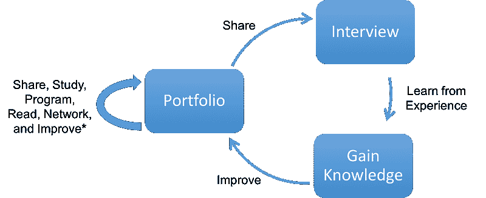

*如果你还没有获得面试机会，请申请更多的工作并继续寻找学习和提升的方法。*

### **将作品集整合到 1 页简历中**

人们找到你作品集的一个方式通常是通过你的简历，因此值得一提。数据科学简历是专注于你的技术技能的地方。你的简历是一个简洁展示你的资格和适合特定角色的机会。招聘人员和招聘经理会非常快速地浏览简历，你只有短时间来留下印象。改善简历可以增加获得面试的机会。你必须确保简历中的每一行和每一部分都很重要。

[威廉·陈](https://twitter.com/wzchen)，来自 Quora 的数据科学经理，提供了[9 个制作数据科学简历的技巧](https://youtu.be/xrhPjE7wHas?t=2m43s)。**请注意下面简要总结中的要点，项目和作品集是第 6、7、8 点，甚至可以说是第 9 点**。

**1\. 长度**：保持简洁，最多一页。这可以让你在快速浏览时产生最大影响。建议使用简单的单列简历，因为它容易浏览。

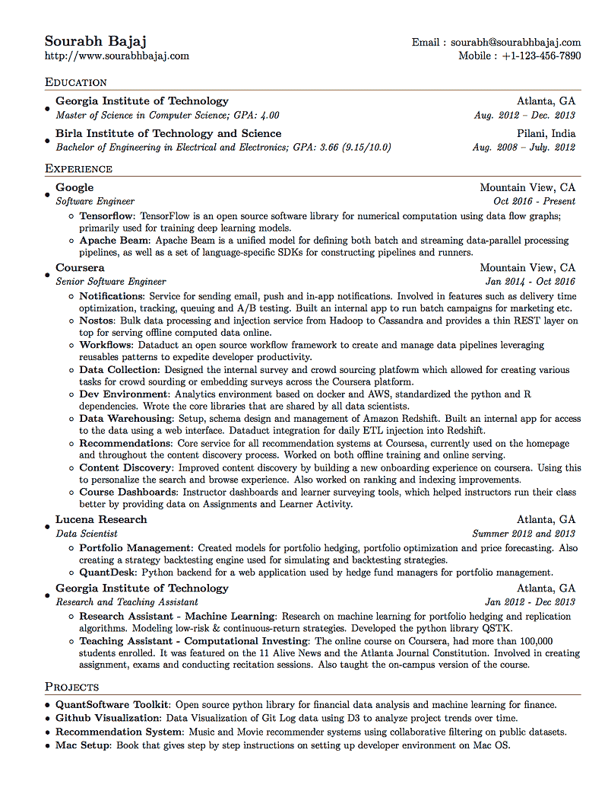

视频中使用的简历示例（latex: [`github.com/sb2nov/resume`](https://github.com/sb2nov/resume)）

**2\. 目标**：不要包含一个。它们不能帮助你与其他人区分开来。它们占用了更重要的内容（技能、项目、经验等）的空间。求职信非常可选，除非你真的个性化它。

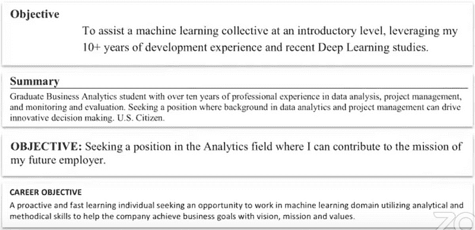

目标陈述不能帮助你与其他人区分开来。许多目标陈述说的非常相似。

**3\. 课程**：列出**相关课程**，这些课程与职位描述相关。

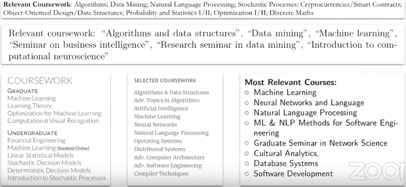

各种简历中展示的相关课程示例。

**4\. 技能**：不要对你的技能给出数值评级。如果你想对自己的技能进行评分，请使用“熟练”或“了解”等词汇。你甚至可以完全省略评估。

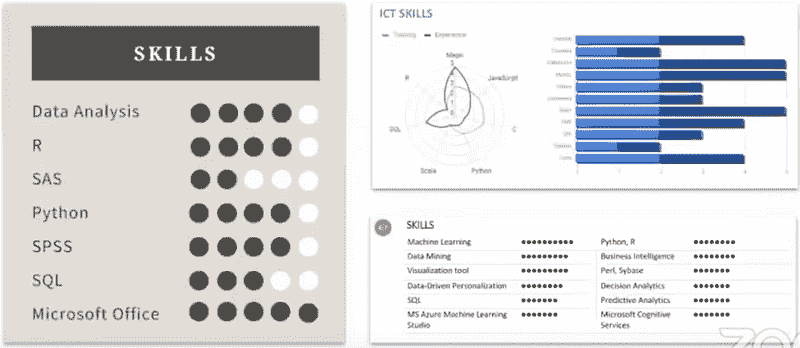

不要对你的技能给出数值评级。

**5\. 技能**：列出职位描述中提到的技术技能。你列出技能的顺序可以暗示你最擅长的领域。

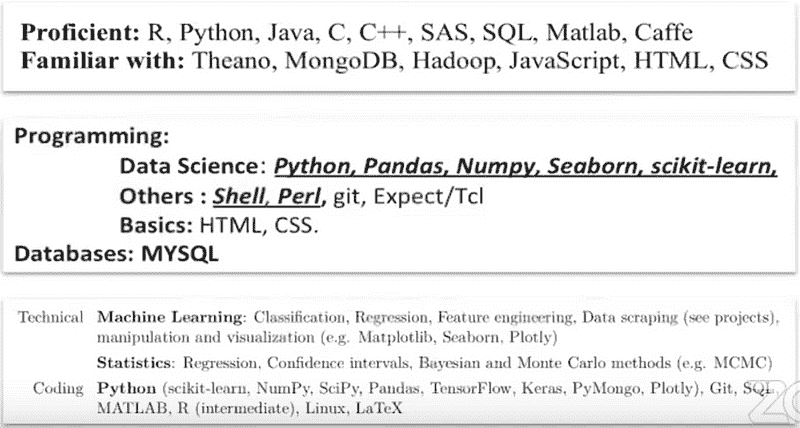

如何在简历上列出你的技能的示例

**6\. 项目**：不要列出常见的项目或作业。它们在区分你和其他申请者方面帮助不大。列出新颖的项目。

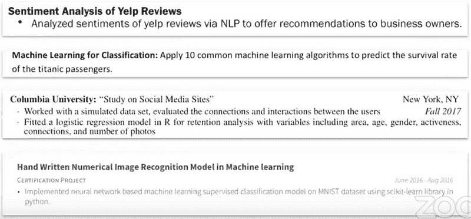

**7\. 项目**：展示结果并包含链接。如果你参与了 Kaggle 竞赛，请标明百分位排名，因为这有助于阅读你简历的人了解你在竞赛中的位置。在项目部分，总是可以加入写作和论文的链接，这样可以让招聘经理或招聘人员深入了解（偏向真实世界中的复杂问题，你可以从中学到新东西）。

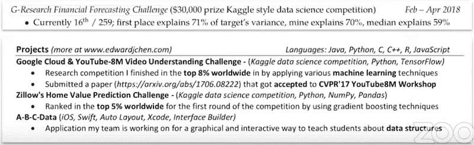

好的项目部分示例

注意在上述一个项目部分中，有一个额外的博客链接，让招聘人员或招聘经理了解更多。这是从简历中链接到你作品集各个部分的一种方式。

**8\. 作品集**：完善你的在线存在。最基本的是 LinkedIn 个人资料。这有点像一个扩展的简历。GitHub 和 Kaggle 个人资料可以帮助展示你的工作。填写每个个人资料，并包括其他网站的链接。填写你的 GitHub 仓库的描述。包括你知识分享个人资料/博客的链接（Medium、Quora）。数据科学特别注重知识分享和向他人传达数据的意义。你不必全部完成，但选择几个去做（稍后会详细说明）。

**9\. 经验**：根据工作量身定制你的经验。经验是你简历的核心，但如果你没有工作经验该怎么办？专注于独立项目，如毕业设计、独立研究、论文工作或 Kaggle 竞赛。如果你没有工作经验，这些可以作为替代。避免在简历上放置不相关的经验。

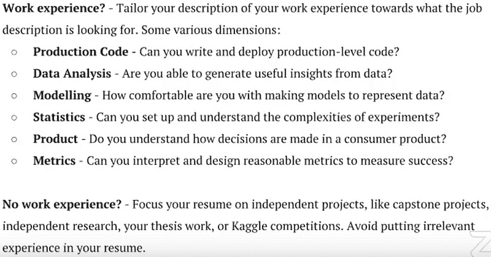

如果你想了解数据科学经理如何审查作品集和简历，这里有 Kaggle’s CareerCon 2018 的链接（[视频](https://www.youtube.com/watch?v=kBR0EtGOkzc)，[审查的简历](https://drive.google.com/drive/u/0/folders/1hqrBBZAxnhckto-gU1EKtXeesmtQqX9i)）。

### **社交媒体的重要性**

这与“投资组合的重要性”部分非常相似，只是分成了子部分。拥有 Github 页面、Kaggle 个人资料、Stack Overflow 等可以支持你的简历。拥有完善的在线个人资料对招聘经理来说是一个良好的信号。

正如 [David Robinson](http://varianceexplained.org/r/start-blog/) 所说，

> 通常，当我评估候选人时，我很高兴看到他们公开分享的内容，即使它不是完善或完成的。分享任何东西几乎总是比什么都不分享要好。
> 
> 数据科学家喜欢查看公开工作的原因是正如 Will Stanton 所说，
> 
> 数据科学家使用这些工具来分享他们的工作并找到问题的答案。如果你使用这些工具，那么你就是在向数据科学家表明你是他们中的一员，即使你从未作为数据科学家工作过。

数据科学很大程度上是关于沟通和呈现数据，因此拥有这些在线个人资料是很好的。除了这些平台帮助提供宝贵的经验之外，它们还可以帮助你被注意到并引导人们找到你的简历。人们可以通过各种渠道（LinkedIn、GitHub、Twitter、Kaggle、Medium、Stack Overflow、Tableau Public、Quora、YouTube 等）在线找到你的简历。你还会发现不同类型的社交媒体相互关联。

### ****Github****

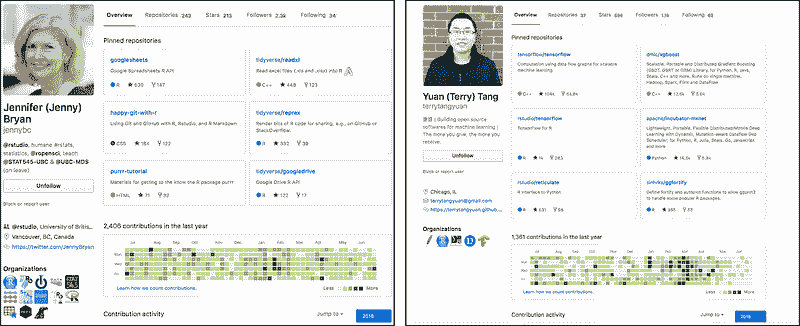

[Jennifer Bryan](https://github.com/jennybc) 和 [Yuan (Terry) Tang](https://github.com/terrytangyuan) 的 Github 个人资料

Github 个人资料是你作为一个合格数据科学家的强有力信号。在简历的项目部分，人们通常会留下指向他们 GitHub 的链接，那里存储了他们项目的代码。你也可以在上面添加写作和 Markdown。GitHub 让人们看到你构建了什么以及如何构建它。在一些公司中，招聘经理会查看申请者的 GitHub。这是向雇主展示你不是假冒伪劣的一种方式。如果你花时间完善你的 GitHub 个人资料，你将比其他人更容易被评估。

值得一提的是，你需要有某种 README.md 文件，其中包含对你项目的描述，因为**数据科学很大程度上是关于沟通结果**。确保 README.md 文件清楚地描述了你的项目是什么、做了什么以及如何运行你的代码。

### ****Kaggle****

参与 Kaggle 比赛、创建内核和参与讨论是展示数据科学家能力的一些方式。重要的是要强调 Kaggle 不像行业项目，正如[科琳·法雷利](https://www.quora.com/profile/Colleen-Farrelly-1)在这个[quora 问题](https://www.quora.com/How-well-do-you-have-to-do-on-Kaggle-in-order-to-become-a-professional-data-scientist)中提到的那样。Kaggle 比赛负责提出任务，为你获取数据，并将其清理成某种可用的形式。它的作用是给你提供分析数据和提出模型的练习。[瑞莎玛·谢赫](https://twitter.com/reshamas)有一篇文章[参加 Kaggle 还是不参加](https://reshamas.github.io/to-kaggle-or-not/)，在文章中她谈到了 Kaggle 比赛的价值。她的文章中提到，

> 的确，参加一次 Kaggle 比赛并不足以使一个人成为数据科学家。也不是上一次课程、参加一次会议教程、分析一个数据集或阅读一本数据科学书籍就能成为数据科学家。参与比赛可以增加你的经验，并丰富你的作品集。这只是对其他项目的补充，而不是检验一个人数据科学技能的唯一标准。

同样，有充分的理由说明[Kaggle 大师继续参与 Kaggle 比赛](https://www.quora.com/What-motivates-Kaggle-Grandmasters-with-many-competitions-under-their-belt-to-continue-actively-participating-in-competitions)。

### ****Linkedin****

与简历不同的是，简历受长度限制，而 LinkedIn 个人资料允许你更详细地描述你的项目和工作经验。Udacity 提供了一份[制作良好 LinkedIn 个人资料的指南](https://career-resource-center.udacity.com/linkedin-github-profiles/how-to-stand-out-on-linkedin)。LinkedIn 的一个重要部分是他们的搜索工具，为了让你出现在搜索结果中，你必须在个人资料中包含[*相关关键词*](https://www.job-hunt.org/linkedin-job-search/linkedin-keywords.shtml)。招聘人员经常在 LinkedIn 上搜索人才。LinkedIn 允许你查看哪些公司搜索了你以及谁查看了你的个人资料。

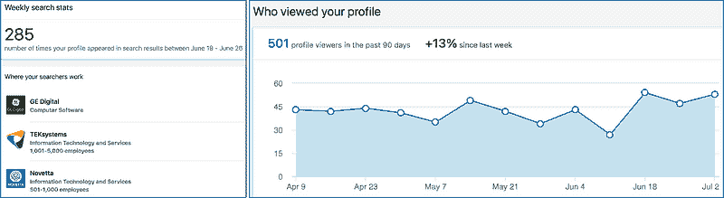

检查你的搜索者工作在哪里以及有多少人查看了你的个人资料。

除了公司找到你并向你发送关于你可用性的消息外，LinkedIn 还有许多功能，例如[请求推荐信](https://blog.linkedin.com/2018/march/19/introducing-ask-for-a-referral-making-it-easier-to-find-your-way-in)。[杰森·古德曼](https://medium.com/@jasonkgoodman)在他的文章[申请数据科学职位的建议](https://medium.com/@jasonkgoodman/advice-on-applying-to-data-science-jobs-6e62b25518e5)中利用 LinkedIn **间接**请求推荐信。

> 我从未、从未、从未在没有介绍的情况下申请过任何公司……一旦我对某家公司感兴趣，我会使用 LinkedIn 寻找该公司的第一度或第二度关系。我会联系那个关系，询问他们关于在公司的经历，如果可能的话，是否能把我引荐给数据科学团队的某个人。我总是尽可能进行面对面的会谈（喝咖啡或吃午餐），而不是打电话。顺便说一下，Trey Causey 最近写了 [一篇很棒的文章](https://medium.com/@treycausey/do-you-have-time-for-a-quick-chat-c3f7e46de89d) ，介绍了如何请求这种类型的会谈。我从不直接要求工作，但他们通常会要求我的简历，并提出将我作为内部推荐人，或者把我介绍给招聘经理。如果他们似乎不愿意这样做……我会感谢他们的时间，然后继续前进。

注意他并没有立即要求推荐。虽然申请公司时常见的建议是获取推荐，但非常重要的一点是，你仍然需要一个作品集、经验或某种证明你能胜任工作的证据。Jason 甚至在那篇文章和 [他写的其他文章](https://medium.com/@jasonkgoodman/advice-on-building-data-portfolio-projects-c5f96d8a0627) 中提到作品集的重要性。

[Aman Dalmia](https://blog.usejournal.com/@amandalmia18) 通过 [在多家 AI 公司和初创企业面试中学到的东西](https://blog.usejournal.com/what-i-learned-from-interviewing-at-multiple-ai-companies-and-start-ups-a9620415e4cc) 学到了类似的东西。

> 网络不是*向人们发送信息让他们为你推荐工作*。*当我刚开始的时候，我经常犯这个错误，直到我偶然发现了 [*这篇文章*](https://www.markmeloon.com/climbing-relationship-ladder-get-data-science-job/) ，作者是 [*Mark Meloon*](https://www.linkedin.com/in/markmeloon/)*，*在这篇文章中，他谈到了通过首先提供帮助来建立*真正的*人际关系的重要性。

他说的另一个观点是 LinkedIn 对于发布你的内容/作品集非常有用。

> 网络中的另一个重要步骤是发布你的内容。例如，如果你擅长某件事，写博客并在 Facebook 和 LinkedIn 上分享这些博客*。*这不仅能帮助别人，*也能帮助你*。

### ****Medium 和/或其他博客平台****

拥有某种形式的博客可能非常有利。很多数据科学工作涉及沟通和展示数据。写博客是练习这项技能的方式，并展示你可以做到这一点。写关于项目或数据科学主题的文章，让你与社区分享，同时鼓励你写出你的工作过程和想法。这在面试时是一项有用的技能。

正如 [David Robinson](http://varianceexplained.org/r/start-blog/) 所说，

*博客是你练习相关技能的机会*。

+   ***数据清理***：与各种数据集一起工作的一个好处是，你会学会接受数据“原封不动”，无论它是以*[*期刊文章的补充文件*](http://varianceexplained.org/r/tidy-genomics/)*还是*[*电影剧本*](http://varianceexplained.org/r/love-actually-network/)的形式出现。

+   ***统计***：处理不熟悉的数据让你能够将统计方法付诸实践，而写作传达和教授概念有助于构建你自己的理解*

+   ***机器学习***：使用预测算法一次和在各种问题上使用它之间有很大的区别，同时了解你为什么会选择一个而不是另一个*

+   ***可视化***：拥有观众对你的图表有鼓励作用，这会促使你开始打磨图表并建立个人风格*

+   ***沟通***：你在写作中获得经验，并练习构建数据驱动的论点。这可能是博客最相关的技能，因为在其他地方很难实践，而这是任何数据科学职业的核心部分*

通过写博客，你可以练习将发现传达给他人。这也是一种自我宣传的方式。关于[使用 Scrapy 构建你自己的数据集](https://towardsdatascience.com/using-scrapy-to-build-your-own-dataset-64ea2d7d4673)的博客，以及具有讽刺意味的[使用 Conda 管理 Python 环境](https://towardsdatascience.com/environment-management-with-conda-python-2-3-b9961a8a5097)博客，教会了我很多，也给我带来了许多我通常无法获得的机会。我发现的一个主要好处是，通过别人对我的项目提出批评和改进建议（通过博客的评论区），使得面试官不会成为第一个指出这些缺陷的人。更明显的好处是，通过写博客，你倾向于阅读更多的数据科学/机器学习博客帖子，从而学到更多。

至于选择哪个平台来写博客，我推荐使用 Medium。[Manali Shinde](https://medium.com/@emessence1)在她的博客文章[如何从零开始构建数据科学作品集](https://medium.com/one-datum-at-a-time/how-to-construct-a-data-science-portfolio-from-scratch-de0b70e58bc1)中指出了她选择 Medium 的原因。

> 我曾考虑在 WordPress 或 Squarespace 等平台上创建自己的网站。虽然这些平台非常适合托管自己的作品集，但我想要一个可以获得一些曝光的地方，并且有一个很好的标签系统以接触更广泛的受众。幸运的是，Medium 如我们所知，提供了这些选项（而且它也是免费的）。

如果你不知道写什么，我建议你查看[David Robinson 的建议](http://varianceexplained.org/r/start-blog/)。

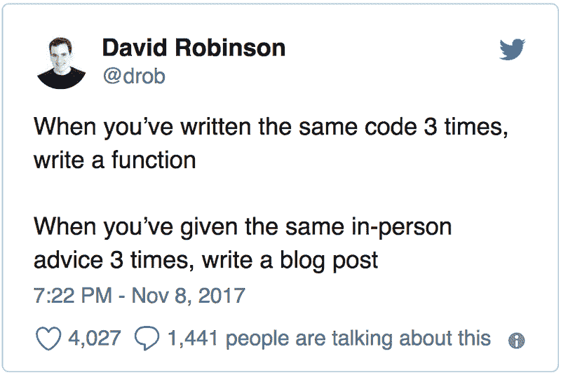

[`twitter.com/drob`](https://twitter.com/drob)

### **Twitter**

在 Twitter 上活跃是识别和与领域内人士互动的绝佳方式。你还可以在 Twitter 上推广你的博客，让你的作品集更加显眼。在 Twitter 上有很多互动机会。正如[Reshama Shaikh](https://twitter.com/reshamas)在她著名的博客文章“[如何获得我的第一份数据科学工作？](https://reshamas.github.io/first-data-science-job/)”中所说，

> [大卫·罗宾逊](https://twitter.com/drob)慷慨地提供转发你的第一篇数据科学帖子。拥有 20K+粉丝，这个提议是无法拒绝的。

Twitter 不仅仅可以用于自我推广。[Data Science Renee](https://twitter.com/BecomingDataSci)有一篇帖子“[如何利用 Twitter 学习数据科学（或其他任何东西）](https://www.becomingadatascientist.com/2015/10/04/how-to-use-twitter-to-learn-data-science-or-anything/)”，其中对如何利用 Twitter 学习技能非常有见地。她文章中的另一个收获是，Twitter 上的存在如何帮助她建立网络并获得机会。

> 我曾被邀请参加播客和博客的采访（其中一些很快就会出现），提供合同工作，并提供了一个我不幸无法参加但很高兴被考虑的会议的免费入场券。行业中的“名人”现在也来找我合作。

### **Tableau Public**

并非所有的数据科学工作都使用 Tableau 或其他 BI 工具。然而，如果你申请的是使用这些工具的工作，重要的是要知道有些网站可以让你公开展示仪表板。例如，如果你说你在学习或掌握 Tableau，可以在[Tableau Public](https://public.tableau.com/en-us/s/)上放几个仪表板。虽然很多公司可能会允许你在工作中学习 Tableau，但有公开的 Tableau 技能证据会有所帮助。如果你想查看 Tableau Public 档案的好例子，请查看[Orysya Stus’](https://public.tableau.com/profile/orysya.stus#!/)和[Brit Cava’s](https://public.tableau.com/profile/brit4337#!/)档案。

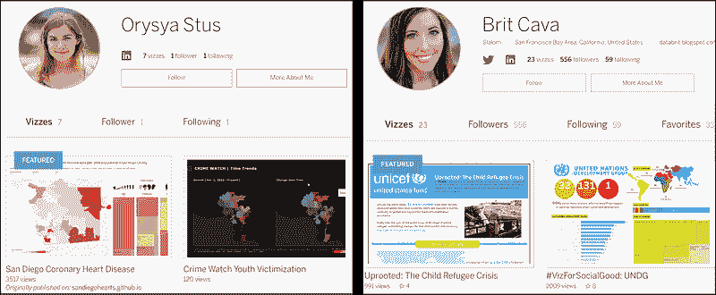

### **结论**

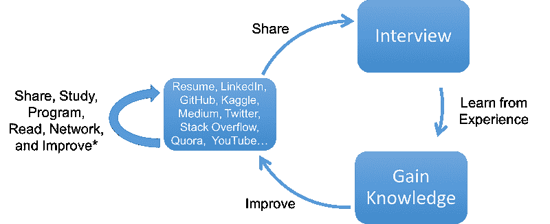

记住，作品集是一个过程。继续改进。

拥有一份强大的简历一直以来都是求职者向潜在雇主展示技能的主要工具。如今，有多种方式来展示你的技能并找到工作。公开证据的作品集是一种获取通常无法获得的机会的方法。重要的是要强调作品集是一个迭代的过程。随着知识的增长，作品集应随着时间的推移进行更新。永远不要停止学习或成长。即使是这篇博客文章也会随着反馈和知识的增加而更新。如果你需要面试建议/指南，可以查看[Brandon Rohrer 的](https://twitter.com/_brohrer_?lang=en)[数据科学面试生存建议](http://survive%20your%20data%20science%20interview/)、[Sadat 的](https://medium.com/@sadatnazrul)[面试指南](https://towardsdatascience.com/data-science-interview-guide-4ee9f5dc778)或[Springboard 的建议](https://www.springboard.com/blog/data-science-interviews-lessons/)。如果你对教程有任何问题或想法，可以在下面的评论区或通过[Twitter](https://twitter.com/GalarnykMichael)联系我。

**个人简介： [Michael Galarnyk](https://www.linkedin.com/in/michaelgalarnyk/)** 是一名数据科学家和企业培训师。他目前在 Scripps 转化研究所工作。你可以在 Twitter ([`twitter.com/GalarnykMichael`](https://twitter.com/GalarnykMichael))、Medium ([`medium.com/@GalarnykMichael`](https://medium.com/@GalarnykMichael)) 和 GitHub ([`github.com/mGalarnyk`](https://github.com/mGalarnyk))上找到他。

[原文](https://towardsdatascience.com/how-to-build-a-data-science-portfolio-5f566517c79c)。经许可转载。

**相关：**

+   大数据和数据科学中的 5 条职业路径解析

+   2018 年能让你被聘用的 5 个数据科学项目

+   解释正态分布的 68-95-99.7 规则

### 更多相关话题

+   [停止学习数据科学以寻找目标，并寻找目标以……](https://www.kdnuggets.com/2021/12/stop-learning-data-science-find-purpose.html)

+   [学习数据科学统计的顶级资源](https://www.kdnuggets.com/2021/12/springboard-top-resources-learn-data-science-statistics.html)

+   [成功的数据科学家的 5 个特征](https://www.kdnuggets.com/2021/12/5-characteristics-successful-data-scientist.html)

+   [每个数据科学家都应该知道的三个 R 库（即使你使用 Python）](https://www.kdnuggets.com/2021/12/three-r-libraries-every-data-scientist-know-even-python.html)

+   [一个 90 亿美元的 AI 失败，详细分析](https://www.kdnuggets.com/2021/12/9b-ai-failure-examined.html)

+   [是什么让 Python 成为初创公司的理想编程语言](https://www.kdnuggets.com/2021/12/makes-python-ideal-programming-language-startups.html)
