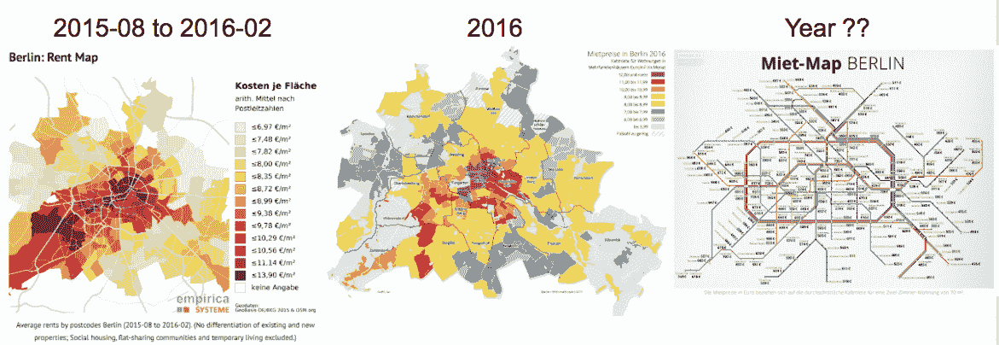
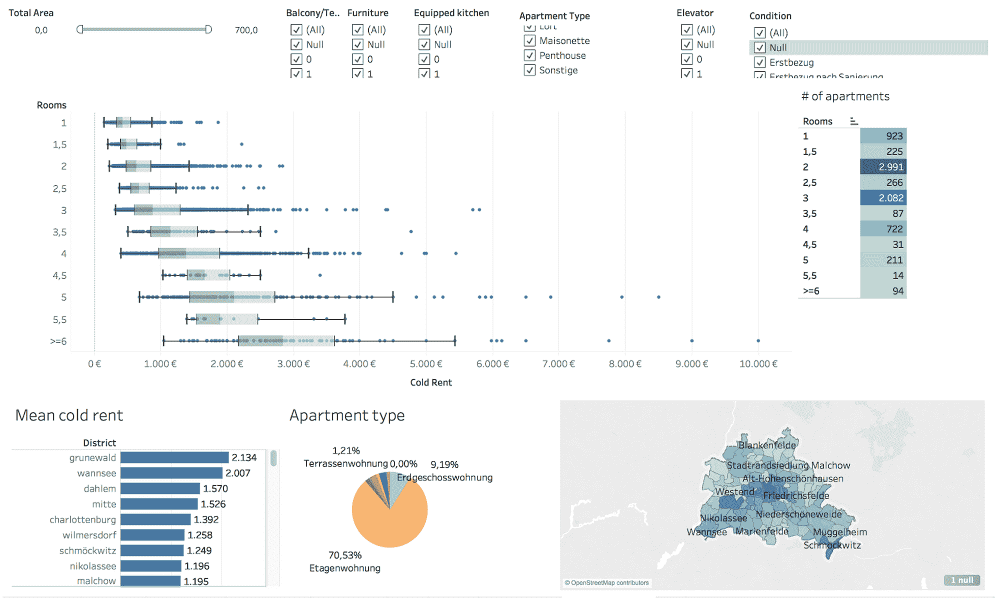
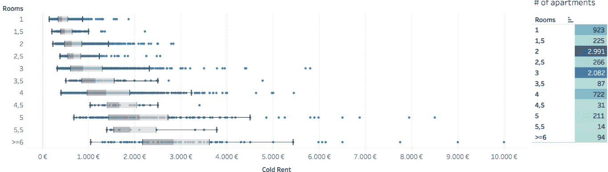
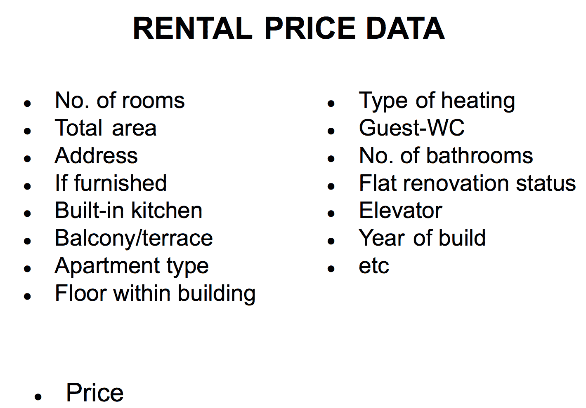
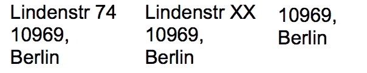

# 如何从零开始构建数据科学项目

> 原文：[`www.kdnuggets.com/2018/12/build-data-science-project-from-scratch.html`](https://www.kdnuggets.com/2018/12/build-data-science-project-from-scratch.html)

 评论

**由 [Jekaterina Kokatjuhha](https://www.linkedin.com/in/jekaterina-kokatjuhha/) 提供，Zalando 的研究工程师。**

有许多关于数据科学和机器学习的在线课程，将指导你学习理论，并提供一些代码示例和**非常干净**的数据分析。

* * *

## 我们的前三大课程推荐

 1\. [Google 网络安全证书](https://www.kdnuggets.com/google-cybersecurity) - 快速开启网络安全职业生涯。

 2\. [Google 数据分析专业证书](https://www.kdnuggets.com/google-data-analytics) - 提升你的数据分析能力

 3\. [Google IT 支持专业证书](https://www.kdnuggets.com/google-itsupport) - 支持你的组织 IT

* * *

然而，为了开始实践数据科学，最好还是挑战一个现实中的问题。深入挖掘数据以获得更深刻的见解。利用额外的数据源进行特征工程，并构建独立的机器学习管道。

本博客文章将指导你从零开始构建数据科学项目的主要步骤。它基于一个**真实的问题**——柏林租房价格的主要驱动因素是什么？它将提供对此情况的分析，并突出新手在机器学习中常犯的错误。

下面是将详细讨论的步骤：

+   寻找一个主题

+   从网络中提取数据并清理

+   获取更深入的见解

+   使用外部 API 进行特征工程

### 寻找一个主题

通过分析数据可以解决许多问题，但最好还是找到一个你感兴趣并能激励你的问题。在寻找主题时，你应该重点关注你的偏好和兴趣。

例如，如果你对医疗系统感兴趣，可以从多个角度挑战相关数据。[“探索 ChestXray14 数据集：问题”](https://lukeoakdenrayner.wordpress.com/2017/12/18/the-chestxray14-dataset-problems/) 是如何质疑医疗数据质量的一个例子。另一个例子——如果你对音乐感兴趣，可以尝试 [根据音频预测歌曲的风格](https://hackernoon.com/finding-the-genre-of-a-song-with-deep-learning-da8f59a61194)。

然而，我建议不仅要专注于自己的兴趣，还要听听你周围的人在谈论什么。他们有什么困扰？他们在抱怨什么？这可能是数据科学项目的另一个好来源。如果人们仍在抱怨，这可能意味着第一次没有妥善解决问题。因此，如果你用数据来挑战它，你可以提供更好的解决方案，并对这个话题的认知产生影响。

这可能听起来有点抽象，因此让我们来看看我是如何产生分析柏林租金价格的想法的。

*“如果我知道这里的租金如此高，我会争取更高的薪水。”*

这是我从最近搬到柏林工作的人员那里听到的事情之一。大多数新来者抱怨说，他们没想到柏林会如此昂贵，而且没有关于公寓可能价格范围的统计数据。如果他们事先知道这些，他们本可以在求职过程中要求更高的薪水，或者考虑其他选项。

我在谷歌上搜索，检查了几个租赁公寓网站，并询问了几个人，但找不到任何可信的当前市场价格统计数据或可视化图表。这就是我产生这个分析想法的原因。

我想收集数据，构建一个互动仪表板，你可以选择不同的选项，比如在柏林米特区的一间带阳台和配备厨房的 40 平方米的公寓，它会显示价格范围。仅此一项就能帮助人们了解柏林的公寓价格。此外，通过应用机器学习，我将能够识别租金价格的驱动因素，并实践不同的机器学习算法。

### 从网上提取数据并进行清理

#### 获取数据

现在你对数据科学项目有了一个想法，你可以开始寻找数据。有很多令人惊叹的数据仓库，如[Kaggle](https://kaggle.com/)，[UCI ML Repository](https://archive.ics.uci.edu/ml/index.php)或[dataset search engine](https://toolbox.google.com/datasetsearch)和包含数据集的[网站](https://www.ncbi.nlm.nih.gov/)。或者，你可以使用[网页抓取](https://en.wikipedia.org/wiki/Web_scraping)。

但要小心——旧数据无处不在。当我搜索柏林租金价格信息时，我发现了许多可视化图表**但**它们要么是过时的，要么没有指定年份。

对于一些统计数据，他们甚至注明这个价格只适用于 50 平方米的两居室公寓，没有家具。但如果我在寻找一间带家具厨房的小公寓呢？

**旧数据无处不在。**

由于我只能找到旧数据，我决定**网页抓取**提供租赁公寓的网站。网页抓取是一种通过自动化过程从网站提取数据的技术。

[我的网页抓取博客文章](https://hackernoon.com/web-scraping-tutorial-with-python-tips-and-tricks-db070e70e071)详细讲解了网页抓取的陷阱和设计模式。

主要发现如下：

+   在抓取之前，检查是否有公开的 API 可用

+   **要善良**！不要通过每秒发送数百个请求来过载网站

+   保存提取发生的日期。将解释为什么这很重要。

#### 数据清理

一旦开始获取数据，非常重要的一点是尽早查看数据，以便发现任何可能的问题。

在网页抓取租赁数据时，我包括了一些小检查，比如所有特征的缺失值数量。网站管理员可能会更改网站的 HTML，这可能会导致我的程序无法再获取数据。

一旦我确保了网页抓取的所有技术方面都得到覆盖，我认为数据几乎是理想的。然而，由于一些不太明显的重复数据，我最终花了大约一周的时间来清理数据。

一旦开始获取数据，非常重要的一点是尽早查看数据，以便发现任何可能的问题。例如，如果你进行网页抓取，可能会遗漏一些重要字段。如果在将数据保存到文件时使用逗号分隔符，而某个字段也包含逗号，你可能会得到分隔不好的文件。

**幻觉 vs 现实**

重复数据的来源有几个：

+   因为在线时间较长而重复的公寓

+   中介输入了错误的信息，例如租金或公寓的楼层。他们会在一段时间后纠正这些错误，或者发布一则完全新的广告，其中包含修正后的值和额外的描述修改

+   同一公寓的价格在一个月后有所变化（上涨或下降）

虽然第一种情况的重复项可以通过其 ID 轻松识别，但第二种情况的重复项则非常复杂。原因是中介可能会稍微更改描述，修改错误的价格，并将其作为新广告发布，这样 ID 也会变为新的。

我不得不提出许多基于逻辑的规则来筛选广告的旧版本。一旦我能够识别出这些公寓是实际的重复项但有些许修改，我可以按提取日期排序，将最新的一个视为最近的。

此外，一些中介在一个月后会对同一公寓的价格进行调整。我被告知，如果没有人想要这个公寓，价格会下降。相反，如果有很多人申请，中介会提高价格。这些听起来是合理的解释。

### 获取更深层次的见解

现在一切准备就绪，我们可以开始分析数据。我知道数据科学家们喜欢使用 seaborn 和 ggplot2，以及许多静态可视化图，从中可以得出一些见解。

然而，互动仪表板可以帮助你和其他利益相关者发现有用的见解。许多很棒的易用工具可以实现这一点，比如[Tableau](https://www.tableau.com/)和[Microstrategy](https://www.microstrategy.com/us)。

我花了不到 30 分钟创建了一个互动仪表板，可以选择所有重要的组件，并查看价格如何变化。

**柏林租赁价格的互动仪表板：可以选择所有可能的配置并查看相应的价格分布。（数据日期：2017/18 冬季）**

一个相当简单的**仪表板**已经可以为新来者提供有关柏林价格的**见解**，并可能成为**租赁公寓网站的良好用户驱动**。

从这些数据可视化中，你可以看到 2.5 房间的价格分布落在 2 房间公寓的分布范围内。原因在于大多数 2.5 房间的公寓不位于市中心，这当然会降低价格。

**柏林的价格分布和公寓数量。**

这些数据是在 2017/18 冬季收集的，未来也会变得过时。然而，我的观点是，租赁网站可以频繁更新他们的统计数据和可视化，以提供更多的透明度。

### 使用外部 APIs 进行特征工程

可视化有助于识别重要的属性或“特征”，这些特征可以被机器学习算法使用。如果你使用的特征非常无信息，任何算法都会产生糟糕的预测。拥有非常强的特征，即使是一个非常简单的算法也可以产生相当不错的结果。

在租赁价格项目中，价格是一个连续变量，因此这是一个典型的回归问题。根据所有提取的信息，我收集了以下特征，以便能够预测租赁价格。

**这些是用于预测租赁公寓价格的主要特征。**

然而，有一个特征是有问题的，即地址。共有 6.6K 个公寓和大约 4.4K 个不同粒度的唯一地址。大约有 200 个唯一邮政编码可以转换为虚拟变量，但这样会丢失特定位置的非常宝贵的信息。

**地址的不同粒度：街道和门牌号，街道和隐藏的门牌号，以及仅有邮政编码。**

**当你收到一个新地址时，你会怎么做？**

你可以用谷歌查找它的位置或如何到达那里。

通过使用外部 API，并结合给定的四个附加特性，可以计算出公寓的地址：

1.  从 S-Bahn Friedrichstrasse（中央车站）乘火车的时间

1.  驾车到 U-Bahn Stadtmitte（市中心）的距离

1.  步行到最近地铁站的时间

1.  公寓周围一公里内的地铁站数量

这四个特性显著提升了性能。

**个人简介**：[Jekaterina Kokatjuhha](https://www.linkedin.com/in/jekaterina-kokatjuhha/)是 Zalando 的研究工程师，专注于可扩展的机器学习用于欺诈预测。

[原文](https://medium.freecodecamp.org/how-to-build-a-data-science-project-from-scratch-dc4f096a62a1)。经许可转载。

**资源：**

+   [在线和基于网络的：分析、数据挖掘、数据科学、机器学习教育](https://www.kdnuggets.com/education/online.html)

+   [用于分析、数据科学、数据挖掘和机器学习的软件](https://www.kdnuggets.com/software/index.html)

**相关：**

+   [数据科学项目雇主希望看到的：如何展示业务影响](https://www.kdnuggets.com/2018/12/data-science-projects-business-impact.html)

+   [Python 中的文本预处理：步骤、工具和示例](https://www.kdnuggets.com/2018/11/text-preprocessing-python.html)

+   [买房子了吗？如何在房地产市场中破解竞争](https://www.kdnuggets.com/2018/10/apartment-hack-competition-real-estate-market.html)

### 相关话题更多

+   [停止学习数据科学以寻找目标，并寻找目标去……](https://www.kdnuggets.com/2021/12/stop-learning-data-science-find-purpose.html)

+   [学习数据科学统计的顶级资源](https://www.kdnuggets.com/2021/12/springboard-top-resources-learn-data-science-statistics.html)

+   [成功数据科学家的五大特征](https://www.kdnuggets.com/2021/12/5-characteristics-successful-data-scientist.html)

+   [每位数据科学家都应该了解的三个 R 语言库（即使你使用 Python）](https://www.kdnuggets.com/2021/12/three-r-libraries-every-data-scientist-know-even-python.html)

+   [一个 90 亿美元的人工智能失败案例分析](https://www.kdnuggets.com/2021/12/9b-ai-failure-examined.html)

+   [是什么让 Python 成为初创企业理想的编程语言](https://www.kdnuggets.com/2021/12/makes-python-ideal-programming-language-startups.html)
