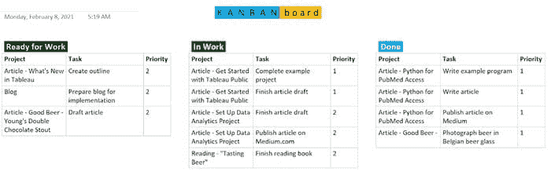
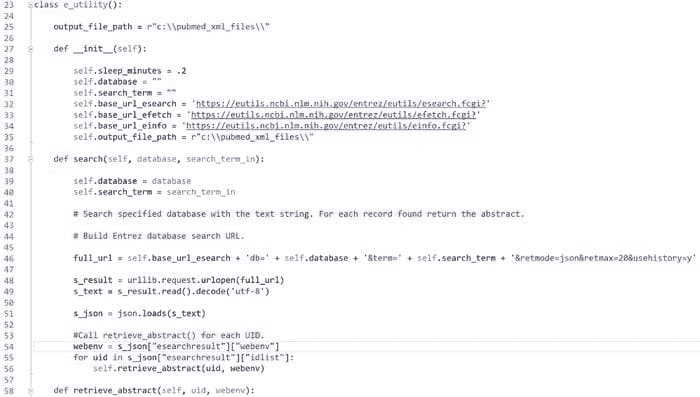
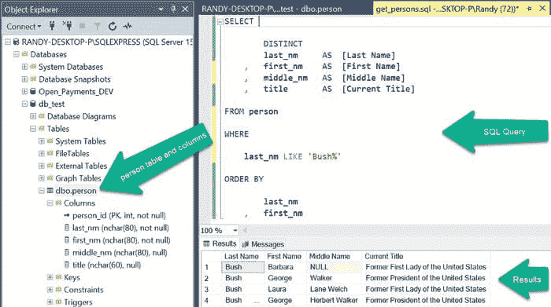
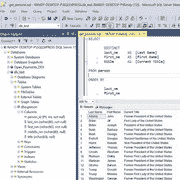
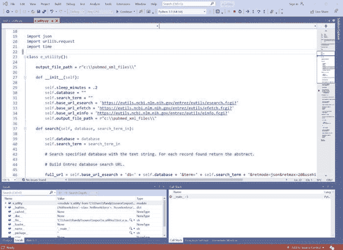
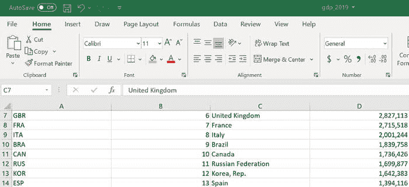

# 建立有效的数据分析团队和项目生态系统以实现成功

> 原文：[`www.kdnuggets.com/2021/04/build-effective-data-analytics-team-project-ecosystem-success.html`](https://www.kdnuggets.com/2021/04/build-effective-data-analytics-team-project-ecosystem-success.html)

评论

**作者：[兰迪·伦奇](https://www.linkedin.com/in/randy-runtsch-73a197/)，数据分析师**

### 介绍

* * *

## 我们的前三个课程推荐

 1\. [谷歌网络安全证书](https://www.kdnuggets.com/google-cybersecurity) - 快速进入网络安全职业生涯。

 2\. [谷歌数据分析专业证书](https://www.kdnuggets.com/google-data-analytics) - 提升你的数据分析能力

 3\. [谷歌 IT 支持专业证书](https://www.kdnuggets.com/google-itsupport) - 支持你的组织 IT

* * *

在长期的软件开发、信息安全和数据分析职业生涯中，我观察到大型、复杂且令人不知所措的项目，如果管理不善，很可能无法满足利益相关者的需求。相比之下，我参与的大多数成功的数据分析项目规模、团队人数和时间线都很小。它们通常在几天、几周或几个月内完成，而不是花费数年时间，通常能够满足最终用户的需求。

良好的管理、敏捷实践、熟练的从业人员、强大的工具、标准和指南可以结合起来，创建一个数据分析生态系统，从而实现短期项目周期和有用的解决方案。以下部分描述了我团队开发和利用的一些组织、项目和数据分析属性与技术。虽然我们在大型企业的风险管理和内部审计职能中建立了我们的数据分析程序，但你也许可以将其中许多技术应用于你的工作环境。

### 良好的管理和领导力

在我 34 年的软件开发和数据分析工作中，我观察到了许多管理和领导风格，无论好坏。最近，我在与一位创建框架并指导我们团队在大型企业中建立成功的部门数据分析程序的经理合作时取得了成功。根据经验和观察，以下是他和其他杰出领导者帮助个人、团队和程序成功的一些属性和行动：

+   为程序设定目标，并管理程序及团队以实现这些目标。

+   确定所需的能力，招聘并培训员工以满足这些能力。

+   与内部和外部组织合作，分享和学习最佳实践。

+   提供适合需求的强大软件工具。

+   作为与高层管理层沟通的桥梁。

+   与团队及其成员合作，并关心他们，但不要过于强势。

+   确保实施和遵循基本但足够的标准、指南和程序。

+   建立成长和成就的节奏。

+   尊重每个团队成员的时间和专注需求。

### 招聘并发展技能和知识

几年前，我参加了一次数据分析会议，讲者描述了她作为数据科学家所需的一些技能。她说，履行她的工作需要超过 200 种技能。确实，创建成功的数据分析解决方案需要分析师具备多种才能。为了招聘和发展具备所需技能和知识的分析师，您和您的管理层可以考虑这些步骤：

1.  **编写引人注目的职位描述和招聘广告**— 制定职位描述和招聘广告，描述成功候选人必须具备的技能和知识。同时列出员工在职期间必须发展的技能和知识。

1.  **招聘具有专业知识和良好潜力的数据分析师**— 应用职位描述和招聘广告来招聘具备所需技能和知识的分析师，并具备发展额外所需技能的潜力。

1.  **识别学习资源**— 创建课程和教程清单，以帮助数据分析师发展所需的技能和知识，以在其职位上取得成功。

1.  **评估技能**— 测量团队及其成员的优缺点，并识别发展和成长需求，评估每个数据分析师的技能和知识，以确保与职位描述和详细的能力清单相符。

1.  **培训分析师**— 确保工作单位的预算和计划允许数据分析师有足够的资金和时间完成培训，以发展所需的技能和知识。根据技能评估结果，确保分析师按照学习资源清单中的要求进行培训。

### 保持项目团队小型化

复杂的项目如果团队过大可能会陷入困境，除非进行专业管理。尝试将每个项目的规模和范围保持较小，并将团队规模限制在一到三名最终用户和一名首席数据分析师，这可能有助于项目的成功。团队可以为复杂项目添加数据分析师，这些项目将受益于劳动分工或互补技能。对于大型或复杂项目，您可能希望指定项目经理与团队合作，识别和管理任务、时间表、风险和问题。最后，在需要时寻求项目业务领域的主题专家（SMEs）。

### 采用敏捷实践

项目团队，尤其是在软件开发中，通常会应用[敏捷开发方法](https://en.wikipedia.org/wiki/Agile_software_development)，例如 Scrum 或 Kanban，以组织任务并迅速推进。我的团队有效地使用了在 Microsoft OneNote 中开发的 Kanban Board，以跟踪和沟通团队和经理之间的任务，定期在站立会议中更新。它由一个页面上的三个列组成。每个任务从“准备工作”开始，到“进行中”时移动，并在完成时从“进行中”移到“完成”。

简单的看板可以用来管理项目任务。图像由作者提供。

### 定义简明的范围、目标和时间表

在整个项目生命周期中，与最终用户、团队成员和经理的对话对于建立和坚持其达成一致的、简明的范围、目标和时间表至关重要。通过保持项目简洁，我在一周到三个月长的项目中都取得了成功。

如果一个项目大而复杂，可以考虑将其拆分成更小的子项目，每个子项目都有有限的范围、目标和时间表。

### 为数据分析师分配合理的竞争项目和任务

一些研究人员发现，当进行[multitasking](https://en.wikipedia.org/wiki/Human_multitasking)时，人类的表现会下降。给个人分配大量的项目或任务可能适得其反。此外，虽然技能和任务多样性是可以提升个人满意度和表现的工作组成部分（见[job characteristics theory](https://en.wikipedia.org/wiki/Job_characteristic_theory)），但分配给工人的项目或任务数量应当合理，以使工人能够成功并完成所有任务。

### 平衡团队合作与自主性

在一个高效运作的团队中工作可以带来许多好处，例如：

+   团队成员可以互补技能。

+   团队成员可以相互鼓励和推动。

+   团队成员可以分享想法并进行头脑风暴，以找出解决方案。

+   团队的生产力可能超过其部分的总和。

对于有效的团队合作的好处毋庸置疑。另一方面，一些工作类型，如数据分析、编程和写作，通常最好由半自主的个人完成，通常需要团队成员的输入。他们的工作需要集中注意力和有限的干扰。

### 采用并掌握强大而多功能的工具和语言

数据分析师应当配备强大而多功能的数据分析工具，以满足他们的需求。通过这种方法，分析师可以利用每个工具的特点，并开发技能和最佳实践。以下部分描述了我当前团队在数据分析项目中使用的每个软件包。

**Alteryx Designer** — 根据 Alteryx 的网站，Designer 可用于“自动化每一步分析，包括数据准备、混合、报告、预测分析和数据科学。”虽然单用户许可证费用高达数千美元，但它是一个强大的数据分析和数据科学工具。我的团队使用它创建和运行输入数据、转换和准备数据以及以多种格式输出数据的工作流。分析师使用它快速轻松地创建强大且运行迅速的工作流。

**Tableau** — Tableau 软件创建了一个强大且可能是最流行的商业智能和数据可视化平台。我的团队使用 Tableau Desktop 连接到数据源并开发可视化工作表和仪表板。然后，我们将可视化内容发布到 Tableau Server，最终用户可以在此查看和互动。

**Python** — Python 是一种用户友好且功能强大的编程语言，在数据分析师和数据科学家中很受欢迎。与同样受数据科学家欢迎的以统计为中心的 R 语言不同，Python 是一种通用语言。它是免费的，且易于学习。分析师可以通过自由获取的库扩展 Python 的功能，例如 [NumPy](https://numpy.org/) 和 [TensorFlow](https://www.tensorflow.org/)。

Python 编程语言代码示例。图片由作者提供。

**SQL** — 结构化查询语言（SQL）是用于实现、操作和查询存储在关系数据库管理系统（RDBMS）中的结构化数据的标准语言。它包括多个子语言。通过其数据查询语言（DQL），分析师可以查询和检索数据库表中的数据。RDBMS 数据库在全球企业中存储着大量数据集。

SQL（结构化查询语言）代码示例。图片由作者提供。

**Microsoft SQL Server Management Studio (SSMS)** — SSMS 是 Microsoft 的集成开发环境（IDE），用于管理和查询在其 SQL Server RDBMS 中实现的数据库。它免费且易于学习，我使用 SSMS 创建和运行 SQL 代码，以查询包含所需数据的数据库。

SQL Server Management Studio (SSMS) 用于管理 Microsoft SQL Server 数据库和 SQL 代码。图片由作者提供。

**Rapid SQL** — Rapid SQL 是一个类似于 SSMS 的 IDE，用于开发 SQL 查询，以访问存储在 Oracle、SQL Server、DB2 和 SAP Sybase 数据库中的数据。我使用 Rapid SQL 从 DB2 或 Oracle 数据库中获取数据。

**Microsoft Visual Studio** — Visual Studio 是微软的旗舰集成开发环境（IDE）。我使用 Visual Studio Professional 来创建用 Python 和其他编程语言编写的应用程序。它的编辑器功能强大，具有颜色编码的语法。[Visual Studio Community 2019](https://visualstudio.microsoft.com/vs/community/) 是一个免费的 IDE 版本，可能满足你的需求。微软的 Visual Studio Code (VS Code) 是另一个免费的 IDE，在程序员和数据分析师中也非常受欢迎。

Microsoft Visual Studio Professional 是一个集成开发环境（IDE），用于编写程序和开发应用程序。图片由作者提供。

**Microsoft Excel** — Excel 当然是一个无处不在、有用、强大且有时不可或缺的工具。我使用 Excel 工作簿作为项目数据源和输出，用于创建小数据集、执行基本的数据清洗和计算等。像 Excel 这样的电子表格应用程序是任何数据分析或数据科学工作中的关键工具。

电子表格应用程序，如 Microsoft Excel，是多功能的数据分析工具。图片由作者提供。

### 制定基本标准、指南和程序

对数据分析项目应用简明的标准和指南可以提高生产力、以及工作成果的维护和共享。以下是指导我工作的标准和指南类型。

**命名标准** — 标准化项目如文件夹、文件、数据库表、列和字段的命名方式，可以使它们的命名一致，并在大量产品中轻松找到工作成果。

**文件夹结构标准和模板** — 对所有项目使用标准化的文件夹结构，可以方便地设置新项目并查找文件夹和文件。我的团队使用以下文件夹结构模板来组织和存储所有数据分析项目的工作成果：

+   项目名称（将此值更改为项目的名称）

+   alteryx_workflows

+   data

+   documentation

+   python_programs

+   sql_scripts

+   tableau_workbooks

文件夹结构根据每个项目的需要进行展开和收缩。

**编码标准** — 编码标准就像语法对于英语散文一样重要。它们帮助我们组织和清晰、一致地传达思想。我曾参与的那些数据分析和软件开发团队都从文档化的编码规范中受益。在各个项目中应用这些标准可以使每个代码模块更容易为原作者编写，并且让团队的任何成员更容易阅读、理解、改进和维护。以下是我的团队用来指导工作的部分编码标准的描述。

+   **类、变量和函数命名约定**— 为了提高可读性，我们决定将所有类、函数和变量名称都用小写字母，每个单词或缩写由下划线（“_”）分隔。每个类和变量名称描述其存储的值的类型，而每个函数名称描述该函数对哪些值或对象执行了什么操作。例如，存储一个人姓名的变量可以命名为 person_name 或 person_nm。一个从数据库中检索人名列表的函数可以命名为 get_person_names()。

+   **代码模块前言**— 我们在每个模块的开头添加文本以描述其目的。为了帮助其他可能维护该模块的编码人员，我们会添加额外的信息，如作者姓名、数据库连接字符串、文件位置以及更改日志。

+   **注释**— 虽然有人说代码自解释，但我相信恰当的注释可以帮助编码人员整理思路，并帮助其他需要维护或增强代码的人更快地理解它。例如，在函数开始时，我描述它处理什么数据。我还会在每个执行任务的代码逻辑分组前添加简短的注释。

+   **空白行**— 为了使代码更易读，我在每个函数、每组变量定义以及每个执行特定任务的代码块之间插入空白行。

+   **简洁的函数范围和可见大小**— 和空白行一样，我限制每个函数的内容，使其更易于编写、理解、维护和增强。我努力保持每个函数简单，并尽量让其内容在编辑器中可见（如宽度不超过 80 字符，高度不超过 40 行）。

**可视化风格指南**— 虽然编码标准可以帮助程序员理解、编写和维护代码，但可视化风格指南可以帮助数据分析师开发一致、有用和有意义的视觉效果。它们也能通过提供一致、设计良好、易于理解和用户友好的视觉效果来惠及数据分析项目中的最终用户。以下是我的团队采纳的一些视觉风格指南。

+   **品牌标准**— 我们公司的品牌管理部门已确定了一组一致的字体、颜色和视觉设计风格及组件。我们已将这些纳入我们的可视化指南中，以增加专业性和一致性，并帮助为最终用户提供熟悉的用户界面风格。

+   **字体**— 我们公司设计了一款字体，我们会在可用时使用。如果不可用，我们的数据分析产品将默认使用 Arial 字体。

+   **颜色**— 我们公司的品牌标准包括一个小的颜色调色板。我们会在可能的情况下将这些颜色应用于图表、图形和仪表盘。我们还尝试将任何图表、图形或仪表盘上使用的颜色数量限制在视觉上令人愉悦的范围内。

+   **标题、头部和标签**——我们的指南描述了文本元素的标准位置、字体、大小和颜色，例如仪表板标题、图表和图形头部、列、过滤器和图例。

+   **视觉组件的摆放**——与文本一样，我们的指南描述了仪表板上元素的位置标准，例如图表和图形、过滤器和图例。

### 摘要

构建一个高效的数据分析团队，定期开发和交付能够为最终用户提供洞察并帮助他们做决策的数据分析解决方案并不容易。不过，应用一些我在软件开发和数据分析长时间职业生涯中学到、采纳并发展起来的经验和有效实践，可能会帮助你取得成功。

**个人简介：[兰迪·伦奇](https://www.linkedin.com/in/randy-runtsch-73a197/)** 是一名数据分析师、软件开发人员、作家、摄影师、骑行者和冒险者。他和妻子住在美国明尼苏达州东南部。请关注兰迪即将发布的文章，内容涉及公共数据集推动数据分析解决方案、编程、数据分析、骑行旅游、啤酒等。

[原文](https://towardsdatascience.com/how-to-set-up-a-data-analytics-team-and-project-ecosystem-for-success-100e14067e77)。已获得许可转载。

**相关：**

+   数据科学团队的模型：国际象棋与跳棋

+   在小公司构建数据科学团队的六个建议

+   数据科学家的缺失团队

### 更多相关内容

+   [如何建立数据科学赋能团队：完整指南](https://www.kdnuggets.com/2022/10/build-data-science-enablement-team-complete-guide.html)

+   [终极开源大型语言模型生态系统](https://www.kdnuggets.com/2023/05/ultimate-opensource-large-language-model-ecosystem.html)

+   [构建可重复和可维护的数据科学项目：一本免费书籍](https://www.kdnuggets.com/2022/08/free-book-build-reproducible-maintainable-data-science-project.html)

+   [背景、连贯性和协作对于数据科学成功至关重要](https://www.kdnuggets.com/2022/01/context-consistency-collaboration-essential-data-science-success.html)

+   [数据编排：生成 AI 成功与失败的分水岭](https://www.kdnuggets.com/2024/07/astronomer/data-orchestration-the-dividing-line-between-generative-ai-success-and-failure)

+   [数据科学方法推动业务成功](https://www.kdnuggets.com/2023/10/nwu-data-science-methods-drive-business-success)
