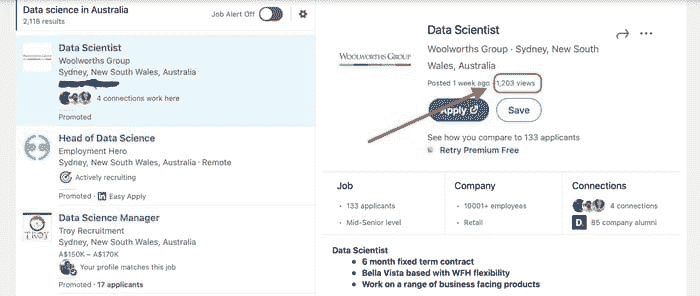
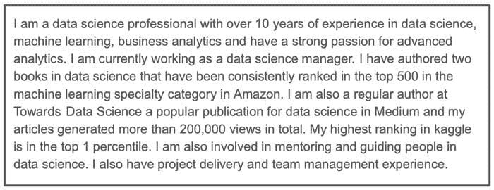
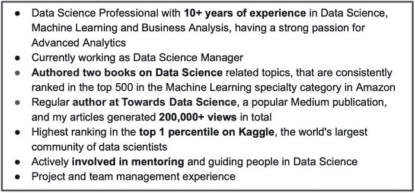

# 如何构建令人印象深刻的数据科学简历

> 原文：[`www.kdnuggets.com/2021/04/build-impressive-data-science-resume.html`](https://www.kdnuggets.com/2021/04/build-impressive-data-science-resume.html)

评论

**由 [Sharan Kumar Ravindran](http://rsharankumar.com)，数据科学专家及作者**

照片由 [Glenn Carstens-Peters](https://unsplash.com/@glenncarstenspeters?utm_source=unsplash&utm_medium=referral&utm_content=creditCopyText) 拍摄，来源于 [Unsplash](https://unsplash.com/s/photos/writing?utm_source=unsplash&utm_medium=referral&utm_content=creditCopyText)

* * *

## 我们的三大推荐课程

 1\. [谷歌网络安全证书](https://www.kdnuggets.com/google-cybersecurity) - 快速进入网络安全职业轨道

 2\. [谷歌数据分析专业证书](https://www.kdnuggets.com/google-data-analytics) - 提升您的数据分析技能

 3\. [谷歌 IT 支持专业证书](https://www.kdnuggets.com/google-itsupport) - 支持您组织的 IT

* * *

我们每个人都需要一份简历来展示我们的技能和经验，但我们为此付出了多少努力以使其具有影响力。不可否认，简历在我们的求职过程中扮演着关键角色。本文将探讨一些简单的策略，以显著改善数据科学简历的展示和内容。

### 首先，为什么专注于简历很重要？

数据科学职位变得非常竞争激烈，尽管机会的数量历史性地高，但申请这些职位的人数也极其庞大。

***例如***，下面是来自 LinkedIn 的职位发布截图，该职位发布总共有 1200+次查看，如果我们考虑大约十分之一的人申请这个职位，那么总共就是 120+个申请，这只是申请该职位的一种方式，还有通过其他来源、推荐以及直接申请的人，因此总申请人数可能接近 200+。同样的逻辑适用于任何数据科学职位，因此简历在筛选中起着关键作用。

来自 [LinkedIn](https://www.linkedin.com/jobs/search/?currentJobId=2427824929&keywords=data%20science)的截图

在本文中，我将指导您如何构建一个高影响力的简历，以帮助您在职位申请中获得筛选。本文涵盖的主题包括，

+   简历准备的基本规则

+   定制您的简历和求职信

+   谷歌的 X-Y-Z 公式，用于撰写有影响力的陈述

+   帮助构建出色简历的工具

如果你偏好视频格式，[请点击这里](https://www.youtube.com/watch?v=te8fmsRzITs)。

### 简历准备的基本规则

### 简历格式

大多数职位申请接受 pdf 和 word 格式的简历。但我建议你坚持使用 pdf 版本，因为这可以确保格式的保留，即招聘人员看到的简历与你看到的是一样的。

### 个人简介

个人简介是简历的关键，视作电梯推介。它应该有说服力，并涵盖诸如你是谁、你的技能和优势等信息。简历的这一部分将是首要印象的主要推动力，并影响招聘人员的决定，因此要花足够的时间确保包括关于你的关键细节。

我个人认为简历开头应包括职业目标。我建议从简历中去除职业目标，而将空间用于更好的个人简介。因为大多数招聘基于你的成就、优势和技能，而不是你的愿望。所以做出明智的决定，合理利用简历的空间，尤其是开头部分。

### 使用要点

确保简历中包含的细节以要点形式呈现，无论是个人简介还是专业/项目经验。长段落很难集中注意力，因此将其保持简洁并以要点形式展示可以提高可读性，正如以下截图所示。

简历的个人简介应为一长段落。

个人简介以要点形式呈现

尝试将每个要点限制在 2-3 行，并将关键短语加粗，以帮助快速扫描。

### 格式一致性

简历的内容应保持一致的格式，包括标题、副标题、要点以及其他文本。以下是一些确保一致性的方法，

+   选择一种字体并在整个简历中使用它

+   简历中用于突出“工作经验”和“教育背景”的标题应保持一致格式。你可以选择使用较大的字体，但要在整个简历中保持一致。

+   如果你的简历超过一页，确保所有页面的边距、对齐和间距一致。

+   你可以选择将标题中的首字母大写，但要在整个简历中保持一致。

### 避免拼写错误

始终检查拼写和语法错误，因为这些错误可能会让招聘人员失去兴趣。虽然拼写和语法错误可能被忽视，但一旦被发现，会发出错误的信号，例如，

+   你没有足够的细节来发现这些错误。

+   作为数据科学家，沟通是关键方面，拼写或语法错误绝对不容忽视。

+   企业越来越多地使用自动化工具来筛选简历，这些工具很可能会拒绝包含排版错误的简历。

### 包括联系方式。

你的联系方式对招聘人员联系你非常重要，因此请确保仔细检查你的详细信息。许多人在编辑简历时会参考同事或朋友的简历，在这种情况下，确保在编辑文本时也修改超链接。例如，当你编辑电子邮件地址时，请确保超链接中的电子邮件地址也被修改。

### 包括你个人资料和作品集的链接。

确保你的简历中有指向 LinkedIn 个人资料、git 库以及其他你希望招聘人员注意的网页或个人资料的链接。

### 定制你的简历和求职信。

当你与许多人竞争一个职位申请时，像定制这样的简单事情可以成为一个差异化因素，并帮助你获得招聘人员的即时关注。当我说将简历定制到职位发布时，并不是完全重新编写你的简历，而只是做一些小的调整，以确保你的个人资料突出显示职位要求和期望。

定制你的简历有助于你在

+   确保你的简历针对职位发布进行了定制。

+   确保你的简历能够通过自动关键词筛选。

+   向招聘人员传达积极的信号，因为你已经做好了准备。

简历中有一些组件你可以定制，它们是

+   简历和求职信中的目标职位名称应与职位发布匹配。

+   确保简历中突出显示的技能包括职位描述中要求的一些技能。

+   对你的个人资料总结进行简单的修改，以确保符合职位发布中提到的期望。

+   如果你申请的职位远离你当前的城市，或申请的工作需要出差，则在简历或求职信中明确提及你愿意搬迁或旅行。

### 谷歌 X-Y-Z 公式来制作有影响力的陈述。

这是一个出色的公式，有助于将你的成就转化为高影响力的陈述。这个公式最早由 Laszlo Bock 在他的文章中介绍，[点击这里](https://www.linkedin.com/pulse/20140929001534-24454816-my-personal-formula-for-a-better-resume/)。这是一个非常有效的技术，可以用来撰写有影响力的简历。这个公式的意思是，

> **以“X”作为“Y”的衡量标准，通过做“Z”实现的成就**

我将用一些简单的例子来准确解释这个公式如何应用到你的数据科学简历中。

**示例 1：**

*“建立了一个推荐系统”*

这是一个简单的陈述，完全没有吸引力，因为它没有确切提到用例的影响。我们可以尝试通过使用以下陈述来改进它，

*“建立了一个推荐系统，使收入增加了 10%”*

现在，这比之前的陈述要好得多，但可以通过使用 Google X-Y-Z 公式进一步改进，如下所示（公式中的 X、Y 和 Z 在下面突出显示）

*“构建了一个****推荐系统 (X)****，通过使用****协同过滤算法 (Z)****，帮助平台****提高了 10%的收入 (Y)****并改善了客户互动”*

**示例 2：**

*“参与了一个 Kaggle 比赛”*

这又是一个简单的陈述，仅仅说你参与了一个 Kaggle 比赛，但没有提到你的表现，因此可以通过添加一些细节来改进，如下所示，

*“在 Kaggle 比赛中获得第 20 名”*

现在已经好多了，但我们可以通过使用 Google X-Y-Z 公式使其更有影响力，例如，

*“参与了一个****Kaggle 比赛 (X)****并在****1250 个团队中获得第 20 名 (Y)****，通过****与 3 位同事一起构建一个集成预测模型 (Z)****”*

现在，使用这个公式将你的成就转化为更有力的陈述。

### 帮助构建出色简历的工具

有很多优秀的工具可以帮助你打造一份出色的简历。以下是我最喜欢的两个，

### [Resume.io](https://resume.io/)

+   这是一个付费平台来构建简历和求职信，尽管使用平台和构建简历不需要支付任何费用，但下载简历时需要付款。

+   他们有许多针对不同职位类别的简历模板，帮助你开始。

+   虽然这个平台支持多种模板并提供许多选项进行修改，但模板的一些部分仍然比较僵化。不过我个人觉得这样更好，因为它能让你专注于需要关注的部分，并且确保你的简历保持一致性。

### [Flowcv.io](https://flowcv.io/)

+   这是一个免费构建简历和求职信的平台，如果你希望拥有多个版本的简历，则需要一次性付款。

+   这个平台提供了多种配置选项来定义事物的外观。我觉得选项越多，决策就越多，因此耗时较长，可能导致一些不一致性。

这些工具在创建出色简历方面非常有帮助。

### 保持联系

+   如果你喜欢这篇文章并对类似内容感兴趣，[请在 Medium 上关注我](https://medium.com/@rsharankumar)。

+   我在我的 YouTube 频道上教授和讨论各种数据科学话题。[点击这里订阅我的频道](https://www.youtube.com/c/DataSciencewithSharan)。

+   订阅我的[邮件列表](https://chipper-leader-6081.ck.page/50934fd077)，获取更多数据科学技巧并与我的工作保持联系。

**个人简介：[Sharan Kumar Ravindran](http://rsharankumar.com)** ([LinkedIn](https://www.linkedin.com/in/rsharankumar/), [GitHub](https://github.com/rsharankumar)) 是一名拥有超过 10 年经验的数据科学专业人士，并且撰写了两本数据科学相关书籍。

[原文](https://towardsdatascience.com/how-to-build-an-impressive-data-science-resume-7a9c71f761c5)。已获许可转载。

**相关内容：**

+   数据职业并非一刀切！揭示你在数据领域理想角色的技巧

+   使用 NLP 提升你的简历

+   数据专业人士如何为简历增添更多变化

### 更多相关内容

+   [数据科学简历必备要素](https://www.kdnuggets.com/2022/06/musthaves-data-science-resume.html)

+   [数据科学简历中学生们遗漏的 7 件事](https://www.kdnuggets.com/7-things-students-are-missing-in-a-data-science-resume)

+   [7 个机器学习项目提升简历](https://www.kdnuggets.com/2022/09/7-machine-learning-portfolio-projects-boost-resume.html)

+   [7 个 AI 项目提升简历](https://www.kdnuggets.com/7-ai-portfolio-projects-to-boost-the-resume)

+   [KDnuggets 新闻，9 月 21 日：7 个机器学习项目…](https://www.kdnuggets.com/2022/n37.html)

+   [提升技能的顶级数据科学项目](https://www.kdnuggets.com/2022/04/top-data-science-projects-build-skills.html)
