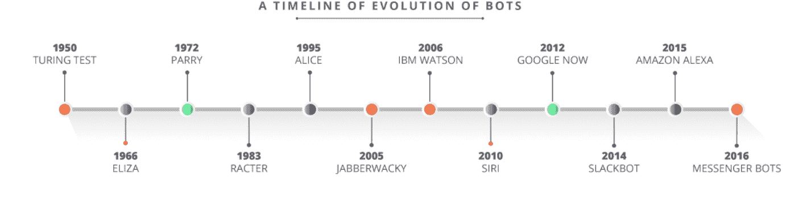
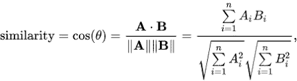
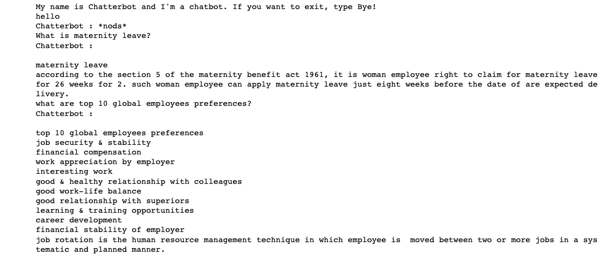
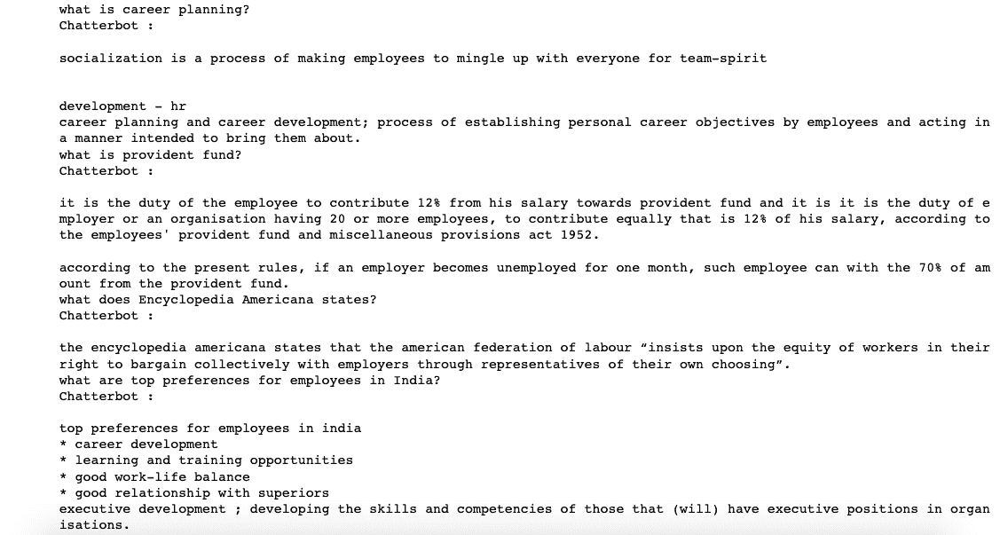
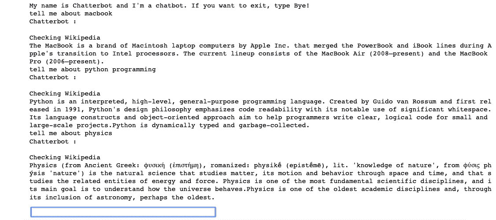

# 让我们构建一个智能聊天机器人

> 原文：[`www.kdnuggets.com/2019/12/build-intelligent-chatbot.html`](https://www.kdnuggets.com/2019/12/build-intelligent-chatbot.html)

评论

在文章 [**使用 Python NLTK 构建你的第一个聊天机器人**](https://towardsdatascience.com/build-your-first-chatbot-using-python-nltk-5d07b027e727)中，我们编写了一个简单的 Python 代码并构建了一个聊天机器人。问题和答案被松散地硬编码，这意味着聊天机器人无法对代码中没有的问题给出令人满意的答案。因此，我们的聊天机器人被认为不是一个智能机器人。

在这篇文章中，我们将构建一个基于文档或信息的聊天机器人，它将深入分析你的查询，并根据这些查询进行回应。

* * *

## 我们的三大课程推荐

 1\. [谷歌网络安全证书](https://www.kdnuggets.com/google-cybersecurity) - 加入网络安全职业的快车道。

 2\. [谷歌数据分析专业证书](https://www.kdnuggets.com/google-data-analytics) - 提升你的数据分析技能

 3\. [谷歌 IT 支持专业证书](https://www.kdnuggets.com/google-itsupport) - 支持你的组织在 IT 方面

* * *

### 介绍

> 一个**聊天机器人**（也称为**谈话机器人**、**聊天机器人**、**Bot**、**IM 机器人**、**互动代理**或**人工对话实体**）是一个[计算机程序](https://en.wikipedia.org/wiki/Computer_program)或一个[人工智能](https://en.wikipedia.org/wiki/Artificial_intelligence)，通过听觉或文本方法进行[对话](https://en.wikipedia.org/wiki/Conversation)。这些程序通常被设计成能够可信地模拟人类作为对话伙伴的行为，从而通过[Turing 测试](https://en.wikipedia.org/wiki/Turing_test)。聊天机器人通常用于[对话系统](https://en.wikipedia.org/wiki/Dialog_system)，用于各种实际目的，包括客户服务或信息获取。—— 维基百科

聊天机器人在今天非常热门。谁不知道它们？聊天机器人被视为与客户、员工以及所有其他希望交流的人互动的未来方式。其精髓在于这种交流是一种对话。与仅仅发布信息不同，使用聊天机器人的人可以通过提问更直接地获取他们想要的信息。


来源： [outgrow.co](https://outgrow.co/chatbots/)

### 聊天机器人能做什么？

聊天机器人相关的原因如下：

+   它们能在正确的时间、正确的地点提供给人们正确的信息，而且最重要的是，只在他们需要的时候。

+   我们在移动设备上约 90%的时间都花在电子邮件和消息平台上。因此，使用聊天机器人与客户互动比将他们引导到网站或移动应用程序更有意义。

+   [人工智能](https://www.edureka.co/blog/what-is-artificial-intelligence)、[机器学习](https://www.edureka.co/blog/scikit-learn-machine-learning/)和[自然语言处理](https://www.youtube.com/watch?v=05ONoGfmKvA)的进步，使得机器人能够越来越像真实的人一样进行对话。

借助聊天机器人，公司可以全天候提供服务。现在，销售和客服团队可以专注于更复杂的任务，而聊天机器人则引导用户完成流程。



来源：[edureka.co](https://www.edureka.co/blog/how-to-develop-a-chat-bot-using-amazon-lex/)

现代聊天机器人不仅仅依赖文本，通常还会显示有用的卡片、图像、链接和表单，提供类似应用程序的体验。

根据机器人编程的方式，我们可以将它们分为两种类型的聊天机器人：基于规则的（笨拙的机器人）和自学习的（智能机器人）。

1.  **基于规则的聊天机器人**：这类机器人根据一些简单的规则回答问题，这些规则是它们经过训练的。

1.  **自学习聊天机器人**：这类机器人依赖于[人工智能](https://www.edureka.co/blog/what-is-artificial-intelligence)（AI）和[机器学习](https://www.edureka.co/blog/machine-learning-tutorial/)（MI）技术与用户进行对话。

自学习聊天机器人进一步分为**检索型和生成型**。

**检索型**

检索型机器人基于指向流或图的原理。机器人被训练从有限的预定义响应中排名出最佳回应。这里的响应是手动输入的，或者基于现有信息的知识库。

**例如：** 你们的营业时间是什么？

**回答：** 下午 9 点到 5 点

这些系统还可以扩展以集成第三方系统。

**例如：** 我的订单在哪里？

**回答：** 它正在路上，应该会在 10 分钟内到达你那里。

检索型机器人是你今天看到的最常见的聊天机器人类型。它们允许机器人开发者和用户体验团队控制体验，并使其符合客户的期望。它们最适合用于**目标导向**的客户支持、潜在客户生成和反馈。我们可以决定机器人的语气，并设计体验，同时考虑到客户的品牌和声誉。

**生成型**

另一种构建聊天机器人的方法是使用生成模型。这些聊天机器人不是通过预定义的响应来构建的。相反，它们是通过大量的先前对话进行训练的，根据这些对话生成对用户的响应。它们需要大量的对话数据进行训练。

生成模型适合用于用户仅仅想交换闲聊的对话型聊天机器人。这些模型几乎总是会有一个准备好的回答。然而，在许多情况下，回答可能是随意的，对你来说并不太有意义。聊天机器人也容易生成语法和句法不正确的回答。

### 聊天机器人构建

在继续之前，有几点需要了解。**使用 NLTK 进行自然语言处理(NLP)、TF-IDF 和余弦相似度。**

**使用 NLTK 进行自然语言处理(NLP)**

自然语言处理（NLP）是计算机程序理解人类语言的能力。NLP 是人工智能（AI）的一个组成部分。

NLP 应用的开发具有挑战性，因为计算机传统上需要人类用精确、明确和高度结构化的编程语言与其“对话”，或者通过有限数量的明确语音命令。然而，人类语言往往是不精确的，通常是模糊的，语言结构可能取决于许多复杂的变量，包括俚语、地方方言和社会背景。

**自然语言工具包(NLTK)**

NLTK 是一个领先的平台，用于构建 Python 程序以处理人类语言数据。它提供了超过 50 种语料库和词汇资源（如 WordNet）的易用接口，以及一套用于分类、分词、词干提取、标注、解析和语义推理的文本处理库、工业级 NLP 库的封装和一个活跃的讨论论坛。

**TF-IDF**

我们将计算每个文档的词频-逆文档频率（TF-IDF）向量。这将给你一个矩阵，其中每一列代表概述词汇表中的一个词（所有至少在一个文档中出现的词）。

TF-IDF 是一种统计方法，用于评估一个词在给定文档中的重要性。

TF — 词频(tf)指的是一个术语在文档中出现的次数。

IDF — 逆文档频率(idf)衡量词在文档中的权重，即该词在整个文档中是常见的还是稀有的。

TF-IDF 的直觉是，频繁出现的术语在文档中的重要性低于那些很少出现的术语。

幸运的是，scikit-learn 提供了一个内置的`[TfIdfVectorizer](https://scikit-learn.org/stable/modules/generated/sklearn.feature_extraction.text.TfidfVectorizer.html)`类，可以很容易地生成 TF-IDF 矩阵。

**余弦相似度**

现在我们有了这个矩阵，我们可以很容易地计算相似度得分。有几种选择可以做到这一点，例如欧氏距离、皮尔逊相关系数和余弦相似度。再次强调，没有绝对正确的得分方式。

我们将使用余弦相似度来计算表示两个单词相似度的数值量。使用余弦相似度评分因为它独立于大小，并且相对容易和快速计算（特别是与 TF-IDF 评分结合使用时）。从数学上讲，它定义如下：



[来源](https://en.wikipedia.org/wiki/Cosine_similarity): 余弦相似度

由于我们使用了 TF-IDF 向量化器，计算点积将直接给出余弦相似度评分。因此，我们将使用`sklearn`的`linear_kernel()`而不是`cosine_similarities()`，因为它更快。

**开始编码…**

因此，我们将从[这个网站](http://www.whatishumanresource.com/human-resource-management)复制数据。数据集包含了与人力资源管理相关的所有内容。将整个数据复制并粘贴为文本格式。我们将基于这些数据训练我们的模型，然后检查模型的表现。此外，我还包含了[Wikipedia python 库](https://pypi.org/project/wikipedia/)，以便你可以询问任何问题。

**导入所有必需的库。**

```py
import nltk
import random
import string
import re, string, unicodedata
from nltk.corpus import wordnet as wn
from nltk.stem.wordnet import WordNetLemmatizer
import wikipedia as wk
from collections import defaultdict
import warnings
warnings.filterwarnings("ignore")
nltk.download('punkt') 
nltk.download('wordnet')
from sklearn.feature_extraction.text import TfidfVectorizer
from sklearn.metrics.pairwise import cosine_similarity, linear_kernel
```

**加载数据集并将所有文本转换为小写。**

```py
data = open('/../../chatbot/HR.txt','r',errors = 'ignore')
raw = data.read()
raw = raw.lower()
```

让我们查看一下我们的数据是什么样的。

```py
raw[:1000]
'human resource management is the process of recruiting, selecting, inducting employees, providing orientation, imparting training and development, appraising the performance of employees, deciding compensation and providing benefits, motivating employees, maintaining proper relations with employees and their trade unions, ensuring employees safety, welfare and healthy measures in compliance with labour laws of the land.\nhuman resource management involves management functions like planning, organizing, directing and controlling\nit involves procurement, development, maintenance of human resource\nit helps to achieve individual, organizational and social objectives\nhuman resource management is a multidisciplinary subject. it includes the study of management, psychology, communication, economics and sociology.\nit involves team spirit and team work.\nit is a continuous process.\nhuman resource management as a department in an organisation handles all aspects of employees and has various functi'
```

**数据预处理**

现在让我们开始数据清理和预处理，将整个数据转换为句子列表。

```py
sent_tokens = nltk.sent_tokenize(raw)
```

我们的下一步是对这些句子进行标准化。标准化是一个将单词列表转换为更统一序列的过程。这在为后续处理准备文本时非常有用。通过将单词转换为标准格式，其他操作能够处理数据，而无需处理可能影响过程的问题。

这一步包括**词汇标记化、去除 ASCII 值、去除各种标签、词性标注和词形还原。**

```py
def Normalize(text):
    remove_punct_dict = dict((ord(punct), None) for punct in string.punctuation)
    #word tokenization
    word_token = nltk.word_tokenize(text.lower().translate(remove_punct_dict))

    #remove ascii
    new_words = []
    for word in word_token:
        new_word = unicodedata.normalize('NFKD', word).encode('ascii', 'ignore').decode('utf-8', 'ignore')
        new_words.append(new_word)

    #Remove tags
    rmv = []
    for w in new_words:
        text=re.sub("&lt;/?.*?&gt;","&lt;&gt;",w)
        rmv.append(text)

    #pos tagging and lemmatization
    tag_map = defaultdict(lambda : wn.NOUN)
    tag_map['J'] = wn.ADJ
    tag_map['V'] = wn.VERB
    tag_map['R'] = wn.ADV
    lmtzr = WordNetLemmatizer()
    lemma_list = []
    rmv = [i for i in rmv if i]
    for token, tag in nltk.pos_tag(rmv):
        lemma = lmtzr.lemmatize(token, tag_map[tag[0]])
        lemma_list.append(lemma)
    return lemma_list
```

所以数据预处理部分完成了，现在让我们定义欢迎词或问候语，这意味着如果用户提供的是问候消息，聊天机器人将根据关键字匹配以问候的方式回应。

```py
welcome_input = ("hello", "hi", "greetings", "sup", "what's up","hey",)
welcome_response = ["hi", "hey", "*nods*", "hi there", "hello", "I am glad! You are talking to me"]
def welcome(user_response):
    for word in user_response.split():
        if word.lower() in welcome_input:
            return random.choice(welcome_response)
```

**生成聊天机器人响应**

为了从我们的聊天机器人生成响应，将使用文档相似度的概念。正如我已经讨论过的，[TFidf 向量化器](http://scikit-learn.org/stable/modules/generated/sklearn.feature_extraction.text.TfidfVectorizer.html)用于将一系列原始文档转换为 TF-IDF 特征矩阵，而*要*查找用户输入的单词与数据集中单词之间的相似度，我们将使用[余弦相似度](http://scikit-learn.org/stable/modules/generated/sklearn.metrics.pairwise.cosine_similarity.html)。

我们定义了一个函数**generateResponse()**，它会搜索用户的输入词，并返回几种可能的回应之一。如果函数没有找到匹配任何关键词的输入，那么你可以让你的聊天机器人帮你搜索维基百科。只需输入**“tell me about any_keyword”。**如果在维基百科中没有找到任何内容，聊天机器人会生成一条消息**“No content has been found”。**

```py
def generateResponse(user_response):
    robo_response=''
    sent_tokens.append(user_response)
    TfidfVec = TfidfVectorizer(tokenizer=Normalize, stop_words='english')
    tfidf = TfidfVec.fit_transform(sent_tokens)
    #vals = cosine_similarity(tfidf[-1], tfidf)
    vals = linear_kernel(tfidf[-1], tfidf)
    idx=vals.argsort()[0][-2]
    flat = vals.flatten()
    flat.sort()
    req_tfidf = flat[-2]
    if(req_tfidf==0) or "tell me about" in user_response:
        print("Checking Wikipedia")
        if user_response:
            robo_response = wikipedia_data(user_response)
            return robo_response
    else:
        robo_response = robo_response+sent_tokens[idx]
        return robo_response#wikipedia search
def wikipedia_data(input):
    reg_ex = re.search('tell me about (.*)', input)
    try:
        if reg_ex:
            topic = reg_ex.group(1)
            wiki = wk.summary(topic, sentences = 3)
            return wiki
    except Exception as e:
            print("No content has been found")
```

最终定义聊天机器人用户对话处理程序。

注意：如果你输入 Bye、shutdown、exit 或 quit，程序将退出。

```py
flag=True
print("My name is Chatterbot and I'm a chatbot. If you want to exit, type Bye!")
while(flag==True):
    user_response = input()
    user_response=user_response.lower()
    if(user_response not in ['bye','shutdown','exit', 'quit']):
        if(user_response=='thanks' or user_response=='thank you' ):
            flag=False
            print("Chatterbot : You are welcome..")
        else:
            if(welcome(user_response)!=None):
                print("Chatterbot : "+welcome(user_response))
            else:
                print("Chatterbot : ",end="")
                print(generateResponse(user_response))
                sent_tokens.remove(user_response)
    else:
        flag=False
        print("Chatterbot : Bye!!! ")
```

现在，让我们测试一下聊天机器人，看看它的反应如何。

***与 Chatterbot 对话的截图:***





如果你希望你的聊天机器人搜索维基百科，只需输入

**“tell me about ****”**



这真是太酷了，不是吗？尽管结果不够准确，但至少我们达成了一个里程碑 :)

### 结论：聊天机器人的未来

聊天机器人的未来非常光明。随着人工智能领域的快速发展，聊天机器人毫无疑问是未来。我们刚刚构建的当前聊天机器人显然不是我所说的未来，这只是聊天机器人建设中的一个垫脚石。

未来的聊天机器人不仅仅是一个客户支持代理，它将成为一个为企业和消费者提供高级帮助的助手。

我们人类不喜欢做重复的乏味任务。因此，在未来，公司将雇佣 AI 聊天机器人来处理那些重复且不需要创造力的任务。通过让 AI 聊天机器人接管这些重复的乏味任务，公司将利用人力资源从事更具创造性的工作。这样，我们可以期待未来会有更多惊人的事物出现。

此外，人类不喜欢将内容（死记硬背）储存在脑海中。如今，借助互联网，他们可以利用这一点。因此，需要储存信息（数据）的任务可以转移到 AI 聊天机器人上。

好了，这篇文章就到这里，希望大家喜欢阅读，欢迎在评论区分享你的评论/想法/反馈。

如有任何疑问，请通过[LinkedIn](https://www.linkedin.com/in/nagesh-singh-chauhan-6936bb13b/)与我联系。


来源：[gfycat.com](https://gfycat.com/gifs/search/edi+cortana)

感谢阅读!!!

**个人简介：[Nagesh Singh Chauhan](https://www.linkedin.com/in/nagesh-singh-chauhan-6936bb13b/)** 是 CirrusLabs 的一个大数据开发者。他在电信、分析、销售、数据科学等多个领域拥有超过 4 年的工作经验，并在各种大数据组件方面具有专长。

[原文](https://towardsdatascience.com/lets-build-an-intelligent-chatbot-7ea7f215ada6)。经授权转载。

**相关内容:**

+   用于 NLP 的深度学习：用 Keras 创建一个聊天机器人!

+   BERT 正在改变 NLP 格局

+   自动化文本摘要入门

### 更多相关内容

+   [使用这些课程构建类似 ChatGPT 的聊天机器人](https://www.kdnuggets.com/2023/05/build-chatgptlike-chatbot-courses.html)

+   [5 分钟内使用 Hugging Face 和 Gradio 构建 AI 聊天机器人](https://www.kdnuggets.com/2023/06/build-ai-chatbot-5-minutes-hugging-face-gradio.html)

+   [聊天机器人变革：从失败到未来](https://www.kdnuggets.com/2021/12/chatbot-transformation-failure-future.html)

+   [开放助手：探索开放和协作的可能性…](https://www.kdnuggets.com/2023/04/open-assistant-explore-possibilities-open-collaborative-chatbot-development.html)

+   [聊天机器人竞技场：LLM 基准平台](https://www.kdnuggets.com/2023/05/chatbot-arena-llm-benchmark-platform.html)

+   [让智能文档处理更智能：第一部分](https://www.kdnuggets.com/2023/02/making-intelligent-document-processing-smarter-part-1.html)
