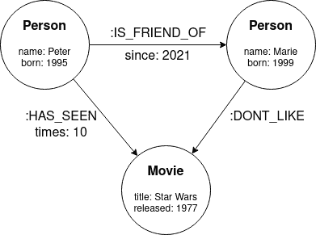
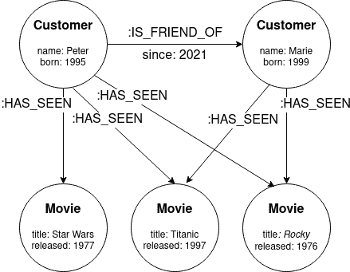

# 如何使用图数据库构建实时推荐引擎

> 原文：[`www.kdnuggets.com/2023/08/build-realtime-recommendation-engine-graph-databases.html`](https://www.kdnuggets.com/2023/08/build-realtime-recommendation-engine-graph-databases.html)

“这是为您推荐的”、“为您推荐”或“您可能还喜欢”等短语已成为大多数数字业务，特别是电子商务或流媒体平台中的必备内容。

尽管它们可能看起来是一个简单的概念，但它们意味着企业与客户互动和连接的新时代：推荐时代。

坦白说，我们大多数人，甚至所有人，在寻找观看内容时，都会被 Netflix 的推荐所吸引，或者直接去 Amazon 的推荐部分查看下一个购买的东西。

在这篇文章中，我将解释如何使用图数据库构建实时推荐引擎。

# 什么是推荐引擎？

推荐引擎是一种工具包，利用高级数据过滤和预测分析来预测和预判客户的需求和愿望，即客户可能会消费或参与的内容、产品或服务。

为了获得这些推荐，引擎使用以下信息的组合：

+   客户的过去行为和历史，例如购买的产品或观看的系列。

+   客户当前的行为和与其他客户的关系。

+   产品的客户排名。

+   商业的畅销商品。

+   类似或相关客户的行为和历史。

# 什么是图数据库？

图数据库是一种 NoSQL 数据库，其中数据以图形结构存储，而不是表或文档。图数据结构由节点组成，这些节点可以通过关系连接。节点和关系都可以具有自己的属性（键值对），这些属性进一步描述它们。

以下图像介绍了图数据结构的基本概念：



图数据结构示例

# 流媒体平台的实时推荐引擎

现在我们知道了什么是推荐引擎和图数据库，我们已经准备好了解如何为流媒体平台使用图数据库构建推荐引擎。

下面的图展示了两个客户观看过的电影及这两个客户之间的关系。



流媒体平台的图示例。

将这些信息以图的形式存储后，我们现在可以考虑电影推荐，以影响下一个要观看的电影。最简单的策略是显示整个平台上观看次数最多的电影。这可以通过使用 Cypher 查询语言轻松实现：

```py
MATCH (:Customer)-[:HAS_SEEN]->(movie:Movie)
RETURN movie, count(movie)
ORDER BY count(movie) DESC LIMIT 5
```

然而，这个查询非常通用，没有考虑客户的上下文，因此没有针对特定客户进行优化。我们可以通过使用客户的社交网络，查询朋友和朋友的朋友关系来做得更好。使用 Cypher 是非常直接的：

```py
MATCH (customer:Customer {name:'Marie'})
    <-[:IS_FRIEND_OF*1..2]-(friend:Customer)
WHERE customer <> friend
WITH DISTINCT friend
MATCH (friend)-[:HAS_SEEN]->(movie:Movie)
RETURN movie, count(movie)
ORDER BY count(movie) DESC LIMIT 5
```

该查询分为两个部分，通过 WITH 子句将第一部分的结果传递到第二部分。

在查询的第一部分中，我们找到当前客户（`{name: 'Marie'}`）并遍历图形，匹配 Marie 的直接朋友或他们的朋友（她的朋友的朋友），使用灵活的路径长度表示法`-[:IS_FRIEND_OF*1..2]->`，这意味着一个或两个`IS_FRIEND_OF`关系深度。

我们注意不要在结果中包括 Marie 本人（`WHERE`子句）并且避免获取直接的重复朋友（`DISTINCT`子句）。

查询的第二部分与最简单的查询相同，但现在不再考虑平台上的所有客户，而是考虑 Marie 的朋友和朋友的朋友。

就这样，我们已经为流媒体平台建立了我们的实时推荐引擎。

# 总结

在这篇文章中，已涉及以下主题：

+   什么是推荐引擎以及它使用的信息量来进行推荐。

+   什么是图数据库以及数据如何作为图而不是表或文档进行存储。

+   一个如何使用图数据库为流媒体平台构建实时推荐引擎的示例。

**[José María Sánchez Salas](https://www.linkedin.com/in/jmssalas/)** 现居挪威。他是来自西班牙穆尔西亚的自由数据工程师。在商业和开发领域之间，他还写了一份数据工程时事通讯。

### 更多相关主题

+   [构建视觉搜索引擎 - 第二部分：搜索引擎](https://www.kdnuggets.com/2022/02/building-visual-search-engine-part-2.html)

+   [在商业中实施推荐系统的十个关键经验](https://www.kdnuggets.com/2022/07/ten-key-lessons-implementing-recommendation-systems-business.html)

+   [用 Hugging Face Transformers 构建推荐系统](https://www.kdnuggets.com/building-a-recommendation-system-with-hugging-face-transformers)

+   [使用 AI & Analytics Engine 更快地准备时间序列数据](https://www.kdnuggets.com/2021/12/piexchange-faster-way-prepare-timeseries-data-ai-analytics-engine.html)

+   [构建视觉搜索引擎 - 第一部分：数据探索](https://www.kdnuggets.com/2022/02/building-visual-search-engine-part-1.html)

+   [用 Python 和 Google Earth 构建地理空间应用程序……](https://www.kdnuggets.com/2022/03/building-geospatial-application-python-google-earth-engine-greppo.html)
