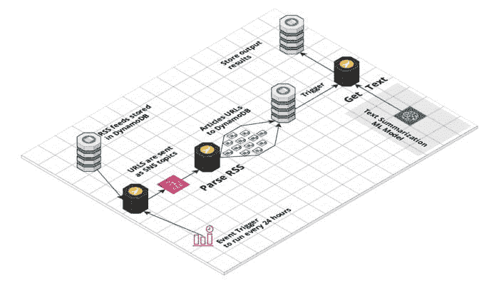
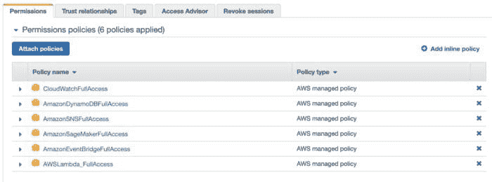
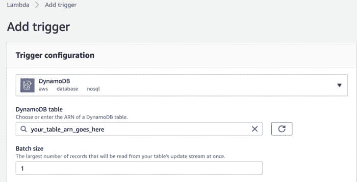

# 使用 ML 在 AWS 云上构建一个无服务器新闻数据管道

> 原文：[`www.kdnuggets.com/2021/11/build-serverless-news-data-pipeline-ml-aws-cloud.html`](https://www.kdnuggets.com/2021/11/build-serverless-news-data-pipeline-ml-aws-cloud.html)

评论

**由[Maria Zentsova](https://www.linkedin.com/in/maria-zentsova-6058b6ab/)，Wood Mackenzie 高级数据分析师**

作为一名分析师，我花费了很多时间跟踪新闻和行业动态。在产假期间思考这个问题后，我决定构建一个简单的[应用程序](https://www.sustinero.com/)来追踪绿色技术和可再生能源的新闻。使用 AWS Lambda 及其他 AWS 服务，如 EventBridge、SNS、DynamoDB 和 Sagemaker，可以非常轻松地入门，并在几天内构建一个原型。

这个应用程序由一系列无服务器的 Lambda 函数和一个作为 SageMaker 端点部署的文本总结机器学习模型提供支持。每 24 小时，AWS EventBridge 规则触发 Lambda 函数，从 DynamoDB 数据库中获取信息流。



这些信息流随后作为 SNS 主题发送，触发多个 Lambda 函数以解析信息流并提取新闻 URL。每个网站每天更新其 RSS 信息流，最多只有几篇文章，因此这样我们不会发送大量流量，避免消耗某个新闻出版物的过多资源。

然而，大问题在于提取文章的全文，因为每个网站都不同。幸运的是，像 goose3 这样的库通过应用 ML 方法来提取页面主体，从而解决了这个问题。由于版权问题，我不能存储文章的全文，这就是为什么我应用一个 HuggingFace 文本总结变换器[模型](https://huggingface.co/facebook/bart-large-cnn)来生成简短的摘要。

这里是一个详细的指南，介绍如何构建由 ML 驱动的新闻聚合管道。

### **1\. 设置具有必要权限的 IAM 角色。**

尽管这个数据管道非常简单，但它连接了多个 AWS 资源。为了授予我们的函数访问所有所需资源的权限，我们需要设置[IAM 角色](https://docs.aws.amazon.com/IAM/latest/UserGuide/id_roles.html)。该角色为我们的函数分配了使用云中其他资源的权限，例如 DynamoDB、Sagemaker、CloudWatch 和 SNS。出于安全考虑，最好不要给予 IAM 角色完全的 AWS 管理访问权限，仅允许它使用所需的资源。



### **2\. 从 DynamoDB 中获取 RSS 信息流到 RSS 分发 Lambda**

使用 AWS Lambda 几乎可以做任何事情，它是一个非常强大的无服务器计算服务，非常适合短期任务。对我来说，主要的优势是它可以非常方便地访问 AWS 生态系统中的其他服务。

我将所有 RSS 源存储在 DynamoDB 表中，并且从 Lambda 使用 [boto3](https://boto3.amazonaws.com/v1/documentation/api/latest/reference/services/dynamodb.html) 库访问它非常容易。一旦我从数据库中获取了所有源，我将它们作为 SNS 消息发送，以触发 feed 解析的 Lambda 函数。

```py
import boto3
import json

def lambda_handler(event, context):
    # Connect to DynamoDB
    dynamodb = boto3.resource('dynamodb')

    # Get table
    table = dynamodb.Table('rss_feeds')

    # Get all records from the table
    data = table.scan()['Items']
    rss = [y['rss'] for y in data]

    # Connect to SNS
    client = boto3.client('sns')

    # Send messages to the queue
    for item in rss:
        client.publish(TopicArn="arn:aws:sns:eu-west-1:802099603194:rss_to-parse",  Message = item)
```

### 3\. **创建带有必要库的 Layers**

要在 AWS Lambdas 中使用一些特定的库，你需要将它们作为 [Layer](https://docs.aws.amazon.com/lambda/latest/dg/configuration-layers.html) 导入。为了准备库进行导入，它需要打包成一个 python.zip 文件，我们可以将其上传到 AWS 并在函数中使用。要创建一个 Layer，只需进入 python 文件夹，运行 pip install 命令，打包成 zip 文件，然后就可以上传了。

```py
pip install feedparser -t .
```

然而，我在将 goose3 库部署为 Layer 时遇到了一些困难。经过简短的调查，结果发现像 LXML 这样的库需要在类似 Lambda 的环境中编译，即 Linux。因此，如果库是在 Windows 上编译的，然后再导入到函数中，就会出现错误。为了解决这个问题，在创建归档之前，我们需要在 Linux 上安装库。

有两种方法可以做到这一点。首先，可以在 [模拟的 Lambda 环境](https://aws.amazon.com/premiumsupport/knowledge-center/lambda-layer-simulated-docker/) 中使用 docker 进行安装。对我来说，最简单的方法是使用 AWS [sam build](https://docs.aws.amazon.com/serverless-application-model/latest/developerguide/sam-cli-command-reference-sam-build.html) 命令。一旦函数构建完成，我只需从构建文件夹中复制所需的包，然后将它们作为 Layer 上传。

```py
sam build --use-container
```

### **4\. 启动 Lambda 函数以解析 feed**

一旦我们将新闻 URL 发送到 SNS 作为主题，我们可以触发多个 Lambda 函数去从 RSS 源中获取新闻文章。一些 RSS 源有所不同，但 feed 解析库允许我们处理不同的格式。我们的 URL 是事件对象的一部分，因此我们需要通过键提取它。

```py
import boto3
import feedparser
from datetime import datetime

def lambda_handler(event, context):

    #Connect to DynamoDB
    dynamodb = boto3.resource('dynamodb')

    # Get table
    table = dynamodb.Table('news')

    # Get a url from from event
    url = event['Records'][0]['Sns']['Message']

    # Parse the rss feed
    feed = feedparser.parse(url)

    for item in feed['entries']:
        result = {
            "news_url": item['link'],
            "title": item['title'],
            "created_at": datetime.now().strftime('%Y-%m-%d') # so that dynamodb will be ok with our date
        }

        # Save the result to dynamodb
        table.put_item(Item=result, ConditionExpression='attribute_not_exists(news_url)') # store only unique urls
```

### **5\. 在 Sagemaker 上创建和部署文本摘要模型**

Sagemaker 是一个服务，它使在 AWS 上编写、训练和部署 ML 模型变得更加容易。HuggingFace 已与 AWS [合作](https://aws.amazon.com/blogs/machine-learning/aws-and-hugging-face-collaborate-to-simplify-and-accelerate-adoption-of-natural-language-processing-models/) 以使在云中部署其模型变得更加容易。

在 Jupiter notebook 中，我编写了一个简单的文本摘要模型，并使用 deploy() 命令部署它。

```py
from sagemaker.huggingface import HuggingFaceModel
import sagemaker

role = sagemaker.get_execution_role()

hub = {
    'HF_MODEL_ID':'facebook/bart-large-cnn',
     'HF_TASK':'summarization'
}

# Hugging Face Model Class
huggingface_model = HuggingFaceModel(
    transformers_version='4.6.1',
    pytorch_version='1.7.1',
    py_version='py36',
    env=hub,
    role=role, 
)

# deploy model to SageMaker Inference
predictor = huggingface_model.deploy(
    initial_instance_count=1, # number of instances
    instance_type='ml.m5.xlarge' # ec2 instance type
)
```

部署完成后，我们可以从 Sagemaker -> 推理 -> 端点配置中获取端点信息，并在我们的 Lambda 中使用它。

### **6\. 获取文章的完整文本，总结它并将结果存储在 DynamoDB 中**

-   我们不应存储完整的文本，因为这涉及版权问题，因此所有处理工作都在一个 lambda 函数中完成。我在 URL 进入 DynamoDB 表后启动文本处理 lambda 函数。为此，我设置了一个 DynamoDB 项目创建作为触发器来启动 lambda 函数。我设置了批处理大小为 1，以便 lambda 只处理一篇文章。

-   

```py
import json
import boto3 
from goose3 import Goose
from datetime import datetime

def lambda_handler(event, context):
    # Get url from DynamoDB record creation event
    url =  event['Records'][0]['dynamodb']['Keys']['news_url']['S']

    # fetch article full text
    g = Goose()
    article = g.extract(url=url)

    body = article.cleaned_text # clean article text

    published_date = article.publish_date # from meta desc

    # Create a summary using our HuggingFace text summary model
    ENDPOINT_NAME = "your_model_endpoint"
    runtime= boto3.client('runtime.sagemaker')

    response = runtime.invoke_endpoint(EndpointName=ENDPOINT_NAME, ContentType='application/json', Body=json.dumps(data))

    #extract a summary
    summary = json.loads(response['Body'].read().decode())

    #Connect to DynamoDB
    dynamodb = boto3.resource('dynamodb')

    # Get table
    table = dynamodb.Table('news')

    # Update item stored in dynamoDB
    update = table.update_item(
        Key = { "news_url": url  }
        ,
        ConditionExpression= 'attribute_exists(news_url) ', 
        UpdateExpression='SET summary = :val1, published_date = :val2'
        ExpressionAttributeValues={
            ':val1': summary,
            ':val2': published_date
        }
    )

```

-   这是使用 AWS 工具构建和部署的一个简单无服务器数据管道，用于读取最新新闻。如果你有任何改进建议或问题，请随时联系我。

-   **简介：[Maria Zentsova](https://www.linkedin.com/in/maria-zentsova-6058b6ab/)** 是 Wood Mackenzie 的高级数据分析师。她从事数据收集和分析、ETL 管道以及数据探索工具的工作。

-   **相关：**

+   我如何将 100 多个 ETL 重新设计为 ELT 数据管道

+   2022 年数据专业人士推广 AWS 技能的最佳方法

+   Prefect：如何使用 Python 编写和安排你的第一个 ETL 管道

### -   更多相关主题

+   [迁移到 AWS 云的 11 个最佳实践](https://www.kdnuggets.com/2023/04/11-best-practices-cloud-data-migration-aws-cloud.html)

+   [构建供应链管道所需的 6 种数据科学技术](https://www.kdnuggets.com/2022/01/6-data-science-technologies-need-build-supply-chain-pipeline.html)

+   [使用 Datawig，一个用于缺失值插补的 AWS 深度学习库](https://www.kdnuggets.com/2021/12/datawig-aws-deep-learning-library-missing-value-imputation.html)

+   [AWS AI & ML 奖学金项目概述](https://www.kdnuggets.com/2022/09/aws-ai-ml-scholarship-program-overview.html)

+   [在 AWS EC2 上设置和使用 JupyterHub (TLJH)](https://www.kdnuggets.com/2023/01/setup-jupyterhub-tljh-aws-ec2.html)

+   [现在就选修的前 8 门 AWS GenAI 课程](https://www.kdnuggets.com/top-8-genai-courses-for-aws-to-take-now)
