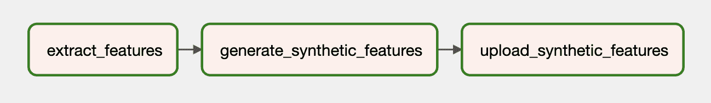
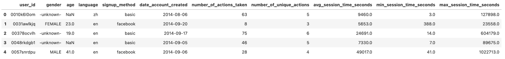
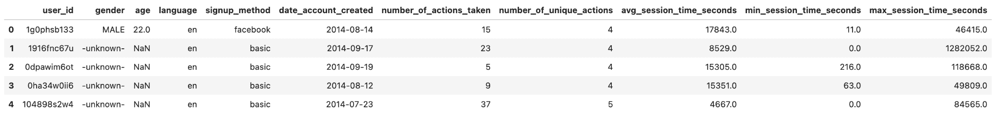

# 使用 Gretel 和 Apache Airflow 构建合成数据管道

> 原文：[`www.kdnuggets.com/2021/09/build-synthetic-data-pipeline-gretel-apache-airflow.html`](https://www.kdnuggets.com/2021/09/build-synthetic-data-pipeline-gretel-apache-airflow.html)

评论

**作者：[Drew Newberry](https://www.linkedin.com/in/drew-newberry/)，Gretel.ai 的软件工程师**


大家好，我是 Drew，我是 Gretel 的一名软件工程师。我最近一直在思考如何将 Gretel API 集成到现有工具中的模式，以便轻松构建安全性和客户隐私为首要特性的数据管道，而不仅仅是事后的考虑或需要打勾的选项。

在 Gretel 的工程师和客户中，Apache Airflow 是一个很受欢迎的数据工程工具。它也与 Gretel 配合得很好。在这篇博客文章中，我们将展示如何使用 Airflow、Gretel 和 PostgreSQL 构建一个合成数据管道。让我们开始吧！

## 什么是 Airflow

[Airflow](https://airflow.apache.org/docs/apache-airflow/stable/howto/operator/index.html) 是一个常用于构建数据管道的工作流自动化工具。它使数据工程师或数据科学家能够使用 Python 和其他熟悉的构造程序化地定义和部署这些管道。Airflow 的核心概念是 DAG，即有向无环图。Airflow DAG 提供了一个模型和一组 API，用于定义管道组件、它们的依赖关系和执行顺序。

你可能会发现 Airflow 管道将数据从产品数据库复制到数据仓库。其他管道可能会执行将规范化数据连接到一个适合分析或建模的单一数据集的查询。还有的管道可能会发布每日报告，汇总关键业务指标。这些用例的共同主题是：协调跨系统的数据流动。这正是 Airflow 擅长的地方。

利用 Airflow 及其丰富的 [集成](https://registry.astronomer.io/) 生态系统，数据工程师和科学家可以将任意数量的异构工具或服务编排成一个易于维护和操作的统一管道。了解这些集成功能后，我们将开始讨论 Gretel 如何集成到 Airflow 管道中，以改进常见的数据操作工作流程。

## Gretel 如何融入其中？

在 Gretel，我们的使命是让数据处理变得更加简单和安全。在与客户交流时，我们经常听到的一个痛点是，获取敏感数据所需的时间和精力。通过使用[ Gretel Synthetics](https://gretel.ai/synthetics)，我们可以通过生成数据集的合成副本来减少处理敏感数据的风险。通过将 Gretel 与 Airflow 集成，可以创建自助服务管道，使数据科学家能够快速获取所需的数据，而不需要每个新数据请求都依赖数据工程师。

为了演示这些功能，我们将构建一个 ETL 管道，该管道从数据库中提取用户活动特征，生成数据集的合成版本，并将数据集保存到 S3。将合成数据集保存到 S3 后，它可以被数据科学家用于下游建模或分析，而不会影响客户隐私。

首先，让我们从鸟瞰图开始了解管道。图中的每个节点代表一个管道步骤，或 Airflow 术语中的“任务”。



*示例 Gretel 合成管道在 Airflow 上。*

我们可以将管道分为三个阶段，这类似于你在 ETL 管道中可能遇到的情况：

+   **提取** - extract_features 任务将查询数据库，并将数据转换为数据科学家可以用来构建模型的特征集。

+   **合成** - generate_synthetic_features 将提取的特征作为输入，训练一个合成模型，然后使用 Gretel API 和云服务生成合成特征集。

+   **加载** - upload_synthetic_features 将合成特征集保存到 S3 中，在那里可以被下游模型或分析程序使用。

在接下来的几个部分，我们将更详细地探讨这三个步骤。如果你希望跟随每个代码示例，你可以前往 [gretelai/gretel-airflow-pipelines](https://github.com/gretelai/gretel-airflow-pipelines) 下载本博客文章中使用的所有代码。该仓库还包含启动 Airflow 实例和运行整个管道的说明。

此外，在我们剖析每个组件之前，查看整个 Airflow 管道可能会很有帮助，[dags/airbnb_user_bookings.py](https://github.com/gretelai/gretel-airflow-pipelines/blob/main/dags/airbnb_user_bookings.py)。以下部分的代码片段是从链接的用户预订管道中提取的。

## 提取特征

第一个任务，extract_features 负责从源数据库中提取原始数据并将其转换为特征集。这是任何机器学习或分析管道中可能遇到的常见[特征工程](https://en.wikipedia.org/wiki/Feature_engineering)问题。

在我们的示例管道中，我们将配置一个 PostgreSQL 数据库，并从 [Airbnb Kaggle 竞赛](https://www.kaggle.com/c/airbnb-recruiting-new-user-bookings) 中加载预订数据。

这个数据集包含两个表格，**Users** 和 **Sessions**。**Sessions** 包含一个外键引用，`user_id`。利用这种关系，我们将创建一个特征集，包含按用户聚合的各种预订指标。下图展示了用于构建这些特征的 SQL 查询。

```py` ``` WITH session_features_by_user AS (    SELECT      user_id,      count(*) AS number_of_actions_taken,      count(DISTINCT action_type) AS number_of_unique_actions,      round(avg(secs_elapsed)) AS avg_session_time_seconds,      round(max(secs_elapsed)) AS max_session_time_seconds,      round(min(secs_elapsed)) AS min_session_time_seconds,      (        SELECT          count(*)        FROM          sessions s        WHERE          s.user_id = user_id          AND s.action_type = 'booking_request') AS total_bookings      FROM        sessions      GROUP BY        user_id  )  SELECT    u.id AS user_id,    u.gender,    u.age,    u.language,    u.signup_method,    u.date_account_created,    s.number_of_actions_taken,    s.number_of_unique_actions,    s.avg_session_time_seconds,    s.min_session_time_seconds,    s.max_session_time_seconds  FROM    session_features_by_user s    LEFT JOIN users u ON u.id = s.user_id  LIMIT 5000 ```py    The SQL query is then executed from our Airflow pipeline and written to an intermediate S3 location using the following task definition.    ``` @task()  def extract_features(sql_file: str) -> str:      context = get_current_context()      sql_query = Path(sql_file).read_text()      key = f"{context['dag_run'].run_id}_booking_features.csv"      with NamedTemporaryFile(mode="r+", suffix=".csv") as tmp_csv:          postgres.copy_expert(              f"copy ({sql_query}) to stdout with csv header", tmp_csv.name          )          s3.load_file(              filename=tmp_csv.name,              key=key,          )      return key ```py    The input to the task, sql_file, determines what query to run on the database. This query will be read-in to the task and then executed against the database. The results of the query will then be written to S3 and the remote file key will be returned as an output of the task.    The screenshot below shows a sample result set of the extraction query from above. We will describe how to create a synthetic version of this dataset in the next section.    *Query result preview.*   ## Synthesize Features using Gretel APIs        To generate a synthetic version of each feature, we must first train a synthetic model, and then run the model to generate synthetic records. Gretel has a set of Python SDKs that make it easy to integrate into Airflow tasks.    In addition to the Python Client SDKs, we’ve created a [Gretel Airflow Hook](https://github.com/gretelai/gretel-airflow-pipelines/blob/main/plugins/hooks/gretel.py) that manages Gretel API connections and secrets. After setting up a Gretel Airflow Connection, connecting to the Gretel API is as easy as    ``` from hooks.gretel import GretelHook     gretel = GretelHook()  project = gretel.get_project() ```py    For more information about how to configure Airflow connections, please refer to our Github repository [README](https://github.com/gretelai/gretel-airflow-pipelines#2-configure-airflow-connections).    The project variable in the example above can be used as the main entrypoint for training and running synthetic models using Gretel’s API. For more details, you can check out our [Python API docs](https://python.docs.gretel.ai/en/stable/projects/projects.html).    Referring back to the booking pipeline, we’ll now review the generate_synthetic_features task. This step is responsible for training the synthetic model using the features extracted in the previous task.    ``` @task()  def generate_synthetic_features(data_source: str) -> str:      project = gretel.get_project()      model = project.create_model_obj(          model_config="synthetics/default",           data_source=s3.download_file(data_source)      )      model.submit_cloud()      poll(model)      return model.get_artifact_link("data_preview") ```py    Looking at the method signature, you will see it takes a path, data_source. This value points to the S3 features extracted in the previous step. In a later section we’ll walk through how all these inputs and outputs are wired together.    When creating the model using project.create_model_obj, the model_config param represents the synthetic model configuration used to generate the model. In this pipeline, we’re using our [default model config](https://github.com/gretelai/gretel-blueprints/blob/main/config_templates/gretel/synthetics/default.yml), but many other [configuration options](https://docs.gretel.ai/synthetics/synthetics-model-configuration) are available.    After the model has been configured, we call model.submit_cloud(). This will submit the model for training and record generation using Gretel Cloud. Calling poll(model) will block the task until the model has completed training.    Now that the model has been trained, we’ll use get_artifact_link to return a link to download the generated synthetic features.     *Data preview of the synthetic set of features.*     This artifact link will be used as an input to the final upload_synthetic_features step.    ## Load Synthetic Features        The original features have been extracted, and a synthetic version has been created. Now it’s time to upload the synthetic features so they can be accessed by downstream consumers. In this example, we’re going to use an S3 bucket as the final destination for the dataset.    ``` @task()  def upload_synthetic_features(data_set: str):      context = get_current_context()      with open(data_set, "rb") as synth_features:          s3.load_file_obj(              file_obj=synth_features,              key=f"{..._booking_features_synthetic.csv",          ) ```py    This task is pretty straightforward. The data_set input value contains a signed HTTP link to download the synthetic dataset from Gretel’s API. The task will read that file into the Airflow worker, and then use the already configured S3 hook to upload the synthetic feature file to an S3 bucket where downstream consumers or models can access it.    ## Orchestrating the Pipeline        Over the last three sections we’ve walked through all the code required to extract, synthesize and load a dataset. The last step is to tie each of these tasks together into a single Airflow pipeline.    If you’ll recall back to the beginning of this post, we briefly mentioned the concept of a DAG. Using Airflow’s TaskFlow API we can compose these three Python methods into a DAG that defines the inputs, outputs and order each step will be run.    ``` feature_path = extract_features(  "/opt/airflow/dags/sql/session_rollups__by_user.sql"      )  synthetic_data = generate_synthetic_features(feature_path)  upload_synthetic_features(synthetic_data) ```py    If you follow the path of these method calls, you will eventually get a graph that looks like our original feature pipeline.    *Gretel synthetics pipeline on Airflow.*     If you want to run this pipeline, and see it in action, head over to the [accompanying Github repository](https://github.com/gretelai/gretel-airflow-pipelines). There you will find instructions on how to start an Airflow instance and run the pipeline end to end.    ## Wrapping things up        If you’ve made it this far, you’ve seen how Gretel can be integrated into a data pipeline built on Airflow. By combining Gretel’s developer friendly APIs, and Airflow’s powerful system of hooks and operators it’s easy to build ETL pipelines that make data more accessible and safer to use.    We also talked about a common feature engineering use case where sensitive data may not be readily accessible. By generating a synthetic version of the dataset, we reduce the risk of exposing any sensitive data, but still retain the utility of the dataset while making it quickly available to those who need it.    Thinking about the feature pipeline in more abstract terms, we now have a pattern that can be repurposed for any number of new SQL queries. By deploying a new version of the pipeline, and swapping out the initial SQL query, we can front any potentially sensitive query with a synthetic dataset that preserves customer privacy. The only line of code that needs to change is the path to the sql file. No complex data engineering required.    ## Thanks for reading        Send us an email at [hi@gretel.ai](https://gretel.ai/blog/running-gretel-on-apache-airflow#) or come join us in [Slack](https://gretel.ai/slackinvite) if you have any questions or comments. We’d love to hear how you’re using Airflow and how we can best integrate with your existing data pipelines.      **Bio: [Drew Newberry](https://www.linkedin.com/in/drew-newberry/)** is a Software Engineer at Gretel.ai.    [Original](https://gretel.ai/blog/running-gretel-on-apache-airflow). Reposted with permission.    **Related:**    *   Prefect: How to Write and Schedule Your First ETL Pipeline with Python *   15 Python Snippets to Optimize your Data Science Pipeline *   How to Query Your Pandas Dataframe     * * *      ## Our Top 3 Course Recommendations       1\. [Google Cybersecurity Certificate](https://www.kdnuggets.com/google-cybersecurity) - Get on the fast track to a career in cybersecurity.     2\. [Google Data Analytics Professional Certificate](https://www.kdnuggets.com/google-data-analytics) - Up your data analytics game     3\. [Google IT Support Professional Certificate](https://www.kdnuggets.com/google-itsupport) - Support your organization in IT    * * *      ### More On This Topic    *   [5 Airflow Alternatives for Data Orchestration](https://www.kdnuggets.com/5-airflow-alternatives-for-data-orchestration) *   [6 Data Science Technologies You Need to Build Your Supply Chain Pipeline](https://www.kdnuggets.com/2022/01/6-data-science-technologies-need-build-supply-chain-pipeline.html) *   [How to Build a Scalable Data Architecture with Apache Kafka](https://www.kdnuggets.com/2023/04/build-scalable-data-architecture-apache-kafka.html) *   [High-Fidelity Synthetic Data for Data Engineers and Data Scientists Alike](https://www.kdnuggets.com/2022/tonic-high-fidelity-synthetic-data-engineers-scientists-alike.html) *   [How to Democratize AI/ML and Data Science with AI-generated Synthetic Data](https://www.kdnuggets.com/2022/11/mostly-ai-democratize-aiml-data-science-aigenerated-synthetic-data.html) *   [Data access is severely lacking in most companies, and 71% believe…](https://www.kdnuggets.com/2023/07/mostly-data-access-severely-lacking-synthetic-data-help.html) ```
