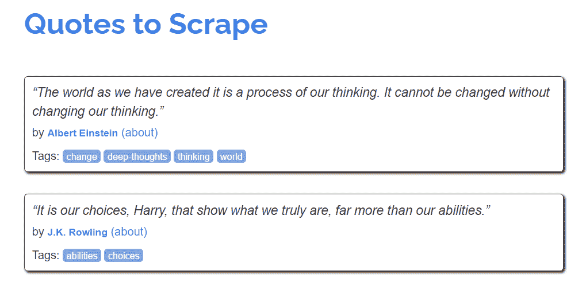
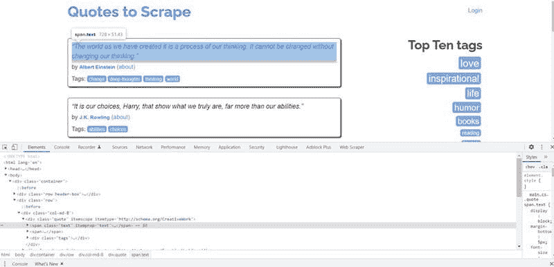
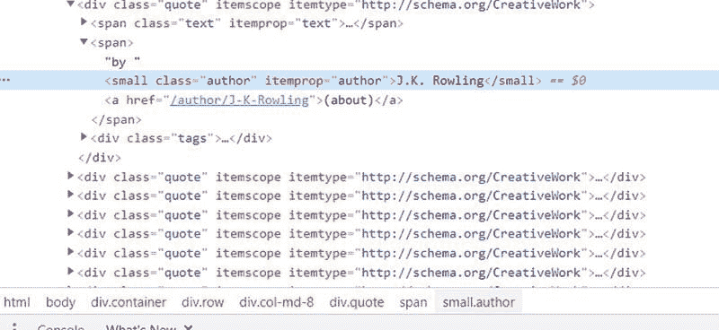
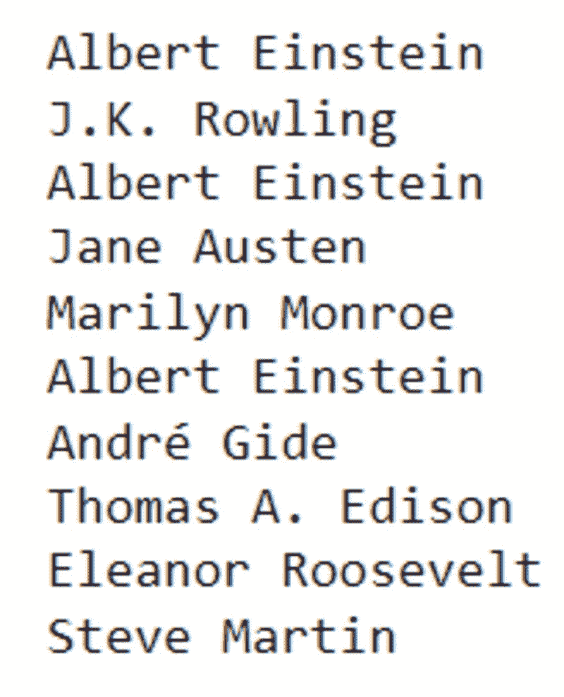
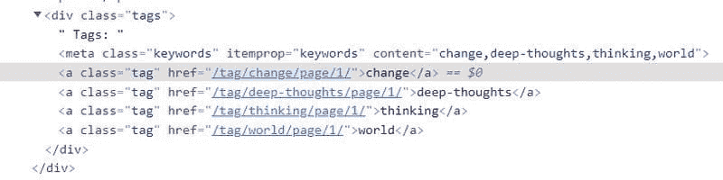
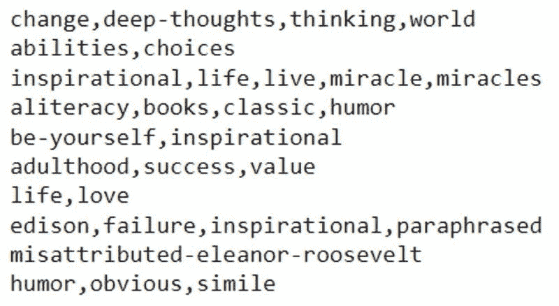
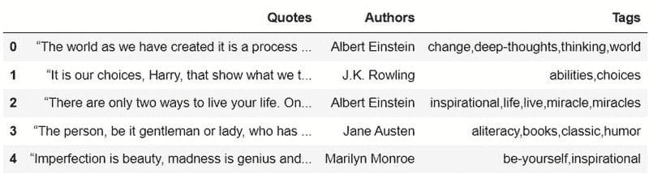

# 用 Python 在 5 分钟内构建网络爬虫

> 原文：[`www.kdnuggets.com/2022/02/build-web-scraper-python-5-minutes.html`](https://www.kdnuggets.com/2022/02/build-web-scraper-python-5-minutes.html)

数据科学家通常需要收集大量数据，以便在组织中提取业务价值。不幸的是，这是一项经常被忽视的技能，因为大多数数据科学课程并不教授如何收集外部数据。相反，大多注重于模型构建和训练。

在本文中，我将向你展示如何从头开始创建一个网络爬虫。

* * *

## 我们的前三个课程推荐

 1\. [谷歌网络安全证书](https://www.kdnuggets.com/google-cybersecurity) - 快速进入网络安全职业道路。

 2\. [谷歌数据分析专业证书](https://www.kdnuggets.com/google-data-analytics) - 提升你的数据分析水平

 3\. [谷歌 IT 支持专业证书](https://www.kdnuggets.com/google-itsupport) - 支持你的组织 IT

* * *

如果你还不熟悉这个术语，网络爬虫是一个自动化工具，可以从网站中提取大量数据。借助网络抓取，你可以在几分钟内收集多达数十万条数据点。

在本教程中，我们将抓取一个名为 “[Quotes to Scrape](https://quotes.toscrape.com/)” 的网站。这个网站是专门为练习网络抓取而建立的。

在本文结束时，你将熟悉以下内容：

+   从网站提取原始 HTML

+   使用 BeautifulSoup 库来解析这些 HTML 并从网站中提取有用的信息

+   同时从多个网页收集数据

+   将这些数据存储到 Pandas 数据框中

在我们开始构建爬虫之前，请确保已安装以下库 — [Pandas](https://pandas.pydata.org/docs/)，[BeautifulSoup](https://www.crummy.com/software/BeautifulSoup/bs4/doc/)，[requests](https://docs.python-requests.org/en/latest/)。

完成后，让我们查看一下我们想要抓取的网站，并决定要从中提取的数据点。



这个网站包含了名人名言的列表。页面上显示了三项主要信息——名言、作者及其相关的几个标签。

该网站有十页，我们将抓取其中的所有信息。

让我们首先导入以下库：

```py
import pandas as pd
from bs4 import BeautifulSoup
import requests
```

然后，使用 *requests* 库，我们将获取我们想抓取的页面并提取其 HTML：

```py
f = requests.get('[`quotes.toscrape.com/'`](http://quotes.toscrape.com/'))
```

接下来，我们将把网站的 HTML 文本传递给 BeautifulSoup，它将解析这些原始数据，以便轻松进行抓取：

```py
soup = BeautifulSoup(f.text)
```

现在，网站的所有数据都存储在 soup 对象中。我们可以很容易地在这个对象上运行 BeautifulSoup 的内置函数，以提取我们想要的数据。

例如，如果我们想提取网页上所有的文本，可以通过以下代码轻松完成：

```py
print(soup.get_text())
```

你应该能看到网站上的所有文本出现在你的屏幕上。

现在，让我们开始抓取网站上列出的引用。右键点击任何一个引用，选择 "*检查元素*"。Chrome 开发者工具将会出现在你的屏幕上：



BeautifulSoup 具有像 find() 和 findAll() 这样的函数，你可以用它们从网页中提取特定的 HTML 标签。

在这种情况下，请注意名为 *text* 的 `<span>` 类被高亮显示。这是因为你右键点击了页面上的一个引用，所有引用都属于这个 *text* 类。

我们需要提取这个类中的所有数据：

```py
for i in soup.findAll("div",{"class":"quote"}):
    print((i.find("span",{"class":"text"})).text)
```

一旦你运行上述代码，将会生成以下输出：


网页上有十个引用，我们的抓取器已经成功地收集了所有这些引用。太棒了！

现在，我们将使用相同的方法抓取作者名字。

如果你右键点击网页上的任何一个作者名字并选择检查，你会看到它们都包含在 `<small>` 标签内，且类名为 *author*。



我们将使用 find() 和 findAll() 函数来提取这个标签内的所有作者名字。

```py
for i in soup.findAll("div",{"class":"quote"}):
    print((i.find("small",{"class":"author"})).text)
```

以下输出将被渲染：



再次，我们成功地抓取了页面上列出的所有作者。我们快完成了！

最后，我们将抓取网站上列出的标签。

如果你右键点击任何一个标签并选择检查元素，你会看到它们都包含在 `<meta>` 标签内，并用逗号分隔：



同时，请注意 `<meta>` 标签被一个父 `<div>` 标签包裹，且类名为 *tags*。

要提取页面上的所有标签，请运行以下代码：

```py
for i in soup.findAll("div",{"class":"tags"}):
    print((i.find("meta"))['content'])
```

屏幕上的输出将如下所示：



我们现在已经成功地抓取了网站单页上的所有数据。

但我们还没有完成！记住，网站有十页，我们需要从所有页面中收集相同的数据。

在我们做这些之前，让我们创建三个空数组，以便存储收集到的数据。

```py
quotes = []
authors = []
tags = []
```

现在，我们将创建一个范围从 1 到 10 的循环，并遍历网站上的每一页。我们将运行之前创建的完全相同的代码行。唯一的区别是，我们现在将其附加到数组中，而不是打印输出。

```py
for pages in range(1,10):    f = requests.get('[`quotes.toscrape.com/page/'+str(pages))`](http://quotes.toscrape.com/page/'+str(pages)))
    soup = BeautifulSoup(f.text)    for i in soup.findAll("div",{"class":"quote"}):
        quotes.append((i.find("span",{"class":"text"})).text)  

    for j in soup.findAll("div",{"class":"quote"}):
        authors.append((j.find("small",{"class":"author"})).text)    for k in soup.findAll("div",{"class":"tags"}):
        tags.append((k.find("meta"))['content'])
```

完成！

最后，让我们将所有收集到的数据汇总到一个 Pandas 数据框中：

```py
finaldf = pd.DataFrame(
    {'Quotes':quotes,
     'Authors':authors,
     'Tags':tags
    })
```

查看最终数据框的开头，我们可以看到所有抓取到的数据都已被整理到三列中：



这就是本教程的全部内容！

我们已经成功使用 Python 库抓取了一个网站，并将提取的数据存储到数据框中。

这些数据可以用于进一步分析——你可以构建一个聚类模型来将相似的引用聚集在一起，或者训练一个模型，根据输入的引用自动生成标签。

如果你想练习上述学到的技能， [这里](http://books.toscrape.com/) 是另一个相对简单的网站可以抓取。

网页抓取不仅仅是本文中提到的技术。现实中的网站通常有机器人保护机制，这使得从数百个页面中收集数据变得困难。当你想从像上述那样的静态 HTML 网页中提取数据时，使用 *requests* 和 *BeautifulSoup* 就足够了。

如果你从需要认证的网站抓取数据，或有验证码等验证机制，或者在页面加载时有 JavaScript 运行，你将需要使用像 Selenium 这样的浏览器自动化工具来帮助抓取。

如果你想学习用于网页抓取的 Selenium，我建议你从 [this](https://www.analyticsvidhya.com/blog/2020/08/web-scraping-selenium-with-python/) 初学者友好的教程开始。

**[Natassha Selvaraj](https://www.natasshaselvaraj.com/)** 是一位自学成才的数据科学家，热衷于写作。你可以在 [LinkedIn](https://www.linkedin.com/in/natassha-selvaraj-33430717a/) 上与她联系。

### 更多相关内容

+   [5 分钟构建机器学习网页应用](https://www.kdnuggets.com/2022/03/build-machine-learning-web-app-5-minutes.html)

+   [KDnuggets 新闻 2022 年 3 月 9 日：用 5 分钟构建机器学习网页应用](https://www.kdnuggets.com/2022/n10.html)

+   [FastAPI 教程：用 Python 分钟构建 API](https://www.kdnuggets.com/fastapi-tutorial-build-apis-with-python-in-minutes)

+   [用 Python 在 5 分钟内构建文本到语音转换器](https://www.kdnuggets.com/2022/09/build-texttospeech-converter-python-5-minutes.html)

+   [用 Hugging Face 和 Gradio 在 5 分钟内构建 AI 聊天机器人](https://www.kdnuggets.com/2023/06/build-ai-chatbot-5-minutes-hugging-face-gradio.html)

+   [在 3 分钟内理解偏差-方差权衡](https://www.kdnuggets.com/2020/09/understanding-bias-variance-trade-off-3-minutes.html)
