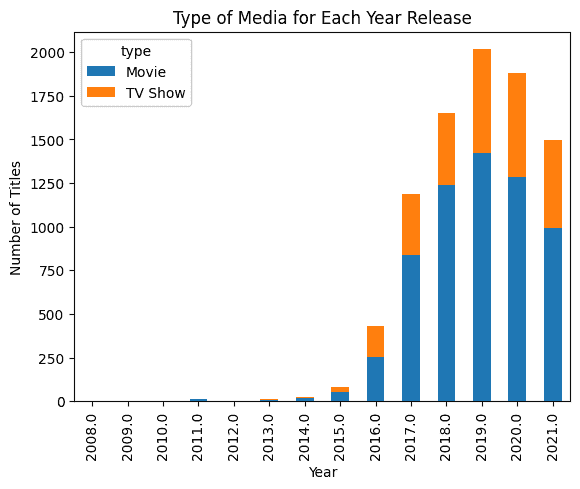
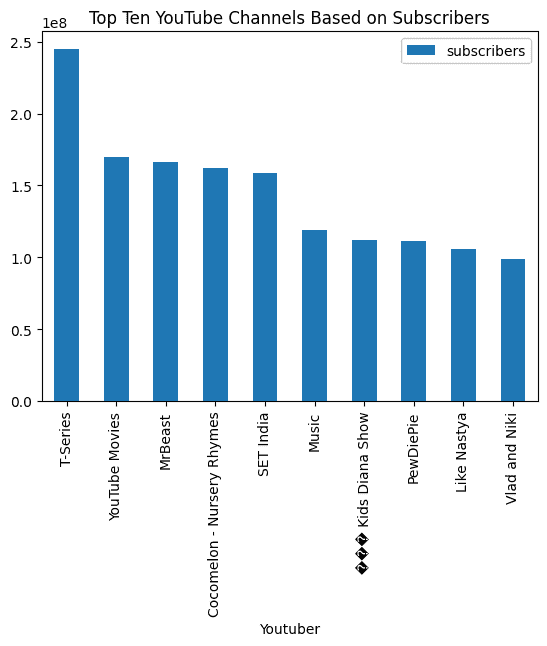

# 使用 LlamaIndex 构建自己的 PandasAI

> 原文：[`www.kdnuggets.com/build-your-own-pandasai-with-llamaindex`](https://www.kdnuggets.com/build-your-own-pandasai-with-llamaindex)


图片作者

# 介绍

* * *

## 我们的前三大课程推荐

 1\. [Google 网络安全证书](https://www.kdnuggets.com/google-cybersecurity) - 快速进入网络安全职业生涯。

 2\. [Google 数据分析专业证书](https://www.kdnuggets.com/google-data-analytics) - 提升您的数据分析技能

 3\. [Google IT 支持专业证书](https://www.kdnuggets.com/google-itsupport) - 支持您所在的组织的 IT 工作

* * *

Pandas AI 是一个 Python 库，利用生成 AI 的力量来增强 Pandas——这一流行的数据分析库。只需一个简单的提示，Pandas AI 就能执行复杂的数据清理、分析和可视化，这些以前需要许多行代码。

除了处理数据外，Pandas AI 还理解自然语言。你可以用简单的英语提问数据，它会用日常语言提供总结和见解，免去你解读复杂图表和表格的麻烦。

在下面的示例中，我们提供了一个 Pandas 数据框，并要求生成 AI 创建一个条形图。结果令人印象深刻。

```py
pandas_ai.run(df, prompt='Plot the bar chart of type of media for each year release, using different colors.')
```



> **注意：** 代码示例来自 [Pandas AI: 生成 AI 驱动的数据分析指南](https://www.datacamp.com/blog/an-introduction-to-pandas-ai) 教程。

在这篇文章中，我们将使用 LlamaIndex 创建类似的工具，这些工具可以理解 Pandas 数据框并生成复杂的结果，如上所示。

[LlamaIndex](https://www.datacamp.com/tutorial/llama-index-adding-personal-data-to-llms) 使得通过聊天和代理自然语言查询数据成为可能。它允许大型语言模型在不重新训练新数据的情况下大规模解释私有数据。它将大型语言模型与各种数据源和工具集成在一起。LlamaIndex 是一个数据框架，只需几行代码即可轻松创建带有 PDF 的聊天应用程序。

# 设置

您可以通过使用 `pip` 命令安装 Python 库。

```py
pip install llama-index
```

默认情况下，LlamaIndex 使用 OpenAI 的 `gpt-3.5-turbo` 模型进行文本生成，使用 `text-embedding-ada-002` 进行检索和嵌入。为了无障碍运行代码，我们必须设置 `OPENAI_API_KEY`。我们可以在 [新的 API 令牌](https://beta.openai.com/account/api-keys) 页面免费注册并获取 API 密钥。

```py
import os
os.environ["OPENAI_API_KEY"] = "sk-xxxxxx"
```

他们还支持 Anthropic、Hugging Face、PaLM 等模型的集成。你可以通过阅读 [模块的](https://gpt-index.readthedocs.io/en/stable/core_modules/model_modules/llms/modules.html) 文档了解有关它的一切。

# Pandas 查询引擎

让我们进入创建自己的 PandasAI 的主要话题。在安装库和设置 API 密钥后，我们将创建一个简单的城市数据框，列包括城市名称和人口。

```py
import pandas as pd
from llama_index.query_engine.pandas_query_engine import PandasQueryEngine
```

```py
df = pd.DataFrame(
    {"city": ["New York", "Islamabad", "Mumbai"], "population": [8804190, 1009832, 12478447]}
)
```

使用 `PandasQueryEngine`，我们将创建一个查询引擎以加载数据框并对其进行索引。

之后，我们将编写查询并显示响应。

```py
query_engine = PandasQueryEngine(df=df)

response = query_engine.query(
    "What is the city with the lowest population?",
)
```

如我们所见，它已经开发了用于显示数据框中最少人口城市的 Python 代码。

```py
> Pandas Instructions:
```

eval("df.loc[df['population'].idxmin()]['city']")

```py
eval("df.loc[df['population'].idxmin()]['city']")
> Pandas Output: Islamabad
```

如果你打印响应，你将得到“伊斯兰堡”。这很简单但令人印象深刻。你不必自己想出逻辑或实验代码。只需输入问题，你将得到答案。

```py
print(response)
```

```py
Islamabad
```

你还可以使用响应元数据打印结果背后的代码。

```py
print(response.metadata["pandas_instruction_str"])
```

```py
eval("df.loc[df['population'].idxmin()]['city']")
```

# 全球 YouTube 统计分析

在第二个示例中，我们将从 Kaggle 加载全球 [YouTube 统计数据 2023](https://www.kaggle.com/datasets/nelgiriyewithana/global-youtube-statistics-2023) 数据集，并进行一些基本分析。这比简单示例要更复杂。

我们将使用 `read_csv` 将数据集加载到查询引擎中。然后我们将编写提示以仅显示缺失值的列和缺失值的数量。

```py
df_yt = pd.read_csv("Global YouTube Statistics.csv")
query_engine = PandasQueryEngine(df=df_yt, verbose=True)

response = query_engine.query(
    "List the columns with missing values and the number of missing values. Only show missing values columns.",
)
```

```py
> Pandas Instructions:
```

df.isnull().sum()[df.isnull().sum() > 0]

```py
df.isnull().sum()[df.isnull().sum() > 0]
> Pandas Output: category                                    46
Country                                    122
Abbreviation                               122
channel_type                                30
video_views_rank                             1
country_rank                               116
channel_type_rank                           33
video_views_for_the_last_30_days            56
subscribers_for_last_30_days               337
created_year                                 5
created_month                                5
created_date                                 5
Gross tertiary education enrollment (%)    123
Population                                 123
Unemployment rate                          123
Urban_population                           123
Latitude                                   123
Longitude                                  123
dtype: int64
```

现在，我们将直接询问有关流行频道类型的问题。在我看来，LlamdaIndex 查询引擎非常准确，尚未产生任何幻觉。

```py
response = query_engine.query(
    "Which channel type have the most views.",
)
```

```py
> Pandas Instructions:
```

eval("df.groupby('channel_type')['video views'].sum().idxmax()")

```py
eval("df.groupby('channel_type')['video views'].sum().idxmax()")
> Pandas Output: Entertainment
Entertainment
```

最终，我们会要求它可视化条形图，结果非常惊人。

```py
response = query_engine.query(
    "Visualize barchat of top ten youtube channels based on subscribers and add the title.",
)
```

```py
> Pandas Instructions:
```

eval("df.nlargest(10, 'subscribers')[['Youtuber', 'subscribers']].plot(kind='bar', x='Youtuber', y='subscribers', title='基于订阅者数量的十大 YouTube 频道')")

```py
eval("df.nlargest(10, 'subscribers')[['Youtuber', 'subscribers']].plot(kind='bar', x='Youtuber', y='subscribers', title='Top Ten YouTube Channels Based on Subscribers')")
> Pandas Output: AxesSubplot(0.125,0.11;0.775x0.77)
```



通过简单的提示和查询引擎，我们可以自动化数据分析并执行复杂任务。LamaIndex 还有更多功能。我强烈建议你阅读 [官方文档](https://gpt-index.readthedocs.io/en/stable/index.html) 并尝试构建一些惊人的东西。

# 结论

总结一下，LlamaIndex 是一个令人兴奋的新工具，它允许开发者创建自己的 PandasAI——利用大型语言模型的力量进行直观的数据分析和对话。通过使用 LlamaIndex 对你的数据集进行索引和嵌入，你可以在不妥协安全性或重新训练模型的情况下，为你的私人数据启用高级自然语言能力。

这只是一个开始，通过 LlamaIndex，你可以构建文档问答系统、聊天机器人、自动化 AI、知识图谱、AI SQL 查询引擎、全栈 Web 应用程序，并构建私人生成式 AI 应用程序。

**[Abid Ali Awan](https://www.polywork.com/kingabzpro)** ([@1abidaliawan](https://www.linkedin.com/in/1abidaliawan/)) 是一位认证的数据科学专业人士，他热衷于构建机器学习模型。目前，他专注于内容创作，并撰写关于机器学习和数据科学技术的技术博客。Abid 拥有技术管理硕士学位和电信工程学士学位。他的愿景是利用图神经网络构建一个 AI 产品，帮助那些在精神健康方面挣扎的学生。

### 更多相关话题

+   [LangChain 101：构建你自己的 GPT 驱动应用程序](https://www.kdnuggets.com/2023/04/langchain-101-build-gptpowered-applications.html)

+   [LangChain 和 LlamaIndex 的比较分析](https://www.kdnuggets.com/comparative-analysis-of-langchain-and-llamaindex)

+   [用 ChatGPT 的 GPTs 自行创建 GPT](https://www.kdnuggets.com/make-your-own-gpts-with-chatgpts-gpts)

+   [人工智能会拥有自己的蝙蝠侠吗？](https://www.kdnuggets.com/2022/05/ai-get-batman.html)

+   [它活过来了！用 Python 和一些便宜的…](https://www.kdnuggets.com/2023/06/manning-build-first-robots-python-cheap-basic-components.html)

+   [构建供应链管道所需的 6 种数据科学技术](https://www.kdnuggets.com/2022/01/6-data-science-technologies-need-build-supply-chain-pipeline.html)
