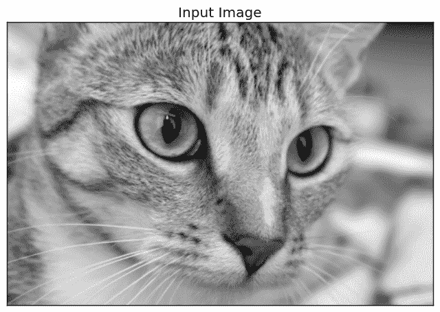
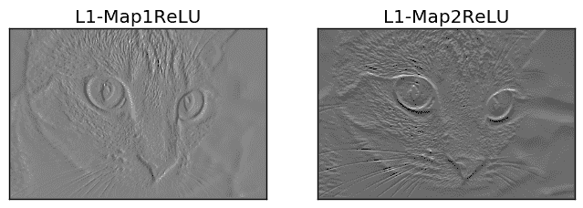
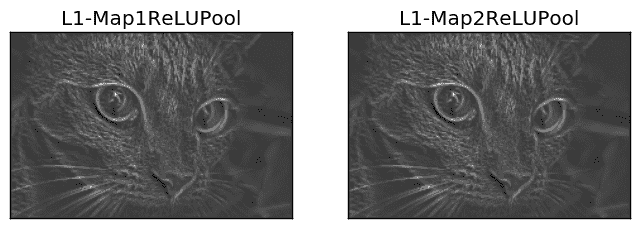
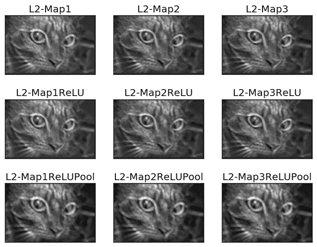
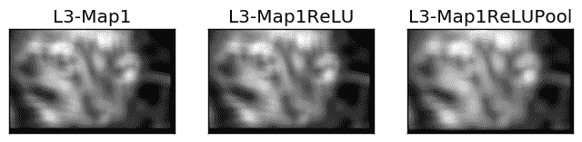

# 从头开始使用 NumPy 构建卷积神经网络

> 原文：[`www.kdnuggets.com/2018/04/building-convolutional-neural-network-numpy-scratch.html`](https://www.kdnuggets.com/2018/04/building-convolutional-neural-network-numpy-scratch.html)

评论

使用 ML/DL 库中已有的模型在某些情况下可能很有帮助。但为了更好的控制和理解，你应该尝试自己实现这些模型。本文展示了如何仅使用 NumPy 实现 CNN。

卷积神经网络（CNN）是分析多维信号（如图像）的最先进技术。已经有许多库实现了 CNN，如 TensorFlow 和 Keras。这些库将开发者与一些细节隔离开，只提供了一个抽象的 API，以简化开发过程并避免实现中的复杂性。但实际上，这些细节可能会有所不同。有时候，数据科学家需要深入这些细节以提升性能。在这种情况下，解决方案是自己构建每个模型的部分。这可以对网络进行尽可能高的控制。此外，推荐实现这些模型以更好地理解它们。

* * *

## 我们的前 3 名课程推荐

 1. [谷歌网络安全证书](https://www.kdnuggets.com/google-cybersecurity) - 快速进入网络安全职业道路。

 2. [谷歌数据分析专业证书](https://www.kdnuggets.com/google-data-analytics) - 提升你的数据分析技能。

 3. [谷歌 IT 支持专业证书](https://www.kdnuggets.com/google-itsupport) - 支持组织的 IT 需求。

* * *

本文使用仅 NumPy 库创建 CNN。仅创建了三个层，即卷积（conv 简写）、ReLU 和最大池化。涉及的主要步骤如下：

1.  读取输入图像。

1.  准备滤波器。

1.  卷积层：对输入图像应用每个滤波器进行卷积。

1.  ReLU 层：对特征图（卷积层的输出）应用 ReLU 激活函数。

1.  最大池化层：对 ReLU 层的输出应用池化操作。

1.  堆叠卷积、ReLU 和最大池化层。

### 1. 读取输入图像

以下代码从 skimage Python 库中读取一个已存在的图像，并将其转换为灰度图像。

```py

1\.  import skimage.data  
2\.  # Reading the image  
3\.  img = skimage.data.chelsea()  
4\.  # Converting the image into gray.  
5\.  img = skimage.color.rgb2gray(img)

```

读取图像是第一步，因为接下来的步骤依赖于输入的大小。图像转换为灰度后如下所示。



### 2. 准备滤波器

以下代码为第一个卷积层（**l1** 的简写）准备滤波器库：

```py

1\.  l1_filter = numpy.zeros((2,3,3))

```

根据滤波器的数量和每个滤波器的大小创建一个零数组。创建了**2**个**3x3**大小的滤波器，因此零数组的大小为（**2**=num_filters，**3**=num_rows_filter，**3**=num_columns_filter）。滤波器的大小被选择为二维数组而无深度，因为输入图像是灰度图像且没有深度（即二维）。如果图像是 RGB 的，有 3 个通道，则滤波器大小必须为（3，3，**3**=深度）。

滤波器组的大小由上面的零数组指定，而不是滤波器的实际值。可以通过以下方式覆盖这些值以检测垂直和水平边缘。

```py

1\.  l1_filter[0, :, :] = numpy.array([[[-1, 0, 1],   
2\.                                     [-1, 0, 1],   
3\.                                     [-1, 0, 1]]])  
4\.  l1_filter[1, :, :] = numpy.array([[[1,   1,  1],   
5\.                                     [0,   0,  0],   
6\.                                     [-1, -1, -1]]]) 

```

### 3\. 卷积层

在准备好滤波器后，接下来是对输入图像进行卷积。下一行使用名为**conv**的函数对图像和滤波器组进行卷积：

```py

1\.  l1_feature_map = conv(img, l1_filter)  

```

该函数只接受两个参数，即图像和滤波器组，具体实现如下。

```py

1\.  def conv(img, conv_filter):  
2\.      if len(img.shape) > 2 or len(conv_filter.shape) > 3: # Check if number of image channels matches the filter depth.  
3\.          if img.shape[-1] != conv_filter.shape[-1]:  
4\.              print("Error: Number of channels in both image and filter must match.")  
5\.              sys.exit()  
6\.      if conv_filter.shape[1] != conv_filter.shape[2]: # Check if filter dimensions are equal.  
7\.          print('Error: Filter must be a square matrix. I.e. number of rows and columns must match.')  
8\.          sys.exit()  
9\.      if conv_filter.shape[1]%2==0: # Check if filter diemnsions are odd.  
10\.         print('Error: Filter must have an odd size. I.e. number of rows and columns must be odd.')  
11\.         sys.exit()  
12\.   
13\.     # An empty feature map to hold the output of convolving the filter(s) with the image.  
14\.     feature_maps = numpy.zeros((img.shape[0]-conv_filter.shape[1]+1,   
15\.                                 img.shape[1]-conv_filter.shape[1]+1,   
16\.                                 conv_filter.shape[0]))  
17\.   
18\.     # Convolving the image by the filter(s).  
19\.     for filter_num in range(conv_filter.shape[0]):  
20\.         print("Filter ", filter_num + 1)  
21\.         curr_filter = conv_filter[filter_num, :] # getting a filter from the bank.  
22\.         """  
23\.         Checking if there are mutliple channels for the single filter. 
24\.         If so, then each channel will convolve the image. 
25\.         The result of all convolutions are summed to return a single feature map. 
26\.         """  
27\.         if len(curr_filter.shape) > 2:  
28\.             conv_map = conv_(img[:, :, 0], curr_filter[:, :, 0]) # Array holding the sum of all feature maps.  
29\.             for ch_num in range(1, curr_filter.shape[-1]): # Convolving each channel with the image and summing the results.  
30\.                 conv_map = conv_map + conv_(img[:, :, ch_num],   
31\.                                   curr_filter[:, :, ch_num])  
32\.         else: # There is just a single channel in the filter.  
33\.             conv_map = conv_(img, curr_filter)  
34\.         feature_maps[:, :, filter_num] = conv_map # Holding feature map with the current filter.
35\.      return feature_maps # Returning all feature maps. 

```

该函数首先确保每个滤波器的深度等于图像通道的数量。在下面的代码中，外层**if**检查通道和滤波器是否具有深度。如果已经存在深度，则内层**if**检查它们是否不相等。如果不匹配，脚本将退出。

```py

1\.  if len(img.shape) > 2 or len(conv_filter.shape) > 3: # Check if number of image channels matches the filter depth.  
2\.          if img.shape[-1] != conv_filter.shape[-1]:  
3\.              print("Error: Number of channels in both image and filter must match.")  
```

此外，滤波器的大小应为奇数，并且滤波器的维度应相等（即行数和列数都是奇数且相等）。这通过以下两个**if**块进行检查。如果条件不满足，脚本将退出。

```py

1\.  if conv_filter.shape[1] != conv_filter.shape[2]: # Check if filter dimensions are equal.  
2\.      print('Error: Filter must be a square matrix. I.e. number of rows and columns must match.')  
3\.      sys.exit()  
4\.  if conv_filter.shape[1]%2==0: # Check if filter diemnsions are odd.  
5\.      print('Error: Filter must have an odd size. I.e. number of rows and columns must be odd.')  
6\.      sys.exit()  

```

不满足上述任何条件证明滤波器深度与图像适配，卷积可以应用。通过滤波器对图像进行卷积的过程开始于初始化一个数组以存放卷积输出（即特征图），并通过以下代码指定其大小：

```py

1\.  # An empty feature map to hold the output of convolving the filter(s) with the image.  
2\.  feature_maps = numpy.zeros((img.shape[0]-conv_filter.shape[1]+1,   
3\.                              img.shape[1]-conv_filter.shape[1]+1,   
4\.                              conv_filter.shape[0])) 

```

由于没有步幅和填充，特征图的大小将等于（img_rows-filter_rows+1，image_columns-filter_columns+1，num_filters），如上代码所示。请注意，每个滤波器都有一个输出特征图。这就是为什么滤波器组中的滤波器数量（**conv_filter.shape[0]**）被用来作为第三个参数来指定大小。

```py

1\.   # Convolving the image by the filter(s).  
2\.      for filter_num in range(conv_filter.shape[0]):  
3\.          print("Filter ", filter_num + 1)  
4\.          curr_filter = conv_filter[filter_num, :] # getting a filter from the bank.  
5\.          """  
6\.          Checking if there are mutliple channels for the single filter. 
7\.          If so, then each channel will convolve the image. 
8\.          The result of all convolutions are summed to return a single feature map. 
9\.          """  
10\.         if len(curr_filter.shape) > 2:  
11\.             conv_map = conv_(img[:, :, 0], curr_filter[:, :, 0]) # Array holding the sum of all feature maps.  
12\.             for ch_num in range(1, curr_filter.shape[-1]): # Convolving each channel with the image and summing the results.  
13\.                 conv_map = conv_map + conv_(img[:, :, ch_num],   
14\.                                   curr_filter[:, :, ch_num])  
15\.         else: # There is just a single channel in the filter.  
16\.             conv_map = conv_(img, curr_filter)  
17\.         feature_maps[:, :, filter_num] = conv_map # Holding feature map with the current filter.  

```

外层循环遍历滤波器组中的每个滤波器，并根据这一行返回它以供进一步处理：

```py

1\.  curr_filter = conv_filter[filter_num, :] # getting a filter from the bank.  

```

如果要卷积的图像有多个通道，则滤波器的深度必须等于这些通道的数量。在这种情况下，卷积是通过将每个图像通道与滤波器中的相应通道进行卷积来完成的。最终，结果的总和将是输出特征图。如果图像只有一个通道，那么卷积将直接进行。确定这种行为是在**if-else**块中完成的：

```py

1\.  if len(curr_filter.shape) > 2:  
2\.       conv_map = conv_(img[:, :, 0], curr_filter[:, :, 0]) # Array holding the sum of all feature map 
3\.       for ch_num in range(1, curr_filter.shape[-1]): # Convolving each channel with the image and summing the results.  
4\.          conv_map = conv_map + conv_(img[:, :, ch_num],   
5\.                                    curr_filter[:, :, ch_num])  
6\.  else: # There is just a single channel in the filter.  
7\.      conv_map = conv_(img, curr_filter)  

```

你可能会注意到，卷积是通过一个叫做**conv_**的函数来实现的，这与**conv**函数不同。函数**conv**只是接受输入图像和滤波器组，但不会自行执行卷积。它只是将每一组输入-滤波器对传递给**conv_**函数。这只是为了使代码更易于调试。以下是**conv_**函数的实现：

```py

1\.  def conv_(img, conv_filter):  
2\.      filter_size = conv_filter.shape[0]  
3\.      result = numpy.zeros((img.shape))  
4\.      #Looping through the image to apply the convolution operation.  
5\.      for r in numpy.uint16(numpy.arange(filter_size/2,   
6\.                            img.shape[0]-filter_size/2-2)):  
7\.          for c in numpy.uint16(numpy.arange(filter_size/2, img.shape[1]-filter_size/2-2)):  
8\.              #Getting the current region to get multiplied with the filter.  
9\.              curr_region = img[r:r+filter_size, c:c+filter_size]  
10\.             #Element-wise multipliplication between the current region and the filter.  
11\.             curr_result = curr_region * conv_filter  
12\.             conv_sum = numpy.sum(curr_result) #Summing the result of multiplication.  
13\.             result[r, c] = conv_sum #Saving the summation in the convolution layer feature map.  
14\.               
15\.     #Clipping the outliers of the result matrix.  
16\.     final_result = result[numpy.uint16(filter_size/2):result.shape[0]-numpy.uint16(filter_size/2),   
17\.                           numpy.uint16(filter_size/2):result.shape[1]-numpy.uint16(filter_size/2)]  
18\.     return final_result  

```

它遍历图像并提取与滤波器大小相等的区域，如下行所示：

```py

1\.  curr_region = img[r:r+filter_size, c:c+filter_size]  

```

然后，它在区域和滤波器之间执行逐元素乘法，并将它们相加以根据这些行获得一个单一的值作为输出：

```py

1\.  #Element-wise multipliplication between the current region and the filter.  
2\.  curr_result = curr_region * conv_filter  
3\.  conv_sum = numpy.sum(curr_result) #Summing the result of multiplication.  
4\.  result[r, c] = conv_sum #Saving the summation in the convolution layer feature map.  
```

在对每个滤波器进行卷积后，特征图由**conv**函数返回。下图显示了此卷积层返回的特征图。


这种层的输出将应用于 ReLU 层。

### 4\. ReLU 层

ReLU 层在每个由卷积层返回的特征图上应用 ReLU 激活函数。它通过以下代码行调用**relu**函数：

```py

l1_feature_map_relu = relu(l1_feature_map)
```

**relu**函数的实现如下：

```py

1\.  def relu(feature_map):  
2\.      #Preparing the output of the ReLU activation function.  
3\.      relu_out = numpy.zeros(feature_map.shape)  
4\.      for map_num in range(feature_map.shape[-1]):  
5\.          for r in numpy.arange(0,feature_map.shape[0]):  
6\.              for c in numpy.arange(0, feature_map.shape[1]):  
7\.                  relu_out[r, c, map_num] = numpy.max(feature_map[r, c, map_num], 0)  
```

这非常简单。只需循环遍历特征图中的每个元素，如果元素大于 0，则返回特征图中的原始值。否则，返回 0。ReLU 层的输出在下图中显示。



ReLU 层的输出会应用到最大池化层中。

### 5\. 最大池化层

最大池化层接受 ReLU 层的输出，并根据以下行应用最大池化操作：

```py

1\.  l1_feature_map_relu_pool = pooling(l1_feature_map_relu, 2, 2)  
```

它使用**pooling**函数实现，如下所示：

```py

1\.  def pooling(feature_map, size=2, stride=2):  
2\.      #Preparing the output of the pooling operation.  
3\.      pool_out = numpy.zeros((numpy.uint16((feature_map.shape[0]-size+1)/stride),  
4\.                              numpy.uint16((feature_map.shape[1]-size+1)/stride),  
5\.                              feature_map.shape[-1]))  
6\.      for map_num in range(feature_map.shape[-1]):  
7\.          r2 = 0  
8\.          for r in numpy.arange(0,feature_map.shape[0]-size-1, stride):  
9\.              c2 = 0  
10\.             for c in numpy.arange(0, feature_map.shape[1]-size-1, stride):  
11\.                 pool_out[r2, c2, map_num] = numpy.max(feature_map[r:r+size,  c:c+size])  
12\.                 c2 = c2 + 1  
13\.             r2 = r2 +1  
```

该函数接受三个输入，即 ReLU 层的输出、池化掩模尺寸和步幅。它简单地创建一个空数组，正如之前所述，用于保存该层的输出。该数组的大小根据尺寸和步幅参数来指定，如下行所示：

```py

1\.  pool_out = numpy.zeros((numpy.uint16((feature_map.shape[0]-size+1)/stride),  
2\.                          numpy.uint16((feature_map.shape[1]-size+1)/stride),  
3\.                          feature_map.shape[-1]))  
```

然后它通过外层循环按通道逐个处理输入，外层循环使用循环变量**map_num**。对于输入中的每个通道，应用最大池化操作。根据使用的步幅和尺寸，区域被裁剪，最大值会被返回到输出数组中，如下行所示：

```py

pool_out[r2, c2, map_num] = numpy.max(feature_map[r:r+size,  c:c+size])
```

这种池化层的输出在下图中显示。请注意，即使池化层的输出在图中看起来与输入相同，它的尺寸仍然小于输入。



### 6\. 堆叠层

到目前为止，包含卷积、ReLU 和最大池化层的 CNN 架构已经完成。可能还会有一些其他层需要堆叠在之前的层之上，如下所示。

```py

1\.  # Second conv layer  
2\.  l2_filter = numpy.random.rand(3, 5, 5, l1_feature_map_relu_pool.shape[-1])  
3\.  print("\n**Working with conv layer 2**")  
4\.  l2_feature_map = conv(l1_feature_map_relu_pool, l2_filter)  
5\.  print("\n**ReLU**")  
6\.  l2_feature_map_relu = relu(l2_feature_map)  
7\.  print("\n**Pooling**")  
8\.  l2_feature_map_relu_pool = pooling(l2_feature_map_relu, 2, 2)  
9\.  print("**End of conv layer 2**\n")  

```

前一卷积层使用了**3**个随机生成的过滤器。这就是为什么从该卷积层会产生**3**个特征图。后续的 ReLU 和池化层也是如此。这些层的输出如下所示。



```py

1\.  # Third conv layer  
2\.  l3_filter = numpy.random.rand(1, 7, 7, l2_feature_map_relu_pool.shape[-1])  
3\.  print("\n**Working with conv layer 3**")  
4\.  l3_feature_map = conv(l2_feature_map_relu_pool, l3_filter)  
5\.  print("\n**ReLU**")  
6\.  l3_feature_map_relu = relu(l3_feature_map)  
7\.  print("\n**Pooling**")  
8\.  l3_feature_map_relu_pool = pooling(l3_feature_map_relu, 2, 2)  
9\.  print("**End of conv layer 3**\n")  

```

下图展示了前面层的输出。前一卷积层只使用了一个过滤器。这就是为什么只有一个特征图作为输出。



但请记住，每一层的输出都是下一层的输入。例如，这些线条接受之前的输出作为它们的输入。

```py

1\.  l2_feature_map = conv(l1_feature_map_relu_pool, l2_filter)  
2\.  l3_feature_map = conv(l2_feature_map_relu_pool, l3_filter)
```

### 7\. 完整代码

完整代码可以在 [**github**](https://github.com/ahmedfgad/NumPyCNN) ([`github.com/ahmedfgad/NumPyCNN`](https://github.com/ahmedfgad/NumPyCNN)) 上找到。代码中包含了使用**Matplotlib**库可视化每一层输出的功能。

**简介: [Ahmed Gad](https://www.linkedin.com/in/ahmedfgad/)** 于 2015 年 7 月获得埃及 Menoufia 大学计算机与信息学院（FCI）信息技术专业的优秀荣誉学士学位。由于在学院中排名第一，他于 2015 年被推荐到埃及某研究所担任助教，随后于 2016 年回到学院担任助教和研究员。他目前的研究兴趣包括深度学习、机器学习、人工智能、数字信号处理和计算机视觉。

[原文](https://www.linkedin.com/pulse/building-convolutional-neural-network-using-numpy-from-ahmed-gad/). 经许可转载。

**相关:**

+   逐步推导卷积神经网络从全连接网络

+   学习率在人工神经网络中有用吗？

+   通过正则化避免过拟合

### 更多相关主题

+   [使用 PyTorch 构建卷积神经网络](https://www.kdnuggets.com/building-a-convolutional-neural-network-with-pytorch)

+   [停止学习数据科学以寻找目标，并以此寻找目标…](https://www.kdnuggets.com/2021/12/stop-learning-data-science-find-purpose.html)

+   [一个 $9B 的人工智能失败，详解](https://www.kdnuggets.com/2021/12/9b-ai-failure-examined.html)

+   [学习数据科学统计的最佳资源](https://www.kdnuggets.com/2021/12/springboard-top-resources-learn-data-science-statistics.html)

+   [成功数据科学家的 5 个特征](https://www.kdnuggets.com/2021/12/5-characteristics-successful-data-scientist.html)

+   [为什么 Python 是初创公司的理想编程语言](https://www.kdnuggets.com/2021/12/makes-python-ideal-programming-language-startups.html)
