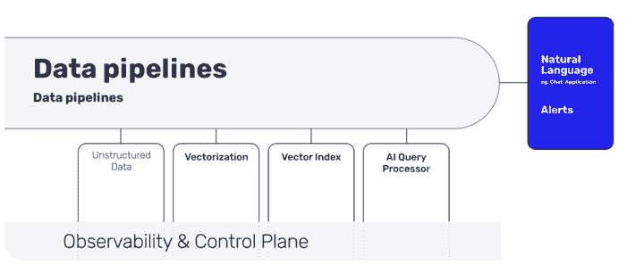

# 构建数据管道以创建大语言模型应用程序

> 原文：[`www.kdnuggets.com/building-data-pipelines-to-create-apps-with-large-language-models`](https://www.kdnuggets.com/building-data-pipelines-to-create-apps-with-large-language-models)

DALL-E 3 生成的图像

企业目前追求两种 LLM 驱动应用程序的方法——**微调**和**检索增强生成（RAG）**。从很高的层面来看，RAG 接受一个输入，并根据来源（例如，公司维基）检索一组相关/支持的文档。这些文档与原始输入提示一起被连接作为上下文，输入到 LLM 模型中，生成最终响应。RAG 似乎是将 LLM 推向市场的最受欢迎的方法，尤其是在[实时处理](https://github.com/pathwaycom/pathway/stargazers)场景中。支持这种方法的 LLM 架构大多数情况下包括构建有效的数据管道。

* * *

## 我们的三大课程推荐

 1\. [谷歌网络安全证书](https://www.kdnuggets.com/google-cybersecurity) - 快速进入网络安全职业生涯。

 2\. [谷歌数据分析专业证书](https://www.kdnuggets.com/google-data-analytics) - 提升你的数据分析技能

 3\. [谷歌 IT 支持专业证书](https://www.kdnuggets.com/google-itsupport) - 支持组织的 IT 工作

* * *

在这篇文章中，我们将探讨 LLM 数据管道中的不同阶段，以帮助开发人员实施与其数据配合的生产级系统。跟随我们，了解如何导入、准备、丰富和提供数据，以驱动 GenAI 应用程序。

# 大语言模型（LLM）管道的不同阶段是什么？

这些是 LLM 管道的不同阶段：

非结构化数据的导入

向量化与丰富（包含元数据）

向量索引（实时同步）

AI 查询处理器

自然语言用户交互（通过聊天或 API）

## 非结构化数据的导入

第一步是收集正确的数据，以帮助实现业务目标。如果你正在构建面向消费者的聊天机器人，那么你必须特别注意将使用哪些数据。数据来源可以从公司门户（例如，Sharepoint、Confluent、文档存储）到内部 API。理想情况下，你希望从这些来源到索引有一个推送机制，以便你的 LLM 应用程序能够为最终用户提供最新的信息。

组织在提取文本数据以进行 LLM 上下文训练时，应实施数据治理政策和协议。组织可以通过审计文档数据来源，列出敏感级别、许可条款和来源来入手。识别需要修订或排除的数据。

这些数据源也应评估质量——多样性、大小、噪音水平、冗余。低质量数据集会稀释来自[LLM 应用](https://github.com/pathwaycom/llm-app)的响应。你甚至可能需要一个早期文档分类机制来帮助后续正确的存储。

即使在快速发展的 LLM 开发中，遵循数据治理的保护措施也能降低风险。前期建立治理框架可以减轻许多后续问题，并支持可扩展、稳健的文本数据提取用于上下文学习。

通过 Slack、Telegram 或 Discord API 拉取消息可以实时获取数据，这有助于 RAG，但原始对话数据中包含噪音——拼写错误、编码问题和奇怪的字符。实时过滤带有攻击性内容或敏感个人信息（可能是 PII）的消息是数据清理的重要部分。

## 带有元数据的向量化

元数据如作者、日期和对话上下文进一步丰富数据。将外部知识嵌入向量中有助于更智能和有针对性的检索。

一些与文档相关的元数据可能存在于门户或文档的元数据中，但如果文档附属于业务对象（例如案例、客户、员工信息），则需要从关系数据库中提取这些信息。如果有数据访问的安全问题，这是你可以添加安全元数据的地方，这也有助于后续检索阶段。

关键步骤是使用 LLM 的嵌入模型将文本和图像转换为向量表示。对于文档，你需要先进行分块，然后使用本地零样本嵌入模型进行编码。

## 向量索引

向量表示必须存储在某处。这就是使用向量数据库或向量索引高效存储和索引这些信息作为嵌入的地方。

这将成为你的“LLM 真实来源”，并且必须与数据源和文档保持同步。[实时索引](https://pathway.com/developers/tutorials/indexing-grouped-tables/)变得重要，如果你的 LLM 应用正在服务客户或生成与业务相关的信息。你要避免你的 LLM 应用与数据源不同步。

## 使用查询处理器进行快速检索

当你拥有数百万份企业文档时，根据用户查询获取正确内容变得具有挑战性。

这是管道早期阶段开始增加价值的地方：通过元数据添加清洗和数据丰富，最重要的是数据索引。这种上下文添加有助于增强提示工程。

## 用户互动

在传统的管道环境中，你将数据推送到数据仓库，分析工具将从仓库中提取报告。在 LLM 管道中，最终用户界面通常是一个聊天界面，它在最简单的层面上接受用户查询并回应查询。

# 摘要

这种新型管道的挑战不仅在于获取一个原型，还在于将其投入生产。这时，企业级监控解决方案来跟踪你的管道和向量存储变得非常重要。从结构化和非结构化数据源获取业务数据的能力成为一个重要的架构决策。LLMs 代表了自然语言处理的最前沿，构建企业级数据管道以支持 LLM 驱动的应用程序使你始终处于前沿。

这里可以访问一个可用的[实时流处理框架](https://github.com/pathwaycom/pathway)。

****[Anup Surendran](https://www.linkedin.com/in/anupsurendran/)**** 是 Pathway 的产品营销负责人，专注于将 AI 产品推向市场。他曾与有两个成功退出（SAP 和 Kroll）的初创公司合作，并喜欢教授他人如何利用 AI 产品提高组织内的生产力。

### 更多相关主题

+   [顶级开源大型语言模型](https://www.kdnuggets.com/2022/09/john-snow-top-open-source-large-language-models.html)

+   [更多免费大型语言模型课程](https://www.kdnuggets.com/2023/06/free-courses-large-language-models.html)

+   [了解大型语言模型](https://www.kdnuggets.com/2023/03/learn-large-language-models.html)

+   [来自 John Snow Labs 的医疗特定大型语言模型介绍](https://www.kdnuggets.com/2023/04/john-snow-introducing-healthcare-specific-large-language-models-john-snow-labs.html)

+   [什么是大型语言模型，它们是如何工作的？](https://www.kdnuggets.com/2023/05/large-language-models-work.html)

+   [AI：大型语言和视觉模型](https://www.kdnuggets.com/2023/06/ai-large-language-visual-models.html)
