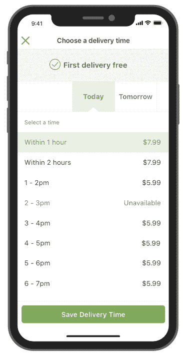
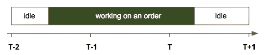
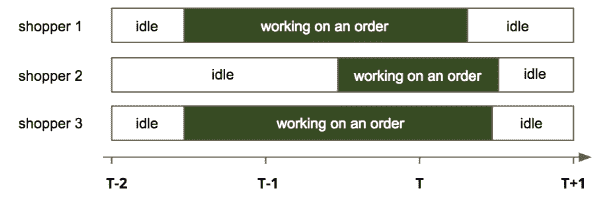
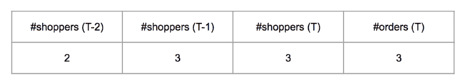
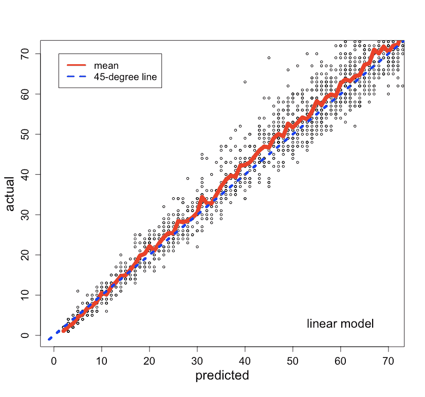
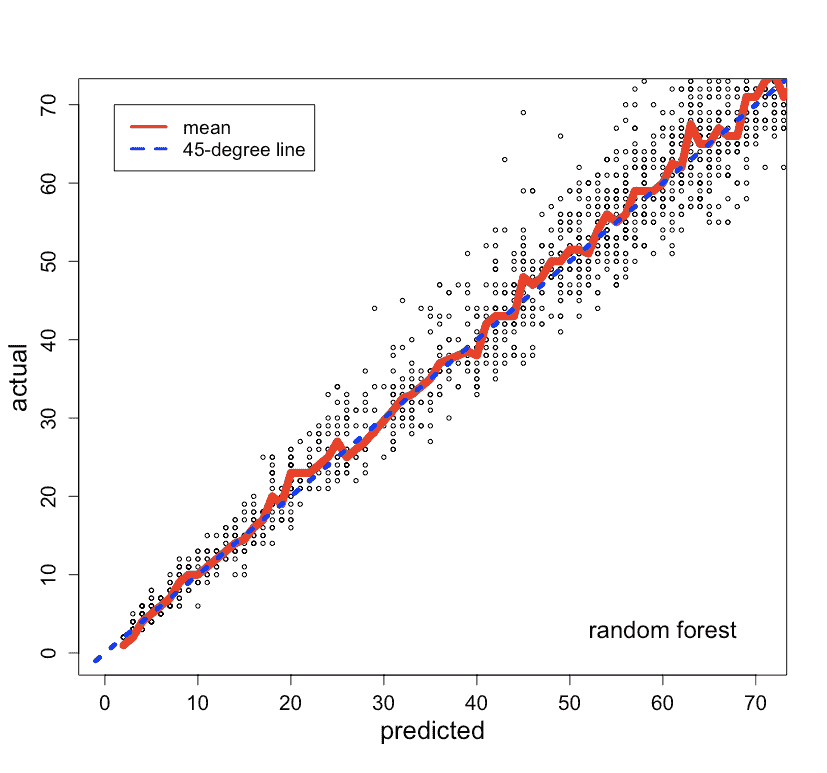
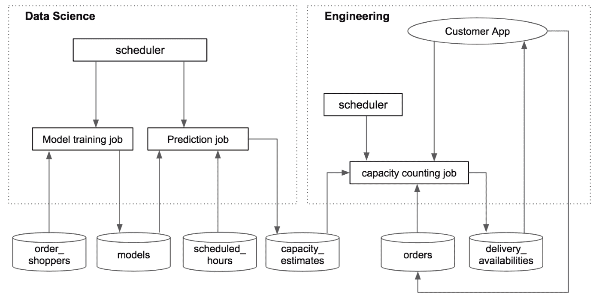
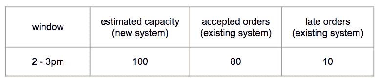
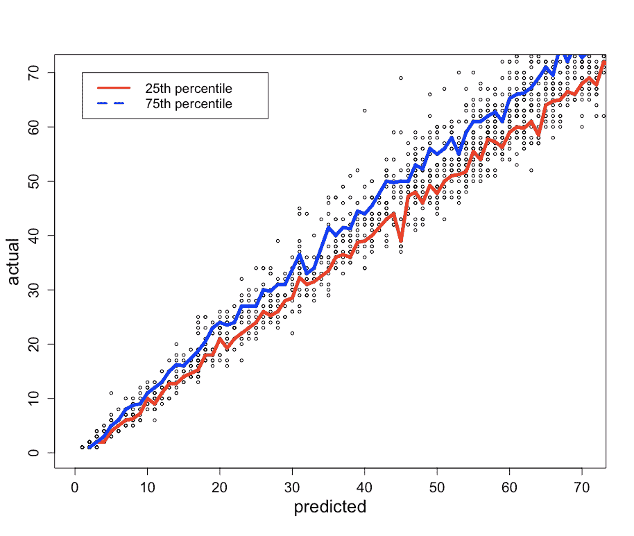
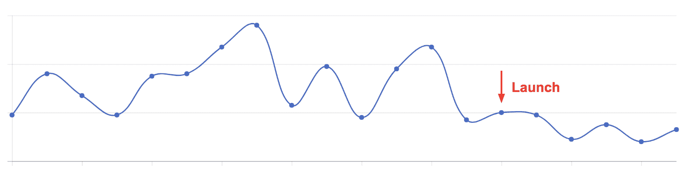

# 在 10 天内构建数据科学产品

> 原文：[`www.kdnuggets.com/2018/07/building-data-science-product-10-days.html`](https://www.kdnuggets.com/2018/07/building-data-science-product-10-days.html)

 评论

**由[邓厚涛](https://tech.instacart.com/@htaodeng)撰写，Instacart 的数据科学家**。

在初创公司，我们经常有机会从头开始创建产品。本文将分享如何快速构建有价值的数据科学产品，以我在 Instacart 的第一个项目为例。

* * *

## 我们的前三课程推荐

 1\. [谷歌网络安全证书](https://www.kdnuggets.com/google-cybersecurity) - 快速进入网络安全职业生涯。

 2\. [谷歌数据分析专业证书](https://www.kdnuggets.com/google-data-analytics) - 提升你的数据分析能力

 3\. [谷歌 IT 支持专业证书](https://www.kdnuggets.com/google-itsupport) - 支持你的组织的 IT 需求

* * *

问题是这样的。在 Instacart 上将商品添加到购物车后，客户可以在结账时选择一个交付窗口（如图 1 所示）。然后，Instacart 的购物者会尽量在窗口内将杂货送到客户手中。在高峰期，我们的系统经常接受超过购物者处理能力的订单，有些订单会延迟交付。

我们决定利用数据科学来解决延迟问题。我们的想法是使用数据科学模型来估算每个窗口的交付能力，当订单数量达到其容量时，窗口将关闭。

这是我们如何在 10 天内构建一个 v1 产品的。

图 1。客户可以选择一个可用的交付窗口，以便将食品杂货送达。

### **第 1 天。规划**

我们从规划开始，以便能够专注于正确的工作并快速开发解决方案。

+   首先，我们定义了衡量项目进展的指标。

+   其次，我们确定了一个可实现且影响较大的领域（低悬果实）。

+   第三，我们提出了一个可以快速实施的简单解决方案。

**指标**。每日报晚交付的百分比被用来衡量延迟情况。我们不希望过早关闭交付窗口，错失可以按时交付的订单。因此，每日交付数量被用作反向指标。（我们现在使用购物者利用率作为反向指标。）

**低悬果实**。数据显示，对于延迟交付较多的日子，大多数订单是在前一天下的。因此，我们决定专注于次日交付窗口（**图 1**中的“明天”窗口）。

**解决方案**。为了在时间窗口*T*（*T*和*T+1*之间）内交付订单，*顾客可能会在*T*之前开始处理订单。图 2 展示了顾客在窗口*T-2*开始处理订单，并在窗口*T*交付订单。由于大多数订单耗时不到两小时，因此交付窗口*T*的容量主要依赖于*T*、T-1*和*T-2*时间窗口的顾客数量。

图 2。顾客在订单上花费时间的示意图。假设线性关系，交付窗口*T*的容量可以表示为

*capacity(T) = a+b0*#shoppers(T)+b1*#shoppers(T-1)+b2*#shoppers(T-2)*

还有其他因素（例如天气）也可能影响容量，但我们决定从简单开始。

### 第 2–3 天。对模型的第一次迭代

我们遵循了典型的建模过程：特征工程、创建训练和测试数据，并比较不同的模型。然而，一旦我们认为模型足够准确，就没有再投入更多时间在模型上。首先，模型只是系统的一部分。其次，模型准确度的提高不一定会转化为指标的同等提升。

**特征和数据**。对于过去的每个交付窗口，我们有以下数据：在窗口内交付的订单，以及顾客在订单上花费的时间。图 3 展示了在时间窗口*T*（*T*和*T+1*之间）内交付的三笔订单，其中窗口*T-2*有 2 名顾客工作，而窗口*T-1*和*T*均有 3 名顾客工作。图 4 展示了从此示例创建的一行数据。

图 3。对于在时间窗口 T（*T*和*T+1*之间）内交付的三笔订单，窗口*T-2*有 2 名顾客工作，而窗口*T-1*和*T*均有 3 名顾客工作。

图 4。图 3 中示例创建的一行数据。

**线性模型**。以#orders(*T*)作为响应变量，其他变量作为预测因子，我们在训练数据集上建立了线性模型，并在验证数据集上进行了测试。模型的形式如下

*#orders(T) = a+b0*#shoppers(T)+b1*#shoppers(T-1)+b2*#shoppers(T-2)*

验证数据的预测值与实际值的比较见图 5（左）。每个预测值的实际值均值和 45 度线也被绘制出来。

**非线性模型**。我们建立了一个随机森林模型进行比较。预测值与实际值的比较见图 5（右）。随机森林模型的表现并没有显著优于线性模型，因此我们决定使用更容易解释和实施的线性模型。

**预测**。使用线性模型，我们可以通过以下公式估算未来交付窗口*T*的容量

*capacity(T) = a+b0*#shoppers(T)+b1*#shoppers(T-1)+b2*#shoppers(T-2)*

注意，在这个公式中，*#shoppers(t)* 表示在未来时间窗口 *t*（*t*=T，T-1 或 T-2）安排的购物者数量。

图 5。线性模型（左）和随机森林模型（右）的预测与实际图。

### 第 4-5 天。端到端集成

我们使用数据库作为数据科学与工程组件之间的接口。通过这种方式，可以减少数据科学和工程之间的依赖（与将数据科学模型嵌入工程代码中相比），并明确不同组件的所有权。图 6 展示了系统的工作原理。

**数据科学组件**。有两个数据科学任务，模型训练任务和预测任务，均由 cron（一个基于时间的调度器）在预定的频率下触发。模型训练任务每周运行一次，获取最新的 order_shoppers 数据（订单和购物者在订单上花费的时间），拟合模型并将其保存到数据库表（models）中。预测任务每晚运行一次，获取模型和 scheduled_hours（未来计划的购物者小时）数据，并估算未来交付窗口的容量。然后将这些估算保存到 capacity_estimates 表中。

**工程组件**。容量计数任务的创建是为了消耗容量估算，并提供每个窗口的交付可用性给客户应用。该任务计划每分钟运行一次，获取容量估算和现有订单，计算交付窗口是否可用，并将可用性信息保存到 delivery_availabilities 表中。此外，当客户下订单时，订单信息将保存到 orders 表中，并触发容量计数任务。

图 6。数据科学与工程组件的集成。

### 第 6-8 天。模型的第二次迭代

我们对容量估算进行了合理性检查，发现并修复了两个建模问题。

**合理性检查**。我们运行了生成未来交付窗口容量估算的预测任务。然后，在一个窗口变得过时时，我们将窗口的估算容量与现有系统实际接受的订单进行了比较。我们发现，在一些情况下，现有系统接受的订单少于估算容量，但有显著的延迟（如图 7 所示）。这表明这些情况下的容量被高估了。基于这一见解，我们发现了两个问题。

图 7。通过将容量估算与现有系统接受的订单进行比较来验证容量估算。

**问题 1：均值预测**。我们构建的模型预测的是均值。从图 5（左侧）可以看到，有些数据点低于均值线。这些数据点的均值预测会高估容量。为了解决这个问题，我们构建了预测区间，并使用了较低的百分位水平。图 8 显示了第 25 百分位和第 75 百分位水平。

**问题 2：数据不一致**。*#shoppers*用于预测的是未来时间段内计划中的顾客数量，并且顾客可以在时间段之前取消预约。然而，*#shoppers*用于模型训练的数据没有包含取消的时间。因此，预测和训练所用的数据不一致。为了解决这个问题，我们估算了取消率并将其纳入公式中。

*capacity(T) = a+b0*#shoppers(T)*****{1-cancelation_rate(T)}****+ …*

图 8。每个预测值的实际值的第 25 百分位和第 75 百分位值。

### 第 9–10 天。调整

在将新系统推出给客户之前，我们进行了内部测试（未影响客户）并做出了相应调整。

**百分位水平**。我们调整了百分位水平，以通过上一节提到的合理性检查。

**缓存**。通过缓存（在服务器上存储经常使用的数据，以避免重复调用数据库），使任务变得更快。

### 启动

图 9 显示了产品发布时段每天的晚点交货百分比。新系统实现了大幅减少晚点交货的目标（而不减少交货数量）。这是一次迅速的成功。自首次推出以来，我们继续迭代，包括估算同日交货窗口的容量。

图 9。每天的晚点交货百分比。

### 收获

作为第一次加入初创公司的数据科学家，我在快速构建有价值的数据科学产品中学到了以下经验

+   确定有影响力且可实现的工作

+   减少工程和数据科学组件之间的依赖

+   专注于提高指标，而不一定是模型准确性

+   从简单开始并快速迭代

四年后，Instacart 现在是一家更大的公司，但这些经验仍然适用于我们进行的数据科学项目，以快速交付业务价值。

注：Andrew Kane 参与了工程组件的初版，Tahir Mobashir 和 Sherin Kurian 参与了后续版本的开发。

[原文](https://medium.com/@htaodeng/building-a-data-science-product-in-10-days-d2f4688567b0)。经许可转载。

**相关：**

+   [SuperDataScience Podcast: Insights from the Founder of KDnuggets](https://www.kdnuggets.com/2018/07/superdatascience-podcast-insights-kdnuggets.html)

+   [解释正态分布的 68-95-99.7 规则](https://www.kdnuggets.com/2018/07/explaining-68-95-99-7-rule-normal-distribution.html)

+   [在增强现实中可视化高维数据](https://www.kdnuggets.com/2017/09/ibm-visualizing-high-dimensional-data-augmented-reality.html)

### 更多相关内容

+   [我在 3 天内创建了一个 AI 应用](https://www.kdnuggets.com/2023/08/created-ai-app-3-days.html)

+   [30 天内成为职场准备好的 4 个认证](https://www.kdnuggets.com/4-certifications-to-become-job-ready-in-30-days)

+   [扩展您的网络数据驱动产品时应该知道的事项](https://www.kdnuggets.com/2023/08/things-know-scaling-web-datadriven-product.html)

+   [介绍 Objectiv：开源产品分析基础设施](https://www.kdnuggets.com/2022/06/objectiv-introducing-objectiv-opensource-product-analytics-infrastructure.html)

+   [构建强大数据科学组合的 7 个免费平台](https://www.kdnuggets.com/2022/10/7-free-platforms-building-strong-data-science-portfolio.html)

+   [构建强大数据科学组合的 5 个免费平台](https://www.kdnuggets.com/5-free-platforms-for-building-a-strong-data-science-portfolio)
