# 使用 fastai 构建深度学习项目——从模型训练到部署

> 原文：[`www.kdnuggets.com/2020/11/building-deep-learning-projects-fastai-model-training-deployment.html`](https://www.kdnuggets.com/2020/11/building-deep-learning-projects-fastai-model-training-deployment.html)

评论

**由 [Harshit Tyagi](https://www.linkedin.com/in/tyagiharshit/)，顾问，网页与数据科学讲师**

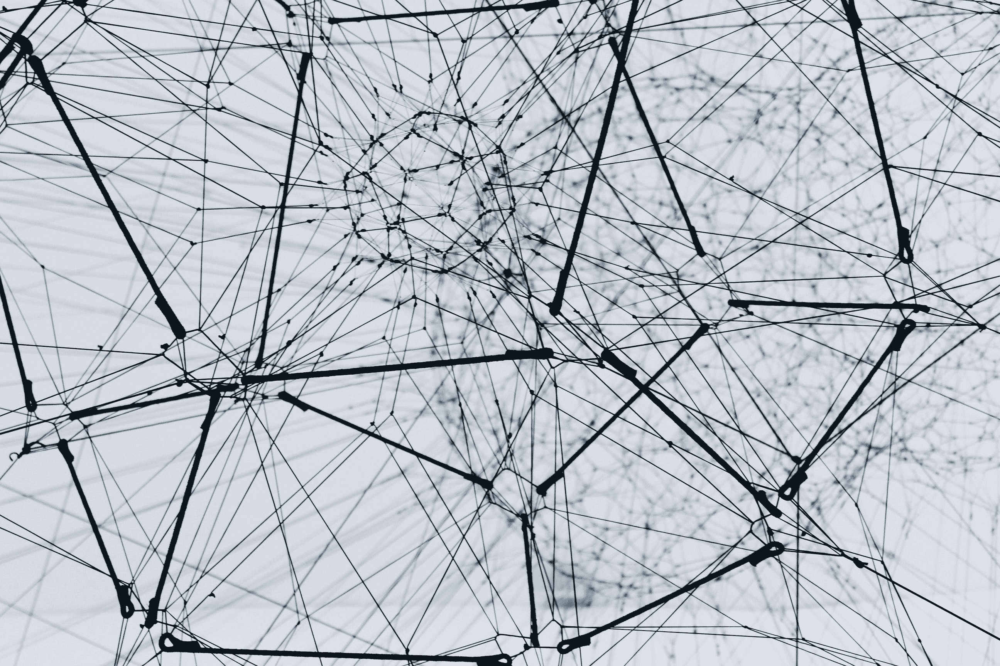

[Unsplash](https://unsplash.com/s/photos/neural-network)

* * *

## 我们的前三个课程推荐

 1\. [谷歌网络安全证书](https://www.kdnuggets.com/google-cybersecurity) - 快速进入网络安全职业。

 2\. [谷歌数据分析专业证书](https://www.kdnuggets.com/google-data-analytics) - 提升您的数据分析技能

 3\. [谷歌 IT 支持专业证书](https://www.kdnuggets.com/google-itsupport) - 支持您的组织的 IT

* * *

深度学习正在许多学科中引发革命性变化。随着 TensorFlow、PyTorch 和现在的**fastai**等库的出现，它也变得更加易于领域专家和 AI 爱好者使用。

**fastai** 的使命是民主化深度学习，这是一个致力于帮助从初学者到熟练的深度学习从业者，利用最新研究中的最先进模型和技术实现世界级成果的研究机构。

### 目标

本博客将带您了解如何使用**fastai**开发**狗分类器**的过程。目标是学习如何轻松入门深度学习模型，并能够在使用预训练模型的情况下，以有限的数据获得接近完美的结果。

### 先决条件

开始的唯一先决条件是**知道如何使用 Python 编码**，并且熟悉高中数学。

### 您将学到的内容

1.  导入库并设置笔记本

1.  使用 Microsoft Azure 收集图像数据

1.  将下载的数据转换为 DataLoader 对象

1.  数据增强

1.  使用模型训练清理数据

1.  导出训练好的模型

1.  从您的 Jupyter Notebook 中构建应用程序

### 导入库并设置笔记本

在开始构建我们的模型之前，我们需要从[这一组笔记本](https://github.com/fastai/fastbook)中导入所需的库和工具函数，这些笔记本是为了介绍使用 fastai 和 PyTorch 进行深度学习而开发的。

让我们安装 fastbook 包以设置笔记本：

```py
!pip install -Uqq fastbook
import fastbook
fastbook.setup_book()
```

然后，让我们从 fastbook 包和 fastai 视觉小部件 API 中导入所有函数和类：

```py
from fastbook import *
from fastai.vision.widgets import *
```

### 使用 Microsoft Azure 收集图像数据

对于大多数类型的项目，你可以在各种 [数据存储库和网站](https://towardsdatascience.com/data-repositories-for-almost-every-type-of-data-science-project-7aa2f98128b?source=---------6----------------------------) 上找到数据。为了开发一个狗分类器，我们需要狗的图片，互联网上有很多狗的图片可供选择。

为了下载这些图片，我们将使用由 Microsoft Azure 提供的 [Bing 图像搜索 API](https://azure.microsoft.com/en-us/services/cognitive-services/bing-image-search-api/)。因此，请在 Microsoft Azure 上注册一个免费帐户，你将获得价值 200 美元的积分。

进入你的门户，使用 [这个快速入门](https://docs.microsoft.com/en-us/azure/cognitive-services/cognitive-services-apis-create-account?tabs=multiservice%2Clinux) 创建一个新的认知服务资源。启用 Bing 图像搜索 API，然后从左侧面板中的`Keys and Endpoint`选项中复制 **密钥** 到你的资源中。

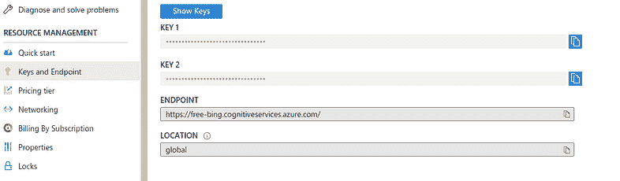

使用检索到的密钥，将这些密钥设置到环境中，如下所示：

```py
key = os.environ.get('AZURE_SEARCH_KEY', '<YOUR_KEY>')
```

现在，fastbook 提供了几个实用函数，比如`search_images_bing`，它返回与你的搜索查询对应的 URL。我们可以使用 help 函数了解这些函数：

```py
help(fastbook)
```

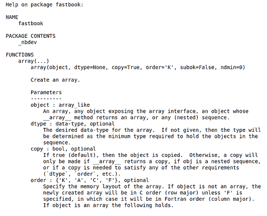

你可以在这个帮助指南中查看`search_image_bing`函数。该函数接受你上面定义的资源的密钥和搜索查询，我们可以使用`attrgot`方法访问搜索结果的 URL：

```py
results = search_images_bing(key, 'german shepherd dogs')
images = results.attrgot('content_url')
len(images)
```

我们已经获得了 150 个德国牧羊犬图片的 URL：

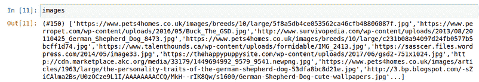

现在，我们可以使用`download_url`函数下载这些图片。但首先让我们定义我们想要的狗的类型。在本教程中，我将处理三种类型的狗，德国牧羊犬、黑狗和拉布拉多。

现在，让我们定义一个狗的类型列表：

```py
dog_types = ['german shepherd', 'black', 'labrador']
path = Path('dogs')
```

然后你需要定义你的图片将被下载到的路径以及每个狗类的文件夹的语义名称。

```py
if not path.exists():
    path.mkdir()
    for t in dog_types:
        dest = (path/t)
        print(dest)
        dest.mkdir(exist_ok=True)
        results = search_images_bing(key, '{} dog'.format(t))
        download_images(dest, urls=results.attrgot('content_url'))
```

这将创建一个“dogs”目录，其中包含每种类型狗图像的 3 个目录。

之后，我们将搜索查询（即 dog_type）和密钥传递给搜索函数，然后使用下载函数从搜索结果中下载所有 URL 到它们各自的目标（`dest`）目录中。

我们可以使用`get_image_file`函数检查下载到路径的图片：

```py
files = get_image_files(path)
files
```

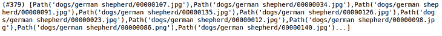

### 验证图像

你还可以检查文件中损坏文件/图像的数量：

```py
corrupt = verify_images(files)
corrupt##output: (#0) []
```

你可以通过将`unlink`方法映射到损坏文件列表来删除所有损坏的文件（如果有的话）：

```py
corrupt.map(Path.unlink);
```

就这样，我们已经准备好 379 张狗的图片来训练和验证我们的模型。

### 将下载的数据转换为 DataLoader 对象

现在，我们需要一种机制来为我们的模型提供数据，fastai 提供了 DataLoaders 的概念，它存储传递给它的多个 DataLoader 对象，并将它们作为 `training` 和 `validation` 集提供。

现在，为了将下载的数据转换为 DataLoader 对象，我们需要提供四个内容：

+   我们正在处理什么类型的数据

+   如何获取项目列表

+   如何标记这些项目

+   如何创建验证集

现在，要创建这些 DataLoaders 对象以及上述信息，fastai 提供了一个灵活的系统，称为 ***数据块 API***。我们可以使用参数和 API 提供的转换方法数组来指定 DataLoader 创建的所有细节：

```py
dogs = DataBlock(
        blocks=(ImageBlock, CategoryBlock),
        get_items=get_image_files,
        splitter=RandomSplitter(valid_pct=0.2, seed=41),
        get_y=parent_label,
        item_tfms=Resize(128)
        )
```

在这里，我们有一些需要理解的参数：

+   **blocks** — 这指定了特征变量（图像）和目标变量（每个图像的类别）

+   **get_items** — 检索底层项目，在我们的例子中是图像，我们有一个 `**get_image_files**` 函数，它返回该路径下所有图像的列表。

+   **splitter** — 根据提供的方法拆分数据；我们使用随机拆分，将 20% 的数据保留用于验证集，并指定种子以在每次运行时获得相同的拆分。

+   **get_y** — 目标变量称为 y；为了创建标签，我们使用 `**parent_label**` 函数，该函数获取文件所在文件夹的名称作为其标签。

+   **item_tfms** — 我们有不同大小的图像，这会导致问题，因为我们总是将一批文件发送到模型，而不是单个文件；因此，我们需要通过将图像调整为标准大小然后将它们组合成张量来预处理这些图像，以便通过模型。我们在这里使用 `**Resize**` 转换。

现在，我们有了 DataBlock 对象，它需要通过提供数据集的路径转换为 DataLoader：

```py
dls = dogs.dataloaders(path)
```

然后，我们可以使用 `show_batch` 方法检查 DataLoader 对象中的图像。

```py
dls.valid.show_batch()
```

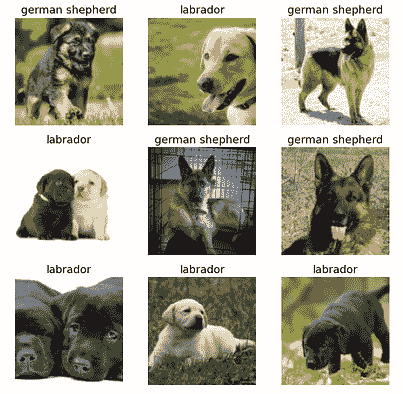

### 数据增强

我们可以对这些图像应用转换，以创建输入图像的随机变化，使其看起来不同但仍表示相同的事实。

我们可以旋转、扭曲、翻转或改变图像的亮度/对比度以创建这些变化。我们还有一个标准的增强集合，封装在 `aug_transforms` 函数中，对于大多数计算机视觉数据集效果很好。

现在，我们可以将这些转换应用于整个图像批次，因为所有图像现在都是相同的大小（224 像素，图像分类问题的标准），使用以下方法：

```py
##adding item transformationsdogs = dogs.new(
                item_tfms=RandomResizedCrop(224, min_scale=0.5), 
                batch_tfms=aug_transforms(mult=2)
               )
dls = dogs.dataloaders(path)
dls.train.show_batch(max_n=8, nrows=2, unique=True)
```

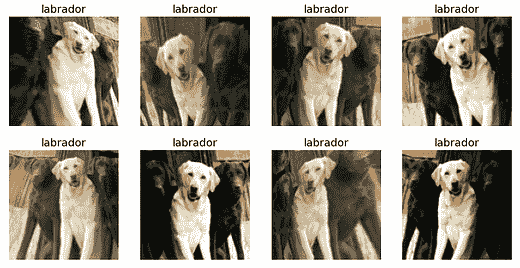

### 模型训练和数据清洗

是时候用这些有限数量的图像来训练模型了。 fastai 提供了许多架构，这使得使用迁移学习变得非常容易。我们可以使用适用于大多数应用程序/数据集的预训练模型创建卷积神经网络（CNN）模型。

我们将使用 ResNet 架构，它对许多数据集和问题都很快且准确。`**resnet18**` 中的 18 代表神经网络中的层数。我们还传递度量标准来测量模型预测的质量，使用数据加载器中的验证集。我们使用 **error_rate** 来表示模型预测错误的频率：

```py
model = cnn_learner(dls, resnet18, metrics=error_rate)
model.fine_tune(4)
```

`fine_tune` 方法类似于其他机器学习库中的 `fit()` 方法。现在，为了训练模型，我们需要指定训练模型的轮数（epochs）。

在这里，我们仅训练了 4 个周期：

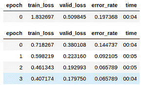

我们还可以使用混淆矩阵可视化预测结果，并将其与实际标签进行比较：

```py
interp = ClassificationInterpretation.from_learner(learn)
interp.plot_confusion_matrix()
```

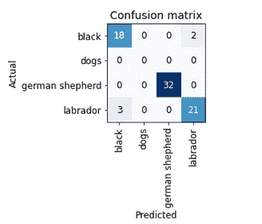

如你所见，我们只有五个错误预测。让我们查看损失最大的图像，即数据集中损失最高的图像：

```py
interp.plot_top_losses(6, nrows=3)
```

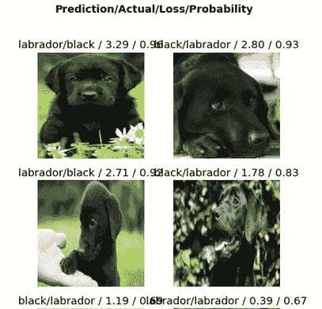

你可以看到，模型在黑色和拉布拉多之间混淆了。因此，我们可以使用 ImageClassifierCleaner 类将这些图像指定为特定类别。

将模型传递给该类，它将打开一个具有直观 GUI 的数据清理小部件。我们可以更改训练集和验证集图像的标签，并查看损失最高的图像。

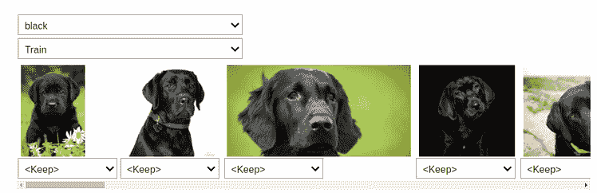

将每张图像添加到其正确的类别后，我们必须使用以下方法将它们移动到正确的目录中：

```py
for idx,cat in cleaner.change():
    shutil.move(str(cleaner.fns[idx]), str(path/cat).split('.')[0] +"_fixed.jpg")
```

### 导出训练好的模型

经过几轮超参数调整后，一旦你对模型满意，就需要保存它，以便我们可以将其部署到服务器上，用于生产环境。

在保存模型时，我们需要保存模型架构和对我们有价值的训练参数。 fastai 提供了 `export()` 方法，将模型保存为扩展名为 `.pkl` 的 pickle 文件。

```py
model.export()
path = Path()
path.ls(file_exts='.pkl')
```

然后我们可以加载模型，并通过将图像传递给加载的模型来进行推断：

```py
model_inf = load_learner(path/'export.pkl')
```

使用此加载的模型进行推断：

```py
model_inf.predict('dogs/labrador/00000000.jpg')
```

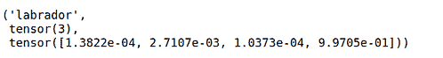

我们可以检查模型数据加载器词汇表中的标签：

```py
model_inf.dls.vocab
```

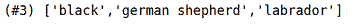

### 从 Jupyter Notebook 构建应用程序

下一步是创建一个可以与朋友、同事、招聘人员等分享的应用程序。要创建应用程序，我们需要添加互动元素，以便我们可以尝试和测试应用程序的功能，并且需要将其作为网页发布到网上，这包括通过像 Flask 这样的框架进行部署或直接使用 Voila。

你可以简单地使用 Voila 将这个 Jupyter Notebook 转换为一个独立的应用程序。我没有在这里涵盖它，但你可以查看我的博客/视频，其中详细介绍了这个过程。

[**使用 Python 和 Voila 构建 COVID-19 分析仪表板**](https://towardsdatascience.com/building-covid-19-analysis-dashboard-using-python-and-voila-ee091f65dcbb)

从你的 jupyter notebook 创建一个具有互动可视化和灵活性的仪表板。

### 部署

我在我的帖子中介绍了部署 ML 模型：

[**使用 Flask 部署训练好的 ML 模型**](https://towardsdatascience.com/deploying-a-trained-ml-model-using-flask-541520b3cbe9)

端到端 ML 项目教程系列的第二部分

但如果你想要另一种简单且免费的 Voila 应用程序部署方式，你可以使用 [Binder](https://mybinder.org/)。按照这些步骤在 Binder 上部署应用程序：

1.  将你的笔记本添加到 [GitHub 仓库](https://github.com/)。

1.  将那个仓库的 URL 插入到 Binder 的 URL 字段中。

1.  将文件下拉菜单更改为选择 URL。

1.  在 “URL to open” 字段中，输入 ` /voila/render/<*name>*.ipynb`

1.  点击右下角的剪贴板按钮以复制 URL 并将其粘贴到安全的地方。

1.  点击启动。

就这样，你的狗分类器上线了！

如果你想观看我执行所有这些步骤的视频版本，这里有博客的视频：

### [Harshit 的数据科学](https://www.youtube.com/c/DataSciencewithHarshit?sub_confirmation=1)

通过这个频道，我计划推出几个 [涵盖整个数据科学领域的系列](https://towardsdatascience.com/hitchhikers-guide-to-learning-data-science-2cc3d963b1a2?source=---------8------------------)。以下是你应该订阅 [频道](https://www.youtube.com/channel/UCH-xwLTKQaABNs2QmGxK2bQ) 的原因：

+   这些系列将涵盖每个主题和子主题所需/要求的所有高质量教程，例如 [数据科学基础的 Python](https://towardsdatascience.com/python-fundamentals-for-data-science-6c7f9901e1c8?source=---------5------------------)。

+   解释了 [为什么我们在 ML 和深度学习中做我们所做的事的数学和推导](https://towardsdatascience.com/practical-reasons-to-learn-mathematics-for-data-science-1f6caec161ea?source=---------9------------------)。

+   [与 Google、Microsoft、Amazon 等公司及大数据驱动公司的 CEO 的数据科学家和工程师的播客](https://www.youtube.com/watch?v=a2pkZCleJwM&t=2s)。

+   [项目和说明](https://towardsdatascience.com/building-covid-19-analysis-dashboard-using-python-and-voila-ee091f65dcbb?source=---------2------------------) 以实施迄今为止学习的主题。了解新的认证、训练营和资源，以通过诸如[**Google 的 TensorFlow 开发者证书考试**](https://youtu.be/yapSsspJzAw)之类的认证。

欢迎通过[Twitter](https://twitter.com/tyagi_harshit24)或[LinkedIn](https://www.linkedin.com/in/tyagiharshit/)与我联系。

**简介：[Harshit Tyagi](https://www.linkedin.com/in/tyagiharshit/)** 是一位顾问及网页与数据科学讲师。

[原文](https://towardsdatascience.com/deep-learning-projects-with-fastai-from-model-training-to-deployment-2be3135bd757)。已获授权转载。

**相关：**

+   与《深度学习编程》同行 10 天

+   在 AWS 上使用 Docker Swarm、Traefik 和 Keycloak 部署安全可扩展的 Streamlit 应用

+   扩展机器学习模型的 5 个挑战

### 更多相关主题

+   [从数据收集到模型部署：数据科学项目的 6 个阶段](https://www.kdnuggets.com/2023/01/data-collection-model-deployment-6-stages-data-science-project.html)

+   [顶级 7 种模型部署和服务工具](https://www.kdnuggets.com/top-7-model-deployment-and-serving-tools)

+   [将机器学习算法完整端到端部署到生产环境中](https://www.kdnuggets.com/2021/12/deployment-machine-learning-algorithm-live-production-environment.html)

+   [回到基础第 4 周：高级主题与部署](https://www.kdnuggets.com/back-to-basics-week-4-advanced-topics-and-deployment)

+   [2022 年通过构建 15 个神经网络项目学习深度学习](https://www.kdnuggets.com/2022/01/15-neural-network-projects-build-2022.html)

+   [使用 TensorFlow 和 Keras 构建和训练第一个神经网络](https://www.kdnuggets.com/2023/05/building-training-first-neural-network-tensorflow-keras.html)
