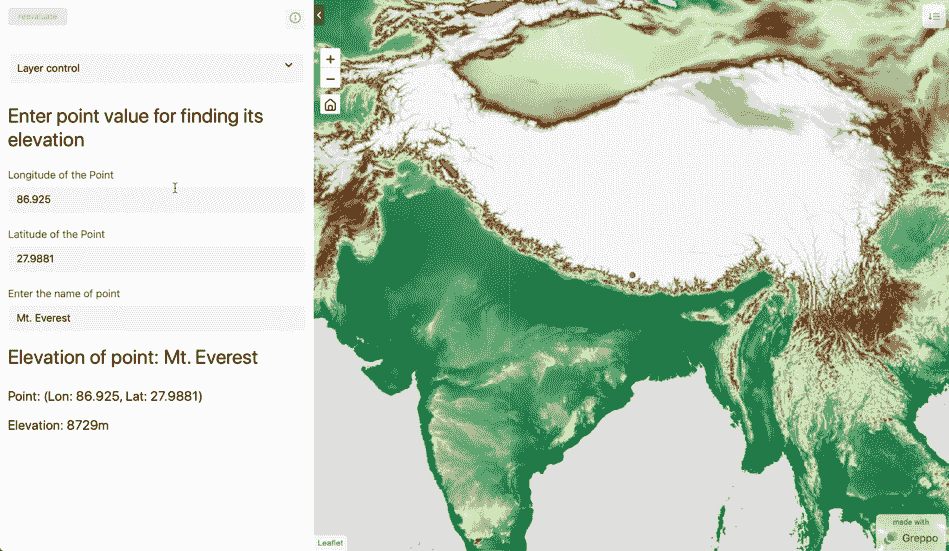
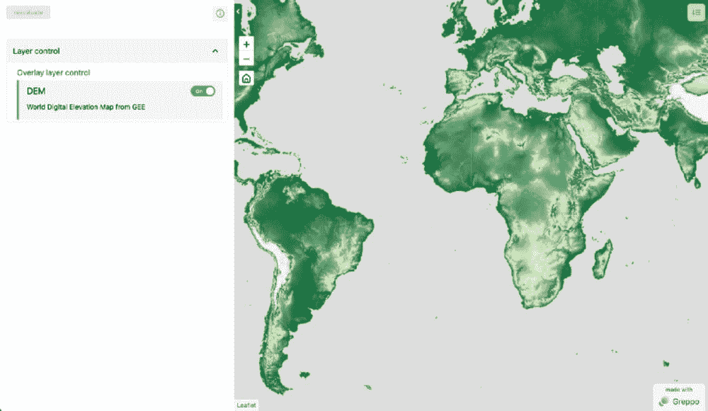
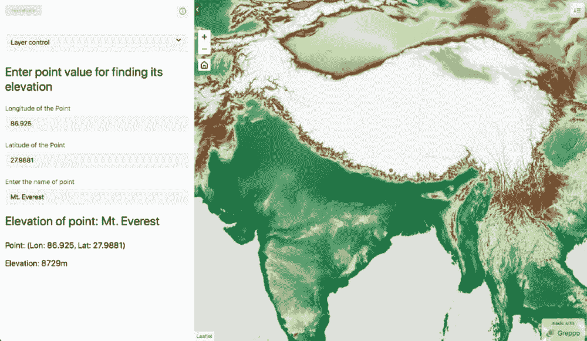

# 使用 Google Earth Engine 和 Greppo 在 Python 中构建地理空间应用

> 原文：[`www.kdnuggets.com/2022/03/building-geospatial-application-python-google-earth-engine-greppo.html`](https://www.kdnuggets.com/2022/03/building-geospatial-application-python-google-earth-engine-greppo.html)



使用 Greppo 和 GEE 的最终网络应用。图像由作者提供。

Google Earth Engine 是数据科学家工具箱中处理地理空间数据的一个了不起的工具。然而，使用 GEE 代码编辑器构建网络应用需要一个陡峭的学习曲线。基于 JavaScript 的应用创建器对仅使用 Python 的数据科学家而言需要大量时间投入。

* * *

## 我们的前三大课程推荐

 1\. [Google 网络安全证书](https://www.kdnuggets.com/google-cybersecurity) - 快速进入网络安全职业轨道。

 2\. [Google 数据分析专业证书](https://www.kdnuggets.com/google-data-analytics) - 提升你的数据分析技能

 3\. [Google IT 支持专业证书](https://www.kdnuggets.com/google-itsupport) - 支持你的组织的 IT 需求

* * *

Greppo 是弥补这一差距的完美工具。

在这篇博客文章中，我将使用 Greppo 构建一个流行的 GEE 用例（数字高程模型 DEM）的网络应用。我将带你了解 GEE 的基础知识、客户端-服务器模型、API 的工作原理以及 GEE 数据模型。了解这些背景后，文章将使用 Greppo 创建一个使用 GEE Python 接口的应用，并突出 Greppo 的思维模型和易用界面。

**注意**：这里的所有代码都是用 Python 编写的。它们从 [**文档**](https://developers.google.com/earth-engine/guides?hl=en)** 中的 GEE 示例 JavaScript 代码移植而来**。

# **入门指南**

在开始之前，你需要获取 Google Earth Engine 的访问权限。请按 [这里的说明进行注册](https://earthengine.google.com/signup/) 并获取访问权限。

这是一个关于 Greppo 的简要教程以及如何使用它：[**在 Python 中使用 Greppo 构建地理空间仪表板**](https://towardsdatascience.com/build-a-geospatial-dashboard-in-python-using-greppo-60aff44ba6c9)

接下来，让我们设置 Python 环境以安装依赖项。要了解什么是 Python 环境及如何设置它，[阅读此处](https://krishadi.com/zettelkasten/python.html)。将以下包安装到 Python 环境中。

```py
pip install earthengine-api greppo
```

网络应用的代码将放在 **app.py** 中，应用程序通过命令行使用命令 greppo serve app.py 提供和运行。

注意：要在命令行中运行`greppo`命令，你需要激活安装了 greppo 的 Python 环境。文件 app.py 可以重命名，但确保在运行命令`greppo serve app.py`时处于该文件所在的文件夹中，或者在相对文件夹结构`greppo serve /demo/folder/app.py`中。

Greppo 的 GitHub 仓库：[`github.com/greppo-io/greppo`](https://github.com/greppo-io/greppo)

如有任何问题，请通过[GitHub](https://github.com/greppo-io/greppo)上的“issues”或在[Discord 频道](https://discord.gg/RNJBjgh8gz)联系我们。

## ****GEE 认证与初始化****

要使用 Google Earth Engine，你需要创建一个服务帐户并获取与该帐户关联的访问密钥文件。这只需几分钟，但确保按照说明正确操作。请按照[这里](https://developers.google.com/earth-engine/guides/service_account?hl=en)的说明进行操作。要使用服务帐户和密钥文件，请使用以下代码进行初始化。

注意：确保将 key-file.json 保存在其他位置，最好安全地保存在计算机的根文件夹中，并且不要提交到公共仓库中。

# **理解 GEE 的客户端-服务器模型**

正如 GEE 的开发文档所说，Earth Engine 不像你之前用过的任何 GIS 或地理空间工具。GEE 主要是一个云平台，所有处理都在云端完成，而不是在你的机器上。你与 GEE 的互动仅仅是将指令翻译并发送到 GEE 的云平台。为了更好地理解这一点，我们需要深入了解 GEE 的客户端与服务器以及其惰性计算模型。

## **[**客户端与服务器**](https://developers.google.com/earth-engine/guides/client_server)**

从我之前提到的开始，**GEE 主要是一个云平台**。它让你在云端进行所有处理。那么，你如何访问这些处理功能呢？

这里就是`earthengine-api`库发挥作用的地方。Python 包`earthengine-api`为客户端（也就是你）提供了作为服务器对象代理的对象，这些对象在云端传递和处理。

为了更好地理解客户端-服务器模型，我们以客户端中的字符串变量和服务器中的字符串变量为例。在客户端创建字符串并打印其类型时，我们得到的是 Python 的`class str`对象来表示字符串。如果我们想将字符串发送到服务器进行使用或操作，我们会使用`ee.String`将数据包装在一个代理容器中，这样服务器就可以读取。更具体地说，`ee.objects`是`ee.computedObject`，它是代理对象的父类。

```py

```

>> # 客户端字符串

>> client_string = 'I am a Python String object'

>> print(type(client_string))

>> # 服务器端字符串

>> server_string = ee.String('I am proxy ee String object!');

>> print(type(server_string))

<class></class>

```py

```

代理对象不包含任何实际的数据或处理函数/算法。它们只是服务器（云平台）上对象的句柄，仅仅传达要在服务器上执行的指令。可以把它看作是使用代码与服务器沟通的一种方式，为此你需要将数据和指令包装在 `ee.computedObject` 特定类型的容器中。

当对数据进行循环或使用条件语句时，这种理解变得更加重要。要执行这些操作，需要将指令发送到服务器以执行。要了解这些是如何实现的，[查看此页面](https://developers.google.com/earth-engine/guides/client_server) 获取更多详细信息。

## **[**惰性计算模型（延迟执行）**](https://developers.google.com/earth-engine/guides/deferred_execution)**

从上面的内容我们知道，earthengine-api 包仅用于向服务器发送指令。那么，执行是如何以及何时发生的呢？

客户端库 earthengine-api 将所有指令编译成 JSON 对象并发送到服务器。然而，这并不会立即执行。执行会被推迟，直到有请求结果。结果请求可以是 `print` 语句，或者是要显示的 `image` 对象。

这种按需计算会影响返回给客户端（即用户）的内容。earthengine-api 的结果是一个指向 GEE 瓦片服务器的 URL，其中包含需要提取的数据。因此，在提到的兴趣区域内的图像会被选择性地处理。兴趣区域由客户端显示中的地图的缩放级别和中心位置确定。当你移动和缩放时，图像会被处理并发送给客户端以供查看。因此，这些图像是惰性计算的。

# **使用 Greppo 结合 GEE**

使用 Greppo 显示和可视化 Earth Engine 图像对象是相当简单的，你只需要使用：`app.ee_layer()`。GEE 中存储地理空间数据的基本数据类型是，

+   `Image`：Earth Engine 中的基本栅格数据类型。

+   `ImageCollection`：图像的堆叠或时间序列。

+   `Geometry`：Earth Engine 中的基本矢量数据类型。

+   `Feature`：带有属性的 Geometry。

+   `FeatureCollection`：一组特征。

了解 GEE 的客户端-服务器和惰性计算模型后，我们可以推测这些数据类型是按需处理的，在请求其可视化时。

## ****那么，如何将 Greppo 与 GEE 结合使用？****

通过一个例子来解释是最好的。首先，我们从 `app` 的搭建开始。你需要从 `greppo` 中导入 app 对象，因为它将是你与前端沟通的入口点。接下来，你需要 `import ee`，验证你的 Earth Engine 身份，并使用上述服务账户的凭据初始化你的会话。

接下来，让我们从目录中选择数据集。在这里，我们使用 **USGS/SRTMGL1_003** 获取数字高程图。我们首先需要为 DEM 图像数据中所有大于 0 的值获取一个地面掩码，为此我们使用 `dem.get(0)`。接下来，我们需要在 DEM 上应用掩码，只可视化土地区域，为此我们使用 `dem.updateMask(dem.gt(0))`，并将结果指定为我们要可视化的 `ee_dem`。由于所有数据存储为 int16（值在 32767 和 -32768 之间的矩阵），我们需要使用调色板来可视化矩阵。

要添加调色板，我们创建一个可视化参数对象，其中包含生成 RGM 或灰度图像的指令。在这里，我们使用包含以下 Hex 值的调色板：`[‘006633’, ‘E5FFCC’, ‘662A00’, ‘D8D8D8’, ‘F5F5F5’]`，并将其线性映射到指定的 `min -> #006633 和 max -> #F5F5F5` 对应的值。

注意：DEM 中存储的数据是栅格，表示为矩阵，每个单元格包含表示该单元格的点的海拔高度（单位：米）。

要在使用 Greppo 的 Web 应用程序中可视化此地图，你只需使用 `app.ee_layer()`。`ee_object` 是地球引擎图像对象，`vis_param` 是可视化参数字典，name 对应于在 Web 应用前端使用的唯一标识符，而 `description` 是可选的，用于向应用用户提供额外的说明。有关更多信息，请参见文档 [**此处**](https://docs.greppo.io/map-components/ee-layer.html)。



上一步骤的 Web 应用视图。图片由作者提供。

# **端到端通信：完整 Web 应用**

到目前为止，我们只看到了如何在 Greppo 中可视化地球引擎对象。然而，Greppo 能够实现前端和后端之间的复杂交互。我们来举一个找到用户指定点的海拔高度的例子。我们将使用 Greppo 的三个 API 特性。

+   `app.display()`：在前端显示文本或 Markdown。

+   `app.number()`：前端中的数字输入功能，供用户输入一个值。与之绑定的后端变量将更新为用户指定的值。

+   `app.text()`：前端中的文本输入功能，供用户输入一个值。与之绑定的后端变量将更新为用户指定的值。

有关更多详细信息，请参见 [**文档此处**](https://docs.greppo.io/index.html)。

让我们开始使用 `app.display`（`name` 是唯一标识符，值是显示的文本，可以是多行字符串）来为 Web 应用用户显示一些文本。之后，让我们创建两个数字输入框，每个用于输入点的经度和纬度，使用 `app.number()`。

`app.number()` 接受名称（前端显示的标识符）和值（此元素的默认值）。接下来，我们还将创建一个文本输入框，用于获取点的名称，使用`app.text()`，并将`name`和`value`作为`app.number()`中提到的参数。

使用该点的纬度和经度，我们现在可以创建一个带有可视化参数`color: ‘red’`的地球引擎 Geometry 对象。我们可以使用上述提到的`app.ee_layer()`来显示这个对象。

要查找该点的高程，我们使用`sample`方法在 DEM 对象上进行地球引擎操作。我们在 DEM 中对该点进行采样以获取 DEM 的属性。我们从输出中获取第一个点，并使用`.get`方法查找与高程属性相关的值。最后，我们组合一个多行字符串来显示输出。

注：要在初始加载时将地图居中于某个点并设置缩放级别，请使用`app.map(center=[lat, lon], zoom=level)`。



带有交互功能的 Web 应用视图。图像由作者提供。

# **结论**

我们的目标是使用 Python 完全创建一个 Web 应用，利用 Google Earth Engine 的数据和计算功能以及 Greppo 的 Web 应用开发库。我们了解了 GEE 的工作原理，了解了如何将 Greppo 与 GEE 集成。学会使用`app.ee_layer(), app.display(), app.number() 和 app.text()`来创建一个完整的 Web 应用，实现前端和后端的全程通信。

演示的所有文件可以在这里找到： [`github.com/greppo-io/greppo-demo/tree/main/ee-demo`](https://github.com/greppo-io/greppo-demo/tree/main/ee-demo)

查看[**GitHub 库：这里**](https://github.com/greppo-io/greppo)，了解 Greppo 的最新动态。如果发现错误、问题或需要功能请求，请通过[Discord 频道](https://discord.gg/RNJBjgh8gz)联系，或在 GitHub 上提出问题。用 Greppo 构建了什么？在 GitHub 上发布它。

+   GitHub 库： [`github.com/greppo-io/greppo`](https://github.com/greppo-io/greppo)

+   文档： [`docs.greppo.io/`](https://docs.greppo.io/)

+   网站： [`greppo.io/`](https://greppo.io/)

**[Adithya Krishnan](https://www.linkedin.com/in/adithyakrishnan/)** ([@krish_adi_](https://twitter.com/krish_adi_)) 是一名科学家、开发者、创始人和攀登者。他对构建 Web 应用、云服务、数据科学以及 AI/ML 项目感兴趣。 [了解更多](https://krishadi.com/)。

### 更多相关内容

+   [构建视觉搜索引擎 - 第二部分：搜索引擎](https://www.kdnuggets.com/2022/02/building-visual-search-engine-part-2.html)

+   [构建视觉搜索引擎 - 第一部分：数据探索](https://www.kdnuggets.com/2022/02/building-visual-search-engine-part-1.html)

+   [5 个用于地理空间数据分析的 Python 包](https://www.kdnuggets.com/2023/08/5-python-packages-geospatial-data-analysis.html)

+   [在 Python 中利用 GeoPandas 处理地理空间数据](https://www.kdnuggets.com/leveraging-geospatial-data-in-python-with-geopandas)

+   [使用 Geemap 进行地理空间数据分析](https://www.kdnuggets.com/geospatial-data-analysis-with-geemap)

+   [创建一个使用 Python 从音频中提取主题的 Web 应用程序](https://www.kdnuggets.com/2023/01/creating-web-application-extract-topics-audio-python.html)
