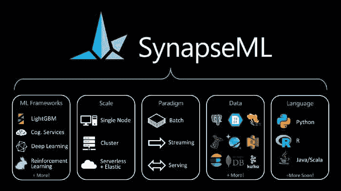
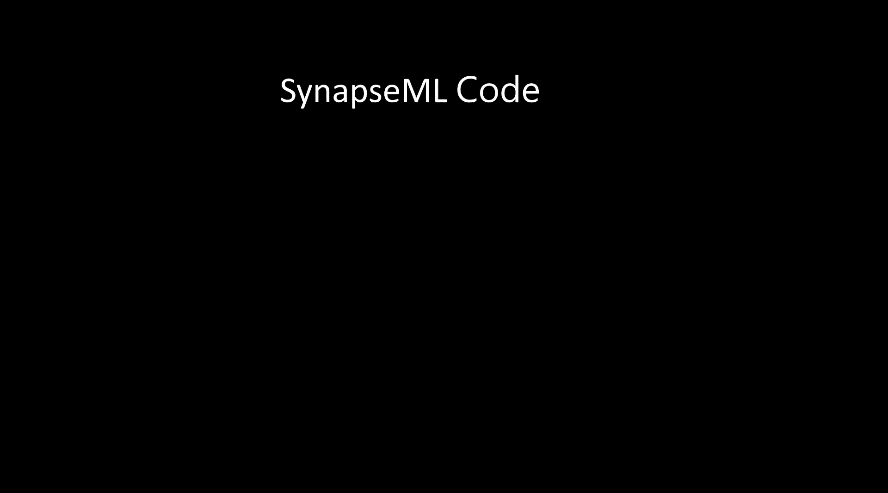

# 使用 Microsoft Synapse ML 构建大规模机器学习管道

> 原文：[`www.kdnuggets.com/2021/11/building-massively-scalable-machine-learning-pipelines-microsoft-synapse-ml.html`](https://www.kdnuggets.com/2021/11/building-massively-scalable-machine-learning-pipelines-microsoft-synapse-ml.html)

评论

图片来源：微软研究院

> 我最近启动了一个新的新闻通讯，专注于人工智能教育，**已经拥有超过 50,000 名订阅者**。TheSequence 是一个不搞虚的（即不炒作、不新闻等）AI 专注的新闻通讯，阅读时间为 5 分钟。其目标是让你了解最新的机器学习项目、研究论文和概念。请通过以下订阅试试：

构建大规模机器学习解决方案简直是一场噩梦。即使你拥有完美的架构，高度可扩展的机器学习管道通常需要结合许多基础设施平台和框架，这些平台和框架并非完全为无缝集成而设计。协调不同的机器学习工具的过程对即便是最有经验的机器学习开发人员来说也具有挑战性。微软研究院刚刚开源了一个旨在解决这一挑战的新框架。

SynapseML 是 MMLSpark 的新版本，一个从头开始设计的开源库，旨在实现大规模可扩展的机器学习管道。在功能上，SynapseML 扩展了 Apache Spark 的能力，以更好地支持大规模机器学习解决方案的需求。该平台使用分布式编程模型将给定的机器学习工作负载分布到数千台机器上，同时确保 GPU 和 CPU 的充分利用。更重要的是，SynapseML 通过一个单一的 API 实现了这一点，该 API 可以依赖像 LightGBM 或 XGBoost 这样的框架。

图片来源：微软研究院

SynapseML API 提供了一个数据、平台和语言无关的模型来与机器学习框架进行交互。这使得机器学习工程师能够快速协调不同的机器学习工具和框架，而不会牺牲开发者体验。API 的另一个重要方面是，它抽象了底层文件和数据库的交互。

为了给 SynapseML 的发布增添一些分发的亮点，微软将该框架添加到了 Azure Synapse Analytics 平台中。这确保了该平台作为原生 Azure 服务提供，并具有相应的企业支持。SynapseML 是防止机器学习工具和框架市场日益分裂的最有趣的努力之一。跟踪该平台如何被机器学习社区接受和采用将会很有趣。

**个人简介：[Jesus Rodriguez](https://www.linkedin.com/in/jesusmrv/)** 目前是 Intotheblock 的首席技术官。他是一位技术专家、执行投资者和创业顾问。Jesus 创办了 Tellago，这是一家屡获殊荣的软件开发公司，专注于通过利用新的企业软件趋势帮助公司成为优秀的软件组织。

[原文](https://jrodthoughts.medium.com/microsoft-synapse-ml-provides-a-single-interface-for-building-massively-scalable-machine-learning-fa73a47f5fcd)。经授权转载。

**相关：**

+   关于 Wu Dao 2.0 的五个关键事实：迄今为止构建的最大变换器模型

+   OpenAI 解决数学文字问题的方法

+   DeepMind 实时天气预报模型背后的架构

* * *

## 我们的三大课程推荐

 1\. [Google 网络安全证书](https://www.kdnuggets.com/google-cybersecurity) - 快速进入网络安全职业生涯。

 2\. [Google 数据分析专业证书](https://www.kdnuggets.com/google-data-analytics) - 提升你的数据分析技能

 3\. [Google IT 支持专业证书](https://www.kdnuggets.com/google-itsupport) - 支持你的组织在 IT 方面

* * *

### 更多相关话题

+   [使用 SQL + Python 构建可扩展的 ETL](https://www.kdnuggets.com/2022/04/building-scalable-etl-sql-python.html)

+   [机器学习并不像你的大脑 第六部分：精确突触权重的重要性](https://www.kdnuggets.com/2022/08/machine-learning-like-brain-part-6-importance-precise-synapse-weights-ability-set-quickly.html)

+   [Synapse CoR：带有革命性变化的 ChatGPT](https://www.kdnuggets.com/synapse-cor-chatgpt-with-a-revolutionary-twist)

+   [如何使用 Apache Kafka 构建可扩展的数据架构](https://www.kdnuggets.com/2023/04/build-scalable-data-architecture-apache-kafka.html)

+   [广义和可扩展的最优稀疏决策树（GOSDT）](https://www.kdnuggets.com/2023/02/generalized-scalable-optimal-sparse-decision-treesgosdt.html)

+   [使用 Pandas 构建数据科学管道](https://www.kdnuggets.com/building-data-science-pipelines-using-pandas)
