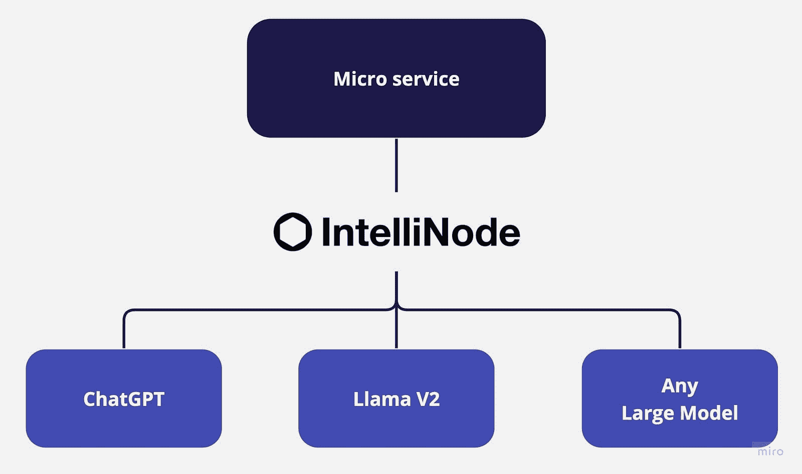
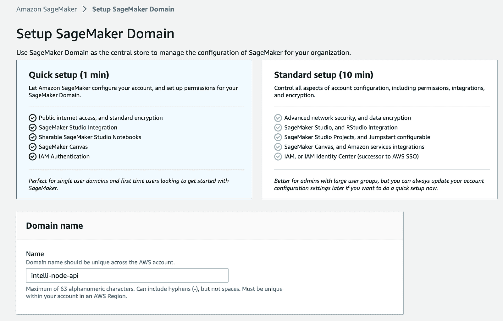
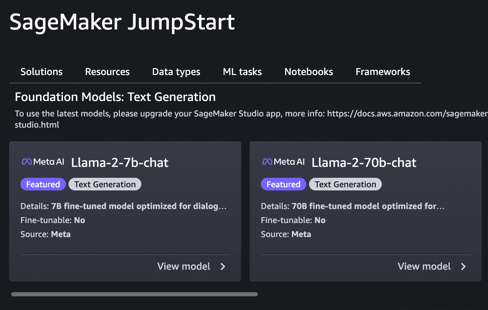
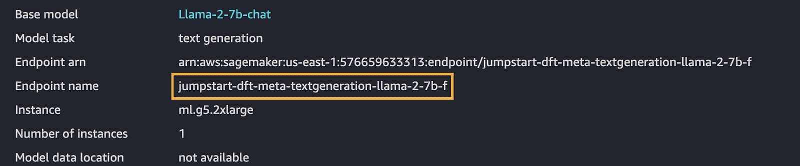
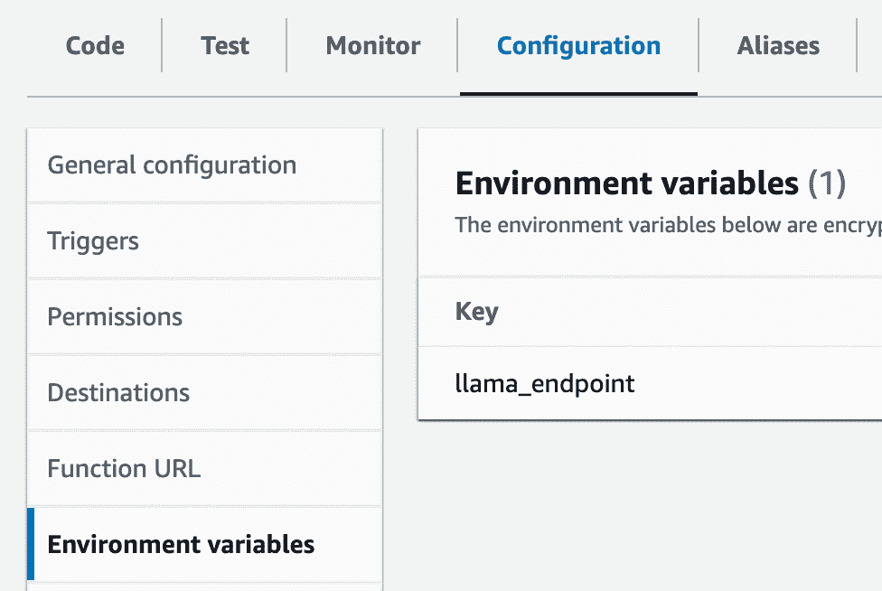
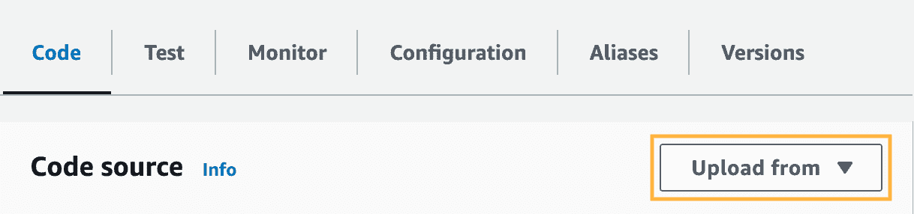
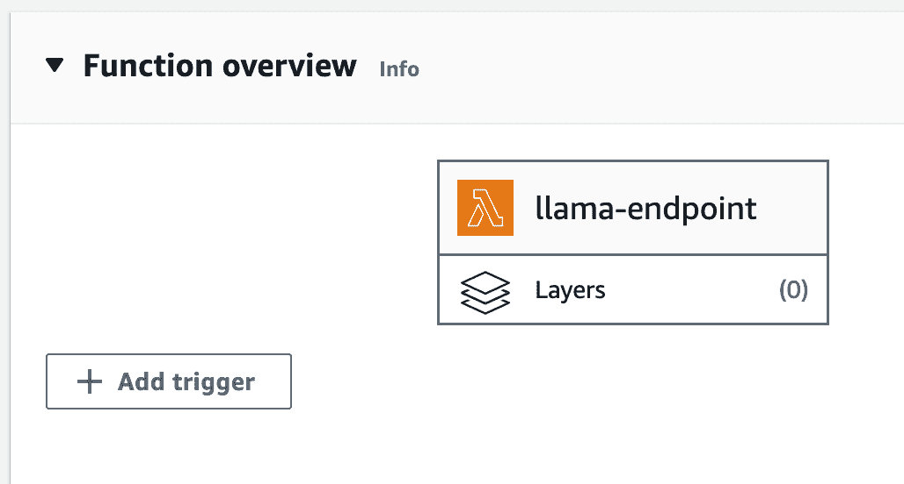
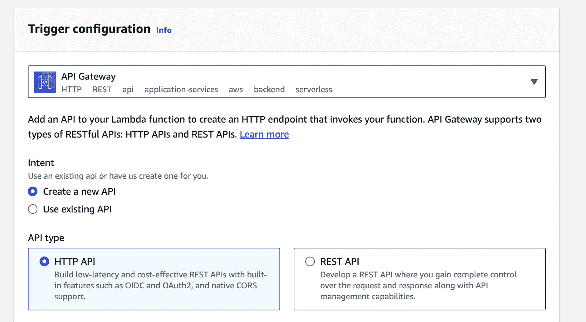
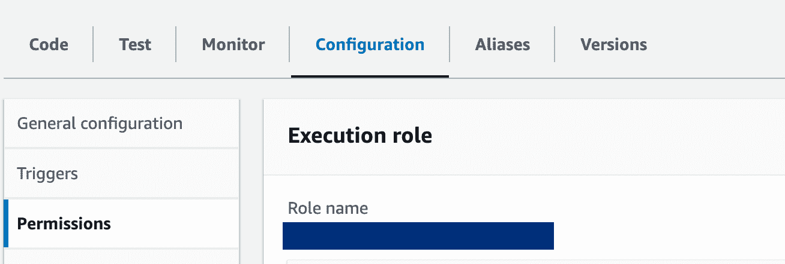

# 使用 Llama 和 ChatGPT 构建多聊天后端的微服务

> 原文：[`www.kdnuggets.com/building-microservice-for-multichat-backends-using-llama-and-chatgpt`](https://www.kdnuggets.com/building-microservice-for-multichat-backends-using-llama-and-chatgpt)



微服务架构促进了灵活、独立服务的创建，并定义了明确的边界。这种可扩展的方法使开发人员能够单独维护和演化服务，而不会影响整个应用程序。然而，要实现微服务架构的全部潜力，尤其是在 AI 驱动的聊天应用中，需要与最新的大型语言模型（LLMs）如 Meta Llama V2 和 OpenAI 的 ChatGPT 以及基于每个应用场景发布的其他微调模型进行稳健的集成，以提供多模型方法以实现多样化解决方案。

* * *

## 我们的 top 3 课程推荐

 1\. [谷歌网络安全证书](https://www.kdnuggets.com/google-cybersecurity) - 快速进入网络安全职业生涯。

 2\. [谷歌数据分析专业证书](https://www.kdnuggets.com/google-data-analytics) - 提升你的数据分析技能

 3\. [谷歌 IT 支持专业证书](https://www.kdnuggets.com/google-itsupport) - 支持你的组织的 IT

* * *

LLMs 是大规模模型，根据对多样数据的训练生成类似人类的文本。通过学习互联网上数十亿个单词，LLMs 理解上下文并生成各个领域的调整内容。然而，将各种 LLM 集成到单个应用程序中通常会面临挑战，因为每个模型都需要独特的接口、访问端点和特定的有效负载。因此，拥有一个能够处理多种模型的单一集成服务可以改善架构设计，并增强独立服务的规模。

本教程将向你介绍如何在微服务架构中使用 Node.js 和 Express 集成 ChatGPT 和 LLaMA V2 的 IntelliNode。

# 聊天机器人集成选项

这里有一些由 IntelliNode 提供的聊天集成选项：

1.  **LLaMA V2**: 你可以通过 Replicate 的 API 进行简单的集成，也可以通过你的 AWS SageMaker 主机来获得额外的控制。

LLaMA V2 是一个强大的开源大型语言模型（LLM），经过了高达 70B 参数的预训练和微调。它在各种领域的复杂推理任务中表现出色，包括编程和创意写作等专业领域。其训练方法包括自监督数据和通过强化学习与人类反馈（RLHF）对齐。LLaMA V2 超越了现有的开源模型，并且在可用性和安全性方面与 ChatGPT 和 BARD 等闭源模型可媲美。

1.  **ChatGPT**：只需提供您的 OpenAI API 密钥，IntelliNode 模块即可在简单的聊天界面中实现与该模型的集成。您可以通过 GPT 3.5 或 GPT 4 模型访问 ChatGPT。这些模型经过大量数据的训练和微调，以提供高度上下文相关和准确的响应。

# 逐步集成

首先，初始化一个新的 Node.js 项目。打开终端，导航到项目目录，然后运行以下命令：

```py
npm init -y
```

该命令将为您的应用程序创建一个新的 `package.json` 文件。

接下来，安装 Express.js，它将用于处理 HTTP 请求和响应，以及用于 LLM 模型连接的 IntelliNode：

```py
npm install express

npm install intellinode
```

安装完成后，在项目根目录中创建一个名为 `*app.js*` 的新文件，然后在 `app.js` 中添加 express 初始化代码。

作者代码

# 使用 Replicate 的 API 进行 Llama V2 集成

Replicate 提供了通过 API 密钥与 Llama V2 快速集成的路径，而 IntelliNode 提供了聊天机器人接口，将您的业务逻辑与 Replicate 后端解耦，允许您在不同聊天模型之间切换。

我们首先从集成 Replica 后端托管的 Llama 开始：

作者代码

从 [replicate.com](https://replicate.com/) 获取您的试用密钥以激活集成。

# 使用 AWS SageMaker 进行 Llama V2 集成

现在，让我们介绍通过 AWS SageMaker 进行 Llama V2 集成，提供隐私和额外的控制层。

该集成需要从您的 AWS 账户生成一个 API 端点，首先我们将在微服务应用程序中设置集成代码：

作者代码

以下步骤是创建您账户中的 Llama 端点，一旦设置了 API 网关，复制 URL 用于运行 '*/llama/aws*' 服务。

**要在您的 AWS 账户中设置 Llama V2 端点：**

1- **SageMaker 服务：** 从您的 AWS 账户中选择 SageMaker 服务并点击域。


aws 账户-选择 sagemaker

**2- 创建 SageMaker 域**：首先在您的 AWS SageMaker 上创建一个新域。这一步骤为您的 SageMaker 操作建立一个受控空间。



aws 账户-sagemaker 域

**3- 部署 Llama 模型**：利用 SageMaker JumpStart 部署你计划集成的 Llama 模型。建议从 2B 模型开始，因为 70B 模型的运行费用较高。



aws 账户-sagemaker 快速启动

**4- 复制端点名称**：一旦你部署了模型，确保记下端点名称，这对后续步骤至关重要。



aws 账户-sagemaker 端点

**5- 创建 Lambda 函数**：AWS Lambda 允许在不管理服务器的情况下运行后端代码。创建一个 Node.js Lambda 函数以用于集成部署的模型。

**6- 设置环境变量**：在你的 Lambda 中创建一个名为 llama_endpoint 的环境变量，值为 SageMaker 端点。



aws 账户-lambda 设置

**7- Intellinode Lambda 导入**：你需要导入准备好的 Lambda zip 文件，该文件建立了与 SageMaker Llama 部署的连接。该导出是一个 zip 文件，可以在 [lambda_llama_sagemaker](https://github.com/Barqawiz/IntelliNode/tree/main/samples/lambda_llama_sagemaker) 目录中找到。



aws 账户-lambda 从 zip 文件上传

**8- API 网关配置**：点击 Lambda 函数页面上的“添加触发器”选项，从可用触发器列表中选择“API 网关”。



aws 账户-lambda 触发器 

aws 账户-api 网关触发器

**9- Lambda 函数设置**：更新 Lambda 角色以授予访问 SageMaker 端点的必要权限。此外，函数的超时设置应延长，以适应处理时间。在 Lambda 函数的“配置”选项卡中进行这些调整。

点击角色名称以更新权限，并提供访问 SageMaker 的权限：



aws 账户-lambda 角色

# ChatGPT 集成

最后，我们将说明将 Openai ChatGPT 作为微服务架构中的另一种选项的步骤：

作者编写的代码

从 [platform.openai.com](https://platform.openai.com/) 获取你的试用密钥。

# 执行实验

首先在终端中导出 API 密钥，如下所示：

作者编写的代码

然后运行节点应用程序：

```py
node app.js
```

在浏览器中输入以下网址以测试 chatGPT 服务:

```py
http://localhost:3000/chatgpt?message=hello
```

我们构建了一个利用 Llama V2 和 OpenAI 的 ChatGPT 等大型语言模型功能的微服务。这种集成为利用先进 AI 驱动的无限商业场景打开了大门。

通过将机器学习需求转化为解耦的微服务，您的应用可以获得灵活性和可扩展性的好处。语言模型的功能现在可以单独管理和开发，这承诺提供更高的效率以及更易于故障排除和升级管理。

## 参考资料

+   ChatGPT API: [链接](https://platform.openai.com/)。

+   Replica API: [链接](https://docs.replicastudios.com/#replica-api)。

+   SageMaker Llama Jump Start: [链接](https://aws.amazon.com/blogs/machine-learning/llama-2-foundation-models-from-meta-are-now-available-in-amazon-sagemaker-jumpstart/)

+   IntelliNode 入门: [链接](https://www.intellinode.ai/getting-started)

+   完整代码 GitHub 仓库: [链接](https://github.com/intelligentnode/IntelliServer)

**[Ahmad Albarqawi](https://www.linkedin.com/in/barqawi/)** 是伊利诺伊大学香槟分校的工程师和数据科学硕士。

### 更多相关话题

+   [Llama, Llama, Llama: 使用您的内容进行本地 RAG 的 3 个简单步骤](https://www.kdnuggets.com/3-simple-steps-to-local-rag-with-your-content)

+   [在本地使用 Groq Llama 3 70B: 分步指南](https://www.kdnuggets.com/using-groq-llama-3-70b-locally-step-by-step-guide)

+   [在 ChatGPT 时代建立深科技创业公司面临的 10 个障碍](https://www.kdnuggets.com/2023/04/10-hurdles-building-deep-tech-startup-age-chatgpt.html)

+   [Visual ChatGPT: 微软结合 ChatGPT 和 VFM](https://www.kdnuggets.com/2023/03/visual-chatgpt-microsoft-combine-chatgpt-vfms.html)

+   [生成性 AI 游乐场: Camel-5b 和 Open LLaMA 3B 的 LLM](https://www.kdnuggets.com/2024/02/intel-generative-ai-playground-llms-with-camel-5b-and-open-llama-3b)

+   [ChatGPT CLI: 将您的命令行界面转换为 ChatGPT](https://www.kdnuggets.com/2023/07/chatgpt-cli-transform-commandline-interface-chatgpt.html)
