# 构建预测模型：Python 中的逻辑回归

> 原文：[`www.kdnuggets.com/building-predictive-models-logistic-regression-in-python`](https://www.kdnuggets.com/building-predictive-models-logistic-regression-in-python)

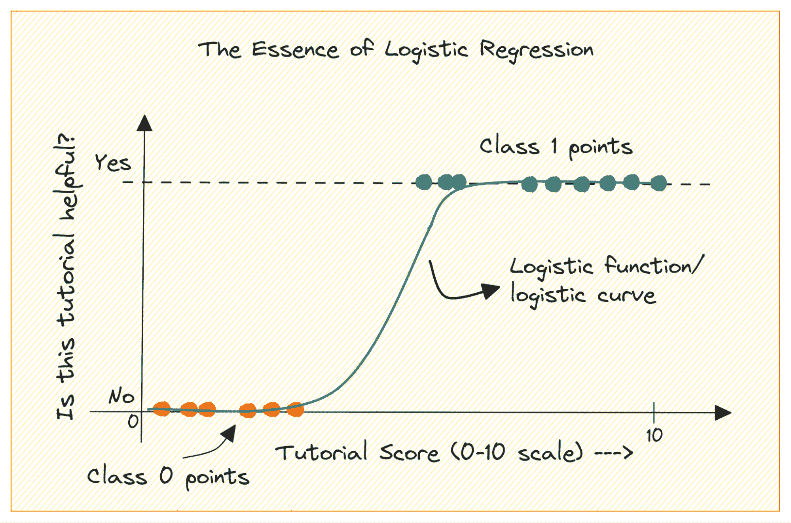

作者提供的图片

当你刚开始学习机器学习时，逻辑回归是你会添加到工具箱中的第一个算法之一。它是一个简单而稳健的算法，通常用于二分类任务。

* * *

## 我们的前三大课程推荐

 1\. [Google 网络安全证书](https://www.kdnuggets.com/google-cybersecurity) - 快速进入网络安全职业生涯。

 2\. [Google 数据分析专业证书](https://www.kdnuggets.com/google-data-analytics) - 提升你的数据分析技能

 3\. [Google IT 支持专业证书](https://www.kdnuggets.com/google-itsupport) - 支持你的组织的 IT。

* * *

考虑一个类别为 0 和 1 的二分类问题。逻辑回归将一个逻辑或 sigmoid 函数拟合到输入数据上，并预测查询数据点属于类别 1 的概率。很有趣，对吧？

在本教程中，我们将从基础开始学习逻辑回归，内容包括：

+   逻辑（或 sigmoid）函数

+   我们如何从线性回归过渡到逻辑回归

+   逻辑回归的工作原理

最后，我们将构建一个简单的逻辑回归模型来[classify RADAR returns from the ionosphere](https://www.google.com/url?q=https://archive.ics.uci.edu/dataset/52/ionosphere&sa=D&source=editors&ust=1700937825039807&usg=AOvVaw3pi2xfFVRgGw7d3kaG9jKd)。

# 逻辑函数

在我们深入了解逻辑回归之前，让我们回顾一下逻辑函数的工作原理。逻辑函数（或称为 sigmoid 函数）由以下公式给出：

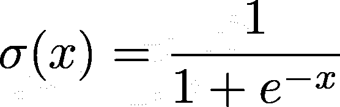

当你绘制 sigmoid 函数时，它看起来是这样的：

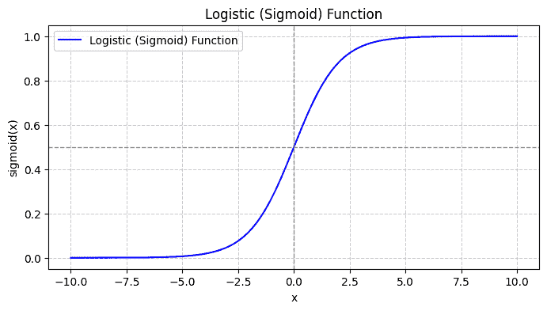

从图中我们可以看出：

+   当 x = 0 时，σ(x) 的值为 0.5。

+   当 x 接近 +∞ 时，σ(x) 接近 1。

+   当 x 接近 -∞ 时，σ(x) 接近 0。

因此，对于所有实际输入，sigmoid 函数将它们压缩到 [0, 1] 的范围内。

# 从线性回归到逻辑回归

首先，让我们讨论一下为什么我们不能使用线性回归来解决二分类问题。

在二分类问题中，输出是分类标签（0 或 1）。由于线性回归预测的是连续值的输出，可能小于 0 或大于 1，因此不适用于当前问题。

此外，当输出标签属于两类中的一种时，直线可能不是最佳拟合。


作者提供的图片

那么我们如何从线性回归转向逻辑回归呢？在线性回归中，预测的输出由以下给出：

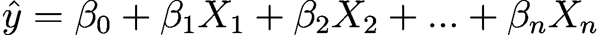

其中βs 是系数，X_is 是预测变量（或特征）。

为了不失一般性，假设 X_0 = 1：

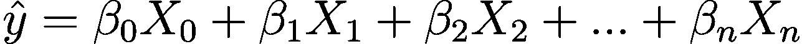

所以我们可以得到一个更简洁的表达式：

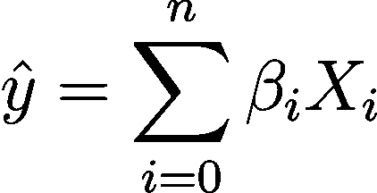

在逻辑回归中，我们需要预测概率 p_i 在[0,1]区间内。我们知道逻辑函数将输入值压缩到[0,1]区间内。

所以将这个表达式代入逻辑函数中，我们得到预测概率为：

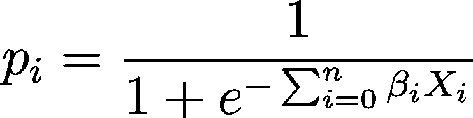

# 逻辑回归的内部机制

那么我们如何为给定的数据集找到最佳的逻辑回归曲线呢？为了解答这个问题，我们需要理解最大似然估计。

[最大似然估计 (MLE)](https://www.google.com/url?q=https://en.wikipedia.org/wiki/Maximum_likelihood_estimation&sa=D&source=editors&ust=1700937825042844&usg=AOvVaw21aHhVf72aBaA4ufZShBzV) 用于通过最大化似然函数来估计逻辑回归模型的参数。让我们深入了解逻辑回归中的 MLE 过程以及如何使用梯度下降法公式化成本函数进行优化。

## 解析最大似然估计

如前所述，我们将二分类结果发生的概率建模为一个或多个预测变量（或特征）的函数：

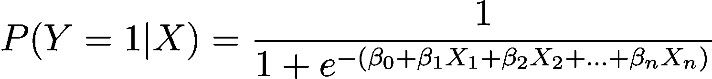

在这里，βs 是模型参数或系数。X_1, X_2,..., X_n 是预测变量。

MLE 旨在找到使观察到的数据的似然最大化的β值。似然函数，记作 L(β)，表示在逻辑回归模型下，给定预测值的情况下观察到给定结果的概率。

## 公式化对数似然函数

为了简化优化过程，通常使用对数似然函数。因为它将概率的乘积转换为对数概率的和。

逻辑回归的对数似然函数为：

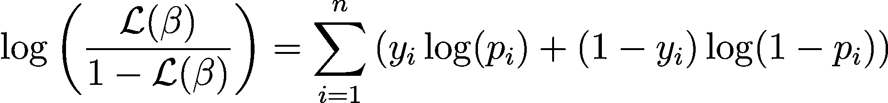

# 成本函数与梯度下降

现在我们知道了对数似然的本质，让我们继续制定逻辑回归的成本函数，并随后进行梯度下降，以寻找最佳模型参数

## 逻辑回归的成本函数

为了优化逻辑回归模型，我们需要 最大化 对数似然。因此，我们可以使用 负对数似然 作为训练过程中需要 最小化 的成本函数。负对数似然，通常称为逻辑损失，定义为：

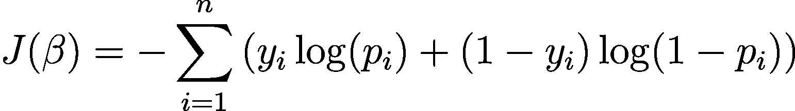

因此，学习算法的目标是找到使这个成本函数最小化的？值。梯度下降是一种常用的优化算法，用于找到这个成本函数的最小值。

## 逻辑回归中的梯度下降

[梯度下降](https://www.google.com/url?q=https://en.wikipedia.org/wiki/Gradient_descent&sa=D&source=editors&ust=1700937825044751&usg=AOvVaw1huVLDtM5ldfX2Ae4YfvwJ) 是一种迭代优化算法，通过与成本函数对β的梯度方向相反的方向更新模型参数β。使用梯度下降进行逻辑回归时，步骤 t+1 的更新规则如下：

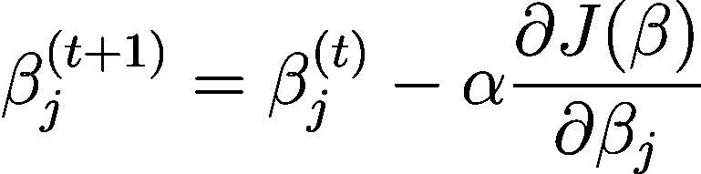

其中α是学习率。

可以使用链式法则计算偏导数。梯度下降迭代更新参数——直到收敛——旨在最小化逻辑损失。随着收敛，它找到最大化观察数据似然的β的最佳值。

# Python 中的逻辑回归与 Scikit-Learn

现在你已经了解了逻辑回归的工作原理，让我们使用 scikit-learn 库构建一个预测模型。

我们将使用 [UCI 机器学习库中的电离层数据集](https://www.google.com/url?q=https://archive.ics.uci.edu/dataset/52/ionosphere&sa=D&source=editors&ust=1700937825045668&usg=AOvVaw2GHhc6h9v8DkLk9xMlILvJ) 进行本教程。数据集包含 34 个数值特征。输出是二元的，‘good’或‘bad’（用‘g’或‘b’表示）。输出标签‘good’指的是雷达返回信号中检测到的电离层结构。

## 步骤 1 – 加载数据集

首先，下载数据集并读取到 pandas 数据框中：

```py
import pandas as pd
import urllib

url = "https://archive.ics.uci.edu/ml/machine-learning-databases/ionosphere/iphere.data"
data = urllib.request.urlopen(url)
df = pd.read_csv(data, header=None)
```

## 步骤 2 – 探索数据集

让我们查看数据框的前几行：

```py
# Display the first few rows of the DataFrame
df.head()
```

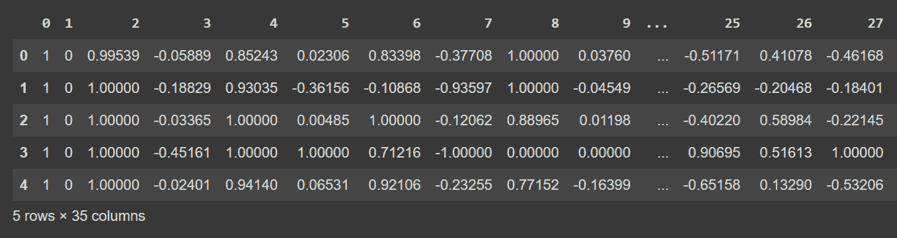

df.head()的截断输出

获取有关数据集的一些信息：每列的非空值数量和数据类型：

```py
# Get information about the dataset
print(df.info())
```

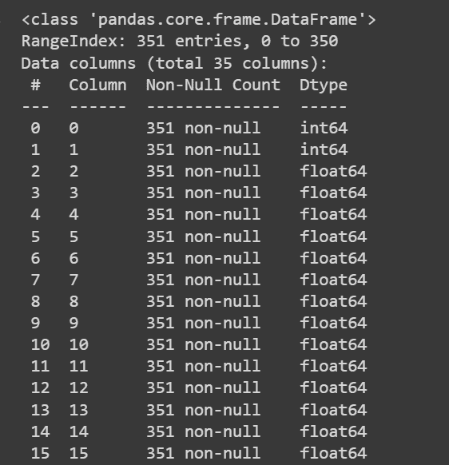 df.info()的截断输出

由于我们有所有数值特征，我们还可以使用`describe()`方法在数据框上获取一些描述性统计信息：

```py
# Get descriptive statistics of the dataset
print(df.describe())
```

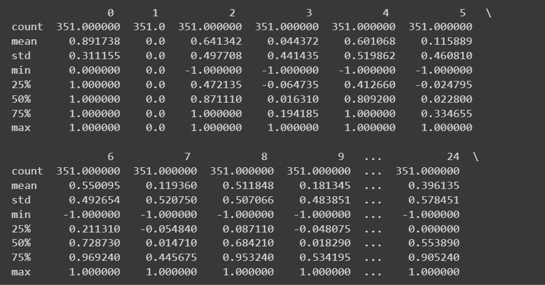

截断输出的 df.describe()

当前列名为 0 到 34，包括标签。由于数据集没有提供列的描述性名称，它只将其称为 attribute_1 到 attribute_34。如果你愿意，可以如所示重命名数据框的列：

```py
column_names = [
"attribute_1", "attribute_2", "attribute_3", "attribute_4", "attribute_5",
"attribute_6", "attribute_7", "attribute_8", "attribute_9", "attribute_10",
"attribute_11", "attribute_12", "attribute_13", "attribute_14", "attribute_15",
"attribute_16", "attribute_17", "attribute_18", "attribute_19", "attribute_20",
"attribute_21", "attribute_22", "attribute_23", "attribute_24", "attribute_25",
"attribute_26", "attribute_27", "attribute_28", "attribute_29", "attribute_30",
"attribute_31", "attribute_32", "attribute_33", "attribute_34", "class_label"
]
df.columns = column_names
```

> 注意：这一步是完全可选的。如果你愿意，可以继续使用默认的列名。

```py
# Display the first few rows of the DataFrame
df.head()
```

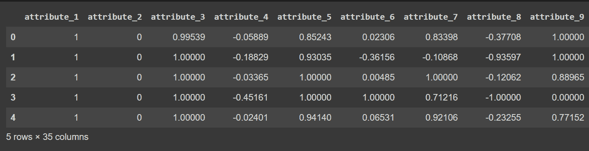

截断输出的 df.head() [在重命名列后]

## 第 3 步 – 重命名类别标签并可视化类别分布

由于输出类标签是‘g’和‘b’，我们需要将它们分别映射到 1 和 0。你可以使用`map()`或`replace()`来实现：

```py
# Convert the class labels from 'g' and 'b' to 1 and 0, respectively
df["class_label"] = df["class_label"].replace({'g': 1, 'b': 0})
```

我们还可以可视化类别标签的分布：

```py
import matplotlib.pyplot as plt

# Count the number of data points in each class
class_counts = df['class_label'].value_counts()

# Create a bar plot to visualize the class distribution
plt.bar(class_counts.index, class_counts.values)
plt.xlabel('Class Label')
plt.ylabel('Count')
plt.xticks(class_counts.index)
plt.title('Class Distribution')
plt.show()
```

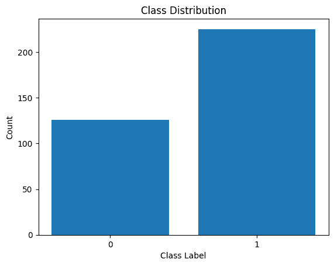

类别标签分布

我们看到分布中存在不平衡。属于类别 1 的记录比属于类别 0 的记录多。在构建逻辑回归模型时，我们将处理这种类别不平衡。

## 第 5 步 – 数据集预处理

我们将像这样收集特征和输出标签：

```py
X = df.drop('class_label', axis=1)  # Input features
y = df['class_label']               # Target variable
```

在将数据集拆分为训练集和测试集之后，我们需要对数据集进行预处理。

当有许多数值特征——每个特征可能有不同的尺度——我们需要对这些数值特征进行预处理。一种常见的方法是将它们转换为均值为零且方差为一的分布。

scikit-learn 的`StandardScaler`帮助我们实现这一点。

```py
from sklearn.preprocessing import StandardScaler
from sklearn.model_selection import train_test_split

# Split the dataset into training and testing sets
X_train, X_test, y_train, y_test = train_test_split(X, y, test_size=0.2, random_state=42)

# Get the indices of the numerical features
numerical_feature_indices = list(range(34))  # Assuming the numerical features are in columns 0 to 33

# Initialize the StandardScaler
scaler = StandardScaler()

# Normalize the numerical features in the training set
X_train.iloc[:, numerical_feature_indices] = scaler.fit_transform(X_train.iloc[:, numerical_feature_indices])

# Normalize the numerical features in the test set using the trained scaler from the training set
X_test.iloc[:, numerical_feature_indices] = scaler.transform(X_test.iloc[:, numerical_feature_indices])
```

## 第 6 步 – 构建逻辑回归模型

现在我们可以实例化一个逻辑回归分类器。`LogisticRegression`类是 scikit-learn 的 linear_model 模块的一部分。

请注意，我们将`class_weight`参数设置为‘balanced’。这将帮助我们处理类别不平衡的问题。通过为每个类别分配权重——权重与类别中的记录数量成反比。

实例化类之后，我们可以将模型拟合到训练数据集上：

```py
from sklearn.linear_model import LogisticRegression

model = LogisticRegression(class_weight='balanced')
model.fit(X_train, y_train)
```

## 第 7 步 – 评估逻辑回归模型

你可以调用`predict()`方法来获取模型的预测结果。

除了准确率，我们还可以获得包含精确度、召回率和 F1 分数等指标的分类报告。

```py
from sklearn.metrics import accuracy_score, classification_report

y_pred = model.predict(X_test)
accuracy = accuracy_score(y_test, y_pred)
print(f"Accuracy: {accuracy:.2f}")

classification_rep = classification_report(y_test, y_pred)
print("Classification Report:\n", classification_rep)
```

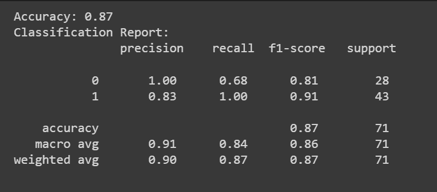

恭喜你，你已经编写了你的第一个逻辑回归模型！

# 结论

在本教程中，我们详细了解了逻辑回归：从理论和数学到编码逻辑回归分类器。

作为下一步，尝试为您选择的适当数据集构建一个逻辑回归模型。

# 数据集来源

电离层数据集在[创意共享署名 4.0 国际](https://www.google.com/url?q=https://creativecommons.org/licenses/by/4.0/legalcode&sa=D&source=editors&ust=1700937825057781&usg=AOvVaw2hz8NeH5w9ltvexC6Yg-wA)（CC BY 4.0）许可证下授权使用。

Sigillito, V., Wing, S., Hutton, L., 和 Baker, K. (1989). 电离层。UCI 机器学习库。 https://doi.org/10.24432/C5W01B.

**[](https://twitter.com/balawc27)**[Bala Priya C](https://www.kdnuggets.com/wp-content/uploads/bala-priya-author-image-update-230821.jpg)** 是一位来自印度的开发者和技术作家。她喜欢在数学、编程、数据科学和内容创作的交汇点上工作。她的兴趣和专长领域包括 DevOps、数据科学和自然语言处理。她喜欢阅读、写作、编码和喝咖啡！目前，她正在通过编写教程、操作指南、观点文章等方式学习并与开发者社区分享她的知识。Bala 还创建了引人入胜的资源概述和编码教程。**

### 更多相关内容

+   [比较线性回归与逻辑回归](https://www.kdnuggets.com/2022/11/comparing-linear-logistic-regression.html)

+   [逻辑回归概述](https://www.kdnuggets.com/2022/02/overview-logistic-regression.html)

+   [线性回归与逻辑回归：简明解释](https://www.kdnuggets.com/2022/03/linear-logistic-regression-succinct-explanation.html)

+   [KDnuggets 新闻 22:n12，3 月 23 日：最佳数据科学书籍…](https://www.kdnuggets.com/2022/n12.html)

+   [用于分类的逻辑回归](https://www.kdnuggets.com/2022/04/logistic-regression-classification.html)

+   [逻辑回归是如何工作的？](https://www.kdnuggets.com/2022/07/logistic-regression-work.html)
