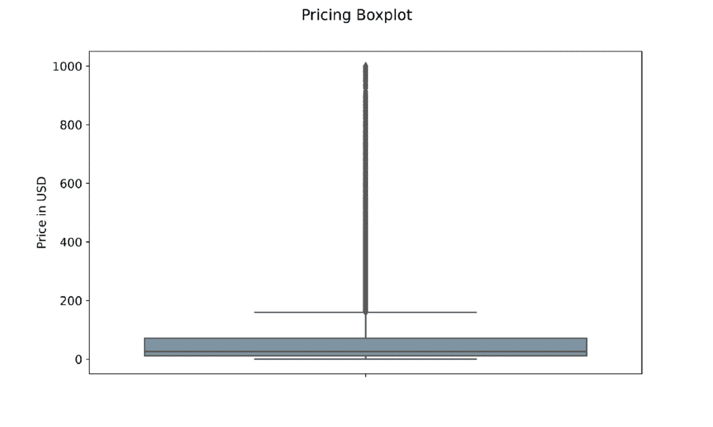
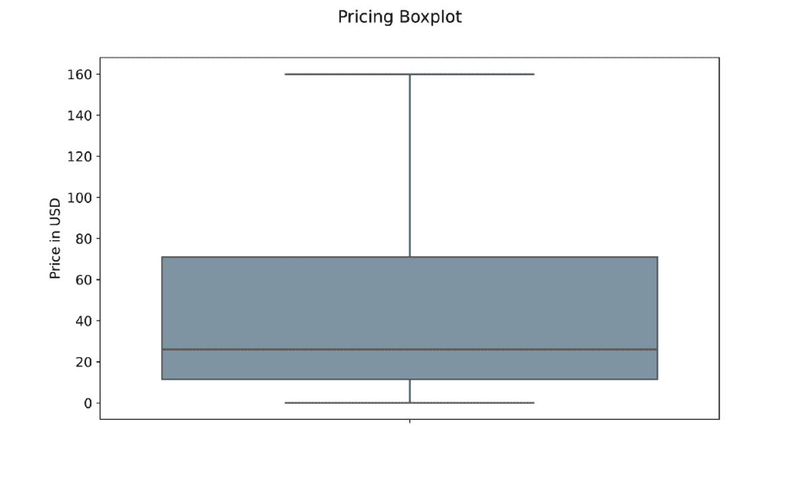
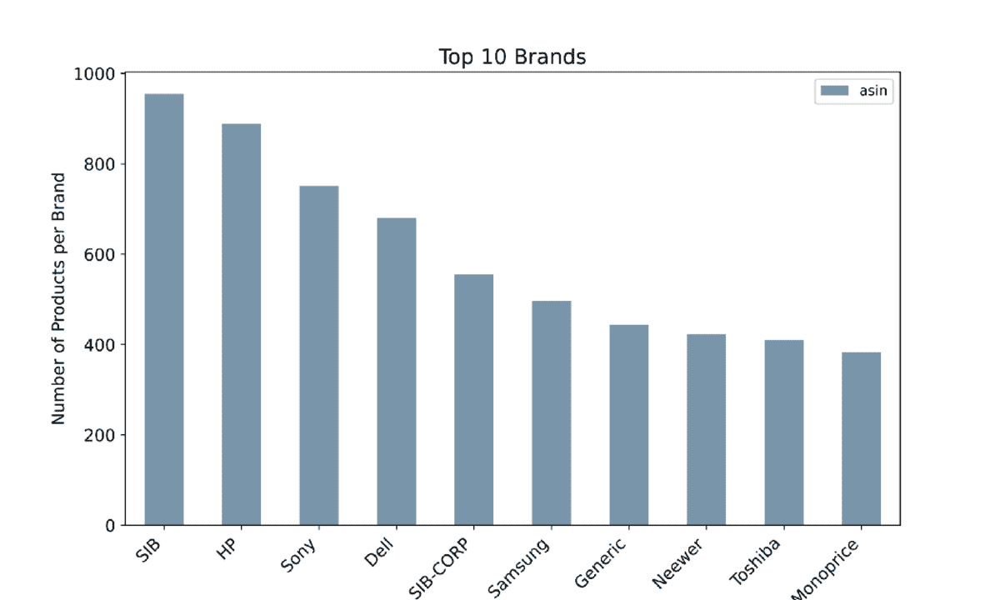
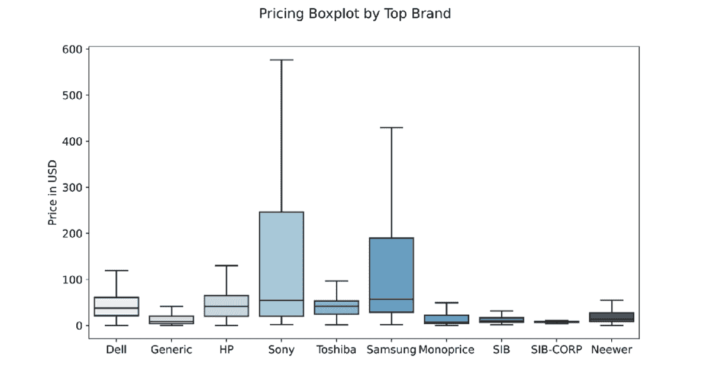

# 使用 Python 为 Amazon 产品构建推荐系统

> 原文：[`www.kdnuggets.com/2023/02/building-recommender-system-amazon-products-python.html`](https://www.kdnuggets.com/2023/02/building-recommender-system-amazon-products-python.html)


照片由 [Marques Thomas](https://unsplash.com/@querysprout?utm_source=medium&utm_medium=referral) 提供，来自 [Unsplash](https://unsplash.com/?utm_source=medium&utm_medium=referral)

# 介绍

* * *

## 我们的前三个课程推荐

 1\. [Google 网络安全证书](https://www.kdnuggets.com/google-cybersecurity) - 快速进入网络安全职业。

 2\. [Google 数据分析专业证书](https://www.kdnuggets.com/google-data-analytics) - 提升你的数据分析技能

 3\. [Google IT 支持专业证书](https://www.kdnuggets.com/google-itsupport) - 支持你在 IT 领域的组织

* * *

该项目的目标是**部分重建****Amazon 产品推荐系统**，针对**电子产品**类别。

现在是十一月，**黑色星期五**来了！你是什么类型的购物者？你会把所有想买的产品都保存到那一天，还是更愿意打开网站查看**实时优惠**及其巨大折扣？

尽管在线商店在过去十年中取得了巨大的成功，显示出巨大的潜力和增长，但实体店和在线商店之间的一个根本区别是消费者的**冲动购买**。

如果客户面临一个**产品组合**，他们更有可能购买原本没有计划购买的商品。**冲动购买**的**现象**在**在线**商店的配置下受到极大的**限制**。而**实体**店则不会发生这种情况。最大的实体零售连锁店会让顾客经过一个**精确的路径**，以确保他们在离开商店之前访问每个货架。

像 Amazon 这样的在线商店认为，**重新创建**冲动购买现象的一种方法是通过**推荐系统**。推荐系统识别出**最相似**或**互补**的产品，客户刚刚购买或浏览的产品。其目的是最大化在线商店通常缺乏的**随机购买**现象。

**在 Amazon 上购物**让我对推荐系统的机制产生了浓厚的兴趣，我希望**重新创建**（即使只是部分地）它们推荐系统的结果。

根据博客“Recostream”，亚马逊的产品推荐系统有**三种依赖关系**，其中之一是**产品对产品推荐**。当用户几乎没有搜索历史时，算法会将产品进行聚类，并根据商品的元数据向同一用户推荐这些产品。

## 数据

项目的第一步是收集**数据**。幸运的是，加州大学圣地亚哥分校的研究人员有一个仓库，让学生和组织外的个人使用这些数据进行研究和项目。数据可以通过以下[链接](http://jmcauley.ucsd.edu/data/amazon/links.html)访问，并且有**许多其他有趣的数据集**与推荐系统相关[2][3]。产品元数据**最后更新于 2014 年**；许多产品可能现在已经不再可用。

电子产品类别的元数据包含**498,196 条记录**，总共有**8 列**。

+   `asin` — 每个产品的唯一 ID

+   `imUrl` — 每个产品关联的图片 URL 链接

+   `description` — 产品的描述

+   `categories` — 所有产品所属类别的 Python 列表

+   `title` — 产品的标题

+   `price` — 产品的价格

+   `salesRank` — 每个产品在特定类别中的排名

+   `related` — 与每个产品相关的客户浏览和购买的产品

+   `brand` — 产品的品牌

你会注意到文件采用了“松散”的`JSON`格式，每一行是一个`JSON`，包含之前提到的所有列作为字段。我们将在代码部署部分看到如何处理这个问题。

## 探索性数据分析

让我们从快速的探索性数据分析开始。经过**清理所有包含至少一个`NaN`值的记录**后，我创建了电子产品类别的可视化图。



带有异常值的价格箱线图 — 作者图片

第一个图表是**箱线图**，显示了每个产品的最大值、最小值、25 百分位数、75 百分位数和平均价格。例如，我们知道一个产品的**最大**价值是 1000 美元，而**最小**价值约为 1 美元。160 美元标记以上的线由**点**构成，每个点代表一个**异常值**。异常值表示数据集中仅出现一次的记录。因此，我们知道只有一个产品的价格接近 1000 美元。

**平均**价格似乎在 25 美元左右。重要的是要注意，库`matplotlib`自动排除异常值，选项为`showfliers=False`。为了让我们的箱线图看起来更干净，我们可以将参数设置为 false。



价格箱线图 — 作者图片

结果是一个更干净的箱线图，没有离群值。图表还建议，绝大多数电子产品的价格在 1 到 160 美元之间。



按上市产品数量排序的前 10 个品牌 — 作者提供的图像

图表显示了在电子产品类别中，**前 10 个品牌**按**上市产品数量**排序。其中包括 HP、Sony、Dell 和 Samsung。



前 10 大零售商定价箱线图 — 作者提供的图像

最后，我们可以看到**前 10 大卖家的价格分布**。Sony 和 Samsung 确实提供了**种类繁多的产品**，从几美元到 500 和 600 美元不等，因此它们的平均价格高于大多数顶级竞争对手。有趣的是，**SIB 和 SIB-CORP** 提供了更多的产品，但平均价格要便宜得多。

图表还告诉我们，Sony 提供的产品价格大约是数据集中最高价产品的 60%。

## 余弦相似度

将产品按其特征进行聚类的一个可能解决方案是**余弦相似度**。我们需要彻底理解这个概念，然后构建我们的推荐系统。

**余弦相似度**衡量两个数字序列的“接近”程度。这在我们的案例中如何应用呢？令人惊讶的是，句子可以被转换成数字，或者更好地，转换成向量。

余弦相似度的值可以在**-1 和 1 之间**，其中**1**表示两个向量**完全相同**，而**-1**表示它们**完全不同**。

从数学上讲，**余弦相似度**是两个多维向量的点积除以它们的大小乘积 [4]。我知道这里有很多复杂的术语，但让我们通过一个实际的例子来分解它。

假设我们正在**分析文档 A**和**文档 B**。文档 A 中最常见的三个词是：“today”、“good”和“sunshine”，分别出现了 4 次、2 次和 3 次。文档 B 中相同的三个词分别出现了 3 次、2 次和 2 次。因此，我们可以这样写：

> A = (2, 2, 3) ; B = (3, 2, 2)

两个向量的**点积**公式可以写成：

它们的向量**点积**是 2x3 + 2x2 + 3x2 = 16

另一方面，**单个向量的大小**计算为：

如果我应用公式，我得到

> ||A|| = 4.12 ; ||B|| = 4.12

因此它们的余弦相似度是

> 16 / 17 = 0.94 = 19.74°

这两个向量非常相似。

到目前为止，我们只计算了**两个向量之间**的**三维**分数。一个词向量可以有**无限多个**维度（取决于它包含多少个词），但处理过程中的逻辑在数学上是相同的。在下一节中，我们将看到如何将所有概念应用于实践。

# 代码部署

让我们进入**代码部署阶段**，在数据集上构建我们的推荐系统。

## 导入库

每个数据科学笔记本的第一个单元格应当**导入所需的库**，我们项目所需的库包括：

```py
#Importing libraries for data management

import gzip
import json
import pandas as pd
from tqdm import tqdm_notebook as tqdm

#Importing libraries for feature engineering
import nltk
import re
from nltk.corpus import stopwords
from sklearn.feature_extraction.text import CountVectorizer 
from sklearn.metrics.pairwise import cosine_similarity
```

+   `gzip` 解压数据文件

+   `json` 解码它们

+   `pandas` 将 JSON 数据转换为更易管理的数据框格式

+   `tqdm` 创建进度条

+   `nltk` 用于处理文本字符串

+   `re` 提供正则表达式支持

+   最后，`sklearn` 是进行文本预处理所需的

## 读取数据

如前所述，数据以**松散的 JSON**格式上传。解决此问题的方法是首先使用命令`json.dumps`将文件转换为**JSON 可读格式行**。然后，我们可以通过将`\n`设置为换行符，将该文件转换为**python 列表**，其中包含 JSON 行。最后，我们可以在读取时**作为 JSON**将每行附加到`data`空列表中，命令为`json.loads`。

使用命令`pd.DataFrame`，`data`列表被读取为数据框，我们现在可以用来构建我们的推荐系统。

```py
#Creating an empty list
data = []

#Decoding the gzip file
def parse(path):
  g = gzip.open(path, 'r')
  for l in g:
    yield json.dumps(eval(l))

#Defining f as the file that will contain json data
f = open("output_strict.json", 'w')

#Defining linebreak as '\n' and writing one at the end of each line
for l in parse("meta_Electronics.json.gz"):
  f.write(l + '\n')

#Appending each json element to the empty 'data' list
with open('output_strict.json', 'r') as f:
    for l in tqdm(f):
        data.append(json.loads(l))

#Reading 'data' as a pandas dataframe
full = pd.DataFrame(data)
```

为了让你了解`data`列表中每一行的样子，我们可以运行一个**简单的命令** `print(data[0])`，控制台**打印出索引 0 处的行**。

```py
print(data[0])

output: 
{
'asin': '0132793040', 
'imUrl': 'http://ecx.images-amazon.com/images/I/31JIPhp%2BGIL.jpg', 
'description': 'The Kelby Training DVD Mastering Blend Modes in Adobe Photoshop CS5 with Corey Barker is a useful tool for...and confidence you need.', 
'categories': [['Electronics', 'Computers & Accessories', 'Cables & Accessories', 'Monitor Accessories']], 
'title': 'Kelby Training DVD: Mastering Blend Modes in Adobe Photoshop CS5 By Corey Barker'
}
```

正如你所见，输出是一个 JSON 文件，它有`{}`来开闭字符串，每个列名后面跟着`:`和相应的字符串。你可以注意到第一个产品缺少`price`、`salesRank`、`related`和`brand information`。这些列自动填充为`NaN`值。

一旦我们将整个列表读取为数据框，电子产品展示了以下 8 个特征：

```py
| asin   | imUrl   | description   | categories   |
|--------|---------|---------------|--------------|
| price   | salesRank   | related   | brand   |
|---------|-------------|-----------|---------|
```

## 特征工程

**特征工程**负责**数据清理和创建**我们将用来计算**余弦相似度分数**的列。由于 RAM 内存限制，我不希望这些列特别长，例如评论或产品描述。相反，我决定创建一个**“数据汤”**，包括`categories`、`title`和`brand`列。在此之前，我们需要删除每一行中包含 NaN 值的列。

选择的列包含我们推荐系统所需的有价值和基本的信息形式。`description`列也可能是一个潜在的候选列，但字符串通常过长，并且在整个数据集中不标准化。它不是我们要实现目标的可靠信息。

```py
#Dropping each row containing a NaN value within selected columns
df = full.dropna(subset=['categories', 'title', 'brand'])

#Resetting index count
df = df.reset_index()
```

在运行这部分代码后，行数从**498,196**急剧减少到大约**142,000**，变化很大。只有在这个时候我们才能创建所谓的数据集合：

```py
#Creating datasoup made of selected columns
df['ensemble'] = df['title'] + ' ' + 
df['categories'].astype(str) + ' ' + 
df['brand']

#Printing record at index 0
df['ensemble'].iloc[0]

output: 
"Barnes & Noble NOOK Power Kit in Carbon BNADPN31 
[['Electronics', 'eBook Readers & Accessories', 'Power Adapters']] 
Barnes & Noble"
```

由于标题中不总是包含品牌名称，因此需要包含**品牌**。

现在我可以进入**清理部分**。函数`text_cleaning`负责从 ensemble 列中删除每一个`amp`字符串。此外，字符串`[^A-Za-z0–9]`过滤掉每一个**特殊字符**。最后，函数的最后一行消除字符串中包含的每一个**停用词**。

```py
#Defining text cleaning function
def text_cleaning(text):
    forbidden_words = set(stopwords.words('english'))
    text = re.sub(r'amp','',text)
    text = re.sub(r'\s+', ' ', re.sub('[^A-Za-z0-9]', ' ', 
           text.strip().lower())).strip()
    text = [word for word in text.split() if word not in forbidden_words]
    return ' '.join(text)
```

使用**lambda 函数**，我们可以将`text_cleaning`应用于名为`ensemble`的整列数据，我们可以通过调用`iloc`并指定随机记录的索引来随机选择一个产品的数据集合。

```py
#Applying text cleaning function to each row
df['ensemble'] = df['ensemble'].apply(lambda text: text_cleaning(text))

#Printing line at Index 10000
df['ensemble'].iloc[10000]

output:
'vcool vga cooler electronics computers accessories 
computer components fans cooling case fans antec'
```

在**第 10001 行**（索引从 0 开始）的记录是**来自 Antec 的 vcool VGA 冷却器**。这是一个品牌名称不在标题中的情况。

## 余弦计算和推荐函数

余弦相似度的计算开始于**构建一个包含 ensemble 列中所有出现过的单词的矩阵**。我们将使用的方法称为“**计数向量化**”或更常见的“**词袋模型**”。如果你想了解更多关于计数向量化的内容，可以阅读我以前的一篇文章，点击以下[链接](https://medium.com/mlearning-ai/a-bow-vs-a-tfidf-feature-extractor-a-practical-application-on-a-na%C3%AFve-bayes-classifier-in-python-a68e8fb2248c)。

由于 RAM 的限制，余弦相似度分数将仅在**35,000**条记录中计算，而不是在**142,000**条经过预处理阶段的记录中。这很可能会影响推荐系统的最终性能。

```py
#Selecting first 35000 rows
df = df.head(35000)

#creating count_vect object
count_vect = CountVectorizer()

#Create Matrix
count_matrix = count_vect.fit_transform(df['ensemble'])

# Compute the cosine similarity matrix
cosine_sim = cosine_similarity(count_matrix, count_matrix)
```

命令`cosine_similarity`顾名思义，会计算`count_matrix`中每一行的余弦相似度。`count_matrix`中的每一行就是每个出现在 ensemble 列中的单词的词频向量。

```py
#Creating a Pandas Series from df's index
indices = pd.Series(df.index, index=df['title']).drop_duplicates()
```

在运行**实际推荐系统**之前，我们需要确保创建一个索引，并且该索引没有重复项。

只有在这个时候我们才能定义`content_recommender`函数。它有 4 个参数：`title`、`cosine_sim`、`df`和`indices`。调用函数时，标题将是唯一的输入元素。

`content_recommender`的工作方式如下：

+   它找到与用户提供的标题相关的**产品索引**。

+   它在**余弦相似度矩阵**中搜索产品的索引，并收集所有产品的所有分数。

+   它**排序**所有分数，从**最相似的产品**（接近 1）到最不相似的（接近 0）。

+   它仅选择**前 30 个最相似**的产品。

+   它添加一个索引并**返回一个 pandas 系列**作为结果。

```py
# Function that takes in product title as input and gives recommendations
def content_recommender(title, cosine_sim=cosine_sim, df=df,
indices=indices):

    # Obtain the index of the product that matches the title
    idx = indices[title]

    # Get the pairwsie similarity scores of all products with that product
    # And convert it into a list of tuples as described above
    sim_scores = list(enumerate(cosine_sim[idx]))

    # Sort the products based on the cosine similarity scores
    sim_scores = sorted(sim_scores, key=lambda x: x[1], reverse=True)

    # Get the scores of the 30 most similar products. Ignore the first product.
    sim_scores = sim_scores[1:30]

    # Get the product indices
    product_indices = [i[0] for i in sim_scores]

    # Return the top 30 most similar products
    return df['title'].iloc[product_indices]
```

现在让我们在“Vcool VGA Cooler”上进行测试。我们需要 30 个相似的产品，且顾客可能有兴趣购买。通过运行命令`content_recommender(product_title)`，**函数返回了 30 条推荐列表**。

```py
#Define the product we want to recommend other items from
product_title = 'Vcool VGA Cooler'

#Launching the content_recommender function
recommendations = content_recommender(product_title)

#Associating titles to recommendations
asin_recommendations = df[df['title'].isin(recommendations)]

#Merging datasets
recommendations = pd.merge(recommendations, 
                           asin_recommendations, 
                           on='title', 
                           how='left')

#Showing top 5 recommended products
recommendations['title'].head()
```

在**5 个最相似的产品**中，我们找到了其他 Antec 产品，如 Tricool 计算机机箱风扇、扩展槽散热风扇等。

```py
1    Antec Big Boy 200 - 200mm Tricool Computer Case Fan                                                            
2    Antec Cyclone Blower, Expansion Slot Cooling Fan                                                               
3    StarTech.com 90x25mm High Air Flow Dual Ball Bearing Computer Case Fan with TX3 Cooling Fan FAN9X25TX3H (Black)
4    Antec 120MM BLUE LED FAN Case Fan (Clear)                                                                      
5    Antec PRO 80MM 80mm Case Fan Pro with 3-Pin & 4-Pin Connector (Discontinued by Manufacturer)
```

原始数据集中的`related`列包含了消费者还购买的产品、一起购买的产品以及在查看 VGA Cooler 后购买的产品列表。

```py
#Selecting the 'related' column of the product we computed recommendations for
related = pd.DataFrame.from_dict(df['related'].iloc[10000], orient='index').transpose()

#Printing first 10 records of the dataset
related.head(10)
```

通过打印该列的 Python 字典头部，控制台返回了以下数据集。

```py
|    | also_bought   | bought_together   | buy_after_viewing   |
|---:|:--------------|:------------------|:--------------------|
|  0 | B000051299    | B000233ZMU        | B000051299          |
|  1 | B000233ZMU    | B000051299        | B00552Q7SC          |
|  2 | B000I5KSNQ    |                   | B000233ZMU          |
|  3 | B00552Q7SC    |                   | B004X90SE2          |
|  4 | B000HVHCKS    |                   |                     |
|  5 | B0026ZPFCK    |                   |                     |
|  6 | B009SJR3GS    |                   |                     |
|  7 | B004X90SE2    |                   |                     |
|  8 | B001NPEBEC    |                   |                     |
|  9 | B002DUKPN2    |                   |                     |
| 10 | B00066FH1U    |                   |                     |
```

让我们测试一下我们的推荐系统是否表现良好。查看`asin` id 是否在`also_bought`列表中的推荐中出现。

```py
#Checking if recommended products are in the 'also_bought' column for
#final evaluation of the recommender

related['also_bought'].isin(recommendations['asin'])
```

我们的推荐系统正确建议了**44 个产品中的 5 个**。

```py
[True False  True False False False False False False False  True False False False False False False  True False False False False False False False False  True False False False False False False False False False False False False False False False False False]
```

我同意这**不是最佳结果**，但考虑到我们仅使用了**35,000**行数据中的**498,196**行，它是可以接受的。这显然还有很大的改进空间。如果 NaN 值在目标列中较少甚至不存在，推荐可能会更准确，更接近实际的 Amazon 推荐。其次，拥有**更大的 RAM 内存**或甚至分布式计算，可以使实践者计算更大的矩阵。

# 结论

希望你喜欢这个项目，并且它对未来使用会有所帮助。

正如文章中提到的，通过**包含数据集中的所有行**在余弦相似度矩阵中，最终结果可以进一步改进。此外，我们还可以通过将元数据集与其他可用的数据集合并来添加每个产品的**评论平均分数**。我们可以在余弦相似度计算中**包括价格**。另一个可能的改进是建立一个完全基于每个**产品描述性**图像的推荐系统。

列出了进一步改进的主要解决方案。其中大多数从未来实际**生产**的实施角度来看都是值得追求的。

* * *

*最后，如果你喜欢这个内容，请考虑关注，以便在发布新文章时收到通知。如果你对文章有任何观察，请在评论中写出来！我很愿意阅读 :) 谢谢阅读！*

*PS：如果你喜欢我的写作，能通过*[*这个链接*](https://giovanni-valdata.medium.com/membership)*订阅 Medium 会员对我来说意义重大！通过会员，你可以获得 Medium 文章提供的惊人价值，并且这也是支持我内容的一种间接方式！*

## 参考

[1] 亚马逊产品推荐系统 2021：电商巨头的算法如何运作？— Recostream。（2021）。从 Recostream.com 网站检索： [`recostream.com/blog/amazon-recommendation-system`](https://recostream.com/blog/amazon-recommendation-system)

[2] He, R., & McAuley, J. (2016 年 4 月). 高潮与低谷：通过单类协同过滤建模时尚趋势的视觉演变。收录于*第 25 届国际万维网会议论文集*（第 507–517 页）。

[3] McAuley, J., Targett, C., Shi, Q., & Van Den Hengel, A. (2015 年 8 月). 基于图像的风格与替代品推荐。收录于*第 38 届国际 ACM SIGIR 信息检索研究与发展会议论文集*（第 43–52 页）。

[4] Rahutomo, F., Kitasuka, T., & Aritsugi, M. (2012 年 10 月). 语义余弦相似度。收录于*第 7 届国际学生高级科学与技术会议 ICAST*（第 4 卷，?1，第 1 页）。

[5] Rounak Banik. 2018 年。使用 Python 的实用推荐系统：开始构建强大且个性化的推荐引擎。*Packt Publishing*。

**[Giovanni Valdata](https://www.linkedin.com/in/giovanni-valdata/)** 拥有两个 BBA 学位和一个管理学硕士学位，在硕士期间将自然语言处理应用于数据科学与管理的论文。Giovanni 喜欢通过开发具有实际应用的技术项目，帮助读者更好地了解该领域。

[原始](https://towardsdatascience.com/building-a-recommender-system-for-amazon-products-with-python-8e0010ec772c)。经许可转载。

### 更多相关话题

+   [下一阶段的 AI 编程：提示设计与构建 AI 产品](https://www.kdnuggets.com/2023/03/corise-prompt-design-building-ai-products.html)

+   [与 OpenAI 一起构建 AI 产品：CoRise 提供的免费课程](https://www.kdnuggets.com/2023/07/corise-building-ai-products-openai-free-course-corise.html)

+   [让您的 AI 之旅更上一层楼！加入 Uplimit 的免费 AI 构建课程](https://www.kdnuggets.com/2024/01/uplimit-supercharge-your-ai-journey-openai-course)

+   [使用 Hugging Face Transformers 构建推荐系统](https://www.kdnuggets.com/building-a-recommendation-system-with-hugging-face-transformers)

+   [2023 年数据产品的潜力](https://www.kdnuggets.com/2023/01/tapping-potential-data-products-2023.html)

+   [使用 Python 的 Watchdog 监控您的文件系统](https://www.kdnuggets.com/monitor-your-file-system-with-pythons-watchdog)
