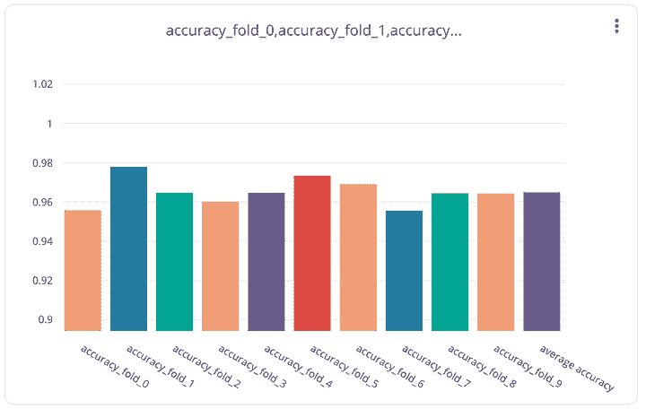

# 使用交叉验证构建可靠的机器学习模型

> 原文：[`www.kdnuggets.com/2018/08/building-reliable-machine-learning-models-cross-validation.html`](https://www.kdnuggets.com/2018/08/building-reliable-machine-learning-models-cross-validation.html)

 评论

**作者：[Gideon Mendels](https://www.linkedin.com/in/mendels/)，联合创始人兼首席执行官 @ [Comet.ml](https://www.comet.ml/)**

交叉验证是一种用于测量和评估机器学习模型性能的技术。在训练过程中，我们创建多个训练集的分区，并在这些分区的不同子集上进行训练/测试。

交叉验证经常被用来训练、测量并最终选择一个机器学习模型，因为它帮助评估模型的结果如何在独立数据集上*实际应用*。最重要的是，交叉验证已被证明能生成比其他方法偏差更低的模型。

本教程将重点介绍一种名为**k 折交叉验证**的交叉验证变体。

在本教程中，我们将涵盖以下内容：

1.  K-Fold 交叉验证概述

1.  使用 Scikit-Learn 和 [Comet.ml](https://www.comet.ml/) 的示例

### K-Fold 交叉验证

交叉验证是一种重采样技术，用于在有限的数据集上评估机器学习模型。

交叉验证的最常见用法是 k 折交叉验证方法。我们的训练集被拆分为*K*个分区，模型在*K-1*个分区上进行训练，测试误差在*Kth*个分区上预测并计算。这在每个唯一组上重复，测试误差被平均。

**相同的过程由以下步骤描述：**

1.  将训练集拆分为 K 个（K=10 是常见选择）分区

对于每个分区：

1.  设置分区作为测试集

1.  在其余的分区上训练模型

1.  在测试集上测量性能

1.  保留性能指标

1.  探索不同折叠下的模型性能

交叉验证通常被使用，因为它易于解释，并且通常会比其他方法，如简单的训练/测试拆分，得到更少偏差或更少乐观的模型性能估计。使用交叉验证的最大缺点之一是训练时间的增加，因为我们实际上是在训练 K 次而不是 1 次。

### 使用 scikit-learn 的交叉验证示例

[**Scikit-learn**](http://scikit-learn.org/)是一个流行的机器学习库，它还提供了许多数据采样、模型评估和训练的工具。我们将使用`Kfold`类来生成我们的折叠。以下是基本概述：

```py
from sklearn.model_selection import KFold
X = [...] # My training dataset inputs/features
y = [...] # My training dataset targets

kf = KFold(n_splits=2)
kf.get_n_splits(X)

for train_index, test_index in kf.split(X):
   X_train, X_test = X[train_index], X[test_index]
   y_train, y_test = y[train_index], y[test_index]
   model = train_model(X_train,y_train)
   score = eval_model(X_test,y_test)
```

### 现在让我们使用 scikit-learn 和 Comet.ml 训练一个端到端的示例。

这个例子在新闻组数据集上训练一个文本分类器（你可以在[这里](http://scikit-learn.org/stable/datasets/twenty_newsgroups.html)找到它）。给定一段文本（字符串），模型将其分类为以下类别之一：“无神论”、“基督教”、“计算机图形学”、“医学”。

在每一轮中，我们将准确度报告给[Comet.ml](https://www.comet.ml/)，最后我们报告所有轮次的平均准确度。实验结束后，我们可以[**访问 Comet.ml 并检查我们的模型**](https://www.comet.ml/gidim/cross-validation/dd73c9696cbc497cb8274abcb883e03e/chart)**:**



以下图表由 Comet.ml 自动生成。最右侧的条形（紫色）表示**所有轮次的** **平均** **准确度**。如图所示，一些轮次的表现明显优于平均水平，展示了 k 折交叉验证的重要性。

你可能注意到我们没有计算**测试**准确度。**测试**集在所有实验完成之前不应以任何方式使用。如果我们根据测试准确度改变超参数或模型类型，我们实际上是在将超参数过拟合到测试分布上。

对交叉验证仍然感到好奇？以下是一些其他优秀的资源：

+   [Jason Brownlee](https://medium.com/@jason.brownlee05)的“[交叉验证的温和介绍](https://machinelearningmastery.com/k-fold-cross-validation/)”

+   [Prashant Gupta](https://medium.com/@prashantgupta17)’s [>机器学习中的交叉验证](https://towardsdatascience.com/cross-validation-in-machine-learning-72924a69872f))

**觉得这篇文章有用吗？在 Medium 上关注我们 ([Comet.ml](https://medium.com/comet-ml))，并查看下面的一些相关文章！请????分享这篇文章！**

+   [Comet.ml 发布说明](https://www.notion.so/cometml/Comet-ml-Release-Notes-93d864bcac584360943a73ae9507bcaa)——每日更新新功能和修复！

+   [使用 fastText 和 Comet.ml 来分类知识图谱中的关系](https://medium.com/comet-ml/using-fasttext-and-comet-ml-to-classify-relationships-in-knowledge-graphs-e73d27b40d67)

+   [实时模型性能可视化](https://medium.com/comet-ml/real-time-model-performance-visualizations-with-comet-ml-992fb6226cb6)

*感谢[Cecelia Shao](https://medium.com/@ceceliashao?source=post_page)。*

**简介: [Gideon Mendels](https://www.linkedin.com/in/mendels/)** 是[Comet.ml](https://www.comet.ml/)的联合创始人兼首席执行官。

**[Comet.ml](https://www.comet.ml/)** 正为机器学习领域做出与 Github 对代码相同的贡献。我们轻量级的 SDK 使数据科学团队能够自动跟踪他们的数据集、代码更改和实验历史。这样，数据科学家可以轻松地重现他们的模型，并在团队中进行模型迭代的协作！

[原文](https://medium.com/comet-ml/building-reliable-machine-learning-models-with-cross-validation-20b2c3e32f3e)。已获许可转载。

**相关内容：**

+   训练集、测试集和 10 折交叉验证

+   可视化交叉验证代码

+   如何（以及为什么）创建一个好的验证集

* * *

## 我们的前三大课程推荐

 1\. [Google 网络安全证书](https://www.kdnuggets.com/google-cybersecurity) - 快速进入网络安全职业的快车道

 2\. [Google 数据分析专业证书](https://www.kdnuggets.com/google-data-analytics) - 提升你的数据分析能力

 3\. [Google IT 支持专业证书](https://www.kdnuggets.com/google-itsupport) - 支持你的组织的 IT 工作

* * *

### 更多相关话题

+   [设计有效且可靠的机器学习系统！](https://www.kdnuggets.com/2023/05/manning-design-effective-reliable-machine-learning-systems.html)

+   [确保 LLM 的可靠少量样本提示选择](https://www.kdnuggets.com/2023/07/ensuring-reliable-fewshot-prompt-selection-llms.html)

+   [通过链式验证解锁可靠的生成：一个…](https://www.kdnuggets.com/unlocking-reliable-generations-through-chain-of-verification)

+   [构建数据管道以创建大型语言模型应用](https://www.kdnuggets.com/building-data-pipelines-to-create-apps-with-large-language-models)

+   [构建预测模型：Python 中的逻辑回归](https://www.kdnuggets.com/building-predictive-models-logistic-regression-in-python)

+   [逐步教程：构建你的第一个机器学习模型](https://www.kdnuggets.com/step-by-step-tutorial-to-building-your-first-machine-learning-model)
