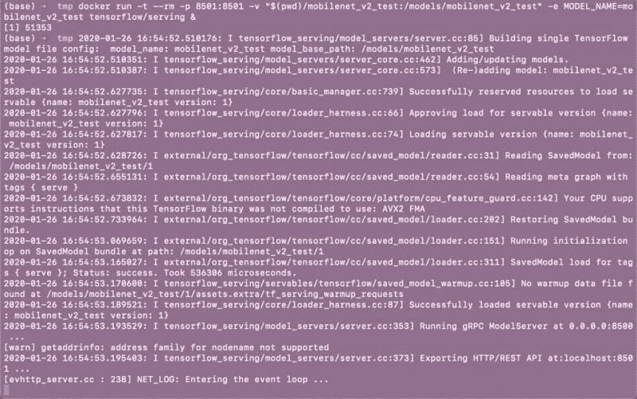
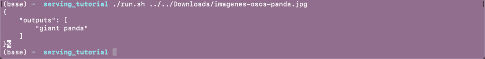
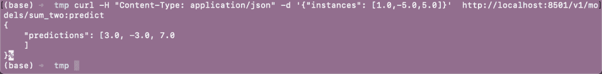

# 使用 Tensorflow Serving 构建 REST API（第二部分）

> 原文：[`www.kdnuggets.com/2020/07/building-rest-api-tensorflow-serving-part-2.html`](https://www.kdnuggets.com/2020/07/building-rest-api-tensorflow-serving-part-2.html)

评论

**由 [Guillermo Gomez](https://www.linkedin.com/in/mlgxmez/)，数据科学家及机器学习工程师**

一旦生成了这些 Tensorflow 对象，就该将它们公开供大家使用了。通过围绕这些对象构建 REST API，人们将能够在他们的项目中使用你的服务。让我们看看如何做到这一点！

### Docker 概述

在这一部分，我假设我们对 Docker 有基本了解。对于那些不熟悉的人，Docker 是一种在计算机上构建隔离环境（容器）的工具，这样它不会与本地文件系统（主机）中的任何文件或程序冲突。它的所有优点中，我会特别强调这些：

+   与虚拟机不同，你可以仅用运行项目单一组件所需的内容来运行容器。这有助于你生成轻量级的容器。

+   Docker 网络功能允许你轻松地让多个容器之间进行通信。

+   即使你的操作系统与所需工具不完全兼容，使用容器也不会再遇到兼容性问题。

+   无论托管环境是你的计算机还是运行在云服务上的服务器，Docker 容器的运行方式都是相同的。

每当我开始学习新东西时，我建议查看文档中的教程或快速入门。Tensorflow Serving 在其 Github [仓库](https://github.com/tensorflow/serving)中有一个简短的教程：

```py
# Download the TensorFlow Serving Docker image and repo
docker pull tensorflow/serving

git clone https://github.com/tensorflow/serving
# Location of demo models
TESTDATA="$(pwd)/serving/tensorflow_serving/servables/tensorflow/testdata"

# Start TensorFlow Serving container and open the REST API port
docker run -t --rm -p 8501:8501 \
    -v "$TESTDATA/saved_model_half_plus_two_cpu:/models/half_plus_two" \
    -e MODEL_NAME=half_plus_two \
    tensorflow/serving &

# Query the model using the predict API
curl -d '{"instances": [1.0, 2.0, 5.0]}' \
    -X POST http://localhost:8501/v1/models/half_plus_two:predict

# Returns => { "predictions": [2.5, 3.0, 4.5] }
```

请注意传递给 `docker run` 命令的参数，特别是那些接受外部值的参数：

+   `-p 8501:8501`，将容器的端口映射到主机上的相同端口。对于 REST API，Tensorflow Serving 使用这个端口，**所以在实验中不要更改这个参数**。

+   `-v "$TESTDATA/saved_model_half_plus_two_cpu:/models/half_plus_two"`，将一个卷附加到容器。这个卷包含你保存 Tensorflow 对象的文件夹的副本。这个文件夹位于名为 `/1/` 的文件夹的上一层。这一文件夹将在容器中显示在 `/models/` 下。

+   `-e MODEL_NAME=half_plus_two`，定义一个环境变量。这个变量是服务你的模型所必需的。为了方便，**使用与容器中附加模型的文件夹名称相同的标识符**。

### 在容器中部署可服务的模型

你可以为你的可服务对象设计一个 API，但 Tensorflow Serving 通过 Docker 抽象化了这个步骤。一旦你部署了容器，你可以向容器所在的服务器发送请求以执行某种计算。在请求体中，你可以附加一些输入（这是运行可服务对象所必需的），并获得一些输出作为回报。

为了进行计算，你需要在请求中指定可服务对象的端点 URL。在上面显示的示例中，这个端点 URL 是 `[`localhost:8501/v1/models/half_plus_two:predict`](http://localhost:8501/v1/models/half_plus_two:predict)`。现在一切都准备好运行我们的 Tensorflow 对象了。我们将从 Keras 模型开始：

```py
docker run -t --rm -p 8501:8501 -v "$(pwd)/mobilenet_v2_test:/models/mobilenet_v2_test" -e MODEL_NAME=mobilenet_v2_test tensorflow/serving &

```

当执行这个命令时，当前目录是 `tmp/`。这是我保存所有模型的文件夹。这是终端返回的内容：



模型已经启动并准备好使用。

### 向可服务对象发起请求

### 使用 `curl` 库

现在容器已经启动并运行，我们可以通过发送需要识别的图像来发起请求。我将展示两种实现方式。首先，我写了一个小的 shell 脚本（可以从 [这里](https://gist.github.com/mlgxmez/6cd3b5824567ba69edd4468e8de97f1f) 下载），它接收一个图像文件的路径作为参数，并使用 `curl` 库进行调用。在这里，我展示了如何发起请求以及模型正在尝试分类的图像。


这只放松的熊猫在实验过程中没有受伤

这就是我们如何使用我们构建的 API 进行调用。



第二个示例涉及一个可服务对象，它将 2 添加到向量的每个元素中。这是容器启动后如何进行调用的示例。



### 使用 `requests` 库

`requests` 库允许你做相同的事情，但使用 Python 代码

```py
import json
import requests
import base64

data = {}
with open('../../Downloads/imagenes-osos-panda.jpg', mode='rb') as file:
    img = file.read()
data = {"inputs":[{"b64":base64.encodebytes(img).decode("utf-8")}]}

# Making the request
r = requests.post("http://localhost:8501/v1/models/mobilenet_v2_test:predict", data=json.dumps(data))
r.content
# And returns:
# b'{\n    "outputs": [\n        "giant panda"\n    ]\n}'
```

在这段代码中，你会注意到在定义发送到请求中的 JSON 时需要遵循一些规则，例如键的命名和嵌套结构的存在。这在 Tensorflow 的 [文档](https://www.tensorflow.org/tfx/serving/api_rest#predict_api) 中有更详细的说明。关于图像，它们在发送到可服务对象之前使用 Base64 编码进行二值化处理。

这涵盖了我目前想用 Tensorflow Serving 解释的所有内容。我希望这个教程能激发你构建机器学习服务的动力。这只是冰山一角。祝你好运！

**个人简介：[Guillermo Gomez](https://www.linkedin.com/in/mlgxmez/)** 在公共基础设施和服务行业构建基于机器学习的产品。他的网站可以找到更多教程：[`thelongrun.blog`](http://thelongrun.blog)

[原文](https://thelongrun.blog/2020/01/26/rest-api-tensorflow-serving-pt2/)。经许可转载。

**相关内容：**

+   使用 TensorFlow Serving 构建 REST API（第一部分）

+   优化机器学习 API 在生产环境中的响应时间

+   开始使用 TensorFlow 2

* * *

## 我们的三大课程推荐

 1\. [Google 网络安全证书](https://www.kdnuggets.com/google-cybersecurity) - 快速进入网络安全职业生涯。

 2\. [Google 数据分析专业证书](https://www.kdnuggets.com/google-data-analytics) - 提升你的数据分析技能

 3\. [Google IT 支持专业证书](https://www.kdnuggets.com/google-itsupport) - 支持你的组织在 IT 领域

* * *

### 更多相关话题

+   [前 7 名模型部署和服务工具](https://www.kdnuggets.com/top-7-model-deployment-and-serving-tools)

+   [使用 TensorFlow 和 Keras 构建和训练你的第一个神经网络](https://www.kdnuggets.com/2023/05/building-training-first-neural-network-tensorflow-keras.html)

+   [构建视觉搜索引擎 - 第一部分：数据探索](https://www.kdnuggets.com/2022/02/building-visual-search-engine-part-1.html)

+   [构建视觉搜索引擎 - 第二部分：搜索引擎](https://www.kdnuggets.com/2022/02/building-visual-search-engine-part-2.html)

+   [OpenAI 的 Whisper API 用于转录和翻译](https://www.kdnuggets.com/2023/06/openai-whisper-api-transcription-translation.html)

+   [认识 Gorilla：UC 伯克利和微软的 API 增强 LLM…](https://www.kdnuggets.com/2023/06/meet-gorilla-uc-berkeley-microsoft-apiaugmented-llm-outperforms-gpt4-chatgpt-claude.html)
