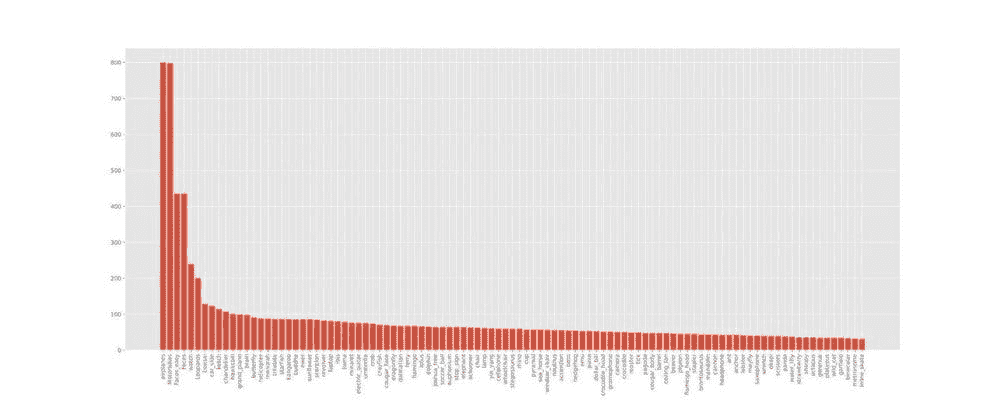
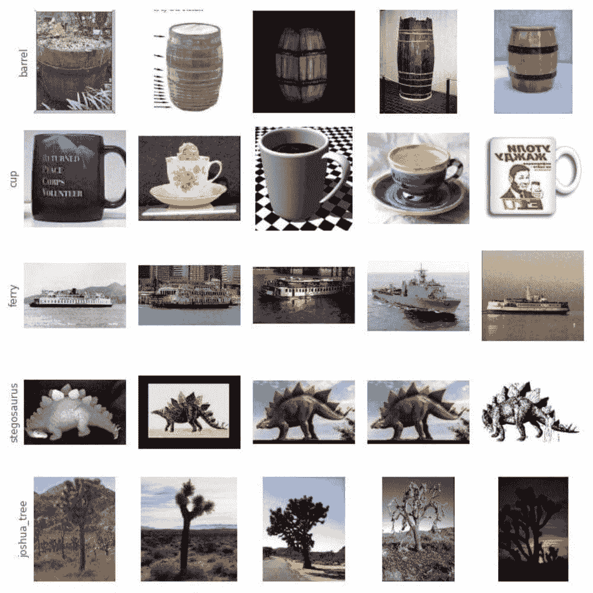
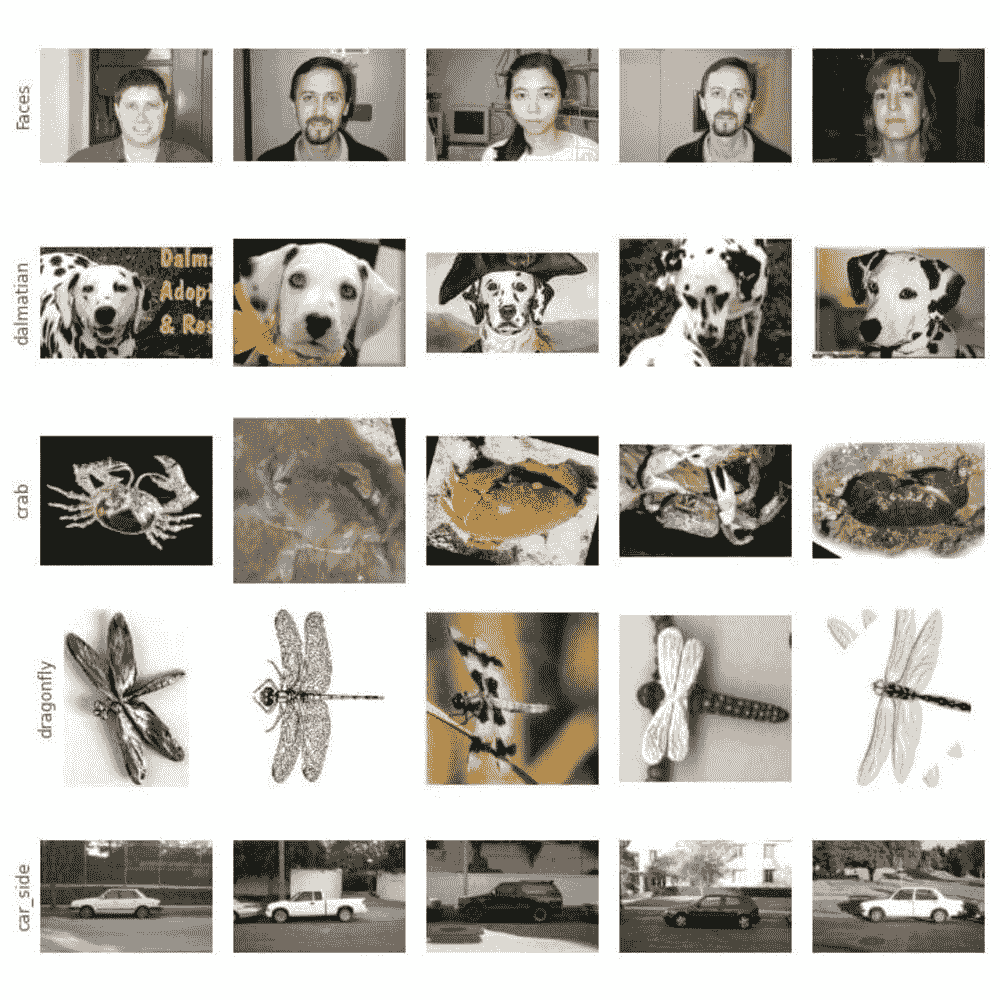
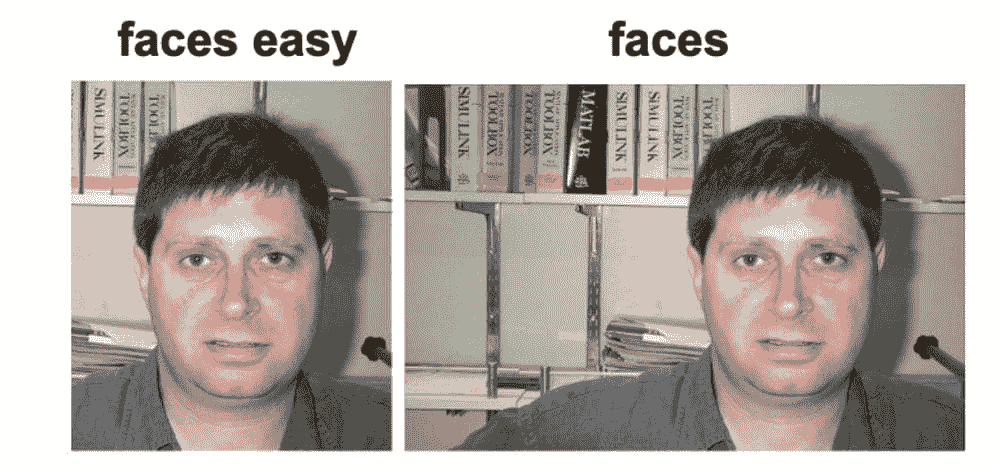
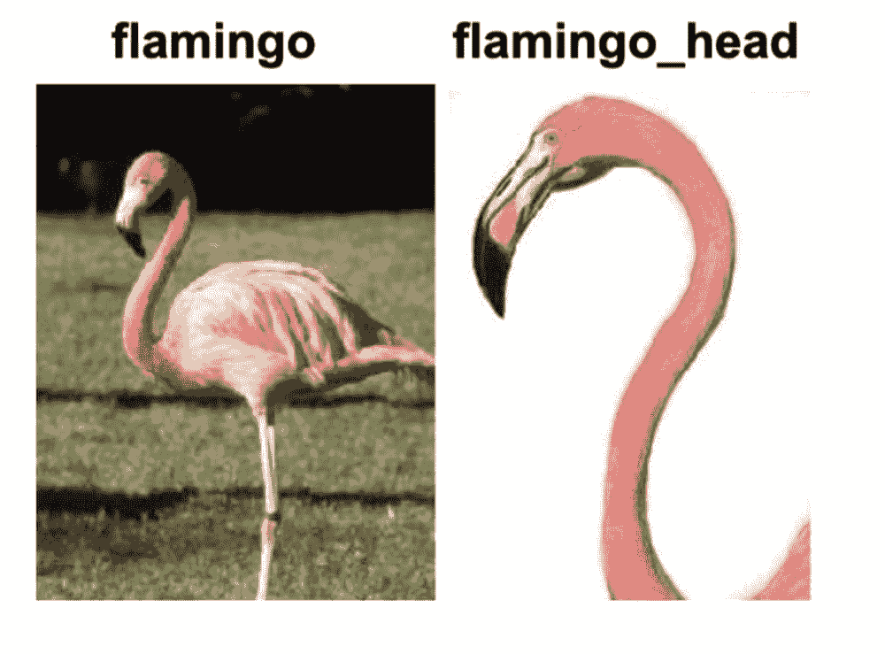
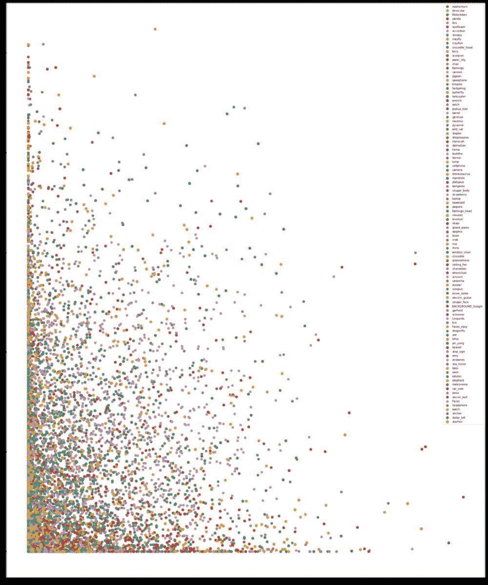
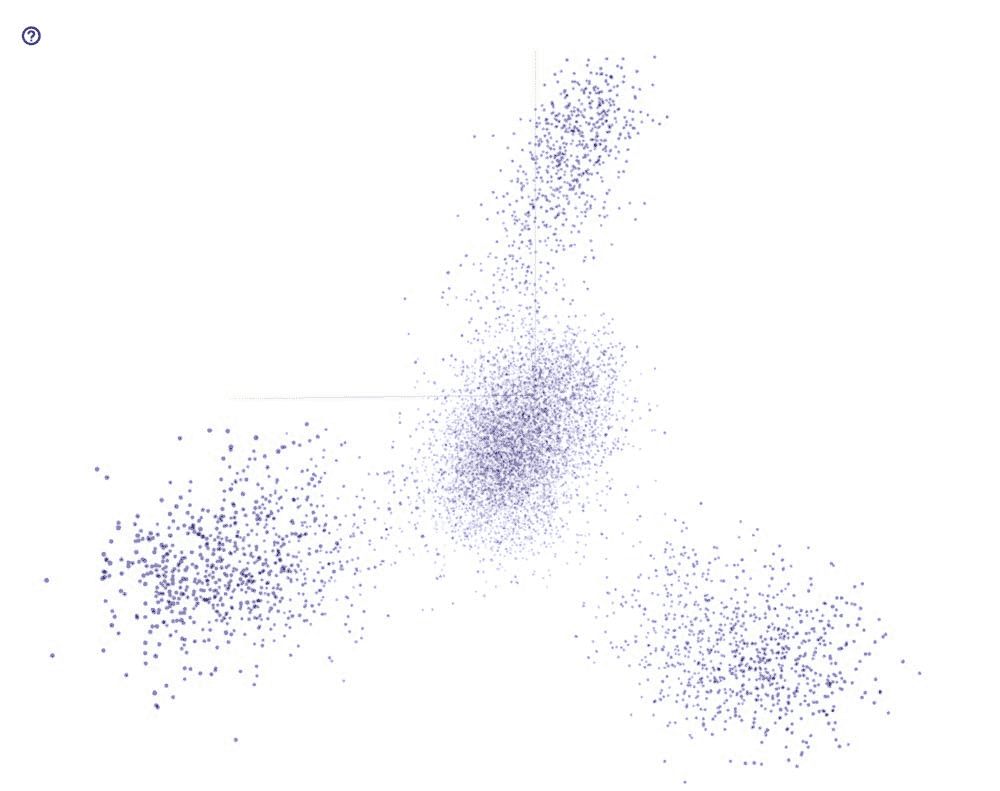
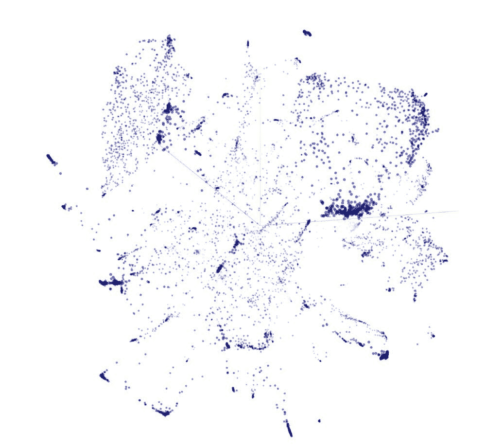

# 构建视觉搜索引擎 – 第一部分：数据探索

> 原文：[`www.kdnuggets.com/2022/02/building-visual-search-engine-part-1.html`](https://www.kdnuggets.com/2022/02/building-visual-search-engine-part-1.html)

### 为什么？

曾经想过 Google 或 Bing 如何找到与您的图像相似的图像吗？生成基于文本的 10 个蓝色链接的算法与寻找视觉上相似或相关的图像的算法是非常不同的。在本文中，我们将解释一种构建视觉搜索引擎的方法。我们将使用 Caltech [101](http://www.vision.caltech.edu/Image_Datasets/Caltech101/) 数据集，该数据集包含日常生活中常见物体的图像。我们将仅介绍一个原型算法，并讨论开发全面规模视觉搜索引擎所需的条件。

### ****关于数据集****

* * *

## 我们的前三个课程推荐

 1\. [Google 网络安全证书](https://www.kdnuggets.com/google-cybersecurity) - 快速进入网络安全职业生涯。

 2\. [Google 数据分析专业证书](https://www.kdnuggets.com/google-data-analytics) - 提升您的数据分析技能

 3\. [Google IT 支持专业证书](https://www.kdnuggets.com/google-itsupport) - 支持您的组织进行 IT

* * *

Caltech 101 数据集包含 101 个类别的物体，如面部、蜱、刀具、手机、货币等。每个类别包含 40–200 张图像。除了 101 个类别外，它还包含一个背景类别/噪声类别，以测试模型在负面图像上的表现。数据集包含 8677 张图像，不包括 486 张背景图像。以下是各类别图像的频率分布。

每个类别中的图像数量遵循长尾分布。最常见的类别包含的图像数量约为最少见类别的 16 倍。大约 5%的类别（5 个类别）包含约 30%的图像。大约 90%的类别有少于 100 张图像。

**注意：** 数据集中的这种不平衡可能导致模型训练时出现偏斜的批次。

### ****探索性数据分析****

我们从随机选择的类别中获取随机图像。请参见下面的一些样本图像。

****观察结果****

+   **纵横比：** 图像具有不同的纵横比，但图像的最大边被调整为 300px。此外，我们尝试获取纵横比的分布，以更好地理解数据集。我们发现大多数图像的纵横比为 0.5–0.8，即宽度大于高度。

+   **彩色与灰度**：我们注意到某些目录中的许多图像是灰度图像。我们实现了一个灰度图像检查，发现 101 个类别中有 411 张图像是灰度图像。接下来，我们检查了每个类别的分布，发现 car-side 类只有灰度图像。还有一些其他类别包含灰度图像，但除了 car-side 类之外，所有类别都包含彩色图像。

**数据偏差：**

+   ***faces 和 faces_easy***：这些类别分别包含面部图像和裁剪的面部图像。但是，有多张同一人的图像具有轻微的视角变化。此外，这些图像在遮挡、背景和光照方面非常相似。

+   ***flamingo 和 flamingo_head***：一个类别包含了整个火烈鸟的身体，另一个类别仅包含火烈鸟的头部。

+   相似情况：**chair** 和 **windsor_chair**

+   **accordion** — 图像旋转了 45 度，并有黑色填充

**动画图像**：许多类别包含卡通图像。卡通图像在语义上是正确的，但与真实图像相比具有不同的纹理。

**对象位置与尺度**：我们发现数据集在图像中的尺度和位置上存在偏差。聚焦的对象总是位于图像的中心，并具有相似的尺度。图像中心的对象可能没有问题，因为 CNN 模型对平移不变（当使用最大池化或平均池化时）。但使用固定尺度训练模型可能会导致模型仅在类似尺度的对象上有效。这将导致模型在不同尺度的图像上失败，这通常发生在现实生活中。我们提出了两个解决方案：

1.  **两阶段管道**：我们可以创建一个两阶段的管道，第一个组件预测聚焦对象的边界框，第二个组件预测对象是什么。

1.  **使用数据增强调整对象大小**：我们可以应用数据增强技术来重新调整聚焦对象的大小，并在增强后的数据集上训练模型。这可能需要增加模型的大小，因为它现在将存储更多的信息（对象识别为多个尺度，因为 CNN 对尺度不变）。

**遮挡与背景**：数据集中大多数图像有干净的背景，聚焦的物体没有被遮挡。

**图像栅格化**：一些类别的图像似乎是从较小尺寸的图像调整大小的。因此，这些图像看起来非常栅格化

### ****嵌入可视化****

在本节中，我们使用从预训练模型生成的嵌入来可视化图像。为此，我们使用了在 ImageNet 上预训练的 MobileNetV2 模型，该模型具有 220 万个参数。我们使用了全局平均池化层的输出，该层生成的嵌入大小为 1280。

该向量的二维图并不直观。这是因为这两个维度合在一起仅解释了数据中 8.5%的方差。我们还使用 TF Projector 将这些嵌入图在三维中绘制。3D 嵌入图解释了数据中约 15%的方差。

我们没有从上述图表中观察到任何明显的对象簇。但图像之间的余弦相似度很好地代表了这些图像。在大多数情况下，接近某一图像嵌入的图像属于同一类别。这证明了我们用于生成嵌入的模型，专注于图像的正确方面，并且能够识别图像中的兴趣对象。

t-SNE 嵌入的可视化显示了大量集中类簇。浏览这些可视化还揭示了一些相似的类，如帆船和双桅帆船、直升机和飞机、淡水龙虾和龙虾等。

> **编辑说明：** 请加入我们下周的精彩内容《构建视觉搜索引擎》，我们将从数据探索转向实际构建视觉搜索引擎。

**[Mudit Bachhawat](https://www.linkedin.com/in/muditbac/?originalSubdomain=in)** 在谷歌担任机器学习工程师，拥有超过 5 年的数据科学、深度学习、计算机视觉、多模态信息检索和优化方面的经验。欢迎随时留言或提问。

### 更多相关内容

+   [构建视觉搜索引擎 - 第二部分：搜索引擎](https://www.kdnuggets.com/2022/02/building-visual-search-engine-part-2.html)

+   [提升你的搜索引擎技能，通过 Uplimit 的机器学习课程！](https://www.kdnuggets.com/2023/10/uplimit-elevate-your-search-engine-skills-search-with-ml-course)

+   [Qdrant：开源向量搜索引擎与托管云平台](https://www.kdnuggets.com/2023/02/qdrant-open-source-vector-search-engine-managed-cloud-platform.html)

+   [使用 Google Earth 构建 Python 地理空间应用程序……](https://www.kdnuggets.com/2022/03/building-geospatial-application-python-google-earth-engine-greppo.html)

+   [使用网格搜索和随机搜索进行超参数调优](https://www.kdnuggets.com/2022/10/hyperparameter-tuning-grid-search-random-search-python.html)

+   [ChatGPT 驱动的数据探索：解锁数据集中隐藏的洞察](https://www.kdnuggets.com/2023/07/chatgptpowered-data-exploration-unlock-hidden-insights-dataset.html)
