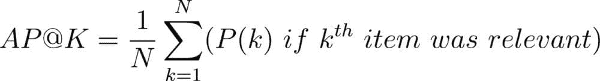
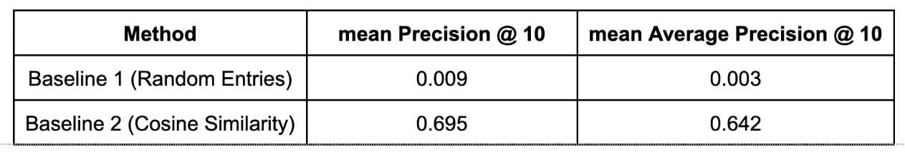
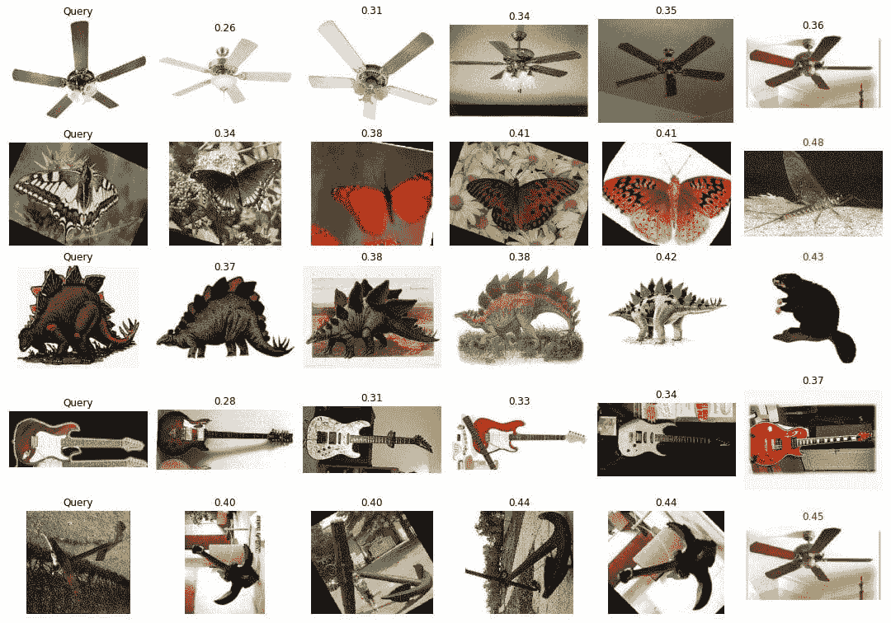
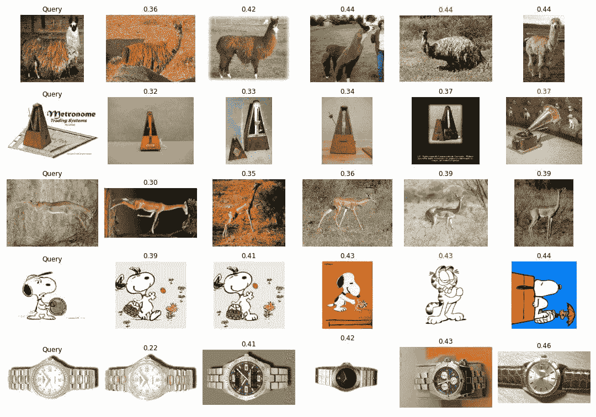
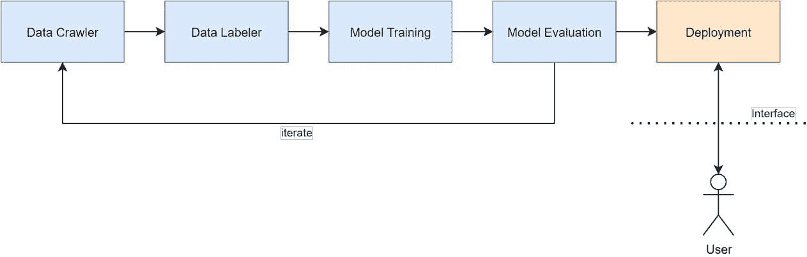

# 构建视觉搜索引擎 – 第二部分：搜索引擎

> 原文：[`www.kdnuggets.com/2022/02/building-visual-search-engine-part-2.html`](https://www.kdnuggets.com/2022/02/building-visual-search-engine-part-2.html)
> 
> **编辑注**：你可以在[这里](https://www.kdnuggets.com/2022/02/building-visual-search-engine-part-1.html)找到本文的第一部分。

* * *

## 我们的前三个课程推荐

 1\. [Google 网络安全证书](https://www.kdnuggets.com/google-cybersecurity) - 快速进入网络安全职业生涯。

 2\. [Google 数据分析专业证书](https://www.kdnuggets.com/google-data-analytics) - 提升你的数据分析能力

 3\. [Google IT 支持专业证书](https://www.kdnuggets.com/google-itsupport) - 支持你的组织的 IT 工作

* * *

**任务**：任务是生成一个图像的排名列表，这些图像在语义上与查询图像相似。

## ****数据集****

我们将数据集分成两部分：训练集和评估集。从每个类别中，我们将随机抽取 20 张图像，并创建一个评估集。其余图像将作为训练集的一部分。我们进一步将评估集拆分为两个部分，查询集和候选集。我们将从评估集的每个类别中取 5 张图像作为查询集，其余图像则作为候选集。这是为了计算评估指标。

对于每个查询集图像，系统从评估集中生成一个图像排名列表。然后使用下面定义的指标来评估系统的性能。

## ****指标****

我们使用 Precision @ K 指标来衡量系统的性能。

该指标不关注条目的排名，只关注相关条目的数量。为了捕捉系统的排名因素，我们还在数据集上展示了平均精度（AP）。

## ****方法****

对于这个练习，我们展示了两个基准。

**基准 1**：在这种方法中，我们从候选集中的所有类别随机选择 10 个样本。我们对每个查询执行此操作并计算指标。

**基准 2**：在这种方法中，我们使用从 MobileNetV2 模型生成的嵌入，并使用余弦距离作为相似度度量来对候选条目进行排名。

注意：我们知道这两种方法都没有使用训练集。这些方法仅为系统提供基准。

## ****结果****

### **定量结果**

我们使用数据集部分定义的方法来计算评估指标。

### **定性结果**

以下结果呈现了基准 2 方法（余弦相似度）的结果

示例搜索结果

示例搜索结果

请在[此处](https://github.com/muditbac/caltech-search)找到重现指标和结果的代码。

## 未来展望

**数据收集和标注：** 为了创建一个完整的图像搜索引擎，我们需要重新审视该系统的需求。该系统是否需要处理某些类型的图像？是否应该处理所有现实生活中的物体？搜索应该集中在图像中的语义对象上，还是类似颜色和纹理的图像就足够了？这些需求将有助于明确数据需求。要创建一个完整的搜索引擎，我们需要从网络上收集数百万张图像并维护索引。收集数据后，我们需要定义任务并开始对数据进行标注。

** 错误分析：** 我们可以分析余弦相似度结果中出现的错误。我们可以检查那些虽然被包含在前 10 结果中但属于其他类别的搜索结果。这可能揭示出类似类别的结果和噪声类别的结果等错误。

**方法：** 现有方法使用了预训练的 MobileNetV2 模型的知识。未来，我们可以使用三元组损失或对比损失在相似和不相似的图像上训练自己的模型。目标是创建一个能够捕捉图像中物体的嵌入器。

** 部署：** 建立一个完整的搜索引擎将需要构建多个组件。

+   **图像爬虫：** 该组件将爬取用于模型训练和验证的图像。

+   **数据标注器：** 该组件将由人工标注员使用，以标注和清理收集的数据。数据将根据多个要求进行收集和清理。训练和验证数据将通过不同的管道处理。

+   **模型训练**：该组件将使用标注数据生成可用于推断的模型工件。

+   **模型评估：** 该组件将生成关于模型改进的报告。系统的任何变化都应该在该报告中可见，变化应该以此为依据。该系统还应生成关注的失败案例。

+   **嵌入预计算：** 一旦模型经过训练和验证，应该利用该模型生成所有部署数据的嵌入。嵌入应预先计算以便于在请求时快速检索。

+   **实时服务和应用接口**：该组件包含用于处理和生成请求的前端和后端。

## 参考文献

[1] Caltech 101, [`www.vision.caltech.edu/Image_Datasets/Caltech101/`](http://www.vision.caltech.edu/Image_Datasets/Caltech101/)

[2] 推荐系统的平均精度均值（MAP）， [`sdsawtelle.github.io/blog/output/mean-average-precision-MAP-for-recommender-systems.htm`](https://sdsawtelle.github.io/blog/output/mean-average-precision-MAP-for-recommender-systems.html)

**[Mudit Bachhawat](https://www.linkedin.com/in/muditbac/?originalSubdomain=in)** 在 Google 担任机器学习工程师，拥有超过 5 年的数据科学、深度学习、计算机视觉、多模态信息检索和优化的经验。欢迎随时留言或提问。

### 更多相关主题

+   [构建视觉搜索引擎 - 第一部分：数据探索](https://www.kdnuggets.com/2022/02/building-visual-search-engine-part-1.html)

+   [通过 Uplimit 的机器学习课程提升您的搜索引擎技能！](https://www.kdnuggets.com/2023/10/uplimit-elevate-your-search-engine-skills-search-with-ml-course)

+   [Qdrant：具有托管云平台的开源向量搜索引擎](https://www.kdnuggets.com/2023/02/qdrant-open-source-vector-search-engine-managed-cloud-platform.html)

+   [使用 Google Earth Engine 构建 Python 地理空间应用程序…](https://www.kdnuggets.com/2022/03/building-geospatial-application-python-google-earth-engine-greppo.html)

+   [使用网格搜索和随机搜索进行超参数调优（Python 版）](https://www.kdnuggets.com/2022/10/hyperparameter-tuning-grid-search-random-search-python.html)

+   [数据科学必备数学：奇异值分解的视觉介绍…](https://www.kdnuggets.com/2022/06/essential-math-data-science-visual-introduction-singular-value-decomposition.html)
