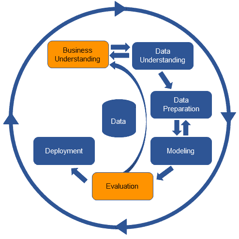
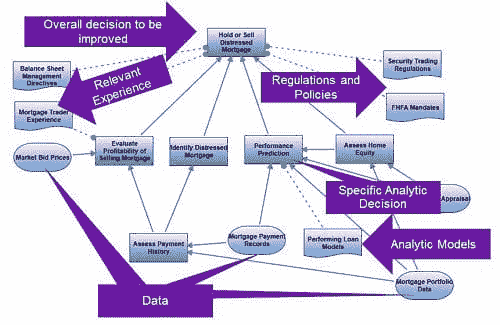

# 将业务清晰度带入 CRISP-DM

> 原文：[`www.kdnuggets.com/2017/01/business-clarity-crisp-dm.html`](https://www.kdnuggets.com/2017/01/business-clarity-crisp-dm.html)

评论

这是三篇文章中的第二篇。第一篇概述了**使用 CRISP-DM 的四个问题及解决方法**。这四个问题中的两个与对业务问题缺乏清晰度有关，这削弱了任何开发的分析的业务价值。分析团队需要模拟业务决策，以将他们的分析与业务目标联系起来，因为这将带来业务问题的清晰度，并使分析结果能够以业务术语进行评估。在 CRISP-DM 中，解决这些问题涉及对业务理解和评估阶段的更改，如图 1 所示。

* * *

## 我们的前三个课程推荐

 1\. [谷歌网络安全证书](https://www.kdnuggets.com/google-cybersecurity) - 快速进入网络安全职业生涯。

 2\. [谷歌数据分析专业证书](https://www.kdnuggets.com/google-data-analytics) - 提升你的数据分析技能

 3\. [谷歌 IT 支持专业证书](https://www.kdnuggets.com/google-itsupport) - 支持你的组织 IT

* * *

**图 1: CRISP-DM 中的框架活动。**

CRISP-DM 的第一阶段，业务理解，完全是关于明确业务问题，从而为项目提供业务焦点。分析团队常常忽视这种清晰性的必要性，在急于寻找数据、分析数据和尝试新技术时未能考虑到这一点。最多，分析团队会识别出他们想要改进的业务指标，然后直接深入分析。

但分析不能直接改善指标。例如，客户流失。如果你需要减少客户流失，你可能会开发各种分析——流失预测、接受保留优惠预测、终身价值预测等。但这些分析本身不会改善你的客户流失率。除非你改变你的行为——除非你做些不同的事情——否则你的流失率不会改善。分析可能会给你提供需要做出什么改变以及如何改变的线索，但除非你真正改变行为，否则你不会得到不同的结果。

那么你需要改变什么？决策是关键——只有当人们和系统做出不同的选择、不同的决策时，结果才会改变。如果这种决策过程可以通过分析来改进，那么结果将会改善。例如，单单拥有一个客户流失模型不会减少流失，但决定将有价值的保留优惠重点放在那些最有可能流失的客户身上则会减少流失。

为了确保他们的分析结果能够改善业务结果，分析团队需要将他们关注的指标与可以通过分析改进的具体决策联系起来。而且他们需要在 CRISP-DM 的业务理解步骤中明确做到这一点。他们需要能够捕捉到哪些决策必须改变，这些决策是如何做出的，以及由谁做出。这就是决策模型发挥作用的地方。

决策建模从理解成功的业务衡量标准和找到影响这些衡量标准的业务决策开始——特别是那些日常的、可重复的决策。如果项目要对业务产生任何影响，这些决策中的一个或多个必须以不同的方式做出——更加分析性。如果项目要产生业务差异，决策模型会将决策过程明确化，具体表现为做出决策时必须回答的问题以及可能的答案。然后，它将决策过程分解并使用像决策模型和符号（DMN）标准这样的简单但强大的符号表示决策方法。

图 2 显示了一个决策模型的示例。它展示了需要改进的总体业务决策（顶部的矩形），以便项目的业务重点明确。它将这一决策过程分解为其组成的子决策（更多的矩形），既使决策的过程变得清晰，又识别出应以分析方式做出的具体决策的角色。它显示了做出决策所涉及的规章、政策和相关经验（作为知识来源，文档形状），建议的分析模型和当前使用的数据（作为输入数据，扁平的椭圆）。这样的模型满足了 CRISP-DM 对业务理解的所有要求。

图 2：表达业务理解的决策模型

决策过程中不同组的角色可以通过参考模型来定义，同时可以识别将受到任何变化影响的系统、流程和业务环境。由于这些模型简单且直观，它们可以在分析、业务和 IT 团队之间协作开发和共享。

最终结果是关于：

+   业务问题

    我们对这个决策的准确性不够，而这是告诉我们这一点的衡量标准

+   分析的使用

    一个预测这类事情在决策过程中会有帮助的分析

+   可能有效的解决方案方法

    这些人需要相信分析的结果，并且需要在特定的业务流程中交付，才能发挥作用。

*成功的分析团队花更多时间理解业务问题，而不是在数据湖中摸索。*

拥有决策模型，分析团队还拥有评估其模型的依据。分析度量——该模型的准确性如何，其提升效果如何——可以用来查看它在具体分析决策中的帮助程度。分析决策的变化可以纳入更广泛的业务背景，以查看这将如何影响整体决策。这将显示分析方法是否与原始业务意图匹配。了解谁在做出各种决策以及在什么背景下做出这些决策，也有助于确保所选择的分析风格能有效工作。例如，对于涉及监管机构的决策，避免使用黑箱分析，对于主要自动化的决策，避免使用视觉分析。

如果模型未能成功评估决策模型，则项目将回到起点。它可能只需要查看更多数据或以不同方式分析数据，但更有可能的是团队需要与业务进行讨论，探讨决策的其他可能性。许多项目在这一点上迷失方向，继续增加新数据或对分析进行新修正，而没有检查它们是否仍在朝着有效的业务目标前进。数据可能不支持改善当前决策的那种分析，但也许会揭示改进其他决策的方法或表明该度量标准不正确。可能需要回到业务理解和更新的决策模型，以重新聚焦并为项目提供前进所需的目的。

*成功的分析团队将分析成功与业务成功之间的空白最小化，评估他们的模型时同时考虑业务驱动因素和分析驱动因素。*

使用决策建模为分析项目带来清晰度，确保团队具备构建成功分析所需的业务理解，并为他们提供了一个业务基准，以评估其分析结果。拥有决策模型，分析项目可以避免 CRISP-DM 中的前两个问题，并建立一个能够解决真实业务问题并产生实际业务差异的分析。

要了解全球信息技术领导者如何使用决策建模，请查看[国际分析研究所的最佳实践简报](http://www.decisionmanagementsolutions.com/bringing-clarity-to-data-science-projects-with-decision-modeling-a-case-study/)。

在最后一篇文章中，我们将探讨如何确保分析结果被部署和管理以实现长期价值。

**相关：**

+   基于标准的预测分析部署

+   数据科学过程

+   数据科学自动化：揭穿误解

### 更多相关话题

+   [LangChain + Streamlit + Llama: 将对话式 AI 带到您的本地机器](https://www.kdnuggets.com/2023/08/langchain-streamlit-llama-bringing-conversational-ai-local-machine.html)

+   [将人类和 AI 代理结合起来以提升客户体验](https://www.kdnuggets.com/2024/06/softweb/bringing-human-and-ai-agents-together-for-enhanced-customer-experience)

+   [AI/ML 技术整合将如何帮助企业实现目标](https://www.kdnuggets.com/2021/12/aiml-technology-integration-help-business-achieving-goals-2022.html)

+   [机器学习未能为我的业务创造价值。为什么？](https://www.kdnuggets.com/2021/12/machine-learning-produce-value-business.html)

+   [云存储的采纳是企业当下的需求](https://www.kdnuggets.com/2022/02/cloud-storage-adoption-need-hour-business.html)

+   [驱动更好的商业决策](https://www.kdnuggets.com/2022/04/informs-driving-better-business-decisions.html)
