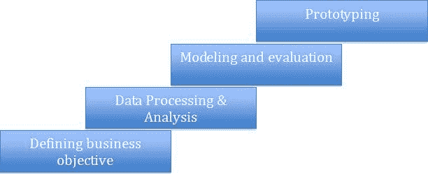
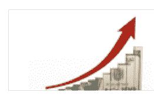
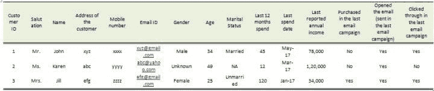

# 数据科学中的业务直觉

> 原文：[`www.kdnuggets.com/2017/10/business-intuition-data-science.html`](https://www.kdnuggets.com/2017/10/business-intuition-data-science.html)

评论

**作者：Jahnavi Mahanta。**

当我们考虑一个数据科学任务时，首先想到的是需要应用的算法技术。虽然这非常重要，但在典型的数据科学任务中，还有许多其他需要同等重视的步骤。

* * *

## 我们的前 3 条课程推荐

 1\. [Google 网络安全证书](https://www.kdnuggets.com/google-cybersecurity) - 快速迈向网络安全职业

 2\. [Google 数据分析专业证书](https://www.kdnuggets.com/google-data-analytics) - 提升你的数据分析水平

 3\. [Google IT 支持专业证书](https://www.kdnuggets.com/google-itsupport) - 在 IT 领域为您的组织提供支持

* * *

典型的数据科学任务可以分为以下几个阶段：

让我用一个简单的案例研究来解释一下：

有一家在线零售商，在假日季之前的 11 月份举办一场购物节。它拥有 100 万种产品的目录和一亿名曾经购买过他们产品的客户的数据库。

这家零售商希望向其客户群体进行促销邮件活动。目标是进行一系列“成功的电子邮件活动”。

现在让我们了解这个具体任务的不同阶段：

### **1\. 确定业务目标：**

这是一个非常关键的阶段，因为对于手头上的业务问题/目标的错误解释可能导致错误的解决方案和不可取的结果。如果您真的考虑一下数据科学的角色，您会发现它的作用是利用数据和从数据中得出的见解来解决现实世界的问题。从这个角度来看，准确地识别问题并定义目标对于成功的结果至关重要。在这个例子中，市场营销人员想要向每位客户发送定制的电子邮件，重点展示根据客户的偏好和口味策划的产品优惠列表：

[图片来源](https://www.remarkety.com/customer-segmentation-drives-better-product-recommendations)

在这种情况下，为了确定业务目标，我们需要提出一些问题：

### 1\. 我们是发送邮件给 1 亿客户还是只发送给一部分客户？

来源：daric.classtell.com/

零售商正在组织一个购物节，因此向所有 1 亿个客户发送电子邮件可能是合理的，但仍然需要考虑以下几点：

a. 通过向所有客户发送大量电子邮件，会不会让一些客户感到不满意。例如，并不活跃地购物的客户。

b. 由于我们希望向客户展示经过筛选的产品列表（基于个体的偏好），所以，如果考虑了所有 1 亿个客户，我们可能会得到一组对任何产品都没有非常高偏好的客户（可能是因为他们与零售商购物并不频繁，因此零售商没有足够的信息了解他们的偏好）

c. 有时，数据处理和存储成本也可能是一个考虑因素。处理 1 亿个客户及其特征，运行机器学习算法可能非常耗时和资源密集。尽管有基础设施可以处理这一切，但考虑到前两个因素，排除一些客户可能是有意义的，特别是为了加快上市时间。

来源：mobileadvertisingwatch.com

### 2\. 我们如何定义和量化成功指标？这是一个非常重要的决定，直接与业务目标相关。在上述情况下，我们可以有几个可能的成功指标：

a. 购买率（#购买量/#发送的邮件数量）：这个指标将告诉我们广告活动说服顾客消费的效果如何。因此，如果零售商只关心整个广告活动带来了多少销售额，那么这就是要选择的指标！

来源：https://www.jaroop.com/web-traffic/

b. 广告活动的邮件打开率（#已打开邮件数量/#发送的邮件数量）：如果零售商想了解其他因素，比如电子邮件活动内容的有效性，特别是本例中电子邮件主题的“吸引力”如何，这一点可能很重要。同样，邮件点击率（在打开邮件后，点击邮件中提供的网址，进入零售商的网站）显示了电子邮件内容的效果如何。

c. *广告活动的盈利能力：*有时候，零售商可能更感兴趣的不仅仅是获取更多客户的响应（即提高响应率），而是提高每位客户的消费金额。可以这样想：一个专注于吸引越来越多客户消费的广告活动可能会吸引那些购买了很多价值较低商品的顾客，而忽略了那些购买较少但购买高价值商品的顾客。

### 2\. 数据处理和分析：

再一次，这是另一个非常重要的阶段，我们在这个阶段详细了解可用的数据以及我们如何使用它来准确解决手头的问题。

广义上，这个阶段可以有以下几个步骤：

1.  缺失值处理

1.  异常值处理

1.  数据分割

1.  特征工程

让我们逐一经历它们，来了解为什么需要这一步。在上面的例子中，假设您拥有类似如下的数据，来自过去的促销电子邮件活动：

上面的数据是在线零售商的一些客户信息快照（100 百万客户之一）。

可以看出，第 2 位顾客的**性别**未知。性别可以是有用的信息，因此，如果有大量顾客的性别为“未知”或“缺失”，我们将丢失一条非常重要的信息。可以有很多方法来填补性别（通过称谓或姓名），因此可以用于***缺失值处理***。同样，如果报告的年收入缺失（因为这些信息仅由顾客提供，他/她可能不愿提供），我们可以利用过去 12 个月的支出来填补/预测年收入。

***异常值处理***也很重要。例如，我们可能会看到“过去 12 个月支出”或“年收入”的一些非常高的值。在支出方面，可能是因为某些顾客的一次性高额支出，这种情况可能不会持续，而且可能会使整个数据产生偏差，因此将支出值限制在某个阈值（例如，“过去 12 个月支出”的 99 或 95 百分位值）可以帮助减少这种偏差。

有时，我们可能会看到数据中有行为非常不同的不同顾客分段。例如，如果我们看最近的顾客（过去 6 个月成为在线零售商会员的顾客），这些顾客的行为可能与其他顾客（他们可能非常好奇，因此电子邮件打开率可能非常高，但购买率可能较低）完全不同。因此，将这些顾客与其他顾客混在一起可能会给某些参数带来偏差，或者这些顾客的特征可能会被其他顾客的特征所掩盖，从而降低他们在任何构建的预测算法上的表示。

***特征工程：*** 特征或变量真的是给算法赋予预测能力的关键。因此，拥有正确的特征集对构建健壮的算法非常关键——因此注重特征工程。特征工程的类型：

1.  特征选择：选择对问题最有用的特征子集。有许多基于相关性、信息价值或其他特征重要性概念的评分算法。然而，随着计算能力和机器学习技术的不断提升，特征选择越来越多地在算法内部处理。

1.  特征构建：从原始数据中手动构建新特征。例如，在上述案例研究中，我们有一个特征“最后消费日期”，它本身可能不提供任何预测能力。然而，我们可以创建一个特征“距离上次消费的天数”，这可能非常强大（最近消费的客户可能有更高的再次消费意向，因此对电子邮件优惠更有响应性）。

1.  特征提取：一些数据（如图像、声音、文本）可以具有多个特征，因此通过特征提取，我们可以自动降低这些类型特征的维度，同时从数据中提取隐藏的特征。例如，在像下面的 Pokemon 图像的图像识别中，每个图像可以具有数百个特征（像素）。因此，任何图像识别算法都必须处理来自多个图像的大量特征。因此，算法必须能够自动提取和减少这些大量特征到一个较小的有意义的特征集。

### 更多关于本主题的内容

+   [稳定扩散：生成式人工智能背后的基本直觉](https://www.kdnuggets.com/2023/06/stable-diffusion-basic-intuition-behind-generative-ai.html)

+   [如何更好地利用数据科学促进业务增长](https://www.kdnuggets.com/2022/08/better-leverage-data-science-business-growth.html)

+   [学习数据科学和商业分析以推动创新和增长](https://www.kdnuggets.com/2023/08/learn-data-science-business-analytics-drive-innovation-growth.html)

+   [数据科学方法推动业务成功](https://www.kdnuggets.com/2023/10/nwu-data-science-methods-drive-business-success)

+   [开启业务成功：对数据科学领导者需求的增长](https://www.kdnuggets.com/unlocking-business-success-the-growing-demand-for-data-science-leaders)

+   [大数据分析：为什么对商业智能如此重要？](https://www.kdnuggets.com/2023/06/big-data-analytics-crucial-business-intelligence.html)
