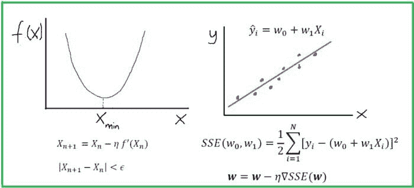
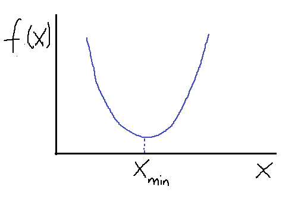
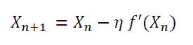
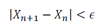
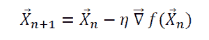
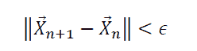

# 数据科学中的微积分

> 原文：[`www.kdnuggets.com/2022/07/calculus-data-science.html`](https://www.kdnuggets.com/2022/07/calculus-data-science.html)

作者提供的图片

## 关键要点

* * *

## 我们的前三名课程推荐

 1\. [Google 网络安全证书](https://www.kdnuggets.com/google-cybersecurity) - 快速进入网络安全职业生涯

 2\. [Google 数据分析专业证书](https://www.kdnuggets.com/google-data-analytics) - 提升您的数据分析技能

 3\. [Google IT 支持专业证书](https://www.kdnuggets.com/google-itsupport) - 支持您组织的 IT 需求

* * *

+   大多数对进入数据科学领域感兴趣的初学者总是担心数学要求。

+   数据科学是一个非常定量的领域，需要高级数学。

+   但要开始，您只需掌握几个数学主题。

+   在这篇文章中，我们讨论了微积分在数据科学和机器学习中的重要性。

# 数据科学和机器学习中的微积分

机器学习算法（如分类、聚类或回归）使用训练数据集来确定可以应用于未见数据的权重因子，以实现预测目的。*每个机器学习模型背后都有一个在很大程度上依赖于微积分的优化算法*。在这篇文章中，我们讨论了一个这样的优化算法，即梯度下降近似（GDA），并展示了它如何用于构建一个简单的线性回归估计器。

# 使用梯度下降算法的优化

## 导数和梯度

在一维情况下，我们可以通过导数来找到函数的最大值和最小值。我们考虑一个简单的二次函数 *f(x)* 如下所示。

**图 1**。使用梯度下降算法的简单函数最小值。作者提供的图片

假设我们想要找到函数 *f(x)* 的最小值。使用梯度下降法和一些初始猜测，*X* 根据以下方程进行更新：

其中常数 *eta* 是一个小的正常数，称为学习率。请注意以下几点：

+   当 X_n > X_min 时，f’(X_n) > 0：这确保 X_n+1 小于 X_n。因此，我们在向左方向迈步，以达到最小值。

+   当 X_n < X_min 时，f’(X_n) < 0：这确保 X_n+1 大于 X_n。因此，我们在向右方向迈步，以达到 X_min。

上述观察表明，初始猜测的好坏无关紧要，梯度下降算法总是能找到最小值。到 *X_min* 的优化步骤数量取决于初始猜测的好坏。有时，如果初始猜测或学习率选择不当，算法可能会完全错过最小值。这通常被称为“**超调**”。通常，可以通过添加收敛标准来确保收敛，例如：

其中 *epsilon* 是一个小的正数。

在更高维度中，多个变量的函数也可以使用梯度下降算法进行优化（最小化）。在这种情况下，我们使用梯度来更新 ***向量 X***：

如同一维情况下，可以通过添加收敛标准来确保收敛，例如：

# 案例研究：构建一个简单的回归估计器

在这个案例研究中，我们使用梯度下降法近似构建了一个简单的线性回归估计器。该估计器用于预测房价，使用了 Housing 数据集。通过调整超参数来寻找性能最佳的回归模型，方法是评估不同学习率下的 R2 得分（拟合优度测量）。本教程的数据集和代码可以从这个 GitHub 库下载：[`github.com/bot13956/python-linear-regression-estimator`](https://github.com/bot13956/python-linear-regression-estimator)

# 摘要

+   一个机器学习算法（如分类、聚类或回归）使用训练数据集来确定权重因子，这些因子可以应用于未见过的数据以进行预测。

+   每个机器学习模型背后都有一个严重依赖微积分的优化算法。

+   因此，拥有微积分的基础知识是重要的，因为这将使数据科学从业者对数据科学和机器学习中使用的优化算法有所了解。

**[Benjamin O. Tayo](https://www.linkedin.com/in/benjamin-o-tayo-ph-d-a2717511/)** 是一位物理学家、数据科学教育者和作家，同时也是 DataScienceHub 的创始人。此前，Benjamin 曾在中央俄克拉荷马大学、大峡谷大学和匹兹堡州立大学教授工程学和物理学。

### 更多内容

+   [麻省理工学院免费微积分课程：理解深度学习的关键](https://www.kdnuggets.com/2020/07/free-mit-courses-calculus-key-deep-learning.html)

+   [微积分：机器学习的隐性构建块](https://www.kdnuggets.com/2022/02/mlm-hidden-building-block-machine-learning.html)

+   [5 个免费课程掌握微积分](https://www.kdnuggets.com/2022/10/5-free-courses-master-calculus.html)

+   [停止学习数据科学以寻找目标，并寻找目标来…](https://www.kdnuggets.com/2021/12/stop-learning-data-science-find-purpose.html)

+   [数据科学最低限度：你需要了解的 10 项基本技能](https://www.kdnuggets.com/2020/10/data-science-minimum-10-essential-skills.html)

+   [KDnuggets™ 新闻 22:n06，2 月 9 日：数据科学编程…](https://www.kdnuggets.com/2022/n06.html)
