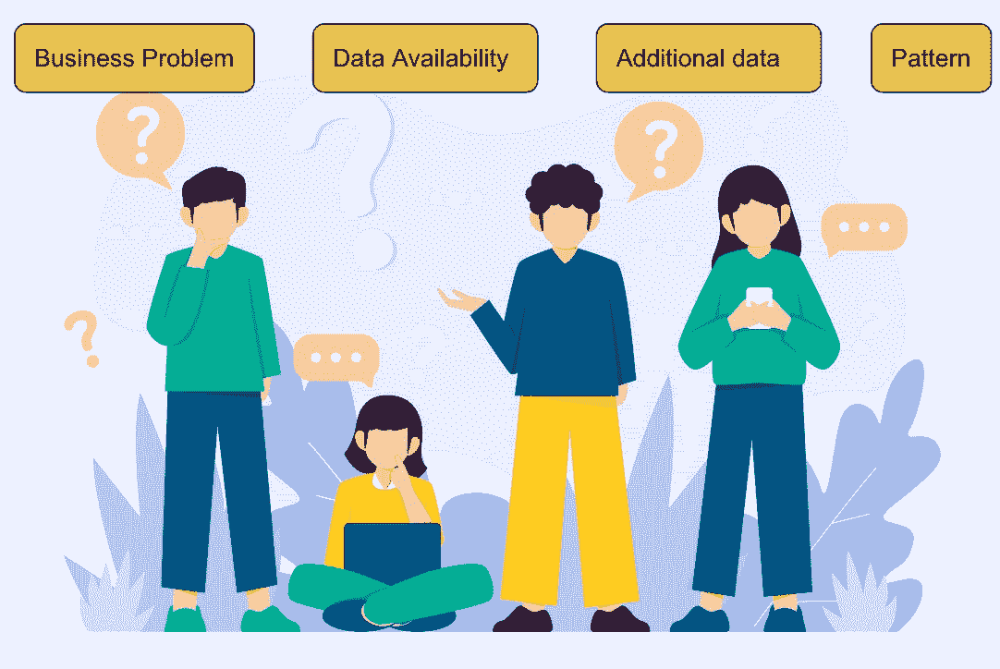

# 数据治理能解决 AI 疲劳吗？

> 原文：[`www.kdnuggets.com/can-data-governance-address-ai-fatigue`](https://www.kdnuggets.com/can-data-governance-address-ai-fatigue)

作者提供的图片

数据治理和 AI 疲劳听起来像是两个不同的概念，但它们之间有着内在的联系。为了更好地理解，让我们先从它们的定义开始。

# 数据治理

这一直是数据行业的核心关注点。

[Google](https://cloud.google.com/learn/what-is-data-governance) 说得很好——“数据治理就是你所做的一切，以确保数据的安全、隐私、准确、可用和可操作。它涉及设定内部标准——数据政策——适用于数据的收集、存储、处理和处置方式。”

正如这个定义所强调的，数据治理涉及数据管理——恰恰是驱动 AI 模型的引擎。

既然数据治理与 AI 之间的联系初现端倪，让我们将其与 AI 疲劳联系起来。尽管名字揭示了一些信息，但指出导致这种疲劳的原因能确保在整个文章中一致使用这个术语。

# AI 疲劳

由于组织、开发人员或团队面临的挫折和挑战，AI 疲劳逐渐显现，通常会导致 AI 系统价值实现或实施的不成功。

这通常始于对 AI 能力的不切实际的期望。对于像 AI 这样的复杂技术，主要利益相关者需要对 AI 的能力和可能性以及其局限性和风险保持一致的认识。

谈到风险时，伦理往往被视为事后考虑，这可能导致废弃不合规的 AI 计划。

你一定在想数据治理在导致 AI 疲劳中的作用——这是本文的前提。

这就是我们接下来要讨论的内容。

AI 疲劳可以大致分为部署前和部署后。让我们首先关注部署前的部分。

## 部署前

许多因素会影响概念验证（PoC）的完成及部署，例如：

+   我们试图解决什么问题？

+   为什么现在需要优先解决这个问题？

+   现有的数据有哪些？

+   这是否本身就是可由机器学习解决的问题？

+   数据是否存在某种模式？

+   这种现象是否可以重复？

+   需要哪些额外的数据才能提升模型性能？

图片来源：[Freepik](https://www.freepik.com/free-vector/organic-flat-people-asking-questions-set_13404888.htm#query=questions&position=33&from_view=search&track=sph)

一旦我们评估出问题可以通过机器学习算法最好地解决，数据科学团队就会进行探索性数据分析。在这一阶段，会揭示许多潜在的数据模式，突出显示数据是否在信号上富有。这也有助于创建工程特征，加快算法的学习过程。

接下来，团队构建第一个基准模型，通常发现其表现未达到可接受的水平。一个输出效果如同掷硬币的模型没有任何价值。这是构建机器学习模型时遇到的第一个挫折，即所谓的教训之一。

组织可能会从一个业务问题转移到另一个问题，导致疲劳。然而，如果基础数据没有足够的信号，那么任何人工智能算法都无法在其上建立。模型必须从训练数据中学习统计关联，以便对未见过的数据进行泛化。

## 后部署

尽管训练模型在验证集上显示出良好的结果，并符合如 70%准确率等业务标准，但如果模型在生产环境中表现不佳，疲劳仍然可能出现。

这种类型的人工智能疲劳被称为后部署阶段。

许多原因可能导致性能下降，其中数据质量差是困扰模型的最常见问题。它限制了模型在缺少关键属性的情况下准确预测目标响应的能力。

设想一下，当一个重要特征在训练数据中缺失仅 10%，而在生产数据中变成 50%缺失，导致预测错误。这样的迭代和努力以确保模型的一致性表现，会导致数据科学家和业务团队的疲劳，从而削弱对数据管道的信心，并风险投资到项目中的投入。

# 数据治理至关重要！

强有力的数据治理措施对于应对两种类型的人工智能疲劳至关重要。由于数据是机器学习模型的核心，富有信号、无错误且高质量的数据是机器学习项目成功的必要条件。解决人工智能疲劳需要重点关注数据治理。因此，我们必须严格工作，确保数据质量，为构建最先进的模型和提供可信的业务洞察奠定基础。

## 数据质量

数据质量，即繁荣的数据治理的关键，是机器学习算法的成功因素。组织必须投资于数据质量，如向数据消费者发布报告。在数据科学项目中，想想当质量差的数据进入模型时会发生什么，这可能导致性能不佳。

只有在错误分析过程中，团队才会识别出数据质量问题，这些问题在上游被修复后，最终会导致团队的疲劳。

显然，这不仅是投入的努力，很多时间也会被浪费，直到正确的数据开始流入。

因此，总是建议在源头解决数据问题，以防止这种耗时的迭代。最终，发布的数据质量报告会让数据科学团队（或者任何其他下游用户和数据消费者）了解即将到来的数据的可接受质量。

如果没有数据质量和治理措施，数据科学家会因数据问题而感到负担过重，从而导致不成功的模型，进而引发 AI 疲劳。

# 结束语

文章突出了 AI 疲劳出现的两个阶段，并展示了数据治理措施，如数据质量报告，如何有助于构建可信赖且稳健的模型。

通过数据治理建立坚实的基础，组织可以制定成功和无缝的 AI 开发和采纳路线图，激发热情。

为确保文章全面概述解决 AI 疲劳的多种方法，我还强调了组织文化的作用，组织文化与数据治理等其他最佳实践相结合，将使数据科学团队能够更快地建立有意义的 AI 贡献。

****[Vidhi Chugh](https://vidhi-chugh.medium.com/)** 是一位 AI 战略家和数字化转型领袖，她在产品、科学和工程的交汇点上工作，致力于构建可扩展的机器学习系统。她是一位获奖的创新领导者、作者和国际演讲者。她的使命是让机器学习大众化，并消除术语，让每个人都能参与这一转型。**

### 了解更多

+   [为何单独使用 LLM 无法满足贵公司的预测需求](https://www.kdnuggets.com/2024/01/pecan-llms-used-alone-cant-address-companys-predictive-needs)

+   [如何使用 Python 跟踪 IP 地址的位置](https://www.kdnuggets.com/2023/01/track-location-ip-address-python.html)

+   [数据治理和可观测性，解释](https://www.kdnuggets.com/2022/08/data-governance-observability-explained.html)

+   [什么是 AI 模型治理？](https://www.kdnuggets.com/2021/12/ai-model-governance.html)

+   [大多数公司在数据访问方面严重不足，71%的人认为……](https://www.kdnuggets.com/2023/07/mostly-data-access-severely-lacking-synthetic-data-help.html)

+   [数据科学家如何赢得 CFO 的青睐（以及为何你需要）](https://www.kdnuggets.com/2021/12/data-scientists-get-ear-cfos-want.html)
