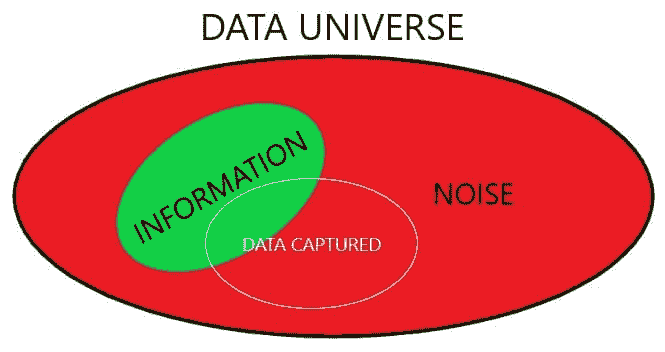
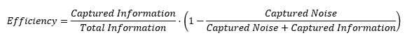
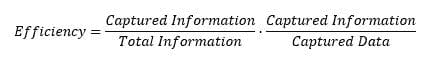
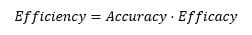
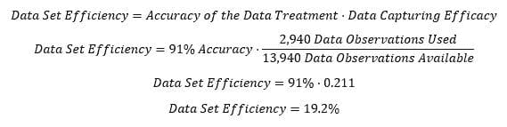
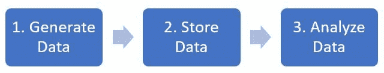

# 如何捕获数据以产生商业影响

> 原文：[`www.kdnuggets.com/2019/03/capture-data-make-business-impact.html`](https://www.kdnuggets.com/2019/03/capture-data-make-business-impact.html)

 评论

**作者 [Ramon Serrallonga](https://www.linkedin.com/in/ramonserrallonga/)**

每一个需要通过数据驱动决策来解决的商业挑战背后都有一个数据宇宙。这个数据宇宙是指与商业挑战相关的、可以被捕获的数据集合。

* * *

## 我们的前三大课程推荐

 1\. [谷歌网络安全证书](https://www.kdnuggets.com/google-cybersecurity) - 快速开启网络安全职业生涯

 2\. [谷歌数据分析专业证书](https://www.kdnuggets.com/google-data-analytics) - 提升你的数据分析能力

 3\. [谷歌 IT 支持专业证书](https://www.kdnuggets.com/google-itsupport) - 支持你的组织 IT

* * *

数据宇宙由信息和噪声组成：信息是可以转化为知识的数据；噪声是无法提取出知识的数据（当然，噪声数据也可以被处理并导致“发现”，这些发现是虚假的知识，并不真正有用）。需要注意的是，数据是否为噪声或信息取决于讨论中的商业挑战。换句话说，相同的数据在一个商业案例中可能是噪声，在另一个商业案例中则可能是信息。

还值得一提的是，没有人会故意收集噪声数据，即噪声数据是无意中被使用的。原因是，区分噪声和信息在某些情况下可能很简单，但在其他情况下则可能非常困难。

一个例子很好地说明了这一点。

在文章 *[Analítica Predictiva en La Liga Santander](https://www.linkedin.com/pulse/anal%C3%ADtica-predictiva-en-la-liga-santander-%E5%B8%AD%E6%B0%B8%E5%98%89-ramon-serrallonga/)* 中，处方分析被应用于西班牙主要足球联赛中以进行更高的分类。考虑到马达加斯加冰淇淋消费的历史数据集：显然，这些数据在体育案例中没有任何相关性，因此被视为噪声。但请注意，只有从 1995 年起的数据被使用。实际上，自 1975 年以来就有数据。那么为什么没有使用完整记录？在 1995-1996 赛季，西班牙采纳了每场胜利给予 3 分而不是仅 2 分的规则。进行了一项 [Chow 检验](https://en.wikipedia.org/wiki/Chow_test) 来查看这是否影响了球队的表现。结果测试为正。因此，1975 年至 1994 年的数据被视为噪声，而不是信息。在这种情况下，注意到这一点需要对相关领域有深入的了解（也有一点运气）。

捕获噪声有一个副作用：我们存储的噪声越多，越难在捕获的数据中找到信息。这就像在干草堆（噪声）中找针（信息）。即使我们可以很容易区分针和草，但如果针被大量的草包围，也可能很难识别。大数据的经验法则是尽可能多地存储数据，并且存储时间尽可能长，这将是一个错误的朋友。

如果我们引入一个指标来量化我们数据捕获工作的效率，它应该遵循这两个规则：

1.  捕获的信息越多，我们的效率就越高。

1.  捕获的噪声越少，我们的效率就越高。

所以，写成公式可能是这样的：

重新排列术语：

我们可以同意（1）捕获的信息越多，我们的数据处理就越准确，（2）捕获的噪声越少，我们的数据捕获努力就越有效。代入这些术语，方程式将如下：

在所有捕获的数据完全是信息的最佳情况下，*效率*的值将为 1。当捕获一些信息和一些噪声时，值将在 0 和 1 之间。令人有趣的是，*效率*趋向于 0，即使所有信息都包含在数据宇宙中，我们试图捕获所有数据时。

继续我们的示例 *[La Liga Santander 中的预测分析](https://www.linkedin.com/pulse/anal%C3%ADtica-predictiva-en-la-liga-santander-%E5%B8%AD%E6%B0%B8%E5%98%89-ramon-serrallonga/)*，我们现在可以计算所使用数据集的效率。模型的整体准确率为 91%。我们可以将这个值视为捕获信息的百分比。另一方面，我们可以确定我们使用了哪些数据进行处理。因此，我们可以按如下方式计算：

现在我们有了效率的定义，我们可以引入一个新概念，智能数据。在物联网中，智能数据通常被描述为来自智能传感器的数据。一些人将其定义为经过清理、过滤和准备分析的大数据。对于“智能数据”没有统一的定义。但我想将“智能数据”定义为高效数据。效率越高，数据就越智能。无论数据的来源或清理过程如何，数据的最高效率（或“智能”）为 100%。

我们如何提高数据捕获的效率，并仅存储智能数据？

通常情况下，大数据计划被视为技术上的顺序。每个任务都是独立的，并且按照顺序进行，找到解决业务挑战的洞察是最后一个任务。

如果各部分之间缺乏良好的沟通，生成的所有数据不一定都能转化为信息，这会降低*准确性*；存储的数据也不一定都能转化为信息，这会降低*效率*。这样，从数据中发现洞察就变得困难了，正如[高德纳](https://www.linkedin.com/company/gartner/)所报告的，[这导致了大数据项目 60-85%的失败率](https://twitter.com/nheudecker/status/928739138169221120)。

为了优化数据捕获，任何大数据计划必须是一个由业务需求指导的迭代过程。不同的团队必须紧密沟通和合作，以迭代的方式围绕业务挑战开发解决方案。尽早引入分析团队，以帮助 IoT 团队以数据将被使用的方式捕获数据。将现有数据中的信息与噪音分开，以提高*效率*。捕获分析团队认为无法实现、IoT 团队认为不相关的数据，以提高*准确性*。

通常说数据科学家将 80%的时间花在清理数据上，仅 20%用于分析数据。通过有效的数据捕获，智能数据可以改变这种情况，使数据科学家仅花费 20%的时间来清理数据，80%的时间用于获得真正对业务有影响的洞察。

**简介**：[Ramon Serrallonga](https://www.linkedin.com/in/ramonserrallonga/)是 Cadifornia 的首席数据官，ESADE 商学院的学术助理，以及 EAE 商学院的讲师。他是一名经济学家，法律硕士，MBA，他的职业生涯在商业和技术的交汇点上发展。

**资源：**

+   [在线和基于网络的：分析、数据挖掘、数据科学、机器学习教育](https://www.kdnuggets.com/education/online.html)

+   [分析、数据科学、数据挖掘和机器学习的软件](https://www.kdnuggets.com/software/index.html)

**相关：**

+   [克服对生产性分析的怀疑](https://www.kdnuggets.com/2019/03/overcoming-distrust-path-productive-analytics.html)

+   [确保你在大数据领域的未来](https://www.kdnuggets.com/2019/03/ntu-online-mba-data-analytics.html)

+   [关于 AI、分析、大数据、数据科学、机器学习的热门博客 - 更新](https://www.kdnuggets.com/2019/01/active-blogs-ai-analytics-data-science.html)

### 更多相关主题

+   [从数据分析师到数据战略师：产生影响的职业路径](https://www.kdnuggets.com/2023/05/data-analyst-data-strategist-career-path-making-impact.html)

+   [如何利用数据可视化为工作报告增添影响力…](https://www.kdnuggets.com/2022/08/data-visualization-add-impact-work-reports-presentations.html)

+   [IMPACT 2022: 数据可观测性峰会，将于 10 月 25-26 日举行](https://www.kdnuggets.com/2022/09/monte-carlo-impact-2022-data-observability-summit.html)

+   [IMPACT: 数据可观测性峰会将于 11 月 8 日重返](https://www.kdnuggets.com/2023/10/monte-carlo-impact-the-data-observability-summit-is-back)

+   [Monte Carlo 启动 IMPACT 2023，数据与 AI 先驱的主题演讲](https://www.kdnuggets.com/2023/11/monte-carlo-is-kicking-off-impact-2023-keynotes-from-data-ai-pioneers)

+   [基准率谬误及其对数据科学的影响](https://www.kdnuggets.com/2023/04/base-rate-fallacy-impact-data-science.html)
