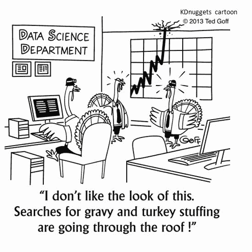

# 卡通：感恩节的数据科学

> 原文：[`www.kdnuggets.com/2021/11/cartoon-data-science-thanksgiving.html`](https://www.kdnuggets.com/2021/11/cartoon-data-science-thanksgiving.html)

为了庆祝美国的感恩节，我们重新审视了经典的 KDnuggets 感恩节卡通，探讨了从数据趋势中可以预测什么？

> *土耳其* 数据科学家：“我不喜欢这个样子。”
> 
> “对肉汁和火鸡填料的搜索量正在飙升！”

这里还有其他的 KDnuggets AI、大数据、数据挖掘和数据科学卡通。

以及标记为 **卡通** 的 KDnuggets 帖子。

还可以查看其他最近的 KDnuggets 卡通：

+   [卡通：云约会](https://www.kdnuggets.com/2020/10/cartoon-cloud-dating.html)

+   [我有一个关于……的笑话](https://www.kdnuggets.com/2020/08/joke-about.html)

+   [卡通：最糟糕的远程医疗？](https://www.kdnuggets.com/2020/05/cartoon-worst-telemedicine.html)

+   [卡通：AI 对新冠病毒的理解](https://www.kdnuggets.com/2020/04/cartoon-ai-coronavirus.html)

+   卡通：教 AI 伦理

+   [KDnuggets 卡通在英语教材中？](https://www.kdnuggets.com/2019/12/kdnuggets-cartoon-textbook.html)

+   [卡通：无监督机器学习？](https://www.kdnuggets.com/2019/09/cartoon-unsupervised-machine-learning.html)

+   卡通：AI 与三月疯狂

+   卡通：这就是你做区块链的方式吗？

+   卡通：2050 年的劳动节

+   卡通：机器学习去度假

+   卡通：数据科学家是 21 世纪最性感的工作，直到……

+   卡通：数据科学与宗教有何不同？

+   卡通：FIFA 世界杯足球与机器学习

+   卡通：GDPR 对隐私的首次影响

+   卡通：AI 掌握了三月疯狂

+   卡通：2118 年的机器学习问题

+   卡通：AI 在家：智能设备还能走多远？

+   卡通：AI 和技术如何改变圣诞节？

### 更多相关话题

+   [停止学习数据科学以寻找目标，并找寻目标去……](https://www.kdnuggets.com/2021/12/stop-learning-data-science-find-purpose.html)

+   数据科学基础：你需要知道的 10 项必备技能

+   [KDnuggets™ 新闻 22:n06，2 月 9 日：数据科学编程…](https://www.kdnuggets.com/2022/n06.html)

+   [数据科学定义幽默：奇特名言的集合…](https://www.kdnuggets.com/2022/02/data-science-definition-humor.html)

+   [学习 5 个关键数据科学技能的 5 个数据科学项目](https://www.kdnuggets.com/2022/03/5-data-science-projects-learn-5-critical-data-science-skills.html)

+   [KDnuggets 新闻，11 月 30 日：什么是切比雪夫定理及其应用…](https://www.kdnuggets.com/2022/n46.html)
