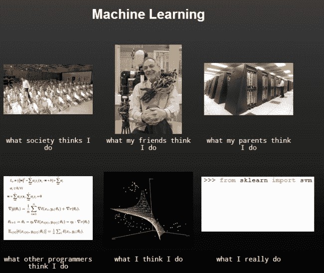

# 漫画：机器学习 – 他们认为我做的事情

> 原文：[`www.kdnuggets.com/2017/04/cartoon-machine-learning-what-they-think.html`](https://www.kdnuggets.com/2017/04/cartoon-machine-learning-what-they-think.html)

这幅漫画由[哈里森·金斯利](https://twitter.com/sentdex)呈现了对机器学习的不同看法：

+   社会认为我做的事情

+   我的朋友认为我做的事情

+   我父母认为我做的事情

+   其他程序员认为我做的事情

+   我认为我做的事情

+   我实际上做的事情（来自 `sklearn import svm`）

[原始](https://pythonprogramming.net/machine-learning-python-sklearn-intro/)。获得许可转载。

* * *

## 我们的前三个课程推荐

 1\. [Google 网络安全证书](https://www.kdnuggets.com/google-cybersecurity) - 快速进入网络安全职业生涯。

 2\. [Google 数据分析专业证书](https://www.kdnuggets.com/google-data-analytics) - 提升您的数据分析技能

 3\. [Google IT 支持专业证书](https://www.kdnuggets.com/google-itsupport) - 支持您的组织 IT

* * *

### 更多相关主题

+   [停止学习数据科学以寻找目标，并寻找目标以…](https://www.kdnuggets.com/2021/12/stop-learning-data-science-find-purpose.html)

+   [数据科学学习统计的顶级资源](https://www.kdnuggets.com/2021/12/springboard-top-resources-learn-data-science-statistics.html)

+   [一个 90 亿美元的人工智能失败案例，详细分析](https://www.kdnuggets.com/2021/12/9b-ai-failure-examined.html)

+   [建立一个坚实的数据团队](https://www.kdnuggets.com/2021/12/build-solid-data-team.html)

+   [使用管道编写干净的 Python 代码](https://www.kdnuggets.com/2021/12/write-clean-python-code-pipes.html)

+   [成功数据科学家的 5 个特征](https://www.kdnuggets.com/2021/12/5-characteristics-successful-data-scientist.html)
