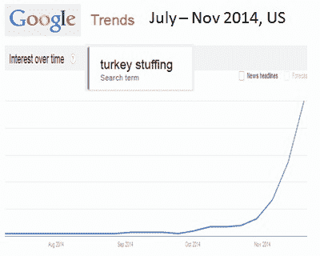

# 卡通：感恩节、大数据和土耳其数据科学。

> 原文：[`www.kdnuggets.com/2018/11/cartoon-thanksgiving-turkey-data-science.html`](https://www.kdnuggets.com/2018/11/cartoon-thanksgiving-turkey-data-science.html)

 评论为了庆祝感恩节，我们回顾了一幅经典的 KDnuggets 感恩节卡通，这幅卡通探讨了从大数据中可以预测什么？

> *土耳其* 数据科学家：“我不喜欢这个样子。”
> 
> 对肉汁和土耳其 stuffing 的搜索量正在飙升！

作为生活模仿艺术的进一步例子，实际的 Google Trends 图表显示的["土耳其 stuffing" 在美国](https://www.google.com/trends/explore#q=turkey%20stuffing&geo=US&date=7%2F2014%205m&cmpt=date)与卡通图非常相似！（不过，只有当我们选择美国区域时，否则我们会发现十月份有一个早期的高峰，这反映了加拿大的感恩节）。

这里还有其他 KDnuggets 大数据、数据挖掘和数据科学卡通。

和 KDnuggets 帖子标记为**卡通**。

另见其他近期的 KDnuggets 卡通：

+   卡通：2050 年的劳动节

+   卡通：机器学习度假

+   卡通：数据科学家是 21 世纪最性感的职业，直到……

+   卡通：数据科学与宗教有何不同？

+   卡通：FIFA 世界杯足球与机器学习

+   卡通：GDPR 对隐私的首次影响

+   卡通：人工智能掌握了疯狂三月

+   卡通：2118 年的机器学习问题

+   卡通：家庭中的人工智能：智能设备能走多远？

+   卡通：人工智能和技术改变圣诞节？

+   卡通：感恩节、大数据和土耳其数据科学

+   卡通：人工智能还能从你的脸上猜测什么？

+   卡通：未来的机器学习课程

+   卡通：史上首个自驾深度学习烤架

+   卡通：数据之母

+   卡通：机器学习——他们认为我在做什么

+   卡通：浓缩咖啡与卡布奇诺之间的距离

+   漫画：税收、人工智能与人类

+   漫画：当 AI 掌握了 March Madness 会发生什么

+   因果关系还是相关性：用 xkcd 解释 Hill 标准

+   漫画：通过数据分析找到完美的情人节约会

+   漫画：当自动驾驶汽车+机器学习带你走得太远…

### 更多相关内容

+   [2022 年及未来的顶级 AI 和数据科学工具与技术](https://www.kdnuggets.com/2022/03/nvidia-0317-top-ai-data-science-tools-techniques-2022-beyond.html)

+   [与大数据的合作：工具和技术](https://www.kdnuggets.com/working-with-big-data-tools-and-techniques)

+   [如何每天处理 150 亿条日志，并将大查询保持在 1 秒内](https://www.kdnuggets.com/how-to-digest-15-billion-logs-per-day-and-keep-big-queries-within-1-second)

+   [SQL 中的 Group By 和 Partition By 场景：何时及如何结合数据…](https://www.kdnuggets.com/sql-group-by-and-partition-by-scenarios-when-and-how-to-combine-data-in-data-science)

+   [学习数据科学和商业分析以推动创新和增长](https://www.kdnuggets.com/2023/08/learn-data-science-business-analytics-drive-innovation-growth.html)

+   [停止学习数据科学以寻找目的，并以寻找目的来…](https://www.kdnuggets.com/2021/12/stop-learning-data-science-find-purpose.html)
