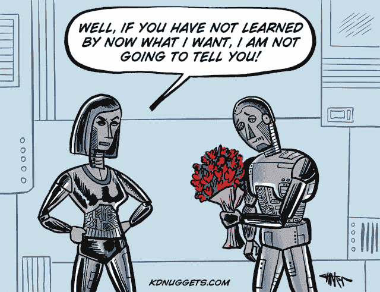

# 漫画：2118 年的机器学习问题

> 原文：[`www.kdnuggets.com/2018/02/cartoon-valentine-machine-learning.html`](https://www.kdnuggets.com/2018/02/cartoon-valentine-machine-learning.html)

为了情人节，新的 KDnuggets 漫画展示了机器学习在 2118 年可能面临的一些问题。

> 女性机器人：好吧，如果你现在还没**学会**我想要什么，我是不会告诉你的！

这幅漫画由 [Jon Carter](http://www.cartertoons.com) 精心绘制。

这里还有其他 KDnuggets 情人节 漫画

+   **漫画：通过数据分析找到的完美情人节约会**, 2017

+   **漫画：数据科学家为情人节许下的 3 个愿望**, 2015

+   **漫画：数据科学家情人节预测**, 2014。

+   **数据科学家情人节调整**, 2013

另请参阅其他近期 KDnuggets 漫画：

+   漫画：家中的人工智能：智能设备能走多远？

+   漫画：人工智能和技术正在改变圣诞节？

+   漫画：感恩节、大数据与火鸡数据科学

+   漫画：人工智能还能从你的脸上猜到什么？

+   漫画：未来的机器学习课堂

+   漫画：史上第一款自驾深度学习烤架

+   漫画：数据之母

+   漫画：机器学习——他们认为我在做什么

+   漫画：浓缩咖啡和卡布奇诺之间的距离

+   漫画：税收、人工智能与人类

+   漫画：当人工智能掌握疯狂三月时会发生什么

+   因果关系还是相关性：用 xkcd 解释 Hill 标准

+   漫画：通过数据分析找到的完美情人节约会

+   漫画：当自驾车 + 机器学习把你带得太远……

+   有趣地看待大数据和数据科学

+   漫画：感恩节、大数据与火鸡数据科学。

+   漫画：恐怖的大数据

+   漫画：机器人时代的劳动节

+   漫画：数据科学家——21 世纪最性感的职业，直到……

+   漫画：让数据再次伟大

+   漫画：Facebook 数据科学实验与猫

+   漫画：自动化过度

+   完美的数据科学面试秘诀

+   漫画：公民数据科学家在工作中

+   数据科学家情人节特别集

+   漫画：更深层次的深度学习

### 更多相关内容

+   [识别机器学习可解决问题的 4 个因素](https://www.kdnuggets.com/2022/04/4-factors-identify-machine-learning-solvable-problems.html)

+   [使用基础和现代算法解决计算机科学问题…](https://www.kdnuggets.com/2023/11/packt-tackle-computer-science-problems-fundamental-modern-algorithms-machine-learning)

+   [更多分类问题的性能评估指标]（https://www.kdnuggets.com/2020/04/performance-evaluation-metrics-classification.html）

+   [常见数据问题（及解决方案）](https://www.kdnuggets.com/2022/02/common-data-problems-solutions.html)

+   [解决 5 个复杂的 SQL 问题：棘手查询解析](https://www.kdnuggets.com/2022/07/5-hardest-things-sql.html)

+   [数据科学项目助你解决现实世界问题](https://www.kdnuggets.com/2022/11/data-science-projects-help-solve-real-world-problems.html)
