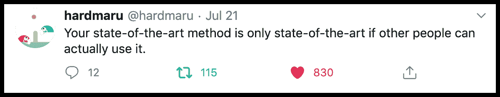
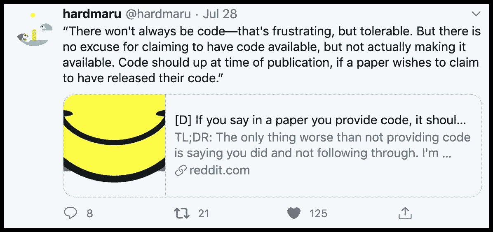
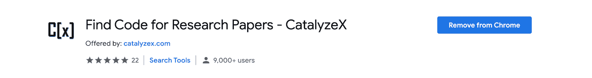
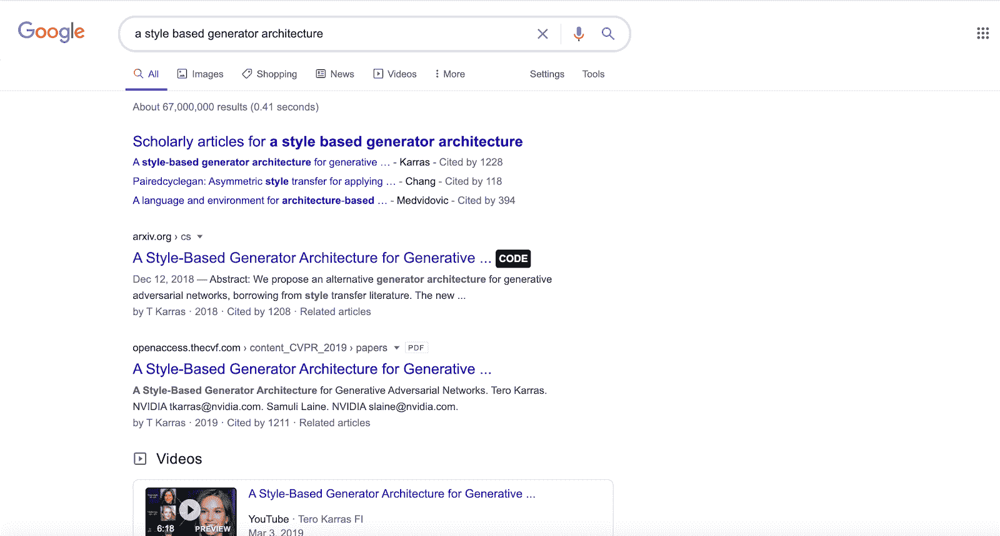
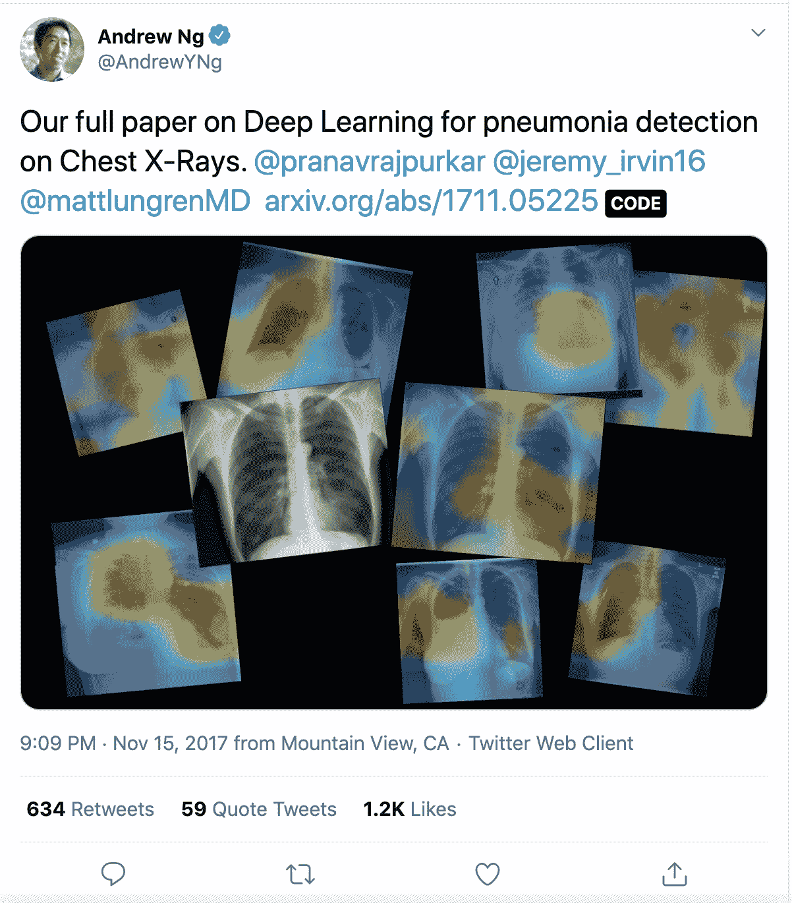
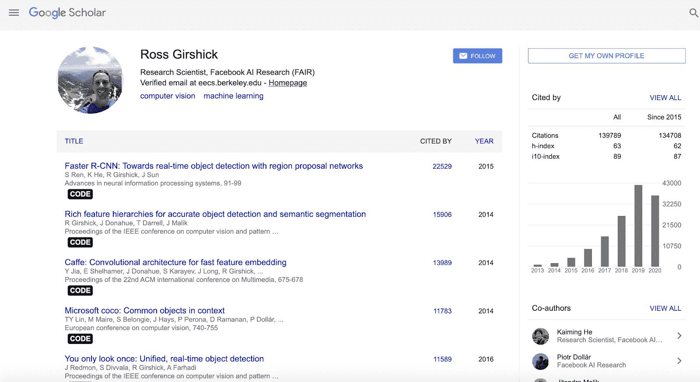
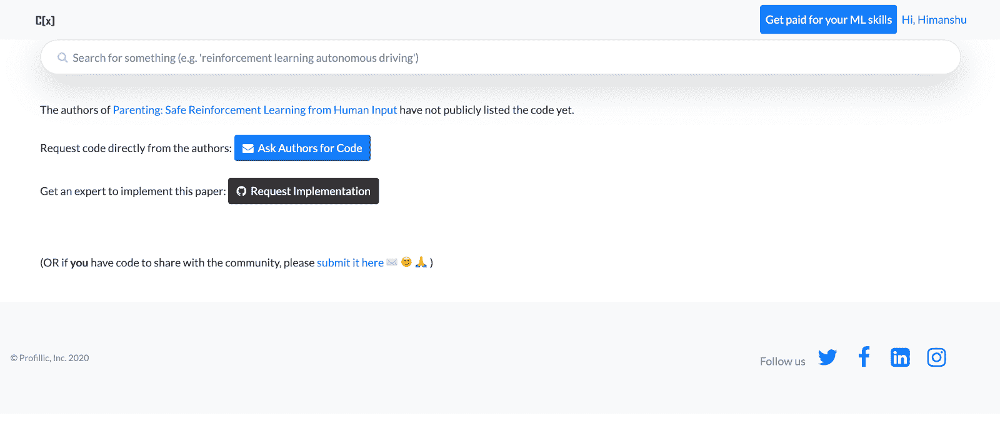
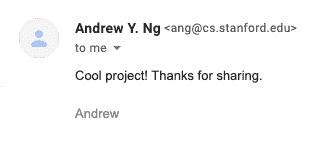

# CatalyzeX：机器学习工程师和研究人员必备的浏览器扩展

> 原文：[`www.kdnuggets.com/2021/01/catalyzex-browser-extension-machine-learning.html`](https://www.kdnuggets.com/2021/01/catalyzex-browser-extension-machine-learning.html)

评论

**由 [Himanshu Ragtah](https://www.linkedin.com/in/himanshuragtah)，CatalyzeX**

***Andrew Ng 喜欢这个，你可能也会喜欢！***

代码是机器学习研究中的基本构建块之一。工程师们已经习惯于发布代码以与社区分享，现在研究人员在线发布代码也正变得越来越普遍。越来越多的机器学习会议正在将其作为要求。

正如 Google Brain 的研究科学家 David Ha (@hardmaru) 所说：

然而，即使代码实际上是可用的，你仍然常常需要手动在 Github 上搜索或者通过各种网站和博客进行搜索。

一款新的浏览器扩展来自 [**CatalyzeX**](http://catalyzex.com/?ref=hackernoon.com)，简化了整个过程，并自动显示你可能在浏览网络时遇到的任何机器学习/人工智能论文的开源代码——在 Google、Arxiv、Twitter、Scholar 等网站上。

该扩展目前适用于 [**Chrome**](https://chrome.google.com/webstore/detail/find-code-for-research-pa/aikkeehnlfpamidigaffhfmgbkdeheil?ref=hackernoon.com) 和 [**Firefox**](https://addons.mozilla.org/en-US/firefox/addon/code-finder-catalyzex/?ref=hackernoon.com)。

你会看到**[代码]**按钮会自动出现在页面内的任何实现处。

点击任何代码链接以轻松跳转到代码并进行探索。

安装浏览器扩展的链接： [**Chrome**](https://chrome.google.com/webstore/detail/find-code-for-research-pa/aikkeehnlfpamidigaffhfmgbkdeheil?ref=hackernoon.com) | [**Firefox**](https://addons.mozilla.org/en-US/firefox/addon/code-finder-catalyzex/?ref=hackernoon.com)

### 如果代码尚不可用怎么办？

如果由于某种原因代码不可用，你可以点击 ‘**未找到代码：请求作者/专家**’。

你将被重定向到这里：

‘**向作者请求代码**’ 允许你向作者直接请求代码——如果他们愿意亲自与您分享。

有时作者可能选择不公开代码。

在这种情况下，随时可以点击 ‘**请求实现**’，并可以请求主题专家来实现论文。

**附言——该扩展的创建者联系了 Andrew Ng，他也很喜欢！**

在这里安装 Chrome 扩展程序：[`chrome.google.com/webstore/detail/find-code-for-research-pa/aikkeehnlfpamidigaffhfmgbkdeheil`](https://chrome.google.com/webstore/detail/find-code-for-research-pa/aikkeehnlfpamidigaffhfmgbkdeheil?ref=hackernoon.com)

在这里安装 Firefox 扩展程序：[`addons.mozilla.org/en-US/firefox/addon/code-finder-catalyzex/`](https://addons.mozilla.org/en-US/firefox/addon/code-finder-catalyzex/?ref=hackernoon.com)

也发布在：https://himanshuragtah.medium.com/catalyzex-a-must-have-browser-extension-for-machine-learning-engineers-and-researchers-690b64ea3936

**个人简介：[Himanshu Ragtah](https://www.linkedin.com/in/himanshuragtah)** (**[@himanshu_ragtah](https://twitter.com/himanshu_ragtah)**) 曾在特斯拉工作——在那里，他负责为 Tesla PowerWall、PowerPack 和 SuperCharger 自动化制造测试。他还是 TEDx 演讲者，讲述了由于 AI（尤其是针对女性和少数群体）的偏见以及智能交通方面的话题。此外，他还是 SXSW 评委、Kairos Society 成员、Hackernoon 顶级出版者，早期，他还与康奈尔大学、普林斯顿大学和密歇根大学等学校共同创办了 SpaceX Hyperloop 团队，其原型在国际上排名前十，并曾被 CNN、The Verge、Wired 和 CNBC 报道。Himanshu 是 Kairos Society 的成员——这是一个精英创始人俱乐部，识别社会最紧迫的挑战并制定新的解决方案（导师包括理查德·布兰森爵士、比尔·克林顿和 CIA 的海登）。他曾获得 NSERC（加拿大 NSF 相当于）的工业本科生研究奖，开源了一个为美国退伍军人假肢的 3D 打印模型，领导了一个无人机机器人团队，并担任顶级机器人比赛的评委（SXSW、PennApps、Lego League）。最后，Himanshu 还帮助设计了一个创新的电子音乐乐器，该乐器曾在 CBC 和 DigitalTrends 上介绍。

[原文](https://hackernoon.com/catalyzex-a-must-have-browser-extension-for-machine-learning-engineers-and-researchers-a4q3w2t)。经许可转载。

**相关内容：**

+   2021 年你应该了解的所有机器学习算法

+   AI、分析、机器学习、数据科学、深度学习研究的主要进展和 2021 年的关键趋势

+   2020 年：充满惊人的 AI 论文的一年——回顾

* * *

## 我们的前三大课程推荐

 1\. [谷歌网络安全证书](https://www.kdnuggets.com/google-cybersecurity) - 快速进入网络安全职业生涯。

 2\. [谷歌数据分析专业证书](https://www.kdnuggets.com/google-data-analytics) - 提升你的数据分析技能

 3\. [谷歌 IT 支持专业证书](https://www.kdnuggets.com/google-itsupport) - 支持你的组织进行 IT 工作

* * *

### 更多相关内容

+   [Web LLM：将 LLM 聊天机器人带到浏览器](https://www.kdnuggets.com/2023/05/webllm-bring-llm-chatbots-browser.html)

+   [AgentGPT：浏览器中的自主 AI 代理](https://www.kdnuggets.com/2023/06/agentgpt-autonomous-ai-agents-browser.html)

+   [用 AI 阅读思想：研究人员将脑波翻译为图像](https://www.kdnuggets.com/2023/03/reading-minds-ai-researchers-translate-brain-waves-images.html)

+   [高保真合成数据适用于数据工程师和数据科学家](https://www.kdnuggets.com/2022/tonic-high-fidelity-synthetic-data-engineers-scientists-alike.html)

+   [如何获得机器学习职位：来自 Meta、Google Brain 和 SAP 工程师的建议](https://www.kdnuggets.com/2022/08/corise-land-ml-job-advice-engineers-meta-google-brain-sap.html)

+   [数据科学家和数据工程师如何协同工作？](https://www.kdnuggets.com/2022/08/data-scientists-data-engineers-work-together.html)
