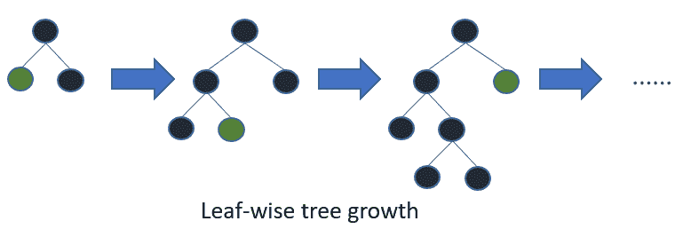
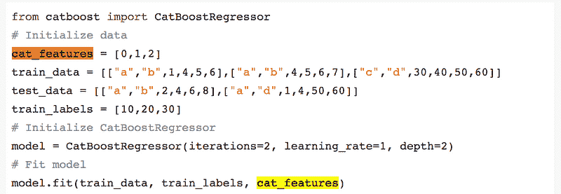
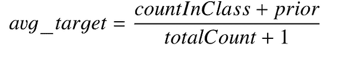
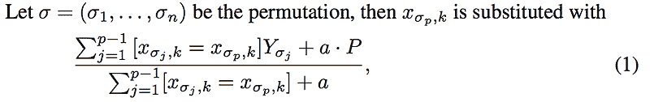
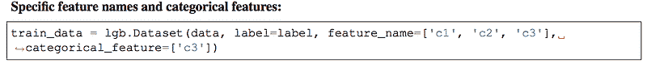
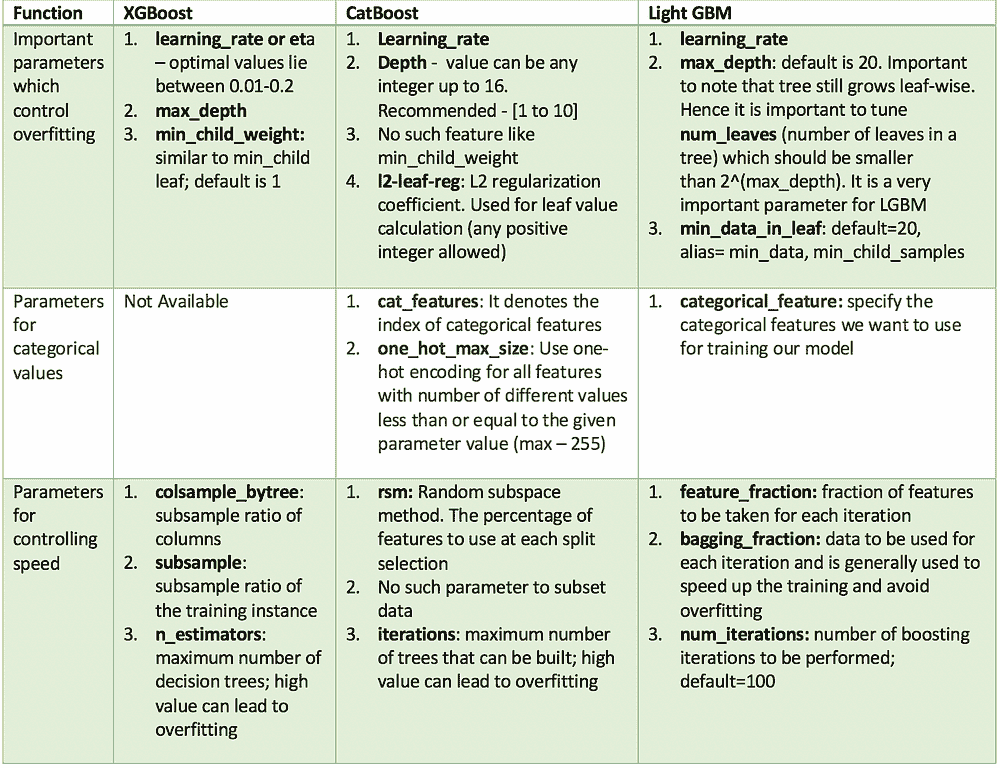
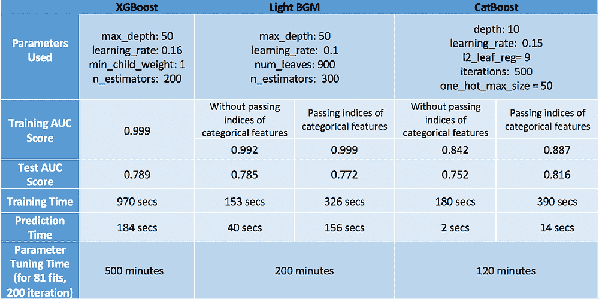

# CatBoost 与 Light GBM 与 XGBoost

> 原文：[`www.kdnuggets.com/2018/03/catboost-vs-light-gbm-vs-xgboost.html`](https://www.kdnuggets.com/2018/03/catboost-vs-light-gbm-vs-xgboost.html)

评论

**由 [Alvira Swalin](https://www.linkedin.com/in/alvira-swalin)，旧金山大学提供**

我最近参加了这个 Kaggle 比赛（斯坦福大学的 WIDS Datathon），通过使用各种提升算法，我成功进入了前十名。从那时起，我对每个模型的细节非常感兴趣，包括参数调优、优缺点，因此决定写这篇博客。尽管神经网络最近重新崛起并受到欢迎，我还是专注于提升算法，因为在有限的训练数据、较短的训练时间和较少的参数调优经验的情况下，它们仍然更有用。

由于 XGBoost（常被称为 GBM 杀手）在机器学习界已经存在较长时间，并有大量专门的文章，因此这篇文章将更多关注 CatBoost 和 LGBM。以下是我们将涵盖的主题-

+   结构差异

+   每种算法对分类变量的处理

+   理解参数

+   数据集上的实现

+   每种算法的性能

### LightGBM 和 XGBoost 的结构差异

LightGBM 使用一种新颖的基于梯度的单侧抽样（GOSS）技术来筛选数据实例，以找到分裂值，而 XGBoost 使用预排序算法和基于直方图的算法来计算最佳分裂。这里的实例指的是观测/样本。

首先让我们了解预排序分裂的工作原理-

+   对每个节点，遍历所有特征

+   对每个特征，根据特征值对实例进行排序

+   使用线性扫描来决定沿该特征基础上的最佳分裂方案 [信息增益](https://en.wikipedia.org/wiki/Information_gain_ratio)

+   在所有特征中选择最佳分裂方案

简单来说，基于直方图的算法将特征的所有数据点分到离散的箱中，并使用这些箱来找到直方图的分裂值。虽然它在训练速度上比预排序算法高效，后者枚举了预排序特征值上的所有可能分裂点，但在速度方面仍落后于 GOSS。

**那么 GOSS 方法的高效性体现在哪里？** 在 AdaBoost 中，样本权重是样本重要性的良好指标。然而，在梯度提升决策树（GBDT）中，没有原生的样本权重，因此不能直接应用为 AdaBoost 提出的抽样方法。这就引出了基于梯度的抽样。

> 梯度代表损失函数切线的斜率，因此逻辑上如果数据点的梯度在某种意义上较大，这些点对找到最佳分裂点是重要的，因为它们的误差较高

GOSS 保留所有具有大梯度的实例，并对具有小梯度的实例进行随机采样。例如，假设我有 50 万行数据，其中 1 万行具有较高的梯度。因此，我的算法将选择（1 万行高梯度 + 剩余 49 万行中的 x% 随机选择）。假设 x 为 10%，则选择的总行数为 59 万，基于此值找到分裂值。

> 在这里的基本假设是，具有较小梯度的训练实例的训练误差较小，且已经过充分训练。
> 
> 为了保持相同的数据分布，在计算信息增益时，GOSS 为小梯度的数据实例引入了一个常数乘数。因此，GOSS 在减少数据实例数量和保持学习决策树的准确性之间达到了良好的平衡。

在 LGBM 中，具有较高梯度/误差的叶子会进一步生长。

### 每个模型如何处理类别变量？

**CatBoost**

CatBoost 具有提供类别列索引的灵活性，以便可以使用 one_hot_max_size 进行独热编码（对于所有不同值数量小于或等于给定参数值的特征使用独热编码）。

如果在 cat_features 参数中不传递任何内容，CatBoost 会将所有列视为数值变量。

> **注意：如果在 cat_features 中没有提供字符串值的列，CatBoost 会抛出错误。此外，具有默认 int 类型的列默认被视为数值型，必须在 cat_features 中指定，以使算法将其视为类别型。**

对于唯一类别数大于 one_hot_max_size 的剩余类别列，CatBoost 使用一种高效的编码方法，该方法类似于均值编码，但减少了过拟合。过程如下——

1.  将输入观察值集合随机排列。生成多个随机排列。

1.  将标签值从浮点数或类别转换为整数

1.  所有类别特征值都使用以下公式转换为数值：

其中，**CountInClass** 表示当前类别特征值为“1”的标签值出现的次数，**Prior** 是分子部分的初始值，由起始参数确定。**TotalCount** 是具有当前类别特征值的对象（直到当前对象）的总数。

数学上，这可以通过以下方程表示：

**LightGBM**

与 CatBoost 相似，LightGBM 也可以通过输入特征名称来处理分类特征。它不会转换为独热编码，比独热编码快得多。LGBM 使用特殊算法来寻找分类特征的分裂值 [[Link](http://www.csiss.org/SPACE/workshops/2004/SAC/files/fisher.pdf)]。

> **注意：在为 LGBM 构建数据集之前，您应该将分类特征转换为 int 类型。即使通过 categorical_feature 参数传递，LGBM 也不接受字符串值。**

**XGBoost**

与 CatBoost 或 LGBM 不同，XGBoost 无法自行处理分类特征，它只接受类似于随机森林的数值值。因此，在将分类数据提供给 XGBoost 之前，必须进行各种编码，如标签编码、均值编码或独热编码。

### 超参数的相似性

所有这些模型都有很多参数需要调整，但我们只会涵盖重要的参数。以下是这些参数按功能划分的列表，以及它们在不同模型中的对应关系。

### 数据集上的实现

我使用了 Kaggle 的 [数据集](https://www.kaggle.com/usdot/flight-delays/data)，该数据集包含 2015 年的航班延误数据，因为它同时包含分类特征和数值特征。该数据集大约有 500 万行，非常适合评估每种提升模型的速度和准确性。我将使用该数据集的 10% 子集 ~ 50 万行。

以下是用于建模的特征：

+   **月份、日期、星期几**：数据类型 int

+   **航空公司和航班号**：数据类型 int

+   **起始机场** 和 **目的地机场**：数据类型字符串

+   **出发时间**：数据类型 float

+   **到达延迟**：这是目标变量，转化为布尔变量，表示延迟超过 10 分钟

+   **距离和飞行时间**：数据类型 float

**XGBoost**

**Light GBM**

**CatBoost**

在调整 CatBoost 的参数时，传递分类特征的索引比较困难。因此，我在没有传递分类特征的情况下调整了参数，并评估了两个模型——一个有分类特征，另一个没有。我单独调整了 one_hot_max_size，因为它不会影响其他参数。

### 结果

### 结尾说明

为了评估模型，我们应该关注模型在速度和准确性方面的表现。

鉴于这一点，CatBoost 凭借在测试集上的最高准确率（0.816）、最小过拟合（训练和测试准确率接近）以及最短的预测时间和调优时间脱颖而出。但这仅仅是因为我们考虑了分类变量并调整了 one_hot_max_size。如果我们不利用 CatBoost 的这些特性，它的表现将变得最差，准确率仅为 0.752。因此，我们了解到，CatBoost 仅在数据中存在分类变量并且我们正确调整它们时表现良好。

我们的下一个表演者是 XGBoost，它通常表现良好。即使在忽略了数据中分类变量的事实（我们已将其转换为数值形式供其使用）之后，它的准确性仍然与 CatBoost 相当。然而，XGBoost 唯一的问题是速度太慢。调整其参数非常令人沮丧（我花了 6 小时运行 GridSearchCV——非常糟糕的主意！）。更好的方法是分别调整参数，而不是使用 GridSearchCV。查看这个[博客](https://www.analyticsvidhya.com/blog/2016/03/complete-guide-parameter-tuning-xgboost-with-codes-python/)文章，了解如何智能地调整参数。

最后，最后一名是 Light GBM。需要注意的是，当使用 cat_features 时，它在速度和准确性方面都表现不佳。我认为它表现不佳的原因是它对分类数据使用了某种改进的均值编码，这导致了过拟合（训练准确率相当高——0.999，相较于测试准确率）。但是，如果像 XGBoost 一样正常使用，它可以在比 XGBoost 快得多的速度下实现类似（如果不是更高的话）准确率（LGBM——0.785，XGBoost——0.789）。

最后，我必须说，这些观察结果适用于这个特定的数据集，可能对其他数据集无效。然而，一般来说，XGBoost 比其他两个算法都慢。

那你最喜欢哪个？请评论并说明原因。

任何反馈或改进建议都将非常感谢!

查看我的其他博客[在这里](https://medium.com/@aswalin)!

**资源**

1.  [`learningsys.org/nips17/assets/papers/paper_11.pdf`](http://learningsys.org/nips17/assets/papers/paper_11.pdf)

1.  [`papers.nips.cc/paper/6907-lightgbm-a-highly-efficient-gradient-boosting-decision-tree.pdf`](https://papers.nips.cc/paper/6907-lightgbm-a-highly-efficient-gradient-boosting-decision-tree.pdf)

1.  [`arxiv.org/pdf/1603.02754.pdf`](https://arxiv.org/pdf/1603.02754.pdf)

1.  [`github.com/Microsoft/LightGBM`](https://github.com/Microsoft/LightGBM)

1.  [`www.analyticsvidhya.com/blog/2017/06/which-algorithm-takes-the-crown-light-gbm-vs-xgboost/`](https://www.analyticsvidhya.com/blog/2017/06/which-algorithm-takes-the-crown-light-gbm-vs-xgboost/)

1.  [`stats.stackexchange.com/questions/307555/mathematical-differences-between-gbm-xgboost-lightgbm-catboost`](https://stats.stackexchange.com/questions/307555/mathematical-differences-between-gbm-xgboost-lightgbm-catboost)

**个人简介： [Alvira Swalin](https://www.linkedin.com/in/alvira-swalin)** ([**Medium**](https://medium.com/@aswalin)) 目前在 USF 攻读数据科学硕士学位，对机器学习与预测建模特别感兴趣。她是 Price (Fx) 的数据科学实习生。

[原文](https://towardsdatascience.com/catboost-vs-light-gbm-vs-xgboost-5f93620723db)。经许可转载。

**相关：**

+   TensorFlow 与 XGBoost 中的梯度提升

+   从基准测试快速机器学习算法中获得的经验教训

+   XGBoost：简明技术概述

* * *

## 我们的前三个课程推荐

 1\. [Google 网络安全证书](https://www.kdnuggets.com/google-cybersecurity) - 快速进入网络安全职业。

 2\. [Google 数据分析专业证书](https://www.kdnuggets.com/google-data-analytics) - 提升你的数据分析能力

 3\. [Google IT 支持专业证书](https://www.kdnuggets.com/google-itsupport) - 支持你组织的 IT

* * *

### 更多相关内容

+   [GBM 和 XGBoost 之间的区别是什么？](https://www.kdnuggets.com/wtf-is-the-difference-between-gbm-and-xgboost)

+   [CatBoost ML 为你的数据带来的 5 大优势](https://www.kdnuggets.com/2023/02/top-5-advantages-catboost-ml-brings-data-make-purr.html)

+   [如何加速 XGBoost 模型训练](https://www.kdnuggets.com/2021/12/speed-xgboost-model-training.html)

+   [XGBoost 的假设是什么？](https://www.kdnuggets.com/2022/08/assumptions-xgboost.html)

+   [调优 XGBoost 超参数](https://www.kdnuggets.com/2022/08/tuning-xgboost-hyperparameters.html)

+   [利用 XGBoost 进行时间序列预测](https://www.kdnuggets.com/2023/08/leveraging-xgboost-timeseries-forecasting.html)
