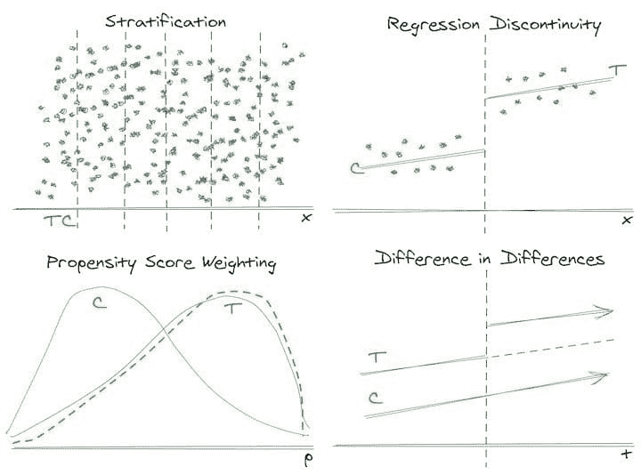
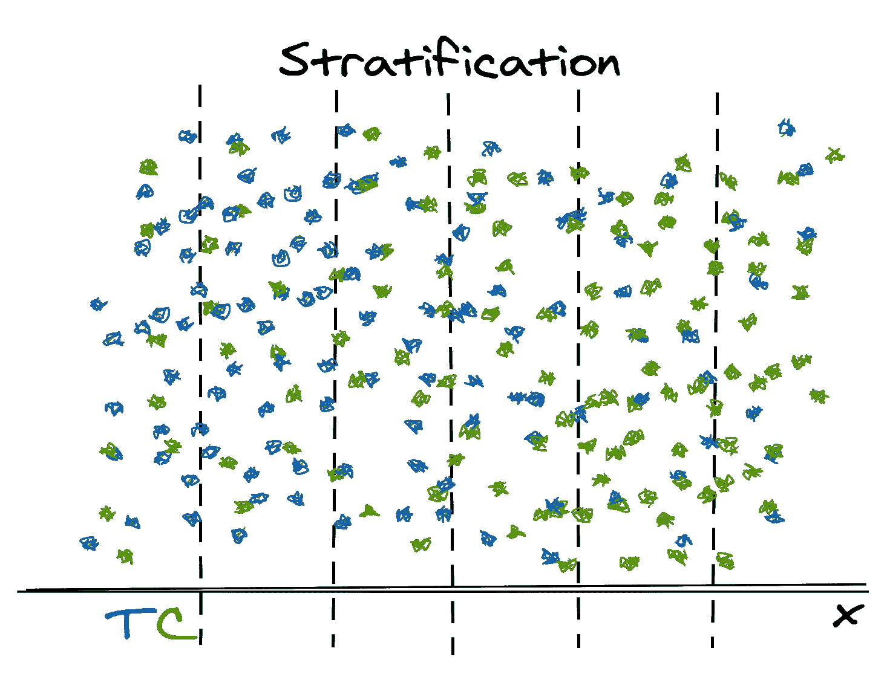
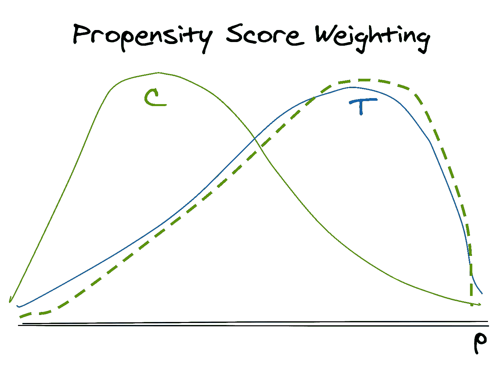
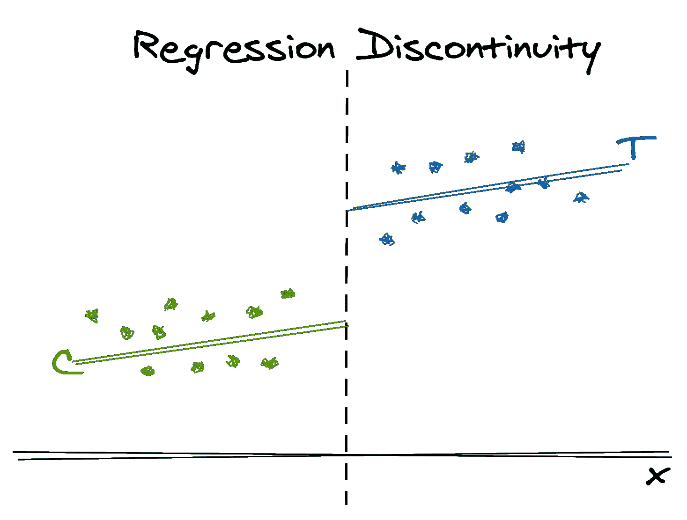

# 数据科学家和数据分析师必须了解：因果设计模式

> 原文：[`www.kdnuggets.com/2021/03/causal-design-patterns.html`](https://www.kdnuggets.com/2021/03/causal-design-patterns.html)

评论

**由 [Emily Riederer](https://twitter.com/EmilyRiederer)，Capital One 高级分析经理**。

* * *

## 我们的前三个课程推荐

 1\. [谷歌网络安全证书](https://www.kdnuggets.com/google-cybersecurity) - 快速进入网络安全职业。

 2\. [谷歌数据分析专业证书](https://www.kdnuggets.com/google-data-analytics) - 提升你的数据分析能力

 3\. [谷歌 IT 支持专业证书](https://www.kdnuggets.com/google-itsupport) - 支持你的组织的 IT

* * *

*因果推断方法的记忆插图，由 [Excalidraw](https://excalidraw.com/) 制作。*

软件工程师研究设计模式¹ 以帮助他们识别原型，考虑具有共同语言的方法，并重复使用经过验证的架构。同样，统计学有许多典型的分析，但这些框架往往被孤立在特定学科内，并被领域特定语言所遮蔽。这使得方法更难以发现，并隐藏了它们的普遍适用性。因此，来自这些领域之外的从业者可能很难识别他们面临的问题是否符合这些范式之一。

观察性因果推断就是其中一个领域。理解真实的因果（而非相关）效应，并从“发现”的历史数据（而非实验“产生”的数据）中推导意义和策略的需求几乎是普遍存在的，但方法分散在流行病学、经济学、政治科学等多个领域。

这篇文章旨在通过简要总结跨学科设计模式来打破一些障碍，这些模式用于从观察数据中测量因果效应，重点是其在行业中的潜在应用。对于每种方法，我提供了插图、方法概述、所需数据结构和关键假设的总结，以及一个假设的消费者零售示例。

因果推断是复杂的，做到这一点需要统计学和领域专业知识。与其提供在无数免费资源中已被巧妙描述的所有细节，这篇文章谦逊地旨在宣传这些方法，以便分析师能够将其纳入他们的思维索引中，并在遇到相关问题时进一步研究。

### 为什么在行业中需要因果推断？

经典的因果问题包括“吸烟是否导致癌症？”和“教育是否导致额外收入？”天真地，我们可能会比较接受处理（吸烟和教育）与未接受处理的结果（癌症或收入）。然而，选择吸烟或追求高等教育的事实会产生选择偏差；这些行为可能与其他因素（冒险精神、经济支持等）相关，这也会影响结果。

在行业中，企业希望知道其策略（如促销优惠）对客户行为的因果效应。当然，这里企业比上述例子有很大优势，因为分配到处理组（如，谁获得折扣码）的机制是*已知的*且*在其控制之下*。他们通常还拥有每个个体（客户）的更丰富的“处理前”行为数据，这可以帮助评估和修正偏差。

然而，这些优势并没有使因果推断变得不必要；如果有的话，它们只是使因果推断变得更可行和更相关。好的企业不会随机行动。例如，我们会向那些可能对我们公司感兴趣的客户进行营销，因此，他们即使没有营销也可能会感兴趣。在衡量效果时，好的业务是坏科学。由于我们的*处理*不是随机给予的，因此比较处理组和未处理组的*结果*会被混淆和偏向，使我们认为自己比实际情况更有效。

对此的一个解药是真正的实验，其中处理是*在*同质目标人群中随机分配的。实验，尤其是 A/B 测试，已成为行业数据科学的主流，那么观察性因果推断为什么仍然重要呢？

+   一些情况由于伦理、物流或声誉风险，你不能进行测试。

+   测试可能很昂贵。实施可能无效的政策有*直接成本*（如测试营销促销）、*实施成本*（如让技术团队实现新的展示）和*机会成本*（如保留对照组而不尽可能广泛地应用你希望是有利的策略）。²

+   随机实验比听起来要难！有时实验可能不会按计划进行，但将结果视为观察数据可能有助于挽回一些信息价值。

+   数据收集可能需要时间。我们可能希望在多年后阅读长期终点数据，比如客户保留或流失。³ 当我们希望查看三年前*未*推出的实验时，历史观察数据可以帮助我们更早地获得初步答案。

+   同样地，我们不能进行时间旅行。对于一些我们已经全面推出的策略，我们不能只是为了测试而撤回。如果我们事后遗憾没有进行测试，我们可以寻找一种准实验来进行分析。

+   这不是非此即彼，而是两者兼具。由于实验的财务和时间成本，因果推断也可以成为帮助我们更好地优先考虑哪些实验值得进行的工具。

+   即使你可以进行实验，理解观察性因果推断也能帮助你更好地识别偏倚并设计实验。

除了这些具体挑战，也许最好的理由是你可以回答很多问题。正如我们将看到的，这些方法几乎都依赖于利用某种任意的随机性来确定特定个体或群体是否接受了某种治疗。行业（以及生活中的其他领域）充满了非随机但定义明确（且有些任意）的政策，这使得观察性因果推断成为一个沃土。分析师可以进行数据搜救任务，在大量历史数据中找到新的用途，这些数据可能被视为无望的偏见或过时的数据。

### 统一主题

为了说明潜在的应用，这篇文章将简要概述分层、倾向评分加权、回归不连续性和差分中的差异，并通过消费者零售中的动机示例来说明它们的应用。这些方法都处理不同组接受不同处理的情况，但组的分配并非完全随机。

为了测量因果效应，我们希望以某种方式考虑[潜在结果](https://en.wikipedia.org/wiki/Rubin_causal_model)，并能够对比在治疗下的平均结果与在*反事实*情境下（即类似观察未接受治疗）的平均结果。

为了在没有真正随机化的情况下创建这种反事实，这些方法尝试利用不同来源的部分随机变异⁴，同时避免各种混杂因素，以得出有效的推断。

你历史数据中发现的部分随机化类型和你关心的偏倚类型决定了哪些方法适用。简言之：

+   如果你有“相似”处理组和未处理组之间的显著重叠，但治疗并非随机分配，分层或倾向评分加权可以帮助你*重新平衡*你的数据，使处理组和未处理组在特征分布上更为相似，其平均结果更具可比性。

+   如果你有通过明显的分界线划分的*不重叠*处理组和未处理组，回归不连续性允许你在组之间的交接处测量*局部*治疗效应。

+   如果将治疗分配给不同的*群体*，差分中的差异和事件研究方法有助于比较跨多个*时间*周期的不同组。

### 分层

分层帮助我们纠正由于非随机分配机制引起的处理组和对照组人口的不平衡权重。

> **TLDR**：当你有“相似”的*个体*，但在少数相关维度上具有不同的分布时，使用分层有助于*重新平衡*这些组，使它们的平均效果更具可比性。

**激励示例：**

+   假设我们在黑色星期五的网站上尝试了“一键即时结账”的 A/B 测试，并希望测量对总购买金额的影响。

+   由于代码中的一个小故障，网页用户有 50%的概率进入治疗组（即，看到按钮），但移动用户只有 30%的概率。

+   此外，我们知道移动用户每笔订单的支出倾向较少。因此，网页用户在治疗组中的*过度代表*意味着简单地比较治疗组与对照组的结果会使我们的结果偏倚，使按钮的因果效果看起来比实际要高。

**方法：**

+   根据每个观测值的特征，将总体按子组进行分类（分层）。

+   计算每个子组中的平均治疗效果。

+   取子组效果的加权平均值，按目标人群（例如治疗分布、对照分布、总体分布）加权。

**关键假设：**

+   治疗和结果的所有常见原因都可以通过协变量捕捉（更数学地说，结果和治疗在协变量条件下是独立的）。

+   所有观测值都有一定的被治疗的正概率。从启发式角度看，你可以认为在上面的图像中，没有主要区域只有绿色对照观测值而没有蓝色治疗观测值。

+   只有少数几个变量需要调整（因为它们影响治疗的可能性和结果），否则，我们将面临[**维度诅咒**](https://en.wikipedia.org/wiki/Curse_of_dimensionality)。

**示例应用：**

+   尽管我们可以进行另一个 A/B 测试，但我们只有一次黑色星期五的机会，需要决定是否在明年包含这个按钮。我们可以计算网页订单和移动订单中的独立治疗效果，然后根据所有订单的整体渠道分布加权平均这些效果。

+   （从技术上讲，随着现代网页设计的发展，我们可以为移动和网页用户做出不同的决定，因此我们可能实际上并不关心整体治疗效果。这只是一个示例。）

**相关方法：**

+   倾向评分加权（下一节将讨论）可以看作是一种更高级的分层形式。这两种方法的目标都是使治疗组和对照组的分布更加相似。

**工具：**

+   这个方法计算上非常简单，因此本质上可以使用`SQL`或任何基本的数据处理包，如*dplyr*或*pandas*，只要工具能够按组执行聚合操作即可。

### 倾向评分加权

类似于分层，倾向评分（考虑“治疗可能性”）加权帮助我们纠正治疗组和对照组之间由于非随机分配机制造成的系统性差异。然而，这种方法允许我们通过将所有相关信息减少到一个单一的评分来控制许多可观察的特征，从而进行平衡。[⁷](https://emilyriederer.netlify.app/post/causal-design-patterns/#fn:7)

> **TLDR**：当你有“相似”的⁸ 处理过和未处理的*个体*，但在大量相关维度上的分布不同，倾向评分加权有助于*重新平衡*这些组，使其平均效果更具可比性。

**激励示例：**

+   我们向所有有有效手机号码的客户发送了一条营销推广短信，并希望了解对下个月购买可能性的因果效应。

+   我们并没有故意将对照组留未处理，但我们可以观察到那些没有有效手机号码的客户的未处理响应。

+   在购买时，电话号码是 UI 上的一个可选字段，因此在人群之间存在一些随机性；然而，我们知道那些没有提供电话号码的人*平均*上购物频率较低，但两组中都存在从低到高频率购物者的完整谱系。

+   因此，如果我们仅仅比较处理过和未处理的组，促销看起来会比实际情况*更有效*，因为它被发送给了通常*更活跃*的客户。

**方法：**

+   根据每个观察值的可观察特征建模*接受*治疗的概率（倾向评分），这些特征与治疗分配和结果均相关。⁹

+   在观察数据中，处理组的倾向评分分布通常会向右偏斜（较高，见实线蓝色），而对照组的分布会向左偏斜（较低，见实线绿色）。

+   使用预测概率（倾向评分）来加权未处理的观察值，以使其与对照组（用绿色虚线显示）的治疗可能性分布相匹配。

+   权重可以根据感兴趣的量（处理过的平均处理效果、总体的平均处理效果、如果给予对照人群的平均处理效果等）以不同的方式构建。

+   在计算每个处理组和对照组的平均结果时应用权重，然后相减以找出治疗效果。

**关键假设：**

+   通过协变量可以捕捉治疗和结果的所有共同原因（从数学上讲，结果和治疗在协变量条件下是独立的）。

+   所有观察值都有一定的正概率¹⁰ 被处理。从启发式角度来看，你可以认为在上面的图像中，处理或对照频率曲线没有完全降到零的区域。

**示例应用：**

+   基于人口统计和历史购买行为对处理的倾向（或等同于，有记录的电话号码）进行建模。

+   推导权重以计算被处理者的平均处理效应。被处理观察值保持不加权；对于未被处理的观察值，权重是倾向得分与一个减去倾向得分的比率。¹¹ ¹²

**相关方法：**

+   分层在概念上类似于倾向得分加权，因为它隐含地计算了在重新加权样本上的处理效应。在这里，重新加权是在计算局部效应之后进行的，而不是之前。

+   倾向得分有时也用于匹配，但对这种方法存在 [争论](https://www.youtube.com/watch?v=rBv39pK1iEs&list=PL0n492lUg2sjYNAtpfatEm-AuGkAmCz4G)。

**工具：**

+   [WeightIt](https://cran.r-project.org/web/packages/WeightIt/index.html) R 包

+   易于使用简单的 [*stats::glm()*](https://rdrr.io/r/stats/glm.html)实现，如 Lucy D’Agostino McGowan 的 [博客文章](https://livefreeordichotomize.com/2019/01/17/understanding-propensity-score-weighting/)中所示。

### 回归不连续性

在现实生活中，特别是在工业中，我们经常违反分层和倾向得分加权所需的“整个协变量空间中的正处理概率”假设。商业和公共政策经常使用具有严格截断的策略（例如，基于年龄和消费的客户细分），这些截断两侧的个体接受不同的处理。在这种情况下，我们没有相关的观察值来重新加权。然而，我们可以应用回归不连续性设计来理解处理在不连续点的局部效应。

> **TLDR**: 当你有被处理和未被处理的*个体*被严格截断分开时，使用截断值上下的处理分配的任意变异来衡量局部因果效应。

**激励示例：**

+   在 90 天内没有进行购买的顾客会收到一张“下一次购买立减$10”的优惠券。

+   我们可以使用“自上次购买以来的天数”这一严格的截断值来衡量优惠券对下一年消费的影响。

+   尽管认为在 10 天内没有购买的顾客与在 150 天内没有购买的顾客类似是不现实的，但在 88 天内没有购买的顾客可能与在 92 天内没有购买的顾客在实质上没有显著不同，除了处理不同。

**方法：**

+   一组个体根据一个任意的截断值接受或不接受处理。

+   对“运行”变量（用于截断的变量）与截断两侧的结果进行建模。然后，*局部*处理效应可以通过在此“运行”变量值下建模结果的差异来确定。

+   注意，我们只能测量*局部*处理效应*在截断点*，而不是像使用分层和倾向得分加权那样的全局平均处理效应。

**关键假设：**

+   分配规则对被观察者来说是未知的，因此无法进行操控。

+   感兴趣的结果可以建模为相对于决策变量的连续函数。

+   我们可以拟合一个合理规范且简单的模型，以关联感兴趣的结果和决策变量。由于 RDD 必须使用模型的“尾部”估计值，过于复杂的模型（例如，高次多项式）可能会得出奇怪的结论。

**示例应用：**

+   我们可以建模“自上次消费以来的天数”和“下一年消费”之间的关系，并评估在“自上次消费以来的天数”值为 90 时建模值的差异。

+   违反假设的*反例*可能是广告宣传“超过$50 免费配送和退货”，并尝试测量提供免费配送对未来客户忠诚度的影响。为什么？这个截断点是*已知的*，因此可以被操控。例如，可能不太忠诚的客户对公司的产品更为怀疑，更可能退货，因此他们可能故意花费超过$50 以改变他们的分类，从而进入处理组。

+   作为附注，你是否可以在这种情况下简单地进行 A/B 测试？绝对可以！通过随机不给一些客户优惠券，你可以得到一个更公平的比较。然而，不太可能你的组织曾经运行的*每一个*历史活动都有良好的随机对照。通过这种方法，你仍然可以提取一些有用的见解，以指导你的下一步。

**相关方法：**

+   模糊回归不连续性允许将截断点设置为概率性的，而不是绝对的。

+   [工具变量方法](https://en.wikipedia.org/wiki/Instrumental_variables_estimation)和两阶段最小二乘法可以被认为是一个更广泛的家族，其中回归不连续性是一个简单的例子。更广泛地说，这些方法通过建模处理和工具之间的关系来解决处理和结果之间的混杂问题，其中工具仅通过处理与结果相关。

**工具：**

+   [rdd](https://cran.r-project.org/web/packages/rdd/index.html) R 包用于回归不连续性。

+   [AER](https://cran.r-project.org/web/packages/AER/index.html) R 包用于工具变量方法。

### 差分中的差分

到目前为止，我们查看了尽可能使组在处理前*相似*的方法。评估这些方法的一种方式是查看在处理前，它们的感兴趣变量的值是否相似（例如，在促销前的 6 个月支出）。然而，我们可用的数据使得这种绝对水平的相似性过于严格。相反，差分中的差分方法更灵活地帮助我们在时间上确定轨迹的相似性。也就是说，我们可以比较处理和对照群体*跨时间*的*相对变化*。

> **TLDR**：当你有群体级别的处理或数据可用时，使用*跨群体*的随机变化来比较其*随时间变化的总体趋势*。

**动机示例：**

+   我们想要估计商店改造对访问量的影响。

+   一次改造影响所有潜在客户，因此这种“处理”不能在个体层面上应用；理论上，它可以随机分配到个体*商店*，但我们没有预算或兴趣在有正面效果的证据出现之前随机改造许多商店。

**方法：**

+   在两个不同的群体中，一个接受了处理，另一个没有。我们相信，如果没有处理，这两个群体在结果上会有相似的趋势。

+   我们可以通过计算处理后群体的*差异*与处理前群体的*差异*之间的*差异*来估计处理效果。

+   实际上，这与推断处理后期未接受处理的处理群体的反事实情况相同（如上图中的虚线）。

+   从技术上讲，这被实施为一个固定效应回归模型。

**关键假设：**

+   处理组的决定并未受到结果的影响。

+   如果没有处理，比较的两组在结果上会有平行的趋势。注意，组别允许有不同的*水平*，但必须在时间上有类似的趋势。

+   没有溢出效应，即处理处理组不会对对照组产生影响。

**示例应用：**

+   我们可以通过比较改造前后商店的流量与未改造商店的流量来估计商店改造对访问量的影响。

+   注意这种方法对我们假设的敏感性：

    +   如果改造是扩展并且由于预见到的流量增加，那么我们的第一个假设就被违背了，我们的效果会被高估。

    +   如果我们选择的对照是同城的另一家附近商店，我们可能会经历溢出效应，使得更多原本会去对照商店的人决定去处理商店。这将再次高估效果。

+   另一个*反例*是测量将某个产品品牌放在商店结账处对销售的影响，并使用不同品牌的相同产品作为对照。为什么？由于这些产品是替代品，处理组的产品摆放可能会“溢出”到负面影响对照组的销售。

**相关方法：**

+   存在放宽不同假设的变体。例如，我们可以考虑不同单元在不同时间接受处理的情况，不同单元具有不同（异质的）处理效应，平行趋势假设仅在调整协变量后成立，以及更多场景。

+   合成控制方法可以被视为差分中的扩展，其中控制是若干不同可能控制的加权平均。

+   贝叶斯结构时间序列方法通过建模时间序列之间的关系（包括趋势和季节性成分）来放宽差分中的平行趋势假设。

**工具：**

+   [did](https://bcallaway11.github.io/did/) R 包用于差分中的差分。

+   [Synth](https://www.jstatsoft.org/article/view/v042i13) R 包用于合成控制。

+   [CausalImpact](http://google.github.io/CausalImpact/CausalImpact.html) R 包用于贝叶斯结构时间序列。

### 含义

如果上述示例让你感到兴趣，仍有一些事情需要记住。解释这些设计模式很容易；在相关时实施它们却很困难。因果推断需要在数据管理、领域知识和概率推理上的投资。

数据管理是必需的，以确保过去处理的数据被保存、可发现且详细充分。所有这些方法都需要丰富的数据，包含每个研究对象的基线特征测量，并对他们所接受的处理有充分的理解。这可能看起来很明显，但很容易忽视保存足够详细的数据。例如，我们可能有一个数据库，将每个客户的账户映射到系统生成的 campaign_id，表示他们参与的某个营销活动；然而，除非有关该特定活动（具体处理、目标、时间等）的信息 readily available，否则这并不是特别有用。此外，就像我们在分层示例中看到的那样，一些最佳的因果推断机会来自执行错误（或者，更温和地说，“自然实验”）。我们可能倾向于忽略这些错误并继续前进，但有关未按计划进行的事件的信息可能是未来分析的强大素材。

域知识对于验证假设至关重要。与其他形式的推断（例如，基本线性回归）不同，我们讨论的许多方法的假设无法通过计算或视觉评估（例如，不像经典的残差图或 QQ 图）。相反，假设很大程度上依赖于细致的关注、直觉以及来自领域的背景知识。这意味着因果推断必然应该是一个人机互动的活动。

最后，对概率推理和这些方法的扎实掌握也很关键。正如我下面链接的许多资源详细讨论的那样，因果推断很容易做错。例如，试图控制错误的变量有时会*引入*相关性并导致偏差，而不是消除它们。[¹³](https://emilyriederer.netlify.app/post/causal-design-patterns/#fn:13)

### 了解更多

本文的重点不是教授任何一种因果推断方法，而是帮助提高对基本因果问题、数据需求和分析设计的认识，这些是你在实际应用中可能会用到的。关于这些或其他方法的具体实施，有大量出色的资源可供学习。请查看我的[资源汇总帖子](https://emilyriederer.netlify.app/post/resource-roundup-causal/)以获取许多免费的书籍、课程、讲座、教程等链接。

### 脚注

1.  这一概念由 1994 年出版的*《设计模式：可重用面向对象软件的元素》*一书普及。更多内容请见[维基百科](https://en.wikipedia.org/wiki/Design_Patterns)。

1.  关于机会成本，[多臂强盗问题](https://multithreaded.stitchfix.com/blog/2020/08/05/bandits/)可以通过决定何时“探索与利用”来帮助平衡这种机会成本。

1.  具体来说，我们*应该*考虑这些终点。众所周知，由于新颖效应，短期测试可能表面上看起来很乐观。

1.  你可能会在经济学文献中看到这被称为“外生性”。

1.  什么是“相似性”？在不深入细节的情况下，我们这里特别关注的是影响个体接受感兴趣的治疗**和**影响感兴趣结果的特征。

1.  一方面，我们可能认为这会减少放弃的购物车；另一方面，这可能会减少浏览量。

1.  从启发式的角度看，你可以将其视为一种基于*相关性*的“维度减少”方法，而不是基于*方差*。

1.  参见前面的脚注“相似性”。

1.  请注意，我们建模的是他们是否*接受*治疗，而不是他们是否*对治疗有反应*。这可能看起来不直观，因为我们*知道*他们是否接受了治疗，但你可以直观地将其视为建模各种未治疗观察与治疗观察的相似性。

1.  这通常被称为积极性假设。

1.  从直观上讲，你可以将其视为抵消未治疗的概率（实际状态），并用接受治疗的概率（目标状态）来替换，就像通过乘以（1 英尺 / 12 英寸）将 60 英寸转换为英尺一样。

1.  我承诺不会在帖子中涉及数学和公式，但这里有一个简短的数字示例来说明这一点。假设我们有两个组 A 和 B。A 组有 30 个治疗个体和 20 个未治疗个体，因此真实的倾向评分是 60%（30/50）。B 组有 10 个治疗个体和 40 个未治疗个体，因此真实的倾向评分是 20%（10/50）。因此，A 组占治疗组的 75%（30/40）和未治疗组的 33%（20/60）。如果 A 组和 B 组之间的区别暗示了在感兴趣的结果上表现不同，这种不平衡会影响我们对治疗和未治疗之间的比较。按照我们的公式，未治疗 A 组的权重为 3/2（0.6/0.4），未治疗 B 组的权重为 1/4（0.2/0.8）。当我们加权平均未治疗组时，未治疗组中的 A 组权重为（20 * 3/2）/（20*3/2 + 40*1/4）= 30 / 40 = 3/4 = 75%。瞧！现在分布与治疗组相同。实际上，我们会应用倾向评分到具有*多个*和*连续*因素影响的情境中（而不仅仅是“A 组和 B 组”），但单变量和离散的例子可以更容易看清发生了什么。

1.  更多内容，请查看链接资源中的“collider bias”相关参考资料，例如 [《因果推断：混音带》](https://mixtape.scunning.com/ch2.html#colliding)中的这一部分。

[原文](https://emilyriederer.netlify.app/post/causal-design-patterns/)。已获得许可转载。

**简介：** [艾米莉·里德（Emily Riederer）](https://www.linkedin.com/in/emilyriederer/)是 Capital One 的高级分析经理，她领导一个团队，专注于构建内部源分析工具、数据集市和实践社区，以改善业务分析。

**相关内容：**

+   [数据科学中的实验设计](https://www.kdnuggets.com/2020/09/design-experiments-data-science.html)

+   [微软的 DoWhy 是一个很酷的因果推断框架](https://www.kdnuggets.com/2020/08/microsoft-dowhy-framework-causal-inference.html)

+   [为什么冰淇淋与鲨鱼攻击有关 - 相关性/因果性对决](https://www.kdnuggets.com/2019/01/dr-data-ice-cream-linked-shark-attacks.html)

### 更多相关内容

+   [每个数据科学家都应该知道的三个 R 语言库（即使你使用 Python）](https://www.kdnuggets.com/2021/12/three-r-libraries-every-data-scientist-know-even-python.html)

+   [停止学习数据科学以寻找目标，并寻找目标来……](https://www.kdnuggets.com/2021/12/stop-learning-data-science-find-purpose.html)

+   [数据科学学习统计学的顶级资源](https://www.kdnuggets.com/2021/12/springboard-top-resources-learn-data-science-statistics.html)

+   [成功数据科学家的 5 个特征](https://www.kdnuggets.com/2021/12/5-characteristics-successful-data-scientist.html)

+   [一个 90 亿美元的 AI 失败，探讨](https://www.kdnuggets.com/2021/12/9b-ai-failure-examined.html)

+   [是什么让 Python 成为初创公司的理想编程语言](https://www.kdnuggets.com/2021/12/makes-python-ideal-programming-language-startups.html)
