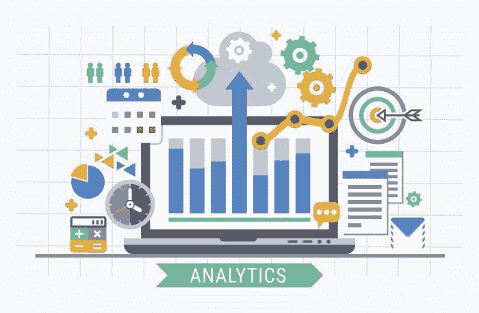
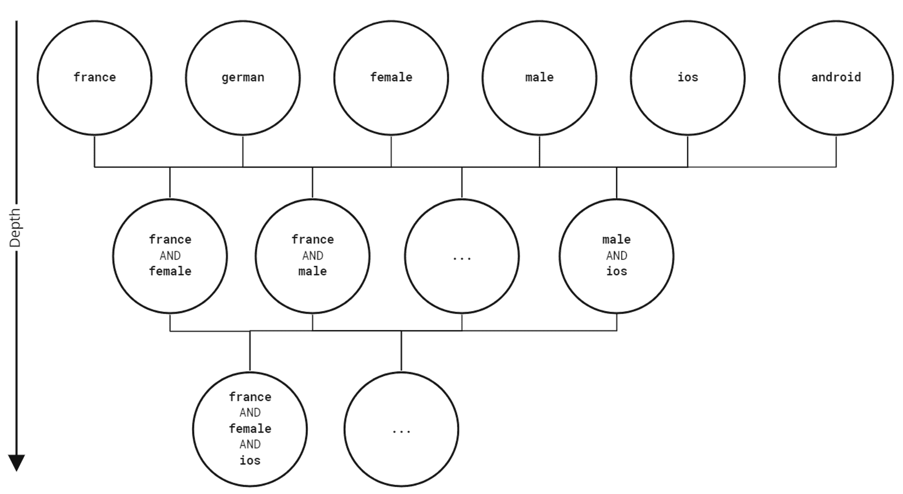

# 如何通过因果推断提升增强分析超越二维平面

> 原文：[`www.kdnuggets.com/2021/08/causal-inference-augmented-analytics-beyond-flatland.html`](https://www.kdnuggets.com/2021/08/causal-inference-augmented-analytics-beyond-flatland.html)

评论

**由 [Michael Klaput](https://www.linkedin.com/in/michael-klaput-67375385) 提供，Kausa 首席科学官兼联合创始人**。



* * *

## 我们的前三个课程推荐

 1\. [谷歌网络安全证书](https://www.kdnuggets.com/google-cybersecurity) - 快速进入网络安全职业。

 2\. [谷歌数据分析专业证书](https://www.kdnuggets.com/google-data-analytics) - 提升你的数据分析能力

 3\. [谷歌 IT 支持专业证书](https://www.kdnuggets.com/google-itsupport) - 支持你的组织 IT 事务

* * *

如果世界是二维的，生活将会非常奇怪。试想一下：地球不会是一个球体，而是一个圆圈——就像二维宇宙中的其他所有恒星和行星一样。生物体也会被压扁，生活在一个平面的景观中。例如，要在街上超过某人，你必须跳过那个人，因为没有深度。出于同样的原因，要仅仅看向你身后，你就必须字面上把自己翻个身。幸运的是，这不是我们生活的世界。但不幸的是，这正是如今大多数企业运行的基础——可能甚至包括你的企业。在任何技术驱动的业务中，你的决策质量不可避免地依赖于你数据洞察的质量。然而，在太多公司中，这些“洞察”实际上是二维的：平面、无用且毫无结论。

企业通常通过 KPI 来衡量其绩效。因此，在数据分析中，找到基于历史数据的未来 KPI 值的最佳预测模型已经成为一个目标。尽管这些模型可能表现得相当好，但从中提取价值同样困难。除了缺乏可解释性之外，这还因为预测模型无法捕捉现实，并且限制于低维解释。在本文中，我们将提供两个论点，说明为什么这是由于糟糕的扩展和大多数预测模型中存在的不切实际的假设。

但为何要费心呢？并不是表现良好的模型提升了业务绩效。实际上，改善业务的唯一途径是通过决策，这最终应该由人类来完成。数据分析在业务中的目标应该是通过揭示洞察来为决策提供信息。不幸的是，这些洞察就像针一样隐藏在数据中。这一复杂的问题促使了一个相对年轻的数据分析分支——增强分析，并在近期的 Gartner 报告中得到了推动[[1](https://www.kausa.ai/blog/how-causal-inference-lifts-augmented-analytics-beyond-flatland#7342acb5e89f)]。


*图 1\. 《平面国的封面：多维度的浪漫 / 作者 A Square 插图，作者：爱德温·阿博特（1838-1926）。出版：伦敦：Seeley & Co.，1884 年\. *EC85 Ab264 884f 哈佛大学豪顿图书馆*

我们想要挑战一种观念，即预测模型应该是用于指导业务决策的默认选项。它们在寻找洞察时引入了昂贵的绕行，甚至可能使其在实际操作中不可行。我们将在一个简单问题中突出显示，预测建模除了大量的开销外几乎无法提供什么。相反，我们将尝试模仿业务分析师的操作。这将自然引导我们到因果推断的方法上。

## 有影响的变化

我们将考虑在大数据场景下诊断回归模型错误的问题。大多数读者应该遇到过以下场景：

*图 2\. 使用单一模型的关键绩效指标实际值与预测值对比。*

显然，KPI 发生了显著变化，这种变化似乎暂时会持续。从技术角度来看，一个合理的反应是对变化点之后的数据重新训练你的预测模型。你同意吗？如果同意，也许可以记住这一点。

*图 3\. 使用两个模型的关键绩效指标实际值与预测值对比。*

好消息是你的模型似乎很准确。坏消息是你的经理将不可避免地询问 KPI 发生了什么。但不要害怕。这是证明你对公司价值的理想情况。你能识别出这种变化背后的原因吗？你能揭示出有助于做出正确决策的洞察吗？

## 为什么的探究

假设你公司的数据集大致如下所示：

```py
import pandas as pd
df = pd.read_csv("..\\dataset\\ecommerce_sample.csv")
df.head()

```

*表 1\. 示例公司数据。*

假设你正处理最简单的情况：使用线性回归模型完美拟合了跳跃前后的 KPI 值。在这里，你需要适当地处理分类数据以用于回归。标准方法是对分类值进行独热编码：对于每个类别值，你引入一个特征，该特征可以是真或假。例如，在上述数据集中，你会定义特征

*customer_country = **德国*。

要最终实现特征选择，有必要使用某种形式的正则化。在这里，你将使用 Lasso 正则化（通过十折交叉验证）。

在训练了两个 Lasso 正则化的线性回归模型后，一个是在跳跃之前，另一个是在跳跃之后，你可以查看这两个模型之间特征权重差异的排名列表。

```py
from sklearn.linear_model import LassoCV
from bokeh.io import show
from bokeh.plotting import figure

#get kpi_axis
kpi_axis = 'kpi'
time_axis = 'time'
df[time_axis] = pd.to_datetime(df[time_axis],format = '%d/%m/%Y')
y_before =  df[df[time_axis] <= '2019-09-11'][kpi_axis] y_after = df[df[time_axis] > '2019-09-11'][kpi_axis]

#one-hot encoding categorical features
for col in df.drop([kpi_axis,time_axis],axis=1).columns:
    one_hot = pd.get_dummies(df[col]) 
    df = df.drop(col,axis = 1) 
    df = df.join(one_hot) 

X_before =  df[df[time_axis] <= '2019-09-11'].drop([kpi_axis,time_axis],axis = 1).to_numpy() X_after = df[df[time_axis] >  '2019-09-11'].drop([kpi_axis,time_axis],axis = 1).to_numpy()

#training left and right
regression_model_before = LassoCV(cv = 10)
regression_model_after = LassoCV(cv = 10)
regression_model_before.fit(X_before,y_before)
regression_model_after.fit(X_after,y_after)

#plotting results
features = df.columns
dweights =regression_model_after - regression_model_before
index = np.argsort(-abs(dweights))
x_axis = features[index[0:3]].to_list()

p = figure(x_range=x_axis,title = "Feature weights difference",plot_width=1000)
p.vbar(x=x_axis, top=(abs(dweights[index[0:3]])),width = 0.8)
show(p)

```

*图 4\. 使用独热编码的特征权重。*

看起来像是安卓用户或年龄大于 46 岁的用户在跳跃前后表现不同。很好，看起来你找到了 KPI 跳跃的原因……或者说你找到了吗？

## 维度诅咒

实际上，这比我们目前所认识的情况要复杂得多。想象一下将这些信息呈现给 KPI 负责人。他们会非常高兴你为 KPI 变化提供了理由，但他们现在会考虑如何根据这些信息采取行动。这将自动引发他们提出如下问题：

“*KPI 变化的实际驱动因素是所有安卓电视用户、所有年龄超过 46 岁的客户以及所有之前进行过购买的客户吗？也许可能是年龄超过 46 岁的重复客户和安卓电视用户……或者是之前购买过东西的安卓电视用户？更糟糕的是，是否还有其他你遗漏的特征组合？*”


*图 5\. Kausa - 因为你知道得更多。*

因此，为了更有信心地回答这些问题，你需要重复你的回归分析，使用更复杂的独热编码特征……现在表示比之前更细的子组。因此，你正在搜索数据集中的更深层次子组，见图 6，新的特征如：

*customer_age = 46+ 和 first_order_made = yes，customer_age = 18−−21 和 first_order_made = no。*

这些子组通过独热编码再次进入。这显然是一个问题，因为你现在陷入了*维度诅咒*。这是大数据时代，你刚刚通过阶乘量增加了特征的数量[[2](https://www.kausa.ai/blog/how-causal-inference-lifts-augmented-analytics-beyond-flatland#7558d6345a50)]。可以用来生成这些精细子组的代码如下：

```py
def binarize(df,cols,kpi_axis,time_axis,order):
    cols = cols.drop([kpi_axis,time_axis])
    features = []
    for k in range(0,order):
        features.append(cols)
    fs = []
    for f in itertools.product(*features):
      #  list(set(f)).sort()
        f = np.unique(f)
        fs.append(tuple(f))
    fs = tuple(set(i for i in fs))
    print(fs)
    for f in fs:
        print(len(f))
        states =[]
        for d in f:
            states.append(tuple(set(df[d].astype('category'))))
        for state in itertools.product(*states):
            z = 1
            name = str()
            for d in range(0,len(f)):
                z = z*df[f[d]]==state[d]
                name +=  f[d] + " == " +str(state[d])
                if d<len(f)-1:
                   name += " AND "
            df[name] = z
    for d in cols:
        df = df.drop([d],axis = 1)
    return df

```



*图 6\. 子组深度。*

请记住，线性回归基于所有特征的协方差矩阵的逆——这会随特征的增加而扩展。

*O(d³)，*

其中 d 是特征的数量，即在我们这种情况下，是可能的子组数量。这相较于非预测性特征选择方法引入了显著的机会成本——这一点将在后面讨论。

```py
df = pd.read_csv("..\\dataset\\ecommerce_sample.csv")
df[time_axis] = pd.to_datetime(df[time_axis],format = '%d/%m/%Y')

#get kpi_axis
kpi_axis = 'kpi'
time_axis = 'time'
y_before =  df[df[time_axis] <= '2019-09-11'][kpi_axis] y_after = df[df[time_axis] > '2019-09-11'][kpi_axis]

#one-hot encoding categorical features
df = binarize(df,df.columns,kpi_axis,time_axis,3)

X_before =  df[df[time_axis] <= '2019-09-11'].drop([kpi_axis,time_axis],axis = 1).to_numpy() X_after = df[df[time_axis] >  '2019-09-11'].drop([kpi_axis,time_axis],axis = 1).to_numpy()

#training left and right
regression_model_before = LassoCV(cv = 10)
regression_model_after = LassoCV(cv = 10)
regression_model_before.fit(X_before,y_before)
regression_model_after.fit(X_after,y_after)

#plotting results
features = df.columns
dweights =regression_model_after - regression_model_before
index = np.argsort(-abs(dweights))
x_axis = features[index[0:3]].to_list()

p = figure(x_range=x_axis,title = "Feature weights difference",plot_width=1000)
p.vbar(x=x_axis, top=(abs(dweights[index[0:3]])),width = 0.8)
show(p)

```

*图 7\. 使用独热编码的交集特征权重。*

一段时间后，你的计算完成了。虽然之前的计算只需 0.1 秒，但寻找三阶特征却花费了超过一分钟。不过这似乎是值得的。你发现，驱动 KPI 变化的群体实际上是一个，如图 7 所示。向你的经理展示这一洞察后，他很快就能指出一个直接影响你报告的子群体的更新。

## 通过精细化子群体，你可以使其具有可操作性。

虽然你的回归方法最终奏效了——但计算时间极长，导致了公司机会成本。在大数据的现实场景中，你的方法可能会失败得很惨。此外，包含仅浅层子群体的原始集合描绘了一个不正确的图景。只有在经过精细化集合和大量计算工作之后，你才能确定导致 KPI 跳跃的实际子群体。

这引出了几个问题：

+   你是否真的需要学习预测模型来回答为什么会发生跳跃？

+   你如何减少机会成本？

+   你如何找到适当粒度的子群体？

+   为了获得这些信息，每次跳跃时重新训练模型是否经济？

虽然回答所有这些问题超出了本文的范围，我们将提供一种新的观点，这可以帮助解决这些问题。为此，我们将开发一种改进线性回归的特征选择方法。增强分析依赖于此。

## 从业务分析师和因果推断中学习

让我们退一步……这里发生了什么？你从一个预测模型开始，发现它既不能预测也不能解释 KPI 的观察到的跳跃。这是为什么呢？因为预测模型无法捕捉现实。它们假设所有数据是独立同分布的[[3](https://www.kausa.ai/blog/how-causal-inference-lifts-augmented-analytics-beyond-flatland#c72ace9e8427)]。然而，在实际应用中，这通常是不正确的，正如这个例子所示。跳跃前后的数据是在不同条件下生成的。你甚至直观地利用了这一点，当你使用两个单独的预测模型时，这（经过一些技巧）帮助我们揭示了跳跃的原因。

既然你不得不放弃预测，并且最终没有做出任何预测，那么预测模型实际上对你有什么帮助呢？如果你思考一下，关键在于你并不关心所有可能子群体对 KPI 的预测，而是关心子群体对 KPI 的影响！因此，要在更深层次上寻找洞察，你必须远离预测建模。这正是数据科学家可以从业务分析师那里学习的地方。

业务分析师通过包含有意义的数据总结的仪表板来寻找洞察。与上述回归方法中将所有特征关联在一起不同，业务分析师会尝试通过迭代地过滤数据以不同条件来确定数据中发生了什么变化（如均值、直方图或指标）。最重要的是，业务分析师无需一次查看所有特征。你如何教机器做到这一点？你如何从业务分析师那里学习？

让我们用数学符号来形式化上述内容。设 X 为一个子组，例如

*X = customer_age = 46+ 和 first_order_made = yes*

和

*f(KPI[before], KPI[after])*

对 KPI 跳跃前后的 KPI 分布做一些总结。然后，你引入条件总结

*f(KPI[before], KPI[after]* ∣ *X)*

你计算满足 X 为真的 KPI 值子集的总结。我们的方法现在只需要计算每个子组的条件总结并进行排名。我想强调的是，在实践中，这些抽象的总结可以是均值、直方图等对象。

上述过程实际上是因果推断中的一种常见技术 [[4](https://www.kausa.ai/blog/how-causal-inference-lifts-augmented-analytics-beyond-flatland#8dfc0806606a)]。因此，你隐含地改变了我们的视角。现在，你将 KPI 中神秘的跳跃视为现在假定由于外部或内部 *处理* 发生的干预。外部处理的例子可能是节假日，内部处理可能是广告活动、定价变化，或如我们案例中的软件更新。因此，你明确地 *提升* 了所有数据是独立且同分布的错误假设。你现在正在寻找对 KPI 变化 *因果* 的子组。

## 《为何探寻，再次回顾》

现在你已经有了一个业务分析师如何操作的模型，让我们继续实际实施。现在，你将使用一种在因果推断中使用的标准总结，称为条件平均处理效应 (CATE) [[5](https://www.kausa.ai/blog/how-causal-inference-lifts-augmented-analytics-beyond-flatland#cc6447b58903)]，我们的总结变成了

*f(KPI[before], KPI[after]* ∣ *X) = E*[*KPI[after]* ∣ *X*] *− E*[*KPI[before]* ∣ *X*]

CATE 对应于 KPI 均值的变化，条件是该子组 X 为真。按大小排名然后给出正确的子组作为结果。为了检测多个子组，我们在每次迭代后移除表现最好的子组后重复这一过程：

```py
df = pd.read_csv("..\\dataset\\ecommerce_sample.csv")
df[time_axis] = pd.to_datetime(df[time_axis],format = '%d/%m/%Y')

#get kpi_axis
kpi_axis = 'kpi'
time_axis = 'time'
y_before =  df[df[time_axis] <= '2019-09-11'][kpi_axis] y_after = df[df[time_axis] > '2019-09-11'][kpi_axis]

df = binarize(df,df.columns,kpi_axis,time_axis,3)
df_before = df[df[time_axis] <= '2019-09-11'] df_after = df[df[time_axis] > '2019-09-11']
features = copy(df.drop([time_axis,kpi_axis], axis=1).columns)

K = 3 #number of subgroups to detect
subgroups=[]
score=[]
for k in range(0,K):
    CATE = []
    y_before = df_before[kpi_axis]
    y_after= df_after[kpi_axis]

    #compute CATEs for all subgroups
    for d in features:
        g = df_before[d] == True
        m_before = np.mean(y_before[g])
        g = df_after[d] == True
        m_after = np.mean(y_after[g])
        CATE.append(m_after-m_before)

    #find subgroup with biggest CATE
    index = np.argsort(-abs(np.array(CATE)))
    subgroups.append(features[index[0]])
    score.append(abs( CATE [index[0]]))

    #remove found subgroups from dataset
    df_before = df_before[df_before[features[index[0]]] == False]
    df_after = df_after[df_after[features[index[0]]] == False] 
    features = features.drop(features[index[0]])

p = figure(x_range=subgroups,title = "Conditional Average Treatment Effect",plot_width=1200,)
p.vbar(x=subgroups, top=score,width = 0.8,color='black')
show(p)

```

*图 8\. 使用交集的独热编码的 CATE 分数。*

这只需要我们预测模型成本的一小部分。计算一阶特征仅需 0.02 秒，而搜索三阶特征则不到一秒。

让我们退一步，将这种方法与早期基于回归的方法进行比较，看看它们各自的目标是什么。通过回归进行的特征选择回答了问题：“哪些子组最能预测你的 KPI？”而因果推断则回答了问题：“哪些子组对 KPI 有最大的因果影响？”比较图 9 中 CATE 的朴素实现与优化的*sklearn*线性回归实现的运行时间，我们发现它们之间相差几个数量级。这表明这些问题虽然表面上相似，但本质上有根本的区别。

*图 9：线性回归（sklearn）与 CATE 在子组深度上的日志运行时间比较，用于穷举子组搜索。*

## 结论

预测模型作为理解 KPI 变化的工具有很大的不足，特别是在多维度的背景下。这些模型在错误的假设下根本回答了错误的问题。相反，商业分析关注的是为什么会发生某事，而不是将来会发生什么。将预测未来 KPI 值的辅助任务从思维中剔除后，分析师在数据中寻找 KPI 变化的原因，试图为正确的问题找到答案。

下次你想解释任何事情时要小心。首先，你应该提出正确的问题。此外，多维度背景需要基于因果推断和商业分析方法的可扩展技术。这是 Kausa 的使命：扩展商业分析逻辑并将其与因果推断结合，以提供对 KPI 变化的正确答案。

*附注：本文结果的代码和数据可在我们的 GitHub 仓库中找到[[6](https://www.kausa.ai/blog/how-causal-inference-lifts-augmented-analytics-beyond-flatland#5b4e41206487)]。*

[原文](https://www.kausa.ai/blog/how-causal-inference-lifts-augmented-analytics-beyond-flatland)。经许可转载。

**个人简介：** [Michael](https://www.linkedin.com/in/michael-klaput-67375385) [Klaput](https://www.linkedin.com/in/michael-klaput-67375385) 是 Kausa 的联合创始人兼首席技术官 ([www.kausa.ai](http://www.kausa.ai))，曾任美国银行美林证券量化分析副总裁，牛津大学理论物理学博士。

**相关：**

+   [无处不在的分析工程](https://www.kdnuggets.com/2021/06/analytics-engineering-everywhere.html)

+   [为什么机器学习在因果关系上遇到困难](https://www.kdnuggets.com/2021/04/machine-learning-struggles-causality.html)

+   [数据科学家和数据分析师必知：因果设计模式](https://www.kdnuggets.com/2021/03/causal-design-patterns.html)

### 更多相关主题

+   [认识 Gorilla：UC Berkeley 和微软的 API 增强型 LLM…](https://www.kdnuggets.com/2023/06/meet-gorilla-uc-berkeley-microsoft-apiaugmented-llm-outperforms-gpt4-chatgpt-claude.html)

+   [检索增强生成：信息检索与文本生成的交汇点](https://www.kdnuggets.com/retrieval-augmented-generation-where-information-retrieval-meets-text-generation)

+   [通过特征/训练/推理管道统一批处理和机器学习系统](https://www.kdnuggets.com/2023/09/hopsworks-unify-batch-ml-systems-feature-training-inference-pipelines)

+   [2022 年及以后 10 个关键 AI 与数据分析趋势](https://www.kdnuggets.com/2021/12/10-key-ai-trends-for-2022.html)

+   [超越管道：图形作为 Scikit-Learn 元估计器](https://www.kdnuggets.com/2022/09/graphs-scikitlearn-metaestimators.html)

+   [超越编码：为什么人性化的触感很重要](https://www.kdnuggets.com/beyond-coding-why-the-human-touch-matters)
