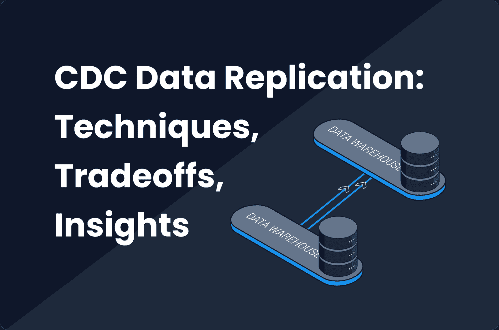
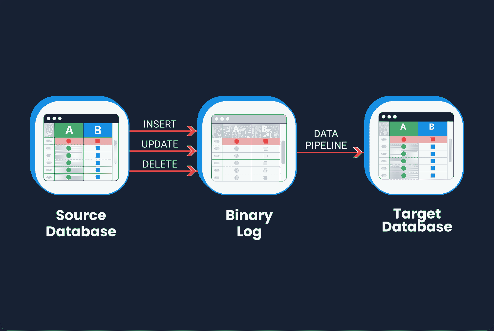
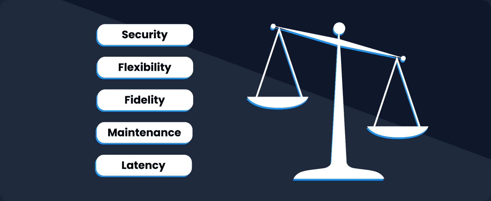
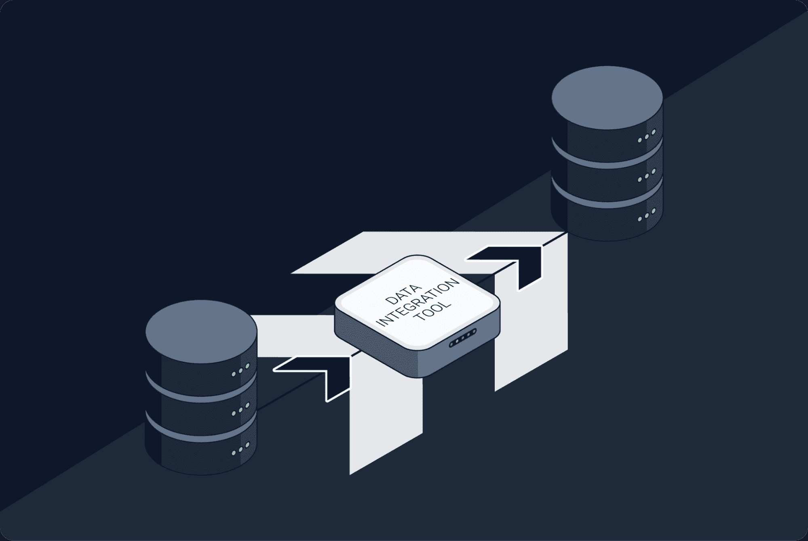

# CDC 数据复制：技术、权衡、见解

> 原文：[`www.kdnuggets.com/2023/08/cdc-data-replication-techniques-tradeoffs-insights.html`](https://www.kdnuggets.com/2023/08/cdc-data-replication-techniques-tradeoffs-insights.html)

许多行业中的组织运营的生产数据库中，大多数数据不会频繁更改；也就是说，日常的更改和更新仅占存储在其中的数据总量的一小部分。正是这些组织最能从变更数据捕获（CDC）数据复制中受益。

* * *

## 我们的前三大课程推荐

 1\. [Google 网络安全证书](https://www.kdnuggets.com/google-cybersecurity) - 快速进入网络安全职业生涯。

 2\. [Google 数据分析专业证书](https://www.kdnuggets.com/google-data-analytics) - 提升你的数据分析水平

 3\. [Google IT 支持专业证书](https://www.kdnuggets.com/google-itsupport) - 支持你组织的 IT

* * *

在这篇文章中，我将定义 CDC 数据复制，简要讨论最常见的使用案例，然后谈论常见的技术及其权衡。最后，我将分享作为数据集成公司 Dataddo 的 CEO 和创始人，我学到的一些实施见解。

# 什么是变更数据捕获（CDC）数据复制？

CDC 数据复制是一种在两个数据库之间实时或接近实时地复制数据的方法，其中*仅*复制新添加或修改的数据。

这是一种[快照复制的替代方案](https://ceur-ws.org/Vol-3369/invited1.pdf)，它涉及将一个数据库的整个快照不断移动到另一个数据库。快照复制可能适用于那些需要长期保留数据单个快照的组织，但它非常耗费处理能力，并且会产生巨大的财务开支。对于那些不需要这样做的组织，CDC 可以节省大量的处理时间。

数据更改可以实时或以小批量（例如每小时）捕获并传递到其新目标。

这张图展示了基于日志的 CDC，其中红色行是新添加的数据。

值得一提的是，CDC 并不是一个新过程。然而，直到最近，只有大型组织拥有实现它的工程资源。*新*的是越来越多的托管工具可实现它且成本低廉，因此它的新兴受欢迎程度。

# 最常见的 CDC 使用案例

本文的篇幅不足以涵盖 CDC 数据复制的所有用例，但以下是三种最常见的。

## 商业智能和分析的数据仓储

任何运行专有数据收集系统的组织都可能有一个存储该系统关键数据的生产数据库。

由于生产数据库是为写操作而设计的，因此它们不会将数据有效地利用。许多组织因此会希望将数据复制到一个数据仓库中，以便可以进行复杂的读取操作以用于分析和商业智能。

如果你的分析团队需要近实时的数据，CDC 是一个很好的方式，因为它会迅速将更改传递到分析仓库中。

## 数据库迁移

当你从一种数据库技术迁移到另一种时，CDC 也非常有用，你需要在停机情况下保持一切可用。一个经典的例子是从本地数据库迁移到云数据库。

## 灾难恢复

类似于迁移案例，CDC 是一种高效且可能具有成本效益的方式，可以确保所有数据始终在多个物理位置可用，以防其中一个位置出现停机。

# 常见的 CDC 技术及其权衡

CDC 有三种主要技术，每种技术都有其自身的优缺点。

CDC 实现涉及灵活性、保真度、延迟、维护和安全性之间的权衡。

## 基于查询的 CDC

基于查询的 CDC 非常简单。你只需使用这种技术编写一个简单的选择查询来从特定表中选择数据，然后添加一些条件，比如“仅选择昨天更新或添加的数据。”假设你已经配置了一个备用表的模式，这些查询将捕获更改的数据并生成一个新的二维表，该表可以插入到新的位置。

### 优势

+   **高度灵活**。允许你定义要捕获哪些更改以及如何捕获它们。这使得以非常细粒度的方式自定义复制过程变得更容易。

+   **减少开销**。仅捕获符合特定标准的更改，因此比捕获所有数据库更改的 CDC 便宜得多。

+   **更容易故障排除**。可以轻松检查和纠正单独的查询，以解决任何问题。

### 缺点

+   **复杂的维护**。每个单独的查询都需要维护。例如，如果你的数据库中有几百个表，你可能需要这么多查询，而维护所有这些查询将是一个噩梦。这是主要的缺点。

+   **较高延迟**。依赖于轮询来检测更改，这可能会引入复制过程中的延迟。这意味着你无法通过选择查询实现实时复制，必须安排某种批处理。如果你需要分析长期时间序列的数据，如客户行为，这可能不是大问题。

## 基于日志的 CDC

我们今天使用的大多数数据库技术都支持集群，这意味着你可以在多个副本中运行它们以实现高可用性。这些技术必须有某种二进制日志，捕获数据库的所有更改。在基于日志的 CDC 中，更改是从日志中读取的，而不是数据库本身，然后复制到目标系统。

### 优势

+   **低延迟**。数据更改可以非常迅速地复制到下游系统。

+   **高保真度**。日志捕获数据库的*所有*更改，包括数据定义语言（DDL）更改和数据操作语言（DML）更改。这使得追踪已删除的行成为可能（而基于查询的 CDC 无法做到这一点）。

### 缺点

+   **较高的安全风险**。需要直接访问数据库事务日志。这可能引发安全问题，因为这需要广泛的访问权限。

+   **灵活性有限**。捕获数据库的所有更改，这限制了定义更改和定制复制过程的灵活性。如果有高度定制的需求，日志将需要进行大量后处理。

一般来说，基于日志的 CDC 实施起来很困难。有关更多信息，请参见下面的“见解”部分。

## 基于触发器的 CDC

基于触发器的 CDC 是前三种技术的一种混合。它涉及为捕获表中的某些更改定义触发器，然后将这些更改插入并在新表中跟踪。从这个新表中，更改被复制到目标系统。

### 优势

+   **灵活性**。允许你定义捕获哪些更改以及如何捕获它们（如基于查询的 CDC），包括已删除的行（如基于日志的 CDC）。

+   **低延迟**。每次触发器触发时，它都算作一个事件，事件可以实时或近实时处理。

### 缺点

+   **极其复杂的维护**。就像基于查询的 CDC 中的查询一样，所有触发器都需要单独维护。因此，如果你有一个包含 200 个表的数据库，并需要捕获所有表的更改，你的整体维护成本将非常高。

# 实施见解

作为一家数据集成公司的首席执行官，我在大大小小的规模上实施 CDC 有很多经验。以下是我在过程中学到的一些东西。

## 针对不同日志的不同实现

基于日志的 CDC 特别复杂。这是因为所有日志—例如 MySQL 的 BinLog、Postgres 的 WAL、Oracle 的 Redo Log、Mongo DB 的 Oplog—尽管概念上相同，但实现方式不同。因此，你需要深入了解所选数据库的低级参数，以使其正常工作。

## 将数据更改写入目标位置

你需要确定如何在目标位置插入、更新和删除数据。

一般来说，插入很简单，但数据量在决定方法上起着重要作用。无论你使用批量插入、数据流还是决定通过文件加载更改，你总会面临技术上的权衡。

为了确保正确更新并避免不必要的重复，你需要在表上定义一个虚拟键，以告知系统哪些内容应该被插入，哪些内容应该被更新。

为了确保正确删除，你需要有一些备用机制，以确保错误的实现不会导致目标表中所有数据的删除。

## 维护长期运行的作业

如果你只转移几行数据，事情会相当简单，但如果是这种情况，那么你可能不需要 CDC。因此，通常情况下，我们可以预期 CDC 作业将需要几分钟甚至几小时，这将需要可靠的监控和维护机制。

## 错误处理

这可能是另一个完全不同的主题。但简而言之，我可以说每种技术在引发异常和呈现错误方面的方式不同。因此，你应该定义一个策略来处理连接失败的情况。你应该重试吗？还是应该将所有内容封装在事务中？

实现内部 CDC 数据复制相当复杂且高度特定于案例。这就是为什么它传统上不被认为是一个流行的复制解决方案，也很难给出通用的实施建议。近年来，像 Dataddo、Informatica、SAP Replication Server 等托管工具显著降低了其可访问性门槛。

# 不是所有人都适用，但对某些人来说很棒

正如我在文章开头提到的，CDC 有可能为公司节省大量财务资源：

+   主要数据库中数据变化不频繁（即每日变化仅占其中数据的相对小部分）

+   需要实时接收数据的分析团队

+   不需要保留主数据库随时间变化的完整快照

尽管如此，没有完美的技术解决方案，只有权衡。这同样适用于 CDC 数据复制。那些选择实现 CDC 的人将不得不不平等地优先考虑灵活性、准确性、延迟、维护和安全性。

**[Petr Nemeth](https://www.linkedin.com/in/petrnemeth/)** 是 Dataddo 的创始人兼首席执行官——一个完全托管的、无代码的数据集成平台，连接云服务、仪表盘应用程序、数据仓库和数据湖。该平台提供 ETL、ELT、逆向 ETL 和数据库复制功能（包括 CDC），以及 200 多个连接器的广泛组合，使得任何技术水平的业务专业人士都能够将数据从几乎任何来源发送到任何目的地。在创办 Dataddo 之前，Petr 曾在电信、IT 和媒体公司担任开发人员、分析师和系统架构师，参与涉及物联网、大数据和商业智能的大型项目。

### 相关主题

+   [软件错误与权衡：Tomasz Lelek 的新书](https://www.kdnuggets.com/2021/12/manning-software-mistakes-tradeoffs-book.html)

+   [ChatGPT 驱动的数据探索：揭示数据集中的隐藏洞察](https://www.kdnuggets.com/2023/07/chatgptpowered-data-exploration-unlock-hidden-insights-dataset.html)

+   [用 LLMs 将非结构化数据转化为结构化洞察的 5 种方法](https://www.kdnuggets.com/5-ways-of-converting-unstructured-data-into-structured-insights-with-llms)

+   [解锁数据洞察：有效分析的关键 Pandas 函数](https://www.kdnuggets.com/unlocking-data-insights-key-pandas-functions-for-effective-analysis)

+   [影响洞察时间的关键因素](https://www.kdnuggets.com/2023/03/key-factors-affecting-time-insights.html)

+   [开发安全、可靠和可信的 AI 框架的专家见解](https://www.kdnuggets.com/expert-insights-on-developing-safe-secure-and-trustworthy-ai-frameworks)
