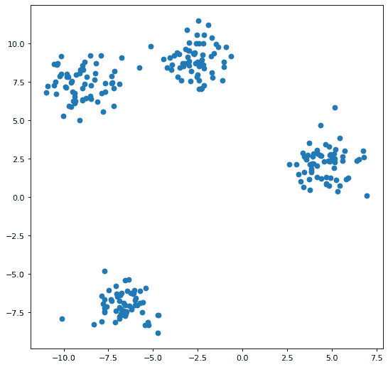
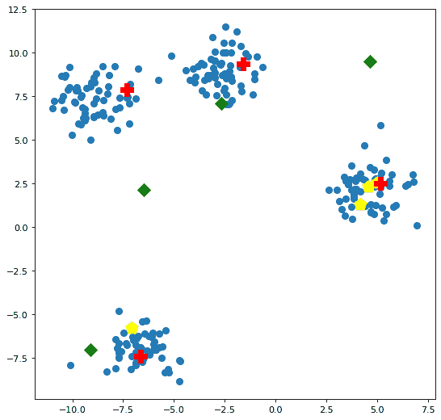
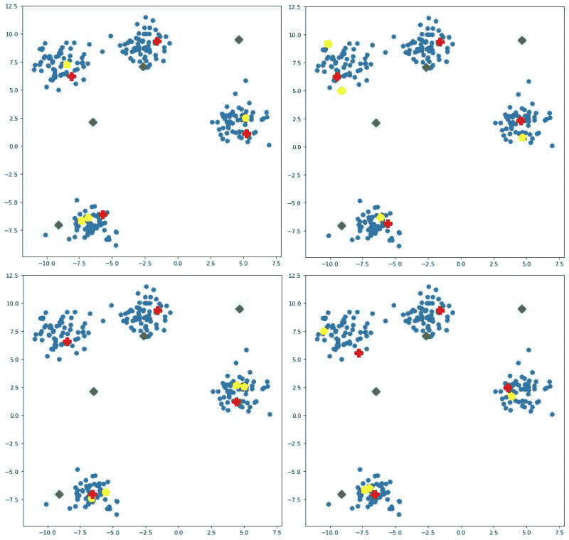

# k-means 聚类的质心初始化方法

> 原文：[`www.kdnuggets.com/2020/06/centroid-initialization-k-means-clustering.html`](https://www.kdnuggets.com/2020/06/centroid-initialization-k-means-clustering.html)

简单的聚类方法，如 *k*-均值，可能没有现代神经网络或其他近期先进的非线性分类器那样引人注目，但它们确实有其用处，掌握如何正确处理无监督学习问题是一项很有价值的技能。

这篇文章旨在系列文章中的第一篇，探讨 *k*-均值聚类管道的不同方面。在这第一篇文章中，我们将讨论质心初始化：它是什么，它实现了什么，以及存在的一些不同方法。我们将假设你对机器学习、Python 编程以及聚类的一般概念有一定的了解。

* * *

## 我们的前三个课程推荐

 1\. [谷歌网络安全证书](https://www.kdnuggets.com/google-cybersecurity) - 快速开启网络安全职业生涯

 2\. [谷歌数据分析专业证书](https://www.kdnuggets.com/google-data-analytics) - 提升你的数据分析能力

 3\. [谷歌 IT 支持专业证书](https://www.kdnuggets.com/google-itsupport) - 支持你的组织的 IT 需求

* * *

# *k*-均值聚类

*k*-均值是一种简单而经常有效的聚类方法。传统上，从给定的数据集中随机选择 *k* 个数据点作为聚类中心或质心，所有训练实例都会被绘制并添加到最近的聚类中。在所有实例都添加到聚类后，质心表示每个聚类实例的均值，将被重新计算，这些重新计算的质心成为各自聚类的新中心。

此时，所有的聚类成员资格都被重置，所有训练集的实例被重新绘制并重新添加到其最近的、可能重新中心化的聚类中。这个迭代过程将继续，直到质心或其成员资格没有变化，聚类被认为已稳定。

当重新计算的质心与前一轮迭代的质心匹配，或在某个预设的范围内时，聚合被认为已经实现。在 *k*-均值中，距离的度量通常是欧几里得距离，给定两个点的形式为 (x, y)，可以表示为：


技术上需要注意的是，特别是在并行计算时代，*k*-均值中的迭代聚类本质上是串行的；然而，迭代中的距离计算不必如此。因此，对于规模较大的数据集，距离计算是 *k*-均值聚类算法中值得进行并行化的目标。

# 质心初始化方法

由于 *k*-均值聚类旨在通过连续迭代基于这些中心点的距离来收敛到一个最佳的簇中心（质心）和簇成员，因此直观上来说，初始质心的定位越优化，*k*-均值聚类算法收敛所需的迭代次数就越少。这表明对这些初始质心的初始化进行一些战略性考虑可能会很有用。

质心初始化方法有哪些？虽然存在许多初始化策略，但我们重点关注以下几种：

+   **随机数据点**：在这种方法中，如上文“传统”案例所述，从数据集中随机选择 *k* 个数据点作为初始质心，这种方法显然高度不稳定，并提供了一种选定的质心在整个数据空间中没有很好分布的情况。

+   **k-means++**：由于将初始质心分散开来被认为是一个值得追求的目标，*k*-means++通过将第一个质心分配给随机选择的数据点位置，然后从剩余的数据点中选择后续质心，依据的是与给定点的最近现有质心的平方距离成正比的概率。这种方法试图将质心尽可能远地推开，覆盖尽可能多的占据的数据空间。*k*-means++ 的原始论文（2006 年）可以在[这里](http://ilpubs.stanford.edu:8090/778/1/2006-13.pdf)阅读。

+   **朴素分片**：这种较少被人知晓（或许完全未知？）的质心初始化方法曾是我自己研究生研究的课题。它主要依赖于计算反映实例所有属性值的复合总和值。一旦计算出这个复合值，就用它来对数据集中的实例进行排序。然后，将数据集水平分成 *k* 份或分片。最后，对每个分片的原始属性进行独立求和，计算其均值，并将这些分片属性均值的行集合起来，作为初始化时使用的质心集合。期望是作为一种确定性方法，它应比随机方法执行得更快，并通过复合总和值近似初始质心在数据空间中的分布。如果感兴趣，可以在这里阅读更多内容。

任何这些方法的变体都是可能的：你可以从数据空间的任何位置随机选择，而不仅仅是包含现有数据点的空间；你可以尝试首先找到位置最中心的数据点，而不是随机选择，然后从那里继续使用 *k*-means++；你也可以在朴素分片中用另一种操作替代求和均值操作。

此外，一种形式的 [层次聚类](https://en.wikipedia.org/wiki/Hierarchical_clustering)（通常是 [Ward 方法](https://en.wikipedia.org/wiki/Ward%27s_method)）可以用作找到初始簇中心的方法，然后将其传递给 *k*-means 执行实际的数据聚类任务。这可能是有效的，但由于这也涉及到层次聚类的讨论，我们会将此内容留待后续文章中。

# 质心初始化和 Scikit-learn

由于我们将使用 Scikit-learn 来执行聚类，让我们查看一下其 [`KMeans`](https://scikit-learn.org/stable/modules/generated/sklearn.cluster.KMeans.html) 模块，其中可以看到关于可用质心初始化方法的说明：

> `**init{‘k-means++’, ‘random’, ndarray, callable}, default=’k-means++’**`
> 
> 初始化方法：
> 
> '`k-means++`': 以一种智能的方式选择 k-means 聚类的初始簇中心，从而加快收敛速度。有关更多细节，请参见 k_init 部分的说明。
> 
> '`random`': 从数据中随机选择 `n_clusters` 个观测值（行）作为初始质心。
> 
> 如果传递 ndarray，它的形状应该是 (n_clusters, n_features)，并给出初始中心。
> 
> 如果传递一个可调用对象，它应该接受 X、n_clusters 和随机状态作为参数，并返回一个初始化结果。

鉴于此，并且由于我们希望能够比较和检查初始化的质心——这是 Scikit-learn 实现无法做到的——我们将使用上述讨论的三种方法的自定义实现，即随机质心初始化、*k*-means++ 和简单分片。然后，我们可以使用这些实现独立于 Scikit-learn 来创建质心，并在聚类时将其作为 ndarray 传入。我们也可以使用可调用选项，而不是 ndarray 选项，并将质心初始化集成到 Scikit-learn *k*-means 执行中，但这会让我们回到最初的状态，即在聚类之前无法检查和比较这些质心。

话虽如此，`centroid_initialization.py` 文件包含了我们的质心初始化实现。

将此文件放置在与我启动 Jupyter notebook 相同的目录中，我可以按以下步骤进行操作，首先是导入。

```py
import numpy as np
import pandas as pd
import matplotlib.pyplot as plt

from sklearn.cluster import KMeans
import centroid_initialization as cent_init

%matplotlib inline
```

# 创建一些数据

显然，我们需要一些数据。我们将创建一个小的合成数据集，以便能够清晰地划分我们的簇（见图 1）。

```py
from sklearn.datasets import make_blobs

n_samples = 250
n_features = 2
n_clusters = 4
random_state = 42
max_iter = 100

X, y = make_blobs(n_samples=n_samples, 
                  n_features=n_features, 
                  centers=n_clusters, 
                  random_state=random_state)

fig=plt.figure(figsize=(8,8), dpi=80, facecolor='w', edgecolor='k')
plt.scatter(X[:, 0], X[:, 1]);
```



**图 1：我们的合成数据集**

# 初始化质心

让我们初始化一些质心，使用上述实现。

## **随机初始化**

```py
random_centroids = cent_init.random(X, n_clusters)
print(random_centroids)
```

```py
[[-7.09730839 -5.78133274]
 [ 4.56277713  2.31432166]
 [ 4.9976662   2.53395421]
 [ 4.16493353  1.31984045]]
```

## **k-means++ 初始化**

```py
plus_centroids = cent_init.plus_plus(X, n_clusters)
print(plus_centroids)
```

```py
[[-1.59379551  9.34303724]
 [-6.63466062 -7.38705277]
 [-7.31520368  7.86243296]
 [ 5.1549141   2.48695563]]
```

## **简单分片初始化**

```py
naive_centroids = cent_init.naive_sharding(X, n_clusters)
print(naive_centroids)
```

```py
[[-9.09917527 -7.00640594]
 [-6.48108313  2.12605542]
 [-2.66275228  7.07500918]
 [ 4.66778007  9.47156226]]
```

如你所见，初始化的质心集合彼此不同。

# 质心初始化的可视化

让我们直观地查看质心彼此之间的比较，以及与数据点的比较。我们将调用下面的绘图函数多次进行比较。图 2 绘制了上述创建的 3 组质心与数据点的对比。

```py
def centroid_plots(X, rand, plus, naive):
    fig=plt.figure(figsize=(8,8), dpi=80, facecolor='w', edgecolor='k')

    plt.scatter(X[:, 0], X[:, 1],
                s=50,
                marker='o',
                label='cluster 1')

    plt.scatter(rand[:, 0], 
                rand[:, 1],
                s=200, c='yellow',
                marker='p')

    plt.scatter(plus[:, 0],
                plus[:, 1],
                s=200, c='red',
                marker='P')

    plt.scatter(naive[:, 0], 
                naive[:, 1],
                s=100, c='green',
                marker='D');

centroid_plots(X, random_centroids, plus_centroids, naive_centroids)
```



**图 2\. 绘制的质心与数据点：随机（黄色），*k*-means++（红色），naive sharding（绿色）**

值得注意的是，随机初始化的质心中有 3 个恰好位于最右侧的簇中；*k*-means++ 初始化的质心每个簇中都有一个；而 naive sharding 的质心分布在数据空间中，呈略微弯曲的方式向上和向右偏移，偏向数据高度聚集的区域。

请记住，我们创建了一个二维数据空间，因此这些质心的可视化是准确的；我们没有去掉一些维度并将数据在简化空间中进行人工绘制，这可能会造成问题。这意味着在这种情况下，质心的比较是尽可能准确的。

你可能会问，这种初始化中哪些因素受随机种子的影响？随机初始化和*k*-means++都是随机方法，因此它们可能会受到随机种子的影响。如果我们对初始化算法进行不同的种子测试，结果如图 3 所示。



**图 3\. 实验中随机种子对质心初始化的影响，从左上角开始顺时针：123, 249, 127, 13**

一些观察：

+   随机初始化的质心（恰如其分）分布非常广泛

+   k-means++ 在簇内相对一致，初始质心的具体数据点略有变化

+   naive sharding 是确定性的，因此不受种子的影响

这引出了我们的一些问题，这些问题直接关系到聚类的下一步：

+   质心的位置对最终的聚类任务有什么影响？

+   质心的位置对最终聚类任务的速度有什么影响？

+   质心的位置对最终聚类任务的准确性有何影响？

+   我们何时会选择某些初始化方法而不是其他方法？

+   如果从最优放置的角度来看，随机初始化似乎是一个很差的方法，那么为什么还会使用它呢？

+   确定性初始化方法（如 naive sharding）是否有优势？

我们下次将开始寻找这些问题的答案。

**[马修·梅奥](https://www.linkedin.com/in/mattmayo13/)**（[**@mattmayo13**](https://twitter.com/mattmayo13)）是数据科学家及 KDnuggets 的主编，这是一个重要的在线数据科学和机器学习资源。他的兴趣包括自然语言处理、算法设计与优化、无监督学习、神经网络以及机器学习的自动化方法。马修拥有计算机科学硕士学位和数据挖掘研究生文凭。他可以通过 editor1 at kdnuggets[dot]com 联系到。

### 主题更多内容

+   [释放聚类的潜力：理解 K-Means 聚类](https://www.kdnuggets.com/2023/07/clustering-unleashed-understanding-kmeans-clustering.html)

+   [什么是 K-Means 聚类以及其算法如何工作？](https://www.kdnuggets.com/2023/05/kmeans-clustering-algorithm-work.html)

+   [无监督学习实操：K-Means 聚类](https://www.kdnuggets.com/handson-with-unsupervised-learning-kmeans-clustering)

+   [使用 PyCaret 在 Python 中进行聚类的介绍](https://www.kdnuggets.com/2021/12/introduction-clustering-python-pycaret.html)

+   [为您的数据集选择合适的聚类算法](https://www.kdnuggets.com/2019/10/right-clustering-algorithm.html)

+   [机器学习中的 DBSCAN 聚类算法](https://www.kdnuggets.com/2020/04/dbscan-clustering-algorithm-machine-learning.html)
