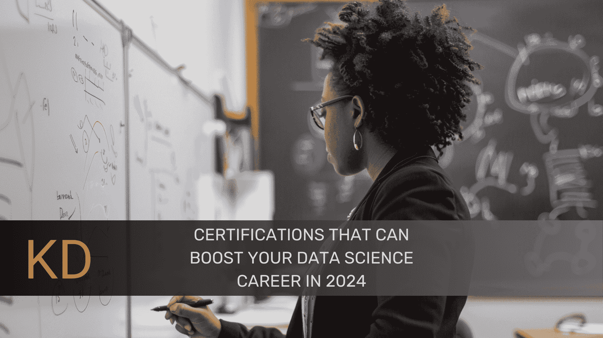

# 可以提升你 2024 年数据科学职业生涯的认证

> 原文：[`www.kdnuggets.com/certifications-that-can-boost-your-data-science-career-in-2024`](https://www.kdnuggets.com/certifications-that-can-boost-your-data-science-career-in-2024)

图片来源：Editor | Midjourney & Canva

在当今的数据科学领域，如何让自己从竞争中脱颖而出？数据科学认证可以大大提升你的职业生涯，证明你的技能并在 2024 年创造新的工作机会。数据科学证书有助于获取数据科学知识，也有助于验证我们在这一领域的技能。让我们来看看一些最佳的认证。

## 认证分析师专业 (CAP)

通过 [认证分析师专业认证](https://certifiedanalytics.org) 的候选人展示了在分析方面的熟练程度。候选人需要具有学士学位和五年的分析经验才能参加此考试。也可以用硕士学位和三年的经验或七年的非分析经验来替代。考试包括数据准备和模型构建等主题。

费用：会员 $375，非会员 $575

有效期：3 年

## Google 认证的专业数据工程师

[Google 认证的专业数据工程师认证](https://cloud.google.com/learn/certification/data-engineer) 证明了一个人在开发和设计 Google Cloud Platform 数据处理系统方面的技能。候选人应具备数据工程知识和 Google Cloud 产品的实际使用经验。虽然没有明确要求的正式资格，但申请者应至少有三年的相关领域工作经验。其中一年应专门致力于开发和实施与 Google Cloud 相关的概念。

费用：$200 USD

有效期：2 年

## 微软认证：Azure 数据科学家助理

[Azure 数据科学家助理认证](https://learn.microsoft.com/en-us/credentials/certifications/azure-data-scientist/?practice-assessment-type=certification) 验证了在 Azure 技术上实施和操作机器学习解决方案的能力。考试旨在测试在机器学习、自然语言处理和计算机视觉方面的熟练程度。它还展示了 Azure 的广泛工具箱和服务如何有助于开发可扩展和成功的机器学习系统。应该具备足够的数据科学概念知识和 Python 熟练度。

费用：$165

有效期：2 年

## SAS 认证数据科学家

[SAS 认证数据科学家证书](https://www.sas.com/en_gb/certification/credentials/advanced-analytics/data-scientist.html)表明候选人能够使用 SAS 进行数据分析。为了晋升为 AI 与机器学习专业或高级分析证书，必须通过高级编程和数据整理专业考试。此测试衡量候选人在数据分析过程中的理解和专业知识。这些技能包括数据的聚合、转换和清洗。

费用：$180

有效期：3 年

## IBM 数据科学专业证书

[IBM 数据科学专业证书在线课程](https://www.coursera.org/professional-certificates/ibm-data-science)涵盖的主题使学习者能够实践数据科学。课程参与者可以报名参加多个在线课程，这些课程可以成为追求数据科学职业的基础。初学者课程包括数据探索和可视化的概述。该项目还包括集中于数据科学高级领域的模块，如使用 Python 进行数据分析和使用 R 进行数据可视化。

费用：$234

有效期：证书不会过期

## Cloudera 认证专业（CCP）数据工程师

[Cloudera 认证数据工程师证书](https://www.cloudera.com/services-and-support/training/cdhhdp-certification/ccp-data-engineer.html)包括了大数据环境下数据工程的多个方面。它为候选人提供了设计强大且可扩展的数据管道的专业知识，以处理大规模数据。寻求此证书的候选人应具备数据工程原理的理解，并对大数据技术有充分的了解。

费用：$400

有效期：2 年

## [DASCA] 高级数据科学家（SDS）

[高级数据科学家证书](https://www.dasca.org/data-science-certifications/senior-data-scientist)认可那些在机器学习和数据科学建模方面表现出熟练度的个人。高级数据科学家认证有一些标准，候选人需要满足才能获得证书。相关领域的硕士学位，包括计算机科学、统计学、数学或相关学科，是其中之一。候选人还必须拥有至少五年的数据科学工作经验。

费用：$775

有效期：3 年

## 总结

在 2024 年，获得认证对提升你的数据科学职业至关重要，因为这有助于验证可信度，提高工作者的声誉，并开启晋升的新机会。在这方面，这些认证将帮助你证明你是一名有能力且愿意解决问题的数据科学工作者。

**[Jayita Gulati](https://www.linkedin.com/in/jayitagulati1998/)** 是一位机器学习爱好者和技术作家，她的热情驱动着她构建机器学习模型。她拥有利物浦大学的计算机科学硕士学位。

### 更多相关话题

+   [提升你的数据科学技能：你需要的关键 SQL 认证](https://www.kdnuggets.com/boost-your-data-science-skills-the-essential-sql-certifications-you-need)

+   [6 个最佳免费在线 Python 课程，提升你的职业生涯](https://www.kdnuggets.com/2022/11/corise-6-best-free-online-courses-python-boost-career.html)

+   [需求旺盛的 SAS 认证，助你成功](https://www.kdnuggets.com/2023/10/sas-in-demand-sas-certifications-success)

+   [5 个免费认证，助你找到第一份开发者工作](https://www.kdnuggets.com/5-free-certifications-to-land-your-first-developer-job)

+   [2024 年你不可错过的 5 个 AI 播客](https://www.kdnuggets.com/top-5-ai-podcasts-you-cant-miss-in-2024)

+   [2024 年你可以参加的 5 个顶级机器学习课程](https://www.kdnuggets.com/5-top-machine-learning-courses-you-can-take-in-2024)
