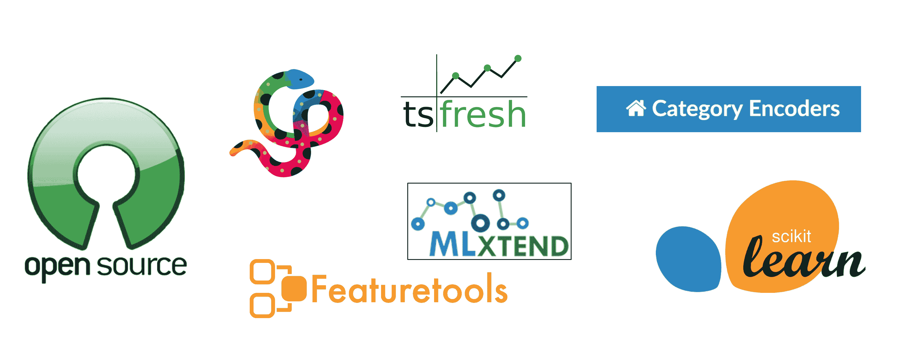

# 机器学习特征创建的挑战

> 原文：[`www.kdnuggets.com/2022/02/challenges-creating-features-machine-learning.html`](https://www.kdnuggets.com/2022/02/challenges-creating-features-machine-learning.html)


图片由 [Monsterkoi](https://pixabay.com/es/users/monsterkoi-65294/) 提供，来源于 [Pixabay](https://pixabay.com/es/photos/diente-de-le%C3%B3n-multicolor-de-colores-2817950/)

当我决定离开学术界并重新培训成为数据科学家时，我很快发现自己必须学习 R 或 Python，或者……两个都学。这可能是我第一次听说 Python。我从未想过三年后我会维护一个越来越受欢迎的开源 Python 特征工程库：[Feature-engine](https://feature-engine.readthedocs.io/en/latest/index.html)。

* * *

## 我们的前三个课程推荐

 1\. [Google 网络安全证书](https://www.kdnuggets.com/google-cybersecurity) - 快速进入网络安全职业的快车道。

 2\. [Google 数据分析专业证书](https://www.kdnuggets.com/google-data-analytics) - 提升你的数据分析技能

 3\. [Google IT 支持专业证书](https://www.kdnuggets.com/google-itsupport) - 支持你的组织 IT

* * *

在这篇文章中，我想探讨特征工程和选择的技术和操作挑战，然后介绍开源 Python 库 [Feature-engine](https://feature-engine.readthedocs.io/en/latest/index.html) 如何帮助我们应对这些挑战。我还将突出 Feature-engine 在其他 Python 库中的优点和缺点。让我们深入了解一下。

## **什么是** **Feature-engine?**

[Feature-engine](https://feature-engine.readthedocs.io/en/latest/index.html) 是一个开源 Python 库，用于特征工程和特征选择。它的工作方式类似于 Scikit-learn，通过 fit() 和 transform() 方法从数据中学习参数，然后使用这些参数对数据进行转换。

使用 Feature-engine，我们可以进行大量特征变换，比如填补缺失数据、编码分类变量、离散化数值变量以及通过数学函数如对数、平方根和指数变换变量。我们还可以组合现有特征来创建新特征、删除或屏蔽异常值，并从日期和时间中提取特征。


Feature-engine 拥有一个专门的 [模块](https://feature-engine.readthedocs.io/en/latest/api_doc/selection/index.html) 用于特征选择，包含在数据科学竞赛或组织内开发的特征选择技术，这些技术在 Scikit-learn 或其他 Python 库中都没有。我在 之前的文章 中讨论了一些这些技术。

## **是什么** **让** **Feature-engine 独特？**

有许多特点使得 Feature-engine 易于使用，并且成为特征工程的绝佳选择。首先，Feature-engine 包含了最全面的特征工程转换集合。其次，Feature-engine 可以对数据框中的特定变量组进行转换，我们只需在 Feature-engine 的转换器中指明需要转换的变量，而不需要额外的代码行或辅助类。第三，Feature-engine 能够自动识别数值型、类别型和日期时间型变量，使我们能够更容易地构建特征工程管道。第四，Feature-engine 接收一个数据框并返回一个数据框，使其既适合数据探索，也适合将模型部署到生产环境中。

Feature-engine 还具有其他特性，使其成为一个出色的库，比如全面的文档和大量示例、易于学习的功能，以及与 Scikit-learn Pipeline、Grid 和 Random 超参数搜索类的兼容性。

Feature-engine 旨在帮助用户进行有意义的数据转换。Feature-engine 会在转换不可能进行时提醒用户，例如，应用对负变量的对数或除以 0，转换后引入 NaN 值，或者用户输入的变量类型不合适。因此，你不需要等到过程结束时才发现问题，你会立刻知道！

## **为什么特征工程具有挑战性？**

首先，让我们定义一下特征工程。特征工程是利用领域知识创建或转换适合训练机器学习模型的变量的过程。它涉及从填充或删除缺失值，到编码类别变量，转换数值变量，从日期、时间、GPS 坐标、文本和图像中提取特征，并以有意义的方式将它们结合起来。话虽如此，这个过程的挑战是什么呢？

数据预处理和特征工程是**耗时的**。首先，我们需要收集一个代表性的数据集，以评估我们想要的总体。接下来，我们进行数据探索，以了解我们拥有的变量及其与目标的关系（如果有目标的话）。数据质量越差，或者我们对正在处理的数据了解得越少，我们在探索和准备数据上需要花费的时间就越多。最后，我们需要处理数据，使其处于可以被机器学习模型使用的状态。

数据预处理和特征工程是**重复性的**。我们对同一数据集中的各种变量以及跨项目的数据集执行相同的变换。很可能，我们的同事也在对他们的数据集进行相同的变换。简而言之，整个团队可能在对每一个变量、每一个数据集进行相同的变换。这依赖于下一个挑战：可重复性。我们如何确保来自不同同事的不同代码返回相同的功能？我们如何在已有的代码基础上构建，以加速未来的项目？

数据预处理和特征工程需要**可重复**。我们使用的代码，不论是项目还是团队成员，都需要在相同数据下获得相同的结果。因此，我们需要在项目和团队之间实现可重复性。但更重要的是，我们需要在研究环境和开发环境之间实现可重复性。什么？

一旦我们创建了一个消耗一些预处理数据的机器学习模型，我们需要将模型投入生产。很常见的是，这个过程涉及在生产环境中重新创建模型及整个特征工程变换。我们需要能够在生产环境中和在研究环境中评估的模型中，给定相同的数据获得相同的结果。这个过程自身也有挑战。首先，研究环境中的代码是否适合生产？还是我们需要对代码进行重大重构？特征工程方法，像机器学习模型一样，可以从数据中学习参数。我们如何存储这些参数以备后用？

特征工程还面临非技术挑战，如**可解释性**。我们能理解转换后的特征吗？通常，模型的用户需要理解为什么模型做出了某个决策。例如，欺诈调查员通常想知道为什么欺诈模型认为某个申请或客户可能存在欺诈行为。这意味着我们需要能够在观察级别解释预测，即对每个客户或每个申请进行解释。要解释一个预测，我们需要使用可解释的模型，并且还需要*可解释的特征*。这将影响我们选择的特征转换。例如，我们可以将特征之间进行某种多项式次序的组合。但这些转换生成的特征对我们来说是不可理解的。“年龄平方乘以收入立方”是什么意思？显然，有些对分类变量的编码方法生成的特征是人们无法理解的。因此，如果我们需要解释我们的模型，我们需要提供可解释的特征。

最终，机器学习模型需要**公平**。为了使模型公平，它们需要基于公平且无歧视的特征做出决策。一个具有歧视性的特征可能是性别，在某些情况下可能是年龄。我们还需要用具有代表性的数据集来训练模型。如果我们的模型将用于英国，我们可能应该基于来自英国人口的数据来训练我们的模型。

## **Feature-engine 如何帮助应对这些挑战？**

Feature-engine 的设计目的是通过避免编写重复的代码来减少数据转换所花费的时间，同时确保可重复性并返回可解释的特征。使用 Feature-engine，数据科学家无需从头编写每个转换，他们可以在 1 到 3 行代码中对多个变量实施每个转换。

Feature-engine 是版本控制的，这确保了研究环境和生产环境之间的可重复性。Feature-engine 的变换器经过彻底测试，确保它们返回预期的转换结果。通过在不同环境、项目和团队成员之间使用 Feature-engine 的变换器，我们确保每个人从相同的转换和数据中获得相同的结果，从而最大限度地提高了可重复性。

Feature-engine 专注于创建人们易于理解的变量。因此，每当模型做出决策时，我们可以理解该变量是如何影响该决策的。

## **难道已经没有足够的特征工程库了吗？**

当然，Feature-engine 不是首个出现的工具。还有其他优秀的 Python 库用于特征转换，如 [Pandas](https://pandas.pydata.org/)、[Scikit-learn](https://scikit-learn.org/stable/index.html)、[Category encoders](https://contrib.scikit-learn.org/category_encoders/)、[Featuretools](https://www.featuretools.com/) 和 [tsfresh](https://tsfresh.com/)，以及更多。Python 生态系统年年增长。



开源的 Python 特征工程和选择库。

Category encoders、Featuretools 和 tsfresh 解决了非常具体的问题。第一个用于编码分类变量，而 Featuretools 和 tsfresh 主要用于分类问题的时间序列。

Pandas 是一个出色的库，可以将数据转换与探索性数据分析结合起来。这可能是它成为首选工具的原因。但是，Pandas 默认不允许我们存储从数据中学习到的参数。Feature-engine 在 Pandas 之上工作，添加了这一功能。

Scikit-learn 另一方面允许我们应用广泛的数据转换，并且在某些情况下能够存储参数。例如，使用 Scikit-learn，我们可以应用常用的数据插补和分类编码方法来学习和存储参数。借助 FunctionTransformer()，我们原则上也可以对变量应用任何我们想要的转换。最初，Scikit-learn 变换器设计用于转换整个数据集。这意味着如果我们只想转换数据的子集，我们需要手动拆分数据或做一些变通处理。最近，他们在不断增加更多功能，以使这一点成为可能。Scikit-learn 变换器还将返回一个 Numpy 数组，适合用于训练机器学习模型，但不适合继续数据探索。

最后，通过 Pandas 和 Scikit-learn，我们可以实现最常用的数据预处理方法，但组织内或数据科学竞赛中开发的附加方法不可用。

## **返回** **到** **Feature-engine：它是如何工作的？**

Feature-engine 变换器的工作方式与 Scikit-learn 变换器完全相同。我们需要用一些参数实例化类，然后应用 fit() 方法以便变换器学习所需的参数，最后使用 transform() 方法来转换数据。

例如，我们可以通过指示要使用的插补方法和要修改的变量来实例化一个缺失数据插补器，如下所示：

```py
median_imputer = MeanMedianImputer(
    imputation_method = 'median', variables = ['variable_a', 'variable_b']
)
```

然后，我们在训练集上应用 fit() 方法，以便 imputer 学习每个变量的中位数值：

```py
median_imputer.fit(X_train)
```

最后，我们在任何我们想要的数据集上应用 transform 方法。这样，缺失的数据将按之前步骤中学习到的值填充到指定变量中：

```py
train_t = median_imputer.transform(X_train)
test_t = median_imputer.transform(X_test)
```

就这样。我们所需的两个变量中没有更多缺失数据了。

## **错误应用数据转换的风险是什么？**

特征工程是从我们的特征中提取更多价值的机会。在这方面，应用“错误”的数据转换（如果这种情况存在）将对机器学习模型的性能和可解释性产生连锁反应。

一些模型对数据做出假设。例如，线性模型假设特征与目标之间存在线性关系。如果我们的数据转换没有保持或创建这种线性关系，那么模型的性能将不会达到最佳水平。同样，一些模型对异常值非常敏感，因此不去移除或筛选它们可能会影响模型的性能。

模型性能下降有多严重？这取决于我们使用模型的目的。如果我们试图防止欺诈，模型性能的下降可能导致数千或数百万美元的损失，同时对其他消费者（无论是保险还是贷款）造成连锁反应。如果我们使用模型来优化广告，我认为这并不是一个很大的损失，因为……这只是广告。

如果我们使用模型来预测疾病、决定谁能获得签证或大学录取，那么问题的维度会有所不同。在第一个情况下，患者的健康处于危险之中。在后两种情况下，我们谈论的是人们的未来和职业，更不用说公平性和歧视问题。

最后一点让我再次回到可解释性上。我的特征是否公平和中立？还是存在歧视？我是否理解我的特征以及数据在变换后如何影响模型的预测？如果我不理解我的变量，我可能不应该用它们来训练模型。否则，我就不会知道为什么做出某些决策。

如果你想了解更多关于有偏见的模型所带来的后果，书籍《[数学毁灭武器](https://www.penguinrandomhouse.com/books/241363/weapons-of-math-destruction-by-cathy-oneil/)》对那些对被预测者产生负面影响的不公平模型进行了很好的回顾。而电影《[编码偏见](https://www.youtube.com/watch?v=jZl55PsfZJQ)》则告诉我们关于在未在训练数据集中代表的群体上使用模型的后果。

## **特征工程如何帮助减轻这些风险？**

我们提到一些模型假设特征与目标之间存在线性关系。Feature-engine 包含一系列变换，返回变换变量与目标之间的单调关系。因此，即使在原始数据中不存在线性或单调关系，也可以在变换后实现。而且，这种变换不会以可解释性为代价。通过存储的参数，我们几乎总是可以从变换后的变量回到原始数据。

我会争辩说，主要的优势在于 Feature-engine “强制” 用户使用领域知识来决定应用哪个变换。它通过不将所有变换集中到一个类中，而是将相关的变换分组到一个变换器中来实现。例如，使用 Scikit-learn 的 SimpleImputer()，我们可以应用所有常用的填充技术。Feature-engine 有 3 个变换器来涵盖整个 SimpleImputer() 功能。这是故意为之，以避免将适用于分类变量的变换应用到数值变量，或者将会显著扭曲变量分布的变换应用到数据点较少的变量上。

去中心化的设计贯穿于整个软件包，使我们能够在每个变换器中添加功能和信息，帮助用户理解该变换的优点和局限性，以及当变量不适用时会引发的错误。

## **什么时候 Feature-engine 不是最佳选择？**

Feature-engine 设计为与 pandas 数据框一起使用，迄今为止，大多数功能都针对表格或横截面数据。这些是使用 Feature-engine 的最佳条件。如果我们的数据不能存储在数据框中，或者不是表格形式，例如，我们有时间序列数据，那么目前 Feature-engine 不是合适的选择。

## **Feature-engine** 的下一步是什么？

在我们 2022 年 1 月的最新发布中，我们对文档进行了大幅改进，包括更多关于如何使用 Feature-engine 的变换器的解释和示例。我们还发布了一个新的变换器，用于自动从日期时间变量中提取特征，以及一个基于特征的群体稳定性指数的新选择算法，这在金融领域被广泛使用。

接下来，我们希望扩展 Feature-engine，以便为时间序列创建用于预测的特征。我们希望 Feature-engine 能够使用我们喜爱的 fit() 和 transform() 功能创建滞后特征和窗口特征。我们还希望扩展日期时间特征的功能，例如，通过创建日期时间变量组合的特征。例如，可以通过计算出生日期与申请时间之间的差值来确定年龄。

## **我们如何支持** **Feature-engine**？

如果你认为 Feature-engine 是一个很棒的工具，有很多方式可以[支持其进一步发展](https://feature-engine.readthedocs.io/en/latest/contribute/index.html#ways-to-contribute)和维护。你可以贡献代码以改善其功能，[捐赠以支持维护者](https://github.com/sponsors/solegalli)（也就是我），建议加入新功能，写博客，在会议上或与同事和学生讨论 Feature-engine，以及任何你能想到的传播途径。

Feature-engine 是一个包容性的项目。我们欢迎每一个人。如果你想为开源项目做出首次贡献，如果你是经验丰富的开发者，如果你想学习 Python 或机器学习，如果你想享受编程的乐趣，如果你有闲暇时间不知如何打发，如果你想教我们一些东西，或者你需要特定的功能，欢迎加入我们。我们很高兴欢迎你。

## **总结**

如果你已经读到这里，做得很好，谢谢你的阅读！

要为 Feature-engine 贡献代码，请查看我们的[贡献指南](https://feature-engine.readthedocs.io/en/latest/contribute/index.html)。尽管指南听起来很繁琐，但它们会在设置环境和解决 git 问题时节省你很多时间。

要了解更多关于 Feature-engine 的信息，请访问其[文档](https://feature-engine.readthedocs.io/en/latest/index.html)。要了解更多关于特征工程和特征选择的一般信息，请查看我的课程[机器学习中的特征工程](https://www.trainindata.com/p/feature-engineering-for-machine-learning)和[机器学习中的特征选择](https://www.trainindata.com/p/feature-selection-for-machine-learning)。

关于特征工程的其他开源库，可以查看[Category encoders](https://contrib.scikit-learn.org/category_encoders/)、[Featuretools](https://www.featuretools.com/)和[tsfresh](https://tsfresh.com/)。

要了解有关机器学习在使用不当时如何对人们生活产生负面影响的精彩讨论，请阅读书籍“[数学毁灭性武器](https://www.penguinrandomhouse.com/books/241363/weapons-of-math-destruction-by-cathy-oneil/)”。

就这些了，希望你喜欢这篇文章。

**[索莱达德·加利，博士](https://linkedin.com/in/soledad-galli)** 是 [Train in Data](https://www.trainindata.com/) 的首席数据科学家和机器学习讲师。索莱达德教授中级和高级数据科学及机器学习课程。她曾在金融和保险领域工作，2018 年获得 [数据科学领袖奖](https://www.information-age.com/data-leaders-awards-2018-revealed-123472520/)，并于 2019 年被评选为 "[LinkedIn 的声音](https://www.linkedin.com/pulse/linkedin-top-voices-2019-data-science-analytics-lorenzetti-soper/)"。她也是 Python 开源库 [Feature-engine](https://feature-engine.readthedocs.io/en/latest/index.html) 的创始人和维护者。索莱达德热衷于分享知识并帮助他人在数据科学领域取得成功。

### 更多相关主题

+   [企业中的机器学习：用例与挑战](https://www.kdnuggets.com/2022/08/dss-machine-learning-enterprise-cases-challenges.html)

+   [如何应对 3 个常见的机器学习挑战](https://www.kdnuggets.com/2022/09/comet-tackle-3-common-machine-learning-challenges.html)

+   [在机器学习模型中处理稀疏特征](https://www.kdnuggets.com/2021/01/sparse-features-machine-learning-models.html)

+   [Pip 安装指南：创建你的 Python 库入门](https://www.kdnuggets.com/pip-install-you-a-beginners-guide-to-creating-your-python-library)

+   [创建一个 Python 网络应用程序以从音频中提取主题](https://www.kdnuggets.com/2023/01/creating-web-application-extract-topics-audio-python.html)

+   [Mercury 概述：创建数据科学投资组合及…](https://www.kdnuggets.com/2022/05/overview-mercury-creating-data-science-portfolio-notebook-based-webapps.html)
