# 使用 5 行代码更改任何图像的背景

> 原文：[`www.kdnuggets.com/2020/11/change-background-image-5-lines-code.html`](https://www.kdnuggets.com/2020/11/change-background-image-5-lines-code.html)

评论

**由 [Ayoola Olafenwa](https://www.linkedin.com/in/ayoola-olafenwa-003b901a9/), 独立 AI 研究员**

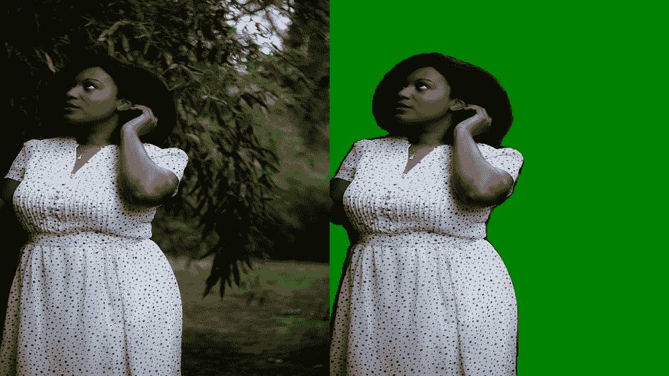

作者的照片拼贴

* * *

## 我们的前 3 个课程推荐

 1\. [Google Cybersecurity Certificate](https://www.kdnuggets.com/google-cybersecurity) - 快速进入网络安全职业生涯。

 2\. [Google Data Analytics Professional Certificate](https://www.kdnuggets.com/google-data-analytics) - 提升你的数据分析能力

 3\. [Google IT Support Professional Certificate](https://www.kdnuggets.com/google-itsupport) - 支持你所在的组织在 IT 方面

* * *

图像分割有许多令人惊叹的应用，可以解决不同的计算机视觉问题。PixelLib 是一个库，旨在确保图像分割在实际应用中的轻松集成。PixelLib 现在支持一种称为 *图像调优* 的功能。

**图像调优**：这是通过图像分割来更改图像背景的过程。图像分割的关键作用是从图像中去除分割出的对象，并将它们放置到新创建的背景中。这是通过为图像生成一个掩码并将其与修改后的背景合并来完成的。我们使用在 Pascal VOC 数据集上训练的 deeplabv3+ 模型。该模型支持 20 种常见的对象类别，这意味着你可以在图像中更改这些对象的背景。

该模型支持以下列出的对象：

```py
person,bus,car,aeroplane, bicycle, ,motorbike,bird, boat, bottle,  cat, chair, cow, dinningtable, dog, horse pottedplant, sheep, sofa, train, tv
```

*支持的背景效果有：*

**1** 用图片更改图像背景

**2** 为图像背景分配一个独特的颜色。

**3** 模糊图像背景

**4** 将图像背景转为灰度

安装 PixelLib 及其依赖项：

安装 Tensorflow：（PixelLib 支持 Tensorflow 2.0 及以上版本）

+   *pip3 install tensorflow*

安装 PixelLib：

+   pip3 install pixellib

如果已安装，请使用以下命令升级到最新版本：

+   pip3 install pixellib — upgrade

### **用图片更改图像背景**

PixelLib 使得只需 5 行代码即可更改任何图像的背景。

***sample.jpg***

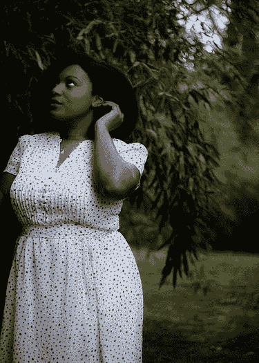

来源：[Unsplash.com by Leighann Blackwoo](https://unsplash.com/photos/nRVMVZvy6mo)

我们想用下面提供的图像更改上面的图像背景。

***background.jpg***

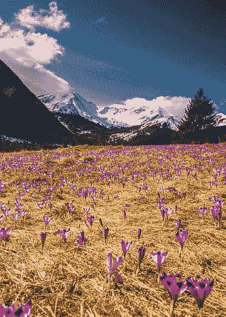

来源：[Unsplash.com by Dawid Zawila](https://unsplash.com/photos/9P2-bzjvIHk)

*更改图片背景的代码*

```py
import pixellibfrom pixellib.tune_bg import alter_bgchange_bg = alter_bg()
```

我们导入了 pixellib，并从 pixellib 导入了类*alter_bg*。我们创建了该类的一个实例。

```py
change_bg.load_pascalvoc_model("deeplabv3_xception_tf_dim_ordering_tf_kernels.h5")
```

我们加载了 deeplabv3+ 模型。从[这里](https://github.com/ayoolaolafenwa/PixelLib/releases/download/1.1/deeplabv3_xception_tf_dim_ordering_tf_kernels.h5)下载 deeplabv3+ pascalvoc 模型。

```py
change_bg.change_bg_img(f_image_path = "sample.jpg",b_image_path = "background.jpg", output_image_name="new_img.jpg")
```

我们调用了函数*change_bg_img*，该函数处理用图片更改图像背景的操作。

该函数接受以下参数：

*f_image_path*: 这是前景图像，即背景将被更改的图像。

*b_image_path*: 这是将用于更改前景图像背景的图像。

*output_image_name*: 背景已更改的新图像。

***输出图像***

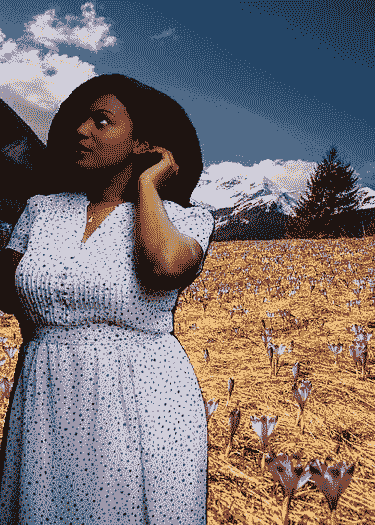

> 哇！这真是太美了，我们成功地替换了图像的背景。

我们可以利用 PixelLib 通过图像分割进行出色的前景和背景分离。

*获取更改后图像数组的代码*

对于专业用途，你可以通过下面的修改代码轻松获得更改后的图像数组。

### **为图像的背景分配不同颜色**

你可以为图像的背景分配不同的颜色，就像你可以用图片更改图像背景一样。这也可以通过五行代码实现。

*分配不同颜色到图像背景的代码*

这与上面用于用图片更改图像背景的代码非常相似。唯一的区别是我们将函数*change_bg_img*替换为*color_bg*，该函数处理颜色更改。

```py
change_bg.color_bg("sample.jpg", colors = (0, 128, 0), output_image_name="colored_bg.jpg")
```

函数*color_bg*接受参数*colors*，我们提供想要使用的颜色的 RGB 值。我们希望图像有一个绿色背景，颜色的 RGB 值设置为绿色，即*(0, 128, 0)*。

***绿色背景***

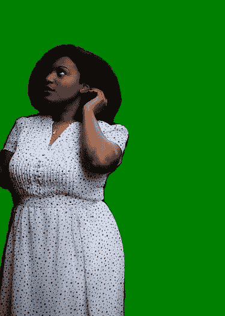

**注意：** 你可以通过提供颜色的 RGB 值来为图像的背景分配任何颜色**。**

```py
change_bg.color_bg("sample.jpg", colors = (255, 255, 255), output_image_name="colored_bg.jpg")
```

我们希望将图像的背景更改为*白色*，并将颜色的 RGB 值设置为白色，即*(255, 255, 255)*。

***白色背景***

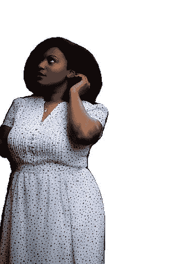

相同的图像，背景为白色。

*获取彩色图像输出数组的代码*

对于专业用途，你可以通过下面的修改代码轻松获得更改后的图像数组。

### **将图像背景转换为灰度**

使用 PixelLib 的相同行代码将任何图像的背景转换为灰度。

*将图像背景转换为灰度的代码*

```py
change_bg.gray_bg(“sample.jpg”,output_image_name=”gray_img.jpg”)
```

代码保持不变，只是调用了函数*gray_bg*来将图像背景转为灰度。

***输出图像***

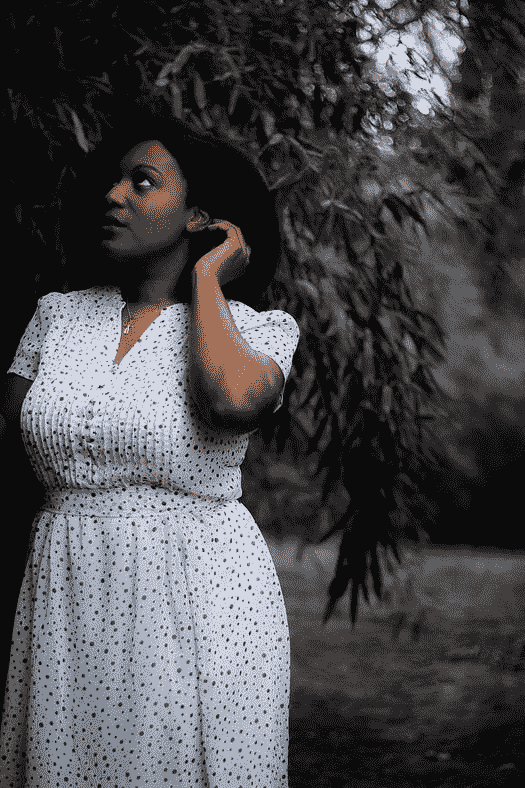

**注意：** 图像的背景将被更改，现有对象会保持其原始质量。

*获取灰度图像输出数组的代码*

### **模糊图像背景**

你可以应用模糊图像背景的效果，并且可以控制背景模糊的程度。

***sample2.jpg***

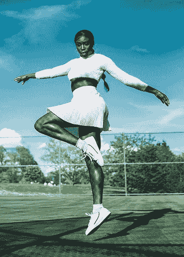

来源: [Unsplash.com by Airella Horvath](https://unsplash.com/photos/V4jPefMoo3E)

```py
change_bg.blur_bg("sample2.jpg", low = True, output_image_name="blur_img.jpg")
```

我们调用了函数 *blur_bg* 以模糊图像的背景，并将模糊效果设置为低。背景模糊程度有三个参数决定。

*low:* 当设置为 true 时，背景会被轻微模糊。

*moderate:* 当设置为 true 时，背景会被适度模糊。

*extreme:* 当设置为 true 时，背景会被深度模糊。

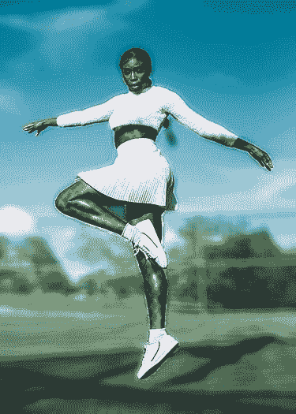

图像被轻微模糊。

```py
change_bg.blur_bg("sample2.jpg", moderate = True, output_image_name="blur_img.jpg")
```

我们希望适度模糊图像的背景，因此将 *moderate* 设置为 *true*。

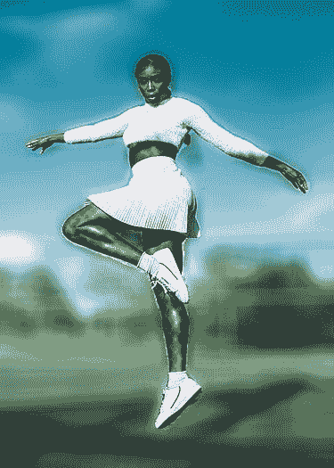

图像的背景以适度效果模糊。

```py
change_bg.blur_bg("sample2.jpg", extreme = True, output_image_name="blur_img.jpg")
```

我们希望将图像的背景深度模糊，因此将 *extreme* 设置为 *true*。

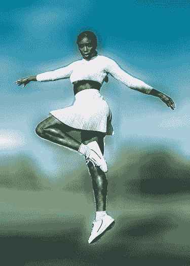

图像的背景被极度模糊。

*模糊图像背景的完整代码*

*获取模糊图像输出数组的代码*

**注意:** 了解如何将这些背景效果应用于视频和摄像头的实时画面，访问 [PixelLib 的 GitHub 仓库](https://github.com/ayoolaolafenwa/PixelLib) 和 [PixelLib 的文档](https://pixellib.readthedocs.io/en/latest/)。我将很快发布一篇解释如何将这些背景效果应用于视频和摄像头实时画面的文章。

通过以下方式联系我：

Email: [olafenwaayoola@gmail.com](https://mail.google.com/mail/u/0/#inbox)

Linkedin: [Ayoola Olafenwa](https://www.linkedin.com/in/ayoola-olafenwa-003b901a9/)

Twitter: [@AyoolaOlafenwa](https://twitter.com/AyoolaOlafenwa)

Facebook: [Ayoola Olafenwa](https://web.facebook.com/ayofen)

查看这些文章，了解如何使用 PixelLib 进行图像和视频中对象的语义和实例分割。

[**用 5 行代码进行图像分割**](https://towardsdatascience.com/image-segmentation-with-six-lines-0f-code-acb870a462e8)

使用 PixelLib 进行语义和实例分割。

[**用 5 行代码进行视频分割**](https://towardsdatascience.com/video-segmentation-with-5-lines-of-code-87f798afb93)

视频的语义和实例分割。

[**用 5 行代码进行 150 类对象的语义分割**](https://towardsdatascience.com/semantic-segmentation-of-150-classes-of-objects-with-5-lines-of-code-7f244fa96b6c)

使用 PixelLib 进行 150 类对象的语义分割

[**用 7 行代码进行自定义实例分割训练**](https://towardsdatascience.com/custom-instance-segmentation-training-with-7-lines-of-code-ff340851e99b)

用 7 行代码训练数据集，实现实例分割和对象检测。

**简介：[Ayoola Olafenwa](https://www.linkedin.com/in/ayoola-olafenwa-003b901a9/)** 是一位独立的 AI 研究员，专注于计算机视觉领域。

[原文](https://towardsdatascience.com/change-the-background-of-any-image-with-5-lines-of-code-23a0ef10ce9a)。经许可转载。

**相关内容：**

+   使用 TensorFlow 轻松进行图像数据集增强

+   使用深度学习自动旋转图像

+   计算机视觉路线图

### 更多相关主题

+   [NExT-GPT 介绍：任何对任何的多模态大型语言模型](https://www.kdnuggets.com/introduction-to-nextgpt-anytoany-multimodal-large-language-model)

+   [在不到 15 行代码中进行多模态深度学习](https://www.kdnuggets.com/2023/01/predibase-multi-modal-deep-learning-less-15-lines-code.html)

+   [如何从不同背景转型进入数据科学？](https://www.kdnuggets.com/2023/05/transition-data-science-different-background.html)

+   [SHAP：在 Python 中解释任何机器学习模型](https://www.kdnuggets.com/2022/11/shap-explain-machine-learning-model-python.html)

+   [如何在没有任何工作经验的情况下获得数据科学的第一份工作](https://www.kdnuggets.com/2021/02/first-job-data-science-without-work-experience.html)

+   [在参加任何免费的数据科学课程之前，请阅读此文](https://www.kdnuggets.com/read-this-before-you-take-any-free-data-science-course)
