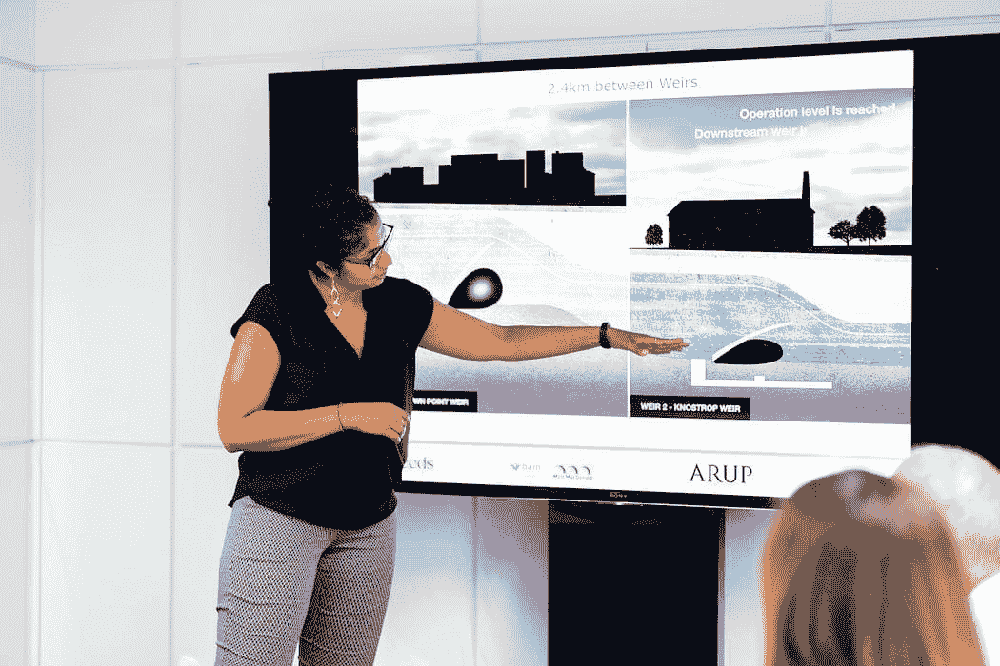
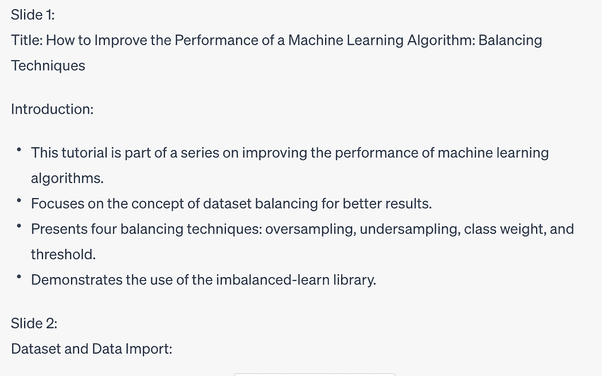

# 如何使用 ChatGPT 将文本转换为 PowerPoint 演示文稿

> 原文：[`www.kdnuggets.com/2023/08/chatgpt-convert-text-powerpoint-presentation.html`](https://www.kdnuggets.com/2023/08/chatgpt-convert-text-powerpoint-presentation.html)



图片由 [ThisisEngineering RAEng](https://unsplash.com/@thisisengineering?utm_source=medium&utm_medium=referral) 提供，来源于 [Unsplash](https://unsplash.com/?utm_source=medium&utm_medium=referral)

您是否厌倦了花费几个小时从冗长的文本中创建 PowerPoint 演示文稿？您是否希望有一种更快的方法将您的内容转换为引人入胜的幻灯片？使用 ChatGPT 仅需几分钟即可将文本转换为演示文稿。告别繁琐的复制粘贴，迎接高效而有效的演示解决方案！

* * *

## 我们的前三个课程推荐

 1\. [谷歌网络安全证书](https://www.kdnuggets.com/google-cybersecurity) - 快速进入网络安全职业道路

 2\. [谷歌数据分析专业证书](https://www.kdnuggets.com/google-data-analytics) - 提升您的数据分析水平

 3\. [谷歌 IT 支持专业证书](https://www.kdnuggets.com/google-itsupport) - 支持您的组织的 IT

* * *

要将文本转换为 PowerPoint 演示文稿，您只需执行两个步骤：

+   让 ChatGPT 总结您的文本

+   让 ChatGPT 编写 Python 代码，将总结转换为 PPTX 格式

# 步骤 1：将文本转换为幻灯片演示文稿

第一步是指示 ChatGPT 根据给定文本生成具有特定数量幻灯片的演示文稿。首先，您必须提供要转换的文本。

使用以下提示指示 ChatGPT 创建演示文稿：

**请将以下文本转换为十张幻灯片的演示文稿：[输入文本]**

ChatGPT 将生成类似于以下图中的文本：



作者提供的图片

需要注意的是，文本的长度和复杂性可能会影响生成的演示文稿的细节和连贯性。因此，建议保持原始文本简洁有序，以获得最佳效果。

# 步骤 2：使用 Python 将演示文稿转换为 PowerPoint 格式

现在您已经获得了生成的演示文稿，是时候将其转换为广泛使用的 PowerPoint 格式 .pptx。为此，我们将要求 ChatGPT 编写生成此格式的 Python 代码。

使用以下提示指示 ChatGPT 将演示文稿转换为 pptx：

**请编写 Python 代码以将之前的文本转换为 pptx 格式**

ChatGPT 将为你的幻灯片生成 Python 代码，例如下面的代码：

```py
from pptx import Presentation

# Create a presentation object
presentation = Presentation()

# Slide 1 - Title slide
slide1 = presentation.slides.add_slide(presentation.slide_layouts[0])
title = slide1.shapes.title
title.text = "Improving the Performance of a Machine Learning Algorithm"

# Slide 2 - Introduction
slide2 = presentation.slides.add_slide(presentation.slide_layouts[1])
content2 = slide2.shapes.title
content2.text = "Introduction"

# Slide 3 - Balancing Techniques
slide3 = presentation.slides.add_slide(presentation.slide_layouts[1])
content3 = slide3.shapes.title
content3.text = "Balancing Techniques"

# Slide 4 - Using imbalanced-learn library
slide4 = presentation.slides.add_slide(presentation.slide_layouts[1])
content4 = slide4.shapes.title
content4.text = "Using imbalanced-learn Library"

# Slide 5 - Data Import
slide5 = presentation.slides.add_slide(presentation.slide_layouts[1])
content5 = slide5.shapes.title
content5.text = "Data Import"

# Slide 6 - Model Building
slide6 = presentation.slides.add_slide(presentation.slide_layouts[1])
content6 = slide6.shapes.title
content6.text = "Model Building"

# Slide 7 - Imbalanced Dataset
slide7 = presentation.slides.add_slide(presentation.slide_layouts[1])
content7 = slide7.shapes.title
content7.text = "Imbalanced Dataset"

# Set the content for each slide
slides = [slide2, slide3, slide4, slide5, slide6, slide7]
content = [
    "This tutorial belongs to the series How to improve the performance of a Machine Learning Algorithm.",
    "A balanced dataset is a dataset where each output class is represented by the same number of input samples.",
    "Balancing techniques include oversampling, undersampling, class weight, and threshold.",
    "The imbalanced-learn library, part of the contrib packages of scikit-learn, is used in this tutorial.",
    "Data is imported using the pandas library, and the target class is created based on cuisine.",
    "The model is built using the Decision Tree algorithm, and evaluation metrics are calculated.",
    "The classification report and various plots are generated for the imbalanced dataset."
]

# Add content to each slide
for slide, content_text in zip(slides, content):
    content_placeholder = slide.placeholders[1]
    content_placeholder.text = content_text

# Save the presentation
presentation.save("machine_learning_presentation.pptx")
```

此外，ChatGPT 推荐你安装 `python-pptx` 库：

```py
pip install python-pptx
```

安装库后，你可以运行生成的代码来制作你的 PowerPoint 演示文稿。

观看下面的视频，看看 ChatGPT 如何实际应用！

# 摘要

恭喜你！你刚刚学会了如何使用 ChatGPT 将文本转换为 PowerPoint 演示文稿！

多亏了 ChatGPT 的惊人能力，将文本转换为 PowerPoint 演示文稿变得轻而易举。按照这篇博客文章中概述的两步过程，你可以迅速将冗长的文本转换为简明的演示文稿。

记得提供清晰且有组织的文本，以获得最佳效果。使用 ChatGPT 和几行 Python 代码，你可以用惊人的演示文稿吸引观众！

**[Angelica Lo Duca](https://www.linkedin.com/in/angelicaloduca/)** ([Medium](https://alod83.medium.com/)) (@alod83) 是意大利比萨国家研究委员会信息学与电信研究所（IIT-CNR）的研究员。她是比萨大学数字人文学科硕士课程中“数据新闻学”课程的教授。她的研究兴趣包括数据科学、数据分析、文本分析、开放数据、网络应用、数据工程和数据新闻学，应用于社会、旅游和文化遗产领域。她是《Comet for Data Science》一书的作者，该书由 Packt Ltd. 出版，以及即将出版的《Data Storytelling in Python Altair and Generative AI》一书，由 Manning 出版，同时也是即将出版的《Learning and Operating Presto》一书的合著者，该书由 O'Reilly Media 出版。Angelica 还是一位热情的技术作家。

[原文](https://medium.com/geekculture/how-to-use-chatgpt-to-convert-text-into-a-powerpoint-presentation-4c152e5a968a)。转载已获许可。

### 相关话题

+   [在数据科学面试中进行精彩的演示](https://www.kdnuggets.com/2022/01/deliver-killer-presentation-data-science-interviews.html)

+   [赢得会议室：创建和呈现有效的数据驱动演示](https://www.kdnuggets.com/2022/04/franks-winning-room-creating-delivering-effective-data-driven-presentation.html)

+   [如何使用 Pandas 将 JSON 数据转换为 DataFrame](https://www.kdnuggets.com/how-to-convert-json-data-into-a-dataframe-with-pandas)

+   [使用 tfidfvectorizer 将文本文档转换为 TF-IDF 矩阵](https://www.kdnuggets.com/2022/09/convert-text-documents-tfidf-matrix-tfidfvectorizer.html)

+   [认识 MetaGPT：将文本转换为 Web 应用的 ChatGPT 驱动 AI 助手](https://www.kdnuggets.com/meet-metagpt-the-chatgptpowered-ai-assistant-that-turns-text-into-web-apps)

+   [ChatGPT CLI：将你的命令行界面转变为 ChatGPT](https://www.kdnuggets.com/2023/07/chatgpt-cli-transform-commandline-interface-chatgpt.html)
