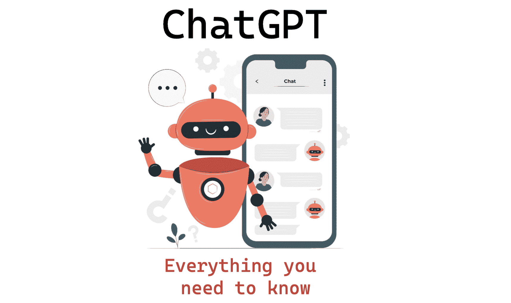
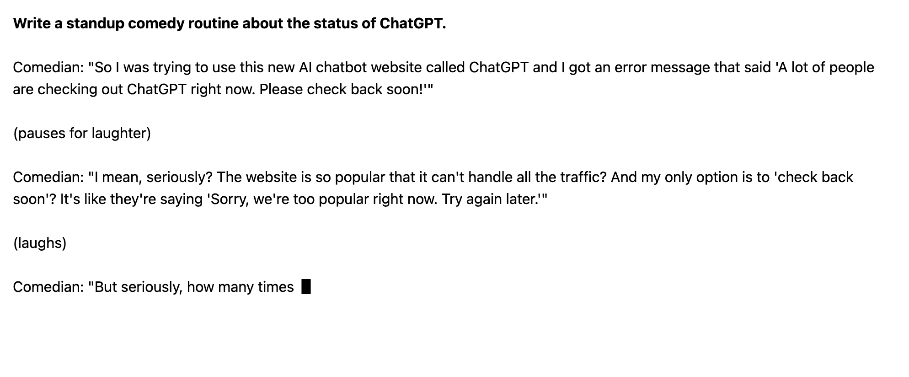
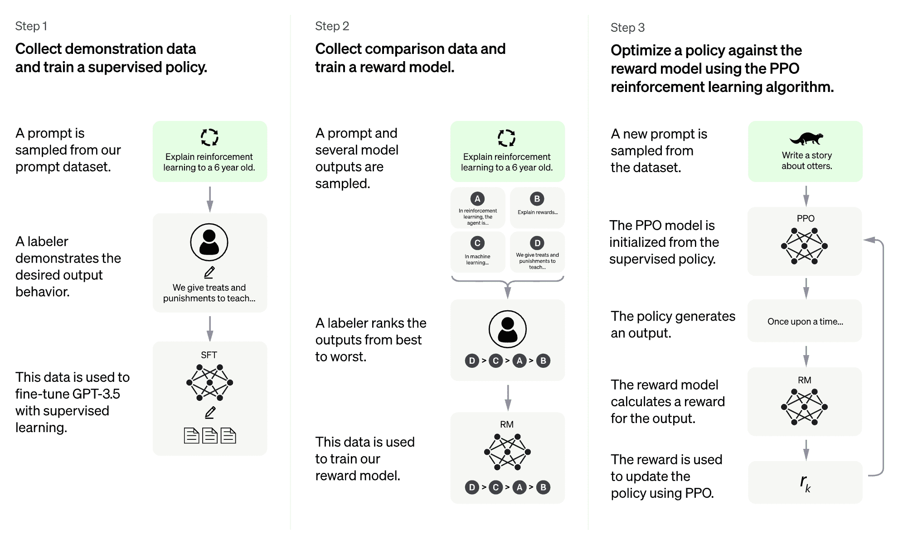

# ChatGPT: 你需要知道的一切

> 原文：[`www.kdnuggets.com/2023/01/chatgpt-everything-need-know.html`](https://www.kdnuggets.com/2023/01/chatgpt-everything-need-know.html)

图片来自[storyset on Freepik](https://www.freepik.com/free-vector/chat-bot-concept-illustration_13317063.htm#query=chatbot&position=0&from_view=search&track=sph)

在过去的几周里，你可能注意到这项新技术被提及到处都是：ChatGPT。有些人已经玩过它，而有些人完全不知道它是什么。本文将深入探讨你需要了解的关于 ChatGPT 的一切。

# 什么是 ChatGPT？

[ChatGPT](https://openai.com/blog/chatgpt/)是一个基于 AI 的聊天系统，由[OpenAI](https://openai.com/)于 2022 年 11 月推出。OpenAI 以创建 Whisper（自动语音识别系统）和 DALLE•2（AI 图像和艺术生成器）而闻名。

ChatGPT 使用公司的 GPT-3 技术。它代表生成预训练变换器 3，是一种自回归语言模型，利用深度学习生成类人的文本。它是一个语言处理 AI 模型，目前是最受欢迎的之一。

GPT-3 训练模型使用“生成预训练”训练方法，这意味着它的训练方式是预测下一个标记。为了实现这一点，模型需要一个初始提示文本，然后它将继续使用该初始提示生成文本。

该模型使用带有人工反馈的强化学习（RLHF）进行优化，以实现对话对话。该模型使用由人类编写的各种数据进行训练，以实现听起来像人的响应。

它与聊天机器人创建了自然、类人的互动。

# ChatGPT 能做什么？

[ChatGPT](https://chat.openai.com/auth/login)的截图

GPT-3 是一个拥有 1750 亿参数的语言模型，因此很难缩小所有 GPT-3 的能力范围。它是一个专注于语言的模型，因此对书面和口头语言有深入的理解。

ChatGPT 的一些应用场景包括：

+   编写短篇内容，如诗歌和打油诗

+   编写长篇内容，如研究论文。

+   以通俗的语言或深入的知识解释主题

+   头脑风暴主题和创意

+   个性化沟通，例如电子邮件回复

+   以自然和引人入胜的语调进行对话的虚拟助手

+   将长内容总结为较短的形式

+   语言翻译

+   营销内容

如果你曾经写过博客、论文或学位论文，你知道制作有价值内容所需的时间和精力。ChatGPT 的强大之处在于它能在几秒钟内生成写得很好的内容，并能够将复杂的主题简化。

# ChatGPT 如何工作？

如前所述，OpenAI 使用了来自人类反馈的强化学习（RLHF）。他们开始时使用监督性微调训练了一个初始模型。人类 AI 训练师扮演了用户和 AI 助手的角色，并提供了对话，以帮助构建自然且引人入胜的回应。

强化学习使用奖励信号/系统来帮助机器学习模型改进。OpenAI 收集了比较数据，即两个或更多模型响应的质量排序。OpenAI 获取了 AI 训练师与聊天机器人之间的对话，随机选择了一个模型生成的消息，抽样了几个替代完成，并让 AI 训练师对其质量进行排名。这使他们能够使用这些奖励模型，并使用近端策略优化进行微调。

以下是步骤：

图片来源于[OpenAI](https://openai.com/blog/chatgpt/)

# ChatGPT 的局限性

ChatGPT 存在局限性。

+   ChatGPT 对过去一年发生的世界事件的知识非常有限

+   它可能会误解你的提问

+   它可能会输出不正确的信息

+   如果你在初始提示中添加了太多元素或过于专业，ChatGPT 可能会感到不知所措

# 结论

ChatGPT 在其测试服务阶段目前已达到满负荷；不过，你可以通过填写此表格[这里](https://chat.openai.com/auth/login)来接收通知，当服务恢复时会通知你。

这篇文章总结了 ChatGPT，但如果你想深入了解 ChatGPT 的技术层面知识，我推荐阅读研究论文[语言模型是少样本学习者](https://arxiv.org/pdf/2005.14165.pdf)。

**[Nisha Arya](https://www.linkedin.com/in/nisha-arya-ahmed/)** 是一名数据科学家和自由技术作家。她特别关注提供数据科学职业建议或教程以及数据科学理论知识。她还希望探索人工智能如何能有利于人类生命的延续。作为一个热衷学习者，她寻求拓宽技术知识和写作技能，同时帮助他人。

* * *

## 我们的三大课程推荐

 1\. [Google 网络安全证书](https://www.kdnuggets.com/google-cybersecurity) - 快速进入网络安全职业领域。

 2\. [Google 数据分析专业证书](https://www.kdnuggets.com/google-data-analytics) - 提升你的数据分析能力

 3\. [Google IT 支持专业证书](https://www.kdnuggets.com/google-itsupport) - 支持你的组织 IT

* * *

### 更多相关主题

+   [ChatGPT 插件：你需要知道的一切](https://www.kdnuggets.com/2023/06/chatgpt-plugins-everything-need-know.html)

+   [KDnuggets 新闻，4 月 13 日：数据科学家应该了解的 Python 库……](https://www.kdnuggets.com/2022/n15.html)

+   [朴素贝叶斯算法：你需要知道的一切](https://www.kdnuggets.com/2020/06/naive-bayes-algorithm-everything.html)

+   [关于张量你需要知道的一切](https://www.kdnuggets.com/2022/05/everything-need-know-tensors.html)

+   [关于数据湖屋你需要知道的一切](https://www.kdnuggets.com/2022/09/everything-need-know-data-lakehouses.html)

+   [GPT-4：你需要知道的一切](https://www.kdnuggets.com/2023/03/gpt4-everything-need-know.html)
