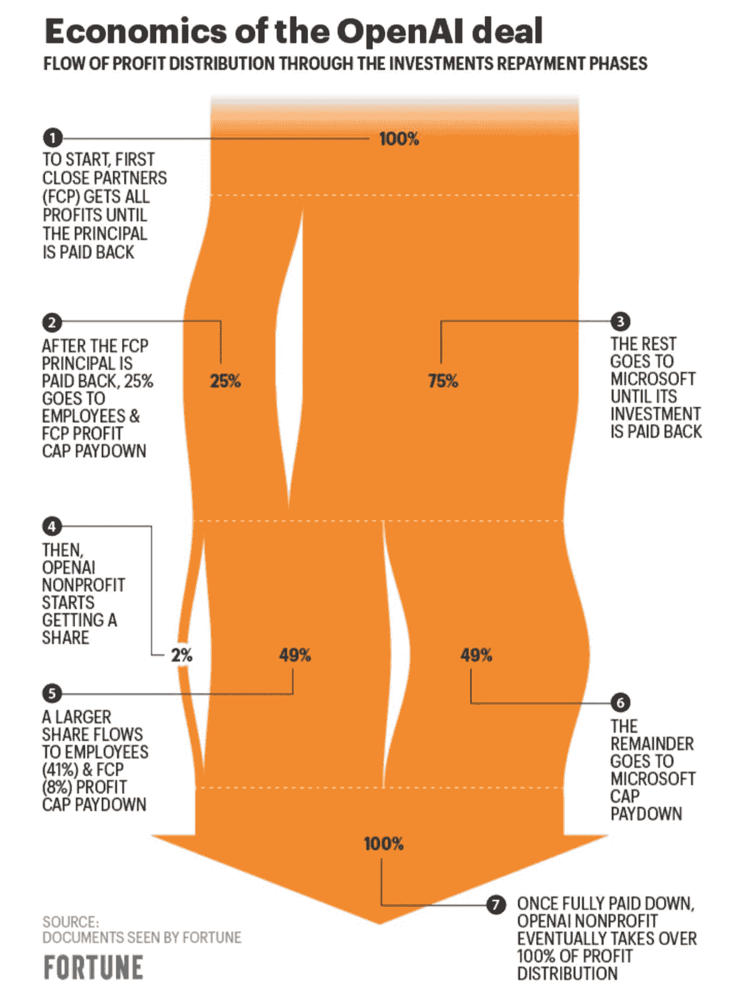

# ChatGPT, GPT-4, 和更多生成型 AI 新闻

> 原文：[`www.kdnuggets.com/2023/02/chatgpt-gpt4-generative-ai-news.html`](https://www.kdnuggets.com/2023/02/chatgpt-gpt4-generative-ai-news.html)

Robolawyer. 资料来源: Midjourney

如果你读过我的作品，你可能知道我主要在我的 AI 新闻通讯中发布文章，[算法桥](https://thealgorithmicbridge.substack.com/)。你可能不知道的是，我每周日都会发布一个特别专栏，我称之为“你可能错过的内容”，在其中我回顾一周发生的所有事情，并提供分析以帮助你理解新闻。

* * *

## 我们的前三名课程推荐

 1\. [谷歌网络安全证书](https://www.kdnuggets.com/google-cybersecurity) - 快速进入网络安全职业轨道。

 2\. [谷歌数据分析专业证书](https://www.kdnuggets.com/google-data-analytics) - 提升你的数据分析技能

 3\. [谷歌 IT 支持专业证书](https://www.kdnuggets.com/google-itsupport) - 支持你的组织 IT

* * *

# ChatGPT, ChatGPT, 还有更多的 ChatGPT

## 微软-OpenAI 100 亿美元交易

[Semafor 报道](https://www.semafor.com/article/01/09/2023/microsoft-eyes-10-billion-bet-on-chatgpt) 说，如果一切按计划进行，微软将在 1 月底之前与 OpenAI 达成 100 亿美元的投资交易（微软首席执行官萨蒂亚·纳德拉在周一正式宣布了[扩展合作伙伴关系](https://blogs.microsoft.com/blog/2023/01/23/microsoftandopenaiextendpartnership/)）。

关于这笔交易曾有一些误信息，暗示 OpenAI 高管对公司的长期生存能力没有信心。然而，[后来澄清](https://fortune.com/2023/01/11/structure-openai-investment-microsoft/) 这笔交易的情况如下：

文章来源：[财富](https://fortune.com/2023/01/11/structure-openai-investment-microsoft/)

撰写《The Neuron》的 Leo L’Orange，[解释](https://twitter.com/nonmayorpete/status/1613234091197071360)说，“一旦 92 亿美元的利润加上 130 亿美元的初始投资还给微软，其他风险投资者赚取 150 亿美元后，所有股权将返回给 OpenAI。”

人们意见分歧。有些人说这笔交易“酷”或“有趣”，而另一些人则说它“奇怪”和“疯狂”。我以非专业的眼光来看，OpenAI 和 Sam Altman 确实*相信*（有人说是*过度相信*）公司长期实现目标的能力。

然而，正如 [Will Knight 在 WIRED 上写的](https://www.wired.com/story/chatgpt-has-investors-drooling-but-can-it-bring-home-the-bacon/)，“不清楚基于这项技术可以构建出什么产品。” OpenAI 必须尽快找出一个可行的商业模式。

## ChatGPT 的变化：新功能和盈利模式

[OpenAI 在 1 月 9 日更新了 ChatGPT](https://help.openai.com/en/articles/6825453-chatgpt-release-notes)（相比 12 月 15 日的上一次更新）。现在聊天机器人具有“改进的事实准确性”，并且你可以在生成过程中停止它。

他们还在开发一个“专业版 ChatGPT”（据传售价为 [42 美元/月](https://twitter.com/DotCSV/status/1616742341389291520)），OpenAI 的总裁 [Greg Brockman 在 1 月 11 日宣布](https://twitter.com/gdb/status/1612986134048698369)。这是三个主要特点：

> “随时可用（没有停机时间）。
> 
> 来自 ChatGPT 的快速响应（即没有限制）。
> 
> 你需要多少条信息（至少是常规每日限制的 2 倍）。

要注册候补名单，你必须 [填写一个表格](https://docs.google.com/forms/d/e/1FAIpQLSfCVqahRmA5OxQXbRlnSm531fTd8QBdUCwZag7mI9mrlOOIaw/viewform)，其中询问你愿意支付的金额（以及多少金额过高）。

如果你打算认真对待它，你应该考虑深入了解 OpenAI 的产品堆栈，参考一下 [OpenAI cookbook repo](https://github.com/openai/openai-cookbook)。Bojan Tunguz 说这是 “[本月 GitHub 上最受欢迎的仓库](https://twitter.com/tunguz/status/1612435428300423168)”。这总是一个好兆头。

## ChatGPT，这位虚假的科学家

ChatGPT 已经进入科学领域。 [Kareem Carr](https://twitter.com/kareem_carr/status/1613325029848092672) 在星期四发布了一张截图，显示 ChatGPT 是一篇论文的共同作者。

[来源](https://twitter.com/kareem_carr/status/1613325029848092672)

但为什么，既然 ChatGPT 只是一个工具？“人们开始将 ChatGPT 当作一个真正的、资质良好的科学 *合作者*，”Gary Marcus 在 [一篇 Substack 文章](https://garymarcus.substack.com/p/scientists-please-dont-let-your-chatbots) 中解释道。“科学家们，请不要让你们的聊天机器人变成共同作者，”他恳求道。

更令人担忧的是那些没有披露 AI 使用情况的案例。科学家 [发现](https://www.biorxiv.org/content/10.1101/2022.12.23.521610v1) 他们无法可靠地识别由 ChatGPT 撰写的摘要——它那华丽的胡说八道甚至欺骗了领域内的专家。正如在牛津大学“研究技术和法规”的 Sandra Wachter 向 Holly Else 讲述的 [《自然》上的一篇文章](https://www.nature.com/articles/d41586-023-00056-7) 中提到的：

> *“如果我们现在处于专家无法判断什么是真实的情况，我们就失去了我们迫切需要的中介来引导我们通过复杂的话题。”*

## ChatGPT 对教育的挑战

ChatGPT 在全球教育中心被禁用（例如，[纽约公立学校](https://www.theguardian.com/us-news/2023/jan/06/new-york-city-schools-ban-ai-chatbot-chatgpt)、[澳大利亚大学](https://www.republicworld.com/world-news/australia/australian-universities-to-go-back-to-pen-and-paper-exam-after-students-caught-using-ai-tool-articleshow.html)和[英国讲师](https://www.theguardian.com/technology/2023/jan/13/end-of-the-essay-uk-lecturers-assessments-chatgpt-concerns-ai)正在考虑此事)。正如我在[上一篇文章](https://thealgorithmicbridge.substack.com/p/chatgpt-and-the-future-present-were)中所争论的，我认为这不是最明智的决定，而只是对生成式 AI 快速发展的反应。

[NYT 的 Kevin Roose 认为](https://www.nytimes.com/2023/01/12/technology/chatgpt-schools-teachers.html)“[ChatGPT]作为教育工具的潜力超过了它的风险。”伟大的数学家 Terence Tao，[同意](https://twitter.com/DataChaz/status/1612766340321796096)：“从长远来看，似乎对抗这一点是徒劳的；也许我们作为讲师需要做的是转向‘开卷考试，开放 AI’的模式。”

[Giada Pistilli](https://www.linkedin.com/posts/giada-pistilli-295a36a1_why-schools-should-not-ban-chatgpt-activity-7019290804770721792-gc9H/)，Hugging Face 的首席伦理学家，解释了学校面临的 ChatGPT 挑战：

> *“不幸的是，教育系统似乎被迫适应这些新技术。我认为这种反应是可以理解的，因为很少有人提前预见、缓解或制定替代解决方案以应对可能出现的问题。颠覆性技术通常需要用户教育，因为它们不能仅仅被随意地丢给人们。”*

最后一段完美地捕捉了问题的根源和潜在的解决方案。我们必须额外努力教育用户如何使用这项技术以及什么是可能的和不可能的。这就是加泰罗尼亚所采取的方法。正如[Francesc Bracero 和 Carina Farreras 在 La Vanguardia](https://www.lavanguardia.com/vida/20230115/8683575/chatgtp-irrumpe-aulas-revoluciona.html)报道的那样：

> *“在加泰罗尼亚，教育部不会在‘整个系统和所有人’中禁止它，因为这将是无效的措施。根据部门的消息，更好的做法是要求各中心进行 AI 使用的教育，‘它可以提供大量知识和优势。’”*

## 学生的最佳朋友：ChatGPT 错误数据库

Gary Marcus 和 Ernest Davis 建立了一个“[错误追踪器](https://researchrabbit.typeform.com/llmerrors?typeform-source=garymarcus.substack.com)”，用来捕捉和分类像 ChatGPT 这样的语言模型所犯的错误（[这里有更多信息](https://garymarcus.substack.com/p/large-language-models-like-chatgpt) 关于他们为什么编写这个文档以及他们的计划）。

该数据库是公开的，任何人都可以参与。这是一个很好的资源，允许对这些模型的行为不端进行严格研究，并且可以帮助人们避免误用。这里有一个令人捧腹的例子，说明了为什么这很重要：

[来源](https://twitter.com/LiquidSloshalot/status/1614384524024250368)

OpenAI 已意识到这一点，并希望打击误导和虚假信息：“[预测语言模型在虚假信息运动中的潜在误用——以及如何减少风险](https://openai.com/blog/forecasting-misuse/)。”

# GPT-4 信息与误信息

## 新信息

[Sam Altman 暗示](https://twitter.com/readkrystalhu/status/1613761499612479489) GPT-4 的发布会有延迟，在与 [Connie Loizos](https://twitter.com/Cookie) 的对话中透露，Loizos 是 TechCrunch 的硅谷编辑。Altman 说：“一般来说，我们会比人们希望的更慢地发布技术。我们会等待更长时间……”这是我的看法：

[来源](https://twitter.com/Alber_RomGar/status/1613880177733341184)

（Altman 还提到正在开发一个视频模型！）

## 关于 GPT-4 的误信息

在社交媒体上，“GPT-4 = 100T”的说法正广泛传播（我主要在 Twitter 和 LinkedIn 上见到过）。如果你还没看到，它的样子是这样的：

[来源](https://twitter.com/AlexHormozi/status/1612913266195587072)

或者这样：

[来源](https://twitter.com/SimonHoiberg/status/1613089457116258306)

所有这些都是相同内容的略微不同版本：一个吸引注意的视觉图表，以及一个关于 GPT-4/GPT-3 比较的强有力的钩子（他们用 GPT-3 作为 ChatGPT 的替代品）。

我认为分享谣言和猜测并将其框架化是可以的（[我对此部分负责](https://thealgorithmicbridge.substack.com/p/gpt-4-a-viral-case-of-ai-misinformation)），但以权威语气发布不可验证的信息且没有参考文献则是令人谴责的。

做这些的人距离成为信息来源中像 ChatGPT 一样无用且危险的程度并不远——并且他们有更强的动机继续这样做。请注意这点，因为它会污染未来所有关于 AI 的信息渠道。

# 更多生成式 AI 新闻

## 一位机器人律师

Joshua Browder，DoNotPay 的 CEO，[在 1 月 9 日发布了这个](https://twitter.com/jbrowder1/status/1612312707398795264)：

[来源](https://twitter.com/jbrowder1/status/1612312707398795264)

不出所料，这一大胆的声明引发了[大量辩论](https://www.cbsnews.com/news/ai-powered-robot-lawyer-takes-its-first-court-case/)，以至于 Twitter 现在将该推文标记为链接到[最高法院禁止物品页面](https://www.supremecourt.gov/visiting/prohibited-items.aspx)。

即使他们由于法律原因最终无法做到这一点，从伦理和社会角度考虑这个问题仍然是值得的。如果 AI 系统犯了严重的错误会发生什么？没有律师的[人](https://twitter.com/harikunzru/status/1612614168062087168)是否可以从这一技术的成熟版本中受益？

## 对稳定扩散的诉讼已开始

Matthew Butterick[1 月 13 日发布了这篇文章](https://stablediffusionlitigation.com/):

> *“代表三位杰出的*[*原告艺术家*](https://stablediffusionlitigation.com/#plaintiffs)* — *[*莎拉·安德森*](https://stablediffusionlitigation.com/#sarah-andersen)*，*[*凯莉·麦克尔南*](https://stablediffusionlitigation.com/#kelly-mckernan)* 和 *[*卡拉·奥尔蒂斯*](https://stablediffusionlitigation.com/#karla-ortiz)* — 我们对*[*稳定性 AI*](https://stablediffusionlitigation.com/#stability-ai)*，*[*偏离艺术*](https://stablediffusionlitigation.com/#deviantart)* 和 *[*Mid­jour­ney*](https://stablediffusionlitigation.com/#midjourney)* 提起了集体诉讼，因其使用了*[*稳定扩散*](https://stability.ai/blog/stable-diffusion-announcement)*，这是 21 世纪的一种拼贴工具，重混了数百万艺术家的受版权保护的作品，这些作品被用作训练数据。”*

这开始了——这是一个漫长的斗争的第一步，旨在调节生成性 AI 的训练和使用。我同意这种动机：“AI 需要对每个人都公平和道德。”

但是，像[许多人一样](https://twitter.com/NickEMoran/status/1614315147832565768)，我发现了博客文章中的不准确之处。它深入探讨了稳定扩散的技术细节，但未能正确解释一些部分。这是否是作为弥合技术差距的手段，还是为了以对其有利的方式描述技术的意图，尚无定论。

我曾在[上一篇文章](https://thealgorithmicbridge.substack.com/i/96141502/a-peaceful-coexistence-with-generative-ai)中争论，目前 AI 艺术与传统艺术家的冲突非常情绪化。这一诉讼的反应也不会有所不同。我们将不得不等待法官决定结果。

## CNET 发布 AI 生成的文章

[《未来学》报道](https://futurism.com/the-byte/cnet-publishing-articles-by-ai) 这件事是在几周前：

> *“*CNET*，一个极受欢迎的科技新闻网站，一直在悄悄地利用‘自动化技术’——AI 的风格性委婉说法——来撰写新一波的财务解释文章。”*

Gael Breton，最初发现此事的人，[在周五写了更深入的分析](https://www.authorityhacker.com/has-ai-already-won/)。他解释说，谷歌似乎并未阻碍这些帖子流量。“AI 内容现在可以接受了吗？”[他这样问道](https://twitter.com/GaelBreton/status/1613110191029121024)。

我认为 CNET 的决定 [完全披露 AI 的使用](https://www.cnet.com/tech/cnet-is-experimenting-with-an-ai-assist-heres-why/) 是一个很好的先例。现在有多少人正在使用 AI 发布内容却没有披露？然而，结果可能是，如果这一做法奏效，人们可能会失业（正如我和许多人所 [预测的](https://thealgorithmicbridge.substack.com/p/generative-ai-my-enhancement-your)）。[这已经在发生了](https://twitter.com/JasonColavito/status/1611710986871767041)：

[来源](https://twitter.com/JasonColavito/status/1611710986871767041)

我完全同意 Santiago 的这条推文：

[来源](https://twitter.com/svpino/status/1610984481342771200)

## 用于图像生成的 RLHF

如果通过人类反馈的强化学习对语言模型有效，那么对文本到图像是否也有效呢？这正是 PickaPic 尝试实现的目标。

[这个演示](https://pickapic.io/)用于研究目的，但可能是对稳定扩散或 DALL-E 的一个有趣补充（Midjourney 也做类似的事情——他们在内部指导模型输出美丽和艺术的图像）。

## 一份“让 Siri/Alexa 提升 10 倍”的配方

将不同生成型 AI 模型混合以创建比各部分之和更好的成果的配方：

[来源](https://twitter.com/DrJimFan/status/1612496633056620545)

**[Alberto Romero](https://medium.com/@albertoromgar)** 是一名自由撰稿人，专注于科技和 AI。他撰写了 [The Algorithmic Bridge](https://thealgorithmicbridge.substack.com/)，这是一个帮助非技术人员理解 AI 新闻和事件的通讯。他也是 CambrianAI 的技术分析师，专注于大型语言模型。

[原始内容](https://albertoromgar.medium.com/chatgpt-gpt-4-and-more-generative-ai-news-17e0b114a96c)。经许可转载。

### 更多相关话题

+   [谷歌通过将生成型 AI 添加到 Docs 和 Gmail 来回应 ChatGPT](https://www.kdnuggets.com/2023/03/google-answer-chatgpt-adding-generative-ai-docs-gmail.html)

+   [本周 AI，8 月 7 日：生成型 AI 来到 Jupyter 和 Stack…](https://www.kdnuggets.com/2023/mm/this-week-ai-2023-08-07.html)

+   [视觉 ChatGPT: 微软将 ChatGPT 与 VFM 结合](https://www.kdnuggets.com/2023/03/visual-chatgpt-microsoft-combine-chatgpt-vfms.html)

+   [ChatGPT CLI: 将您的命令行界面转换为 ChatGPT](https://www.kdnuggets.com/2023/07/chatgpt-cli-transform-commandline-interface-chatgpt.html)

+   [KDnuggets 新闻，6 月 29 日：数据科学的 20 条基本 Linux 命令…](https://www.kdnuggets.com/2022/n26.html)

+   [梦与现实之间：生成文本与幻觉](https://www.kdnuggets.com/between-dreams-and-reality-generative-text-and-hallucinations)
