# 使用 ChatGPT 学习 SQL

> 原文：[`www.kdnuggets.com/2023/04/chatgpt-learn-sql.html`](https://www.kdnuggets.com/2023/04/chatgpt-learn-sql.html)

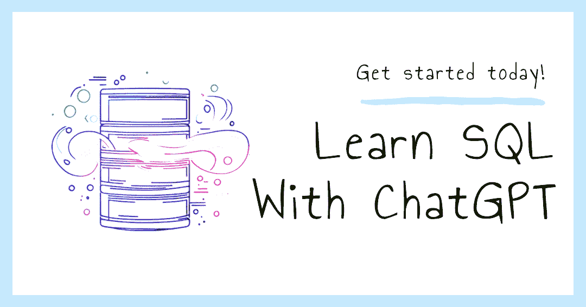

图片由编辑 | Microsoft Designer

ChatGPT 能做许多很酷的事情。其中之一是编写代码。[**你只需给出正确的指令，ChatGPT 就会为你完成任务。**](https://medium.com/geekculture/5-chatgpt-features-to-boost-your-daily-work-404478fd70ca)

如果你想学习 SQL，ChatGPT 是一个很好的资源来入门。它可以帮助你使用自然语言创建 SQL 查询，解决你可能遇到的任何编码问题，甚至帮助你理解你不明白的预定义查询。

**在本文中，我将概述如何使用 ChatGPT 学习 SQL 并在这项有价值的技能上变得熟练。**

让我们一起搞清楚！????????

首先，ChatGPT 到底是什么？

*ChatGPT 是一个由 OpenAI 训练的大型语言模型。它能够根据收到的输入生成类人的文本，可以用来回答问题并与人们进行对话。*

所以基本上，我们可以利用它的知识——以及它以非常简单和*人性化*的方式告诉我们任何事情的能力——**来理解 SQL 并从中学习。**

# #步骤 1：设置 ChatGPT

要开始使用 ChatGPT，你需要注册一个账户[*这里*](https://chat.openai.com/chat).

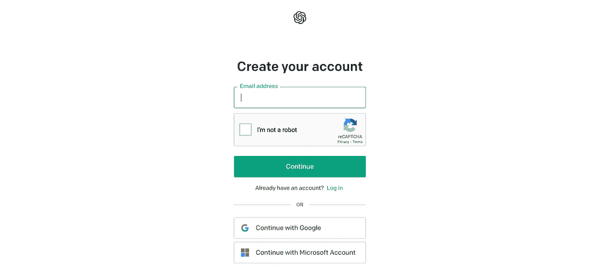

注册 ChatGPT 显示。

你需要提供你的电子邮件地址和电话号码才能开始使用 ChatGPT。

# #步骤 2：学习如何与 ChatGPT 互动

一旦你启用了 ChatGPT，你应该会看到以下显示：

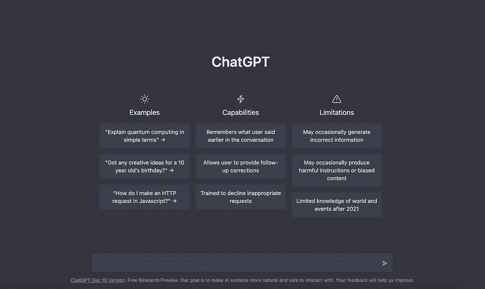

ChatGPT 聊天显示的屏幕截图。

在下方的输入框中，我们可以写下任何内容以开始与 ChatGPT 互动。由于我将打扰她——或者他——一段时间，我先提前道歉 ;)


自制 gif。ChatGPT 回答我的第一条消息。

# #步骤 3：问任何你能想象的事情——它都会回答你。

现在，我们可以开始向 ChatGPT 提问。我将专注于学习 SQL。我们可以通过 ChatGPT 询问 5 个主要的内容来提高我们的 SQL 技能。

# 1\. 向我们解释 SQL 中的任何概念或命令

当接触一种新的编程语言时，我们通常会对每个命令产生很多疑问和困惑。**ChatGPT 可以通过简单的解释帮助我们理解任何命令，并根据我们的要求提供尽可能多的使用示例。**

让我们从 SQL 中最基本的东西开始——`SELECT`命令。

> 简要解释一下`*SELECT*`命令及其用法示例

ChatGPT 给出简短的回答，解释了`SELECT`命令，并给出了最基本的示例：*SELECT * FROM*

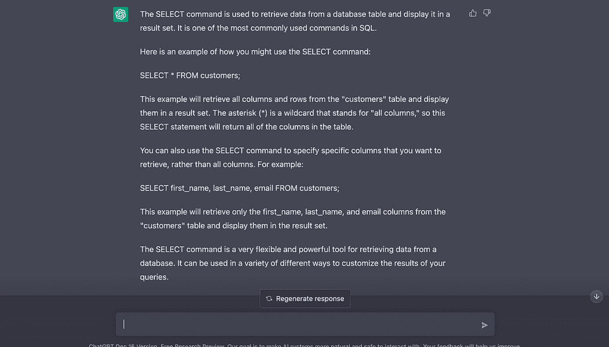

ChatGPT 聊天的截图。

但是，我可以进一步询问 `SELECT` 命令。

> 解释一下 `*SELECT*` 命令及其一些使用示例

正如你在下面的图片中观察到的那样，ChatGPT 解释了该命令的基础知识，并给出了几个使用示例。


ChatGPT 聊天的截图。给出更多 `SELECT` 命令的示例。

你可以尝试询问任何你能想象到的命令，例如像 `HAVING` 这样的更具挑战性的命令。

> 给我一些 SQL 中 `HAVING` 命令的示例

ChatGPT 通过以下几个示例进行了回答：

1.  要查找所有薪资高于平均薪资的员工的名字和薪水，你可以使用如下查询：

```py
SELECT 
     name, 
     salary
FROM employees
GROUP BY name
HAVING salary > (SELECT AVG(salary) FROM employees);
```

2\. 要找到过去一年内下过超过 10 个订单的所有客户的名字，你可以使用如下查询：

```py
SELECT 
     name 
FROM customers 
WHERE customer_id 
IN 
(
  SELECT customer_id 
  FROM orders 
  WHERE date >= DATEADD(year, -1, GETDATE()) 
  GROUP BY customer_id 
  HAVING COUNT(*) > 10
);
```

当然，我们可以继续询问更多的解释和示例。尝试任何你能想到的其他命令，它都会立即回答。

## 2\. 你可以询问如何在 SQL 中做某事，ChatGPT 会告诉你使用哪个（或哪些）命令。

我可以询问如何执行特定的操作，ChatGPT 会告诉我需要使用哪个命令。

> 我想要合并两个表，在 SQL 中我应该使用什么命令？

ChatGPT 告诉我使用任何连接命令，正如你在下面的图片中观察到的那样。

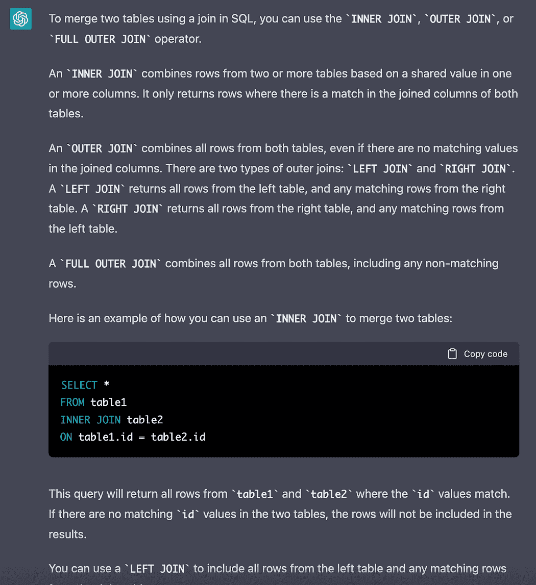

ChatGPT 聊天的截图。解释如何合并两个表。

不过，我知道我只想在某些特定列中行有相同值时合并两个表。在这种情况下，我可以再次询问，了解我应该使用什么命令。

> 我想要合并两个表，并只获取在某些给定列中有相同值的数据。

因此，ChatGPT 让我知道只有 `INNER JOIN` 允许我这样做，正如你在下面的图片中观察到的那样：

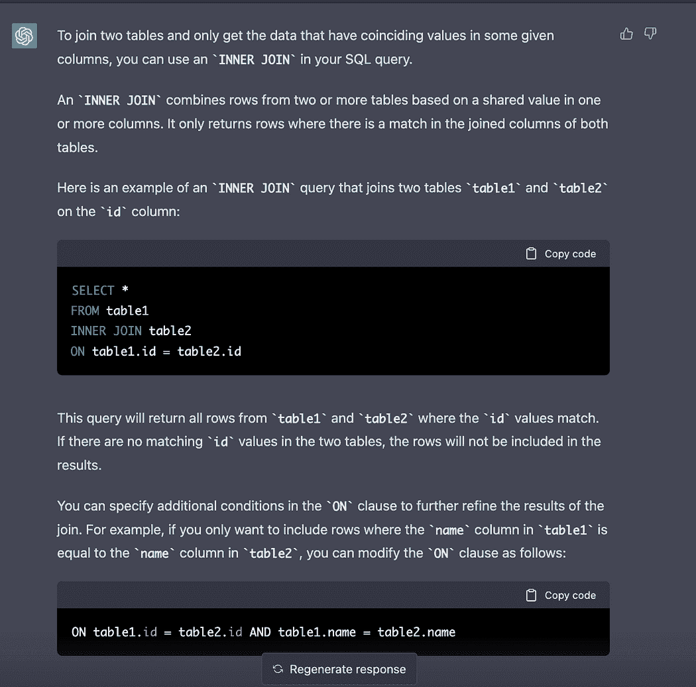

ChatGPT 聊天的截图。解释如何合并两个表并仅保留具有相同值的数据。

它给出了相应的查询：

```py
SELECT 
    *
FROM table1
INNER JOIN table2
   ON  table1.id = table2.id
   AND table1.name = table2.name;
```

## 3\. 你可以让 ChatGPT 使用自然语言创建查询

现在让我们想象一下，我知道我需要什么结果，但对如何构建这个查询一点头绪都没有。**我可以简单地向 ChatGPT 解释我想做什么，它会给我一个结构来遵循。**因此，我可以通过 ChatGPT 的示例学习如何构建查询。

> 向我解释如何创建一个 SQL 查询，计算在一个包含各个城市不同物品价格的表格中的最昂贵城市。

ChatGPT 立即回答了我，正如你在下面的图片中所观察到的那样。

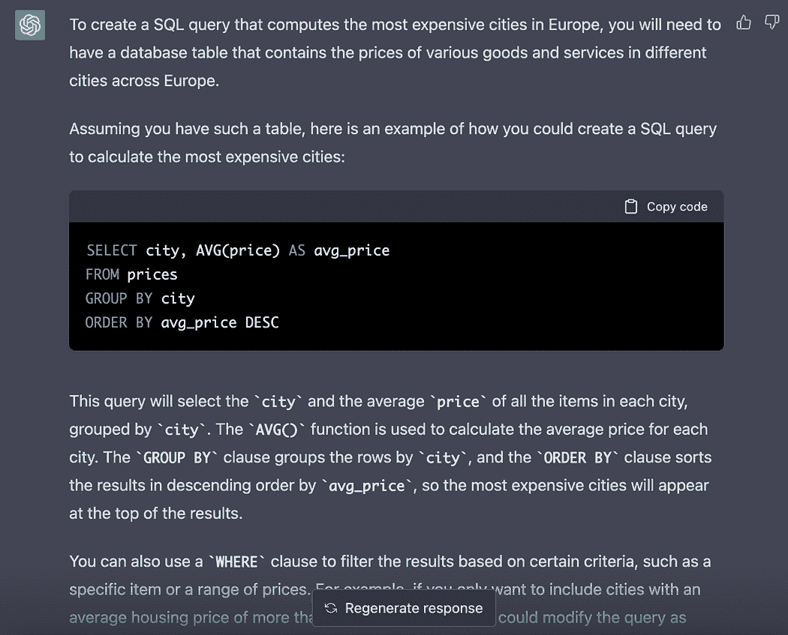

ChatGPT 给我一个查询的示例，并解释这个查询的作用。

## 4. 你可以让 ChatGPT 解释一个查询是如何工作的。

现在让我们想象一下，你需要完成一个生病的同事留下的工作，但你不理解他的查询——有些人编码方式混乱，或者你可能只是感到懒惰，不想浪费时间理解别人的查询。

这是正常的 —— **你可以使用 ChatGPT 来避免这项任务**。我们可以轻松地让 ChatGPT 解释给定的查询。

让我们想象一下，我们想要理解以下查询的作用：

> 以下查询的作用是什么：[在这里插入查询]

ChatGPT 立即给出答案：

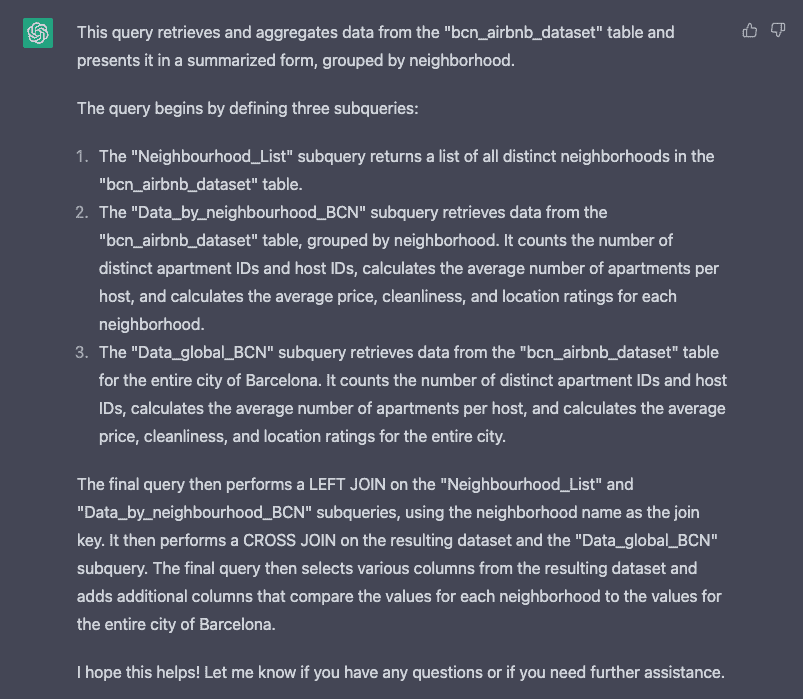

ChatGPT 聊天截图。它解释了给定查询的作用。

如你在之前的图片中所见，ChatGPT 逐步解释了这个查询的作用。

首先，它解释了所有包含的子查询及其作用。然后解释了最终查询以及如何使用之前的子查询来合并所有数据。**我们甚至可以要求对某个子查询进行更详细的解释。**

> 你能进一步解释一下之前查询的第二个子查询是做什么的吗？

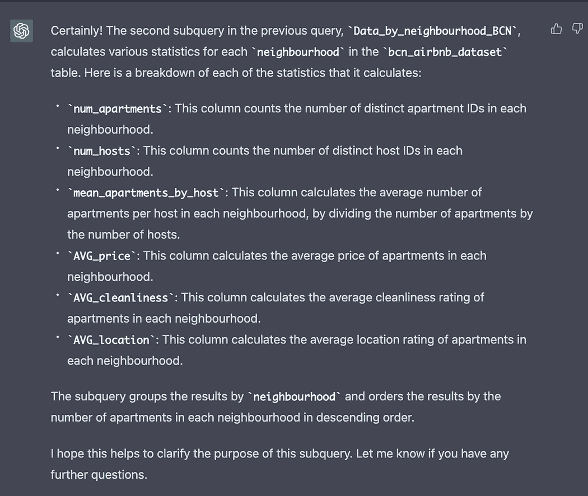

ChatGPT 聊天截图。它进一步解释了给定查询的第二个子查询的作用。

如你在之前的图片中所见，ChatGPT 详细解释了第二个子查询的作用。

**你可以用任何你能想象的查询来挑战 ChatGPT！**

## 5. 你可以让 ChatGPT 挑战你做一些练习题。

对我来说，ChatGPT 的最佳部分是要求一些练习和答案来练习和测试你的技能。它甚至可以告诉你何时做得好——或不好。

> 你能给我一些练习来练习 SQL 吗？

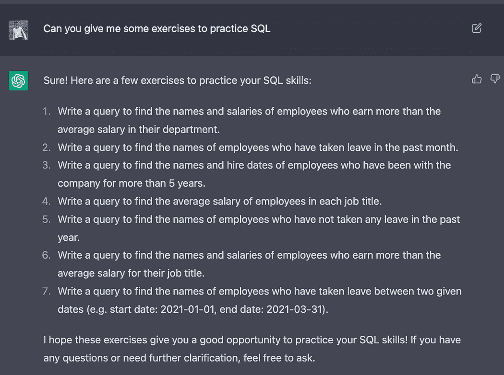

ChatGPT 给我一些练习 SQL 的截图。

现在 ChatGPT 给我提供了一些需要完成的问题。在这种情况下，我可以尝试解决第一个问题，并询问 ChatGPT 我的解决方案是否正确。

> 以下查询是否正确回答了第一个之前的练习 [插入查询]

ChatGPT 会直接回答并说明它是否正确及原因。

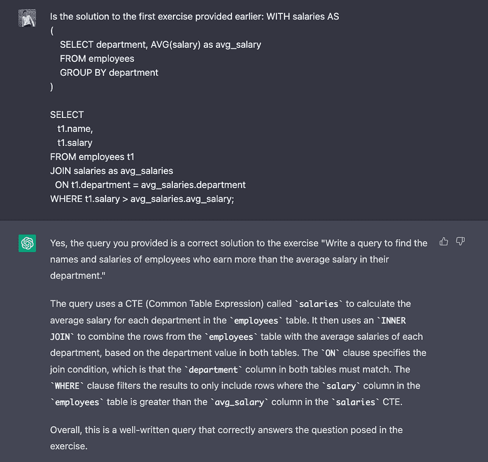

ChatGPT 判断我编写的查询是否正确的截图。

我可以询问每个之前示例的正确答案：

> 你能给我之前练习题的正确答案吗？

如你在下图中所见，ChatGPT 会给我所有正确的查询进行操作。


⚠️* 请注意，ChatGPT 提供的答案与我提交的待检查答案完全不同。*

# 结论

**SQL 是当今数据驱动世界中一项宝贵的技能。** 通过使用 ChatGPT 学习基础知识并练习你的技能，你可以熟练掌握 SQL。**通过持续学习和实践，你可以不断扩展你的技能，并在数据职业生涯中取得飞跃进步。**

如果 ChatGPT 用其他优秀功能让你感到惊讶，请告诉我！我会在评论中阅读你的反馈！ :D

**数据总是有更好的见解——相信它。**

**[Josep Ferrer](https://www.linkedin.com/in/josep-ferrer-sanchez)** 是一位来自巴塞罗那的分析工程师。他毕业于物理工程专业，目前在应用于人类流动性的 数据科学领域工作。他还是一位兼职内容创作者，专注于数据科学和技术。

[原文](https://medium.com/geekculture/using-chatgpt-to-learn-sql-53067465076e)。经许可转载。

* * *

## 我们的前三个课程推荐

 1\. [Google 网络安全证书](https://www.kdnuggets.com/google-cybersecurity) - 加快你的网络安全职业道路。

 2\. [Google 数据分析专业证书](https://www.kdnuggets.com/google-data-analytics) - 提升你的数据分析水平

 3\. [Google IT 支持专业证书](https://www.kdnuggets.com/google-itsupport) - 支持你的组织 IT

* * *

### 更多相关内容

+   [Visual ChatGPT：微软结合 ChatGPT 和 VFMs](https://www.kdnuggets.com/2023/03/visual-chatgpt-microsoft-combine-chatgpt-vfms.html)

+   [ChatGPT CLI：将你的命令行界面转换为 ChatGPT](https://www.kdnuggets.com/2023/07/chatgpt-cli-transform-commandline-interface-chatgpt.html)

+   [学习如何使用 ChatGPT 学习 Python（或其他任何东西）](https://www.kdnuggets.com/2023/02/learn-python-chatgpt.html)

+   [一个学习所有基础知识的优秀资源…](https://www.kdnuggets.com/023/08/excellent-resource-learn-foundations-everything-underneath-chatgpt.html)

+   [学习 ChatGPT 的顶级免费资源](https://www.kdnuggets.com/2023/02/top-free-resources-learn-chatgpt.html)

+   [如何通过 ChatGPT 学习 Python 基础知识](https://www.kdnuggets.com/how-to-learn-python-basics-with-chatgpt)
