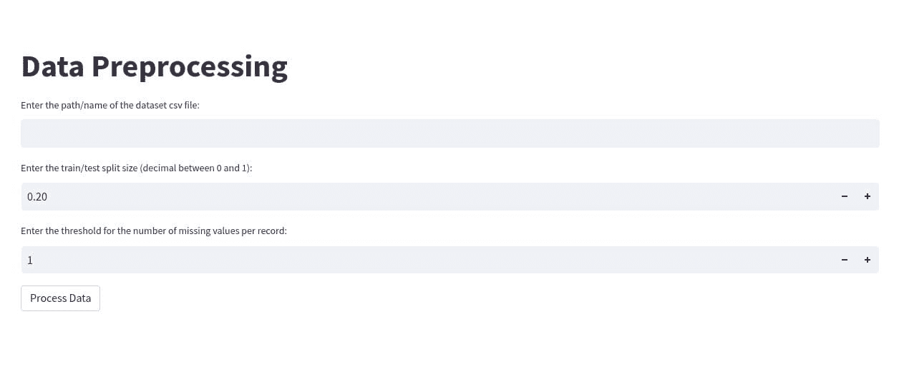

# ChatGPT 作为 Python 编程助手

> 原文：[`www.kdnuggets.com/2023/01/chatgpt-python-programming-assistant.html`](https://www.kdnuggets.com/2023/01/chatgpt-python-programming-assistant.html)


原图由[Sigmund](https://unsplash.com/de/@sigmund?utm_source=unsplash&utm_medium=referral&utm_content=creditCopyText)提供，来源于[Unsplash](https://unsplash.com/photos/Im_cQ6hQo10?utm_source=unsplash&utm_medium=referral&utm_content=creditCopyText) | 作者编辑

OpenAI 的 ChatGPT 是……你已经知道了。你已经读过足够的内容，不再需要介绍。如果你恰好**不知道** ChatGPT 是什么，[先看看这个](https://www.kdnuggets.com/2023/01/chatgpt-everything-need-know.html)，然后再回来继续。

与 ChatGPT 的对话可以是[娱乐性的](https://www.kdnuggets.com/2022/12/kdnuggets-chatgpt-conversation.html)，甚至是[启发性的](https://www.kdnuggets.com/2023/01/20-questions-detect-fake-data-scientists-chatgpt-1.html)。但让我们看看它实际上能有多有帮助。

让我们看看 ChatGPT 在根据我们提供的规范编写代码时能做什么。我们将从简单开始，然后逐步构建。

# 简单的数据处理脚本

我认为一个好的起点是某种数据处理脚本。由于我打算让 ChatGPT 使用各种 Python 库编写一些机器学习脚本，这似乎是一个合理的起点。

## 目标

首先，我想尝试加载数据集；确保所有数据集值都是数字值，或将它们转换为数字；检查缺失值；并将数据集拆分为训练集和测试集。

## 提示

*编写一个 Python 脚本，实现以下功能：

- 从磁盘上的 csv 文件加载数据集到 Pandas DataFrame

- 确保数据集完全是数字的；将字符串值转换为数字，并在字典中跟踪这种转换以供以后参考

- 检查 DataFrame 中的缺失值，并为任何有一个缺失值的记录填补缺失值；完全删除有多个缺失值的记录

- 将数据集拆分为测试集和训练集*

## 响应

```py
import pandas as pd

# Load dataset from csv to DataFrame
df = pd.read_csv('dataset.csv')

# Initialize dictionary to track string to numeric conversions
conversions = {}

# Convert string values to numeric and track conversions in dictionary
for col in df.columns:
    if df[col].dtype == object:
        conversions[col] = {val: i for i, val in enumerate(df[col].unique())}
        df[col] = df[col].map(conversions[col])

# Check for missing values
missing_values = df.isna().sum()

# Impute missing values for records with one missing value
for col in missing_values[missing_values == 1].index:
    df[col].fillna(df[col].median(), inplace=True)

# Drop records with more than one missing value
df.dropna(thresh=len(df.columns) - 1, inplace=True)

# Split dataset into test and training sets
from sklearn.model_selection import train_test_split
train_df, test_df = train_test_split(df, test_size=0.2)
```

注意：该脚本从 csv 文件名为 "dataset.csv" 的文件中加载数据集，并将数据框分割为 80/20 比例的测试集和训练集。如果你想使用不同的文件名或比例，请相应地更改路径/比例。

## 分析

ChatGPT 生成了一个有用的脚本。它决定了数据集的名称以及训练/测试的分割百分比，并记录了这两点以及如何更改它们。如果总体任务完成。

# 代码重构

## 目标

现在我们有一个做某事的脚本，让我们稍微重构一下它。良好编码的基石是使用函数来逻辑组织代码，促进重用，并确保不重复自己。

## 提示

*重写上述脚本，以使用一系列合理的函数*

## 响应

```py
import pandas as pd
from sklearn.model_selection import train_test_split

def load_and_convert_data(file_path):
    # Load dataset from csv to DataFrame
    df = pd.read_csv(file_path)

    # Initialize dictionary to track string to numeric conversions
    conversions = {}

    # Convert string values to numeric and track conversions in dictionary
    for col in df.columns:
        if df[col].dtype == object:
            conversions[col] = {val: i for i, val in enumerate(df[col].unique())}
            df[col] = df[col].map(conversions[col])

    return df, conversions

def handle_missing_values(df):
    # Check for missing values
    missing_values = df.isna().sum()

    # Impute missing values for records with one missing value
    for col in missing_values[missing_values == 1].index:
        df[col].fillna(df[col].median(), inplace=True)

    # Drop records with more than one missing value
    df.dropna(thresh=len(df.columns) - 1, inplace=True)

    return df

def split_data(df, test_size):
    return train_test_split(df, test_size=test_size)

# Use the functions
file_path = "dataset.csv"
df, conversions = load_and_convert_data(file_path)
df = handle_missing_values(df)
train_df, test_df = split_data(df, 0.2)
```

在这里，我使用了三个函数：

1\. load_and_convert_data(file_path) 加载 CSV 数据集并将字符串值转换为数字。

2\. handle_missing_values(df) 处理数据集中的缺失值。

3\. split_data(df, test_size) 将数据集拆分为测试集和训练集。

主脚本使用这些函数来加载、转换和清理数据集，然后将其拆分为测试集和训练集。

数据集的路径和测试比例是这些函数的输入。

## 分析

如果你查看 ChatGPT 输出的第一个脚本，你可能会看到一些非常明显的行，能够指出哪些功能应该被分隔成不同的函数。我确实发现了这一点。在这方面，ChatGPT 完全按我预期的方式进行了。再次确认，生成了一个称职的脚本。

# 扩展我们的代码

## 目标

好的，我们的脚本现在看起来好一点了，因为它使用了一些用于组织的函数。接下来，让我们稍微扩展脚本，使用户在运行脚本时可以指定一些参数。

## 提示

*重写上述程序，以从命令行以参数的形式获取以下内容，并在程序中使用它们：*

- 数据集 CSV 文件的路径/名称

- 训练/测试拆分大小

- 记录的缺失值数量的阈值，超过此阈值则丢弃整条记录，而不是填补缺失值*

## 响应

```py
import pandas as pd
import argparse
from sklearn.model_selection import train_test_split

def load_and_convert_data(file_path):
    # Load dataset from csv to DataFrame
    df = pd.read_csv(file_path)

    # Initialize dictionary to track string to numeric conversions
    conversions = {}

    # Convert string values to numeric and track conversions in dictionary
    for col in df.columns:
        if df[col].dtype == object:
            conversions[col] = {val: i for i, val in enumerate(df[col].unique())}
            df[col] = df[col].map(conversions[col])

    return df, conversions

def handle_missing_values(df, threshold):
    # Check for missing values
    missing_values = df.isna().sum()

    # Impute missing values for records with one missing value
    for col in missing_values[missing_values == 1].index:
        df[col].fillna(df[col].median(), inplace=True)

    # Drop records with more than threshold missing value
    df.dropna(thresh=len(df.columns) - threshold, inplace=True)

    return df

def split_data(df, test_size):
    return train_test_split(df, test_size=test_size)

if __name__ == '__main__':
    parser = argparse.ArgumentParser()
    parser.add_argument("file_path", help="path/name of the dataset csv file")
    parser.add_argument("test_size", help="train/test split size", type=float)
    parser.add_argument("threshold", help="threshold for the number of missing values per record", type=int)
    args = parser.parse_args()

    # Use the functions
    df, conversions = load_and_convert_data(args.file_path)
    df = handle_missing_values(df, args.threshold)
    train_df, test_df = split_data(df, args.test_size)
```

在这个版本中，我使用了 argparse 模块来将文件路径、测试/训练拆分大小和每条记录的缺失值阈值作为命令行参数输入。用户需要用正确的参数运行脚本，例如：

`python script.py dataset.csv 0.2 1`

这将使用“dataset.csv”文件、0.2 的测试大小和 1 的缺失值阈值来运行脚本。

主脚本使用这些参数来加载、转换和清理数据集，然后将其拆分为测试集和训练集。

还值得一提的是，在运行脚本时，应该从命令行运行，而不是从 IDE 运行。

## 分析

说实话，考虑到 ChatGPT 解释了它所做的内容相当清楚，这里不需要太多分析。我实际上会注意到一个之前没有提到的点，并且对 ChatGPT 的评论给予称赞，它的注释既富有表现力又简洁。

# 将我们的代码转换为 Streamlit 应用

## 目标

现在，假设我们想让这个代码“生产”就绪（请允许我开个玩笑）。让我们让 ChatGPT 将这些函数封装在一个 Streamlit 应用中。

## 提示

*将上述程序重写为 Streamlit 应用，允许用户提供与上述命令行参数相同的参数*

## 响应

```py
import pandas as pd
import streamlit as st
from sklearn.model_selection import train_test_split

def load_and_convert_data(file_path):
    # Load dataset from csv to DataFrame
    df = pd.read_csv(file_path)

    # Initialize dictionary to track string to numeric conversions
    conversions = {}

    # Convert string values to numeric and track conversions in dictionary
    for col in df.columns:
        if df[col].dtype == object:
            conversions[col] = {val: i for i, val in enumerate(df[col].unique())}
            df[col] = df[col].map(conversions[col])

    return df, conversions

def handle_missing_values(df, threshold):
    # Check for missing values
    missing_values = df.isna().sum()

    # Impute missing values for records with one missing value
    for col in missing_values[missing_values == 1].index:
        df[col].fillna(df[col].median(), inplace=True)

    # Drop records with more than threshold missing value
    df.dropna(thresh=len(df.columns) - threshold, inplace=True)

    return df

def split_data(df, test_size):
    return train_test_split(df, test_size=test_size)

def main():
    st.set_page_config(page_title="Data Preprocessing", page_icon=":guardsman:", layout="wide")
    st.title("Data Preprocessing")

    file_path = st.text_input("Enter the path/name of the dataset csv file: ")
    test_size = st.number_input("Enter the train/test split size (decimal between 0 and 1): ", step=0.01, value=0.2)
    threshold = st.number_input("Enter the threshold for the number of missing values per record: ", step=1, value=1)

    if st.button("Process Data"):
        df, conversions = load_and_convert_data(file_path)
        df = handle_missing_values(df, threshold)
        train_df, test_df = split_data(df, test_size)
        st.success("Data preprocessing completed!")

if __name__ == '__main__':
    main()
```

这个版本是一个 Streamlit 应用程序，允许用户提供与命令行参数相同的参数。它使用 Streamlit 库创建一个交互式网页应用程序，允许用户输入文件路径、测试/训练拆分大小以及每条记录的缺失值阈值。用户可以点击“处理数据”按钮来运行脚本并预处理数据。它使用与脚本的前一个版本相同的函数来加载、转换和清理数据集，然后将其拆分为测试集和训练集。

要运行该脚本，你需要安装 Streamlit，你可以在终端中运行命令 `pip install streamlit`。安装完成后，使用命令 `streamlit run script.py` 来运行脚本。

## 分析

它完成了它应该做的事情。ChatGPT 利用我们的功能...函数构建了一个简单的 Streamlit 网页应用程序。



使用 ChatGPT 生成的脚本创建的 Streamlit 网页应用程序

# 总结

ChatGPT 在创建、重构、扩展和为我们编写的简单数据预处理 Python 脚本添加包装器方面表现得非常出色，所有这些都是基于我们提供的规格。虽然这并不是最复杂的程序，但它是朝着让 ChatGPT 作为编程助手真正有用的方向迈出的第一步。结果在每一步都达到了预期。

下一次，我们将构建一个复杂度更高并且有更多额外要求的程序。我很期待看看 ChatGPT 在压力下表现如何。希望你也是。

**[Matthew Mayo](https://www.linkedin.com/in/mattmayo13/)** （[**@mattmayo13**](https://twitter.com/mattmayo13)）是数据科学家及 KDnuggets 的主编，KDnuggets 是开创性的在线数据科学和机器学习资源。他的兴趣包括自然语言处理、算法设计与优化、无监督学习、神经网络以及机器学习的自动化方法。Matthew 拥有计算机科学硕士学位和数据挖掘研究生文凭。他可以通过 editor1 at kdnuggets[dot]com 联系到。

* * *

## 我们的前三名课程推荐

 1\. [谷歌网络安全证书](https://www.kdnuggets.com/google-cybersecurity) - 快速进入网络安全领域的职业生涯。

 2\. [谷歌数据分析专业证书](https://www.kdnuggets.com/google-data-analytics) - 提升你的数据分析技能

 3\. [谷歌 IT 支持专业证书](https://www.kdnuggets.com/google-itsupport) - 支持你的组织进行 IT 管理

* * *

### 更多相关主题

+   [忘掉 ChatGPT 吧，这个新的 AI 助手遥遥领先，并将…](https://www.kdnuggets.com/2023/08/forget-chatgpt-new-ai-assistant-leagues-ahead-change-way-work-forever.html)

+   [认识 MetaGPT：由 ChatGPT 驱动的 AI 助手，能够将文本转换成…](https://www.kdnuggets.com/meet-metagpt-the-chatgptpowered-ai-assistant-that-turns-text-into-web-apps)

+   [DataLang：为数据科学家创造的新编程语言… 创建…](https://www.kdnuggets.com/2023/04/datalang-new-programming-language-data-scientists-chatgpt.html)

+   [ChatGPT 如何改变编程的面貌](https://www.kdnuggets.com/how-chatgpt-is-changing-the-face-of-programming)

+   [Python：机器学习的编程语言](https://www.kdnuggets.com/2022/06/mlm-python-programming-language-machine-learning.html)

+   [是什么让 Python 成为初创公司的理想编程语言](https://www.kdnuggets.com/2021/12/makes-python-ideal-programming-language-startups.html)
