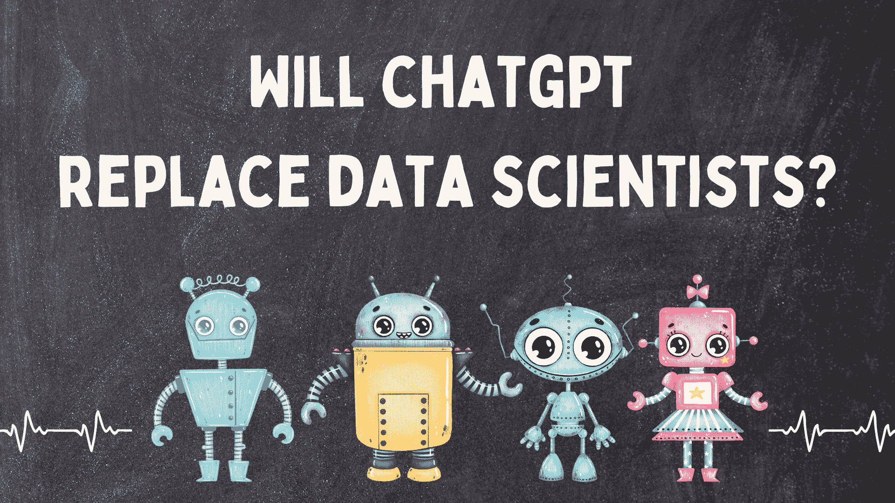
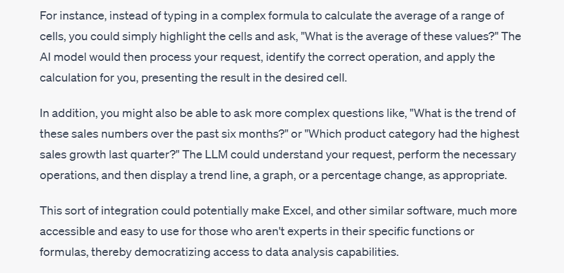
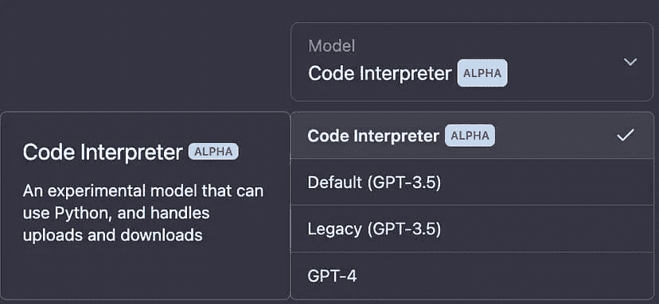
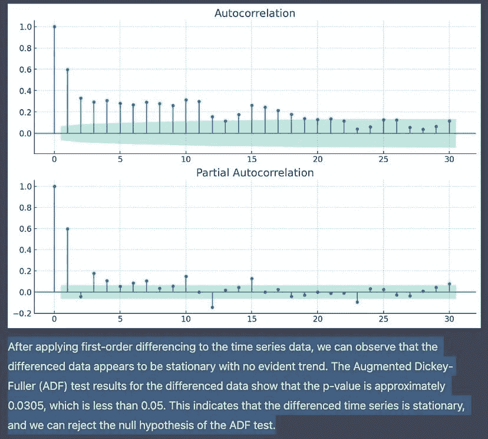

# ChatGPT 会取代数据科学家吗？

> 原文：[`www.kdnuggets.com/2023/06/chatgpt-replace-data-scientists.html`](https://www.kdnuggets.com/2023/06/chatgpt-replace-data-scientists.html)

图片由作者提供

如果你在数据行业工作或渴望从事该行业，你可能会想知道是否是时候换个职业了。

生成模型如 ChatGPT 会不会是数据科学家的终结？

作为一个在数据科学领域工作了三年的人，我想分享我的看法。

在我之前写的一篇文章中，我强烈不同意自动化 AI 软件可以 取代数据科学家 的观点。我的论点是，这些工具会在一定程度上提高组织效率，但缺乏定制性，并且在每个阶段都需要人工参与。

但那是在 2022 年 2 月，远在 ChatGPT，即 OpenAI 的革命性语言模型发布之前。

当 ChatGPT 首次公开时，它基于 GPT-3.5，这是一个能够理解自然语言和代码的模型。

然后，在 2023 年 3 月，GPT-4 发布了。这一算法在解决基于逻辑、创造力和推理的问题方面优于其前身。

这是关于 GPT-4 的一些事实：

+   它可以编写代码（而且，真的很棒）

+   它通过了律师资格考试

+   它在机器学习基准测试中优于大多数最先进的模型

这个模型可以将草图转变为一个完整的网站，并且是编程和数据科学任务的得力助手。

这一技术已经被组织用来提高效率。

[Freshworks 的 CEO](https://www.businessinsider.com/chatgpt-coding-openai-ceo-save-time-ai-jobs-software-2023-5?r=US&IR=T) Girish Mathrubootham 表示，曾经需要 9 周才能完成的编程任务，现在使用 ChatGPT 只需 **几天** 即可完成。

通过生成 AI，该公司中的编码工作流程比平时快大约 20 倍。这将大大减少周转时间，这意味着公司可以更快地完成更多工作。

# 不利之处 - 为什么你的工作面临风险

## 产品集成

到目前为止，我们只谈论了编程。

数据科学家的工作还有其他方面——如数据准备、分析、可视化和模型构建。

根据我的经验，数据科学家目前的需求量很大，因为他们需要掌握多种技能。

除了建立统计模型和学习编程，这些专业人士还需要使用 SQL 进行数据提取，使用如 Tableau 和 PowerBI 之类的软件进行可视化，并有效地将见解传达给利益相关者。

然而，借助像 ChatGPT 这样的 LLM，进入数据科学或分析领域的障碍将大大降低。候选人不再需要掌握各种软件的专长，而是可以利用 LLM 的力量在几分钟内完成通常需要几个小时的工作。

例如，在我曾经工作过的一家公司，我被要求完成一个计时的 Excel 评估，因为该组织的大部分数据库都存在于电子表格中。他们希望聘请一个能够迅速提取和分析这些数据的人。

然而，随着 LLM 的普及，对具备特定工具使用专长的候选人的招聘要求将会消失。

例如，通过 ChatGPT-Excel 集成，你可以简单地高亮要分析的单元格，并向 LLM 提问，如“这些销售数字在上个季度的趋势如何，”或“你能进行回归分析吗？”

ChatGPT 对 Excel 集成的回应会是什么样子

这样的产品集成将使 Excel 及其他类似软件对那些通常不使用它们的人变得可用，而对工具专家的需求将减少。

## 代码插件

[ChatGPT 代码解释器插件](https://ai.plainenglish.io/i-got-chatgpt-plugins-access-is-the-excitement-justified-ef76ea18d94f)是数据科学工作流程民主化的另一个例子。它允许你在聊天中运行 Python 代码和分析数据。

图片来源于“[The Latest Now](https://ai.plainenglish.io/i-got-chatgpt-plugins-access-is-the-excitement-justified-ef76ea18d94f)”在 Medium

你可以上传 CSV 文件，并让 ChatGPT 帮助你清理、分析数据以及构建统计模型。

一旦你分析了数据并告诉它你想做什么（例如，预测下个季度的销售数字），ChatGPT 会告诉你实现最终结果的步骤。

它将继续为你进行实际分析和建模，并在每个阶段解释输出结果。

在[这篇](https://medium.com/mlearning-ai/do-data-science-in-minutes-with-this-chatgpt-plugin-afb580980351)文章中，作者要求 ChatGPT 的代码解释器使用联邦储备经济数据（FRED）预测未来的通货膨胀趋势。算法从可视化数据中的当前趋势开始。

然后它检查了数据的平稳性，对其进行了变换，并决定使用 ARIMA 进行建模。它甚至能够找到用于生成 ARIMA 预测的最佳参数：

图片来源于“[The Latest Now](https://medium.com/mlearning-ai/do-data-science-in-minutes-with-this-chatgpt-plugin-afb580980351)”在 Medium

这些步骤通常需要数据科学家花费大约 3-4 小时来完成，而 ChatGPT 只需几分钟，就能通过简单地摄取用户上传的数据来完成。

这是一项令人印象深刻的成就，将显著减少实现模型构建过程所需的专业知识量。

# 那么……人类专业知识仍然必要吗？

当然，无论 AI 在编码和模型构建方面变得多么出色，人类专家仍然需要监督这一过程。

ChatGPT 经常生成错误的代码并在构建统计模型时做出错误的决策。公司仍需要招聘擅长统计和编程的员工来监督数据科学过程，以确保模型的提示是正确的。

LLM 不能创建完整的数据产品，因为人类仍需执行需求收集、调试和验证模型输出等任务。

然而，公司**对执行这些任务的人**的需求将不如以前那么多。

像 LLM 带来的显著效率提升将意味着团队可以开始缩减规模。

比如说，公司可以只聘请 5 名数据科学家，而不是 10 名来完成工作。

我相信，入门级数据科学职位将是首批受到这一发展的影响的，因为 LLM 已经能够执行中级水平的编码和分析工作流。

[由于 AI 的招聘冻结](https://www.zdnet.com/article/ai-threatens-7800-jobs-as-ibm-pauses-hiring/) 已经在大型科技公司中出现，我们可能会看到数据科学人才超过该技能需求的情况。

# 如何在 ChatGPT 时代保护你的职业生涯

幸运的是，对于我们技术和数据科学专业人士来说，情况并非全然悲观。尽管 LLM 在编程和数据分析等任务上迅速进步，但它们无法取代人类的创造力和决策能力。

以下是一些在 LLM 时代保护职业生涯的建议：

## 获取业务专业知识

组织将继续招聘能够为业务创造收入的人。

如果你在某个特定领域拥有专业知识，并且理解公司的运营细节和客户需求，你将有独特的机会来识别增长机会。

你最不希望做的就是在 AI 竞争中处于劣势——你不希望成为管理电子表格的那个人，或是每个人都找来制作季度业绩报告的人。这些工作很容易被自动化，将成为 ChatGPT 时代首批被取代的职位。

我认为，与其把精力集中在学习那些 LLM 能够比你更快掌握的特定软件上，不如学习更宏观的视角。发展领导力和管理技能，理解如何利用 AI 实现公司的目标。

## 拥抱 AI

根据皮尤研究中心的数据，只有[14%的成年人](https://www.pewresearch.org/short-reads/2023/05/24/a-majority-of-americans-have-heard-of-chatgpt-but-few-have-tried-it-themselves/)实际上尝试过 ChatGPT。如果你正在阅读这篇文章，利用 ChatGPT 学习新事物，并跟上人工智能的最新进展，那么你就是一个早期采用者。

我建议将 LLM（大型语言模型）融入到你的工作流程中，使用集成了人工智能的产品，并学习利用这些模型最大化效率的最佳实践。

这样，你可以保持领先，并更好地了解你工作中的哪些部分可以自动化，哪些部分需要人工干预。

这不仅会使你成为更优秀的数据科学家，而且当组织开始将人工智能融入不同的业务领域时，你将处于最佳位置，能够就如何利用人工智能提高生产力提供建议。

实际上，最近出现了一种新的角色，称为[提示工程](https://www.forbes.com/sites/bernardmarr/2023/05/11/the-hot-new-job-that-pays-six-figures-ai-prompt-engineering/)，薪资高达$335,000。提示工程师是让生成型人工智能应用程序按其需求执行任务的专家。

一个好的提示工程师是能够“项目管理”人工智能，完成诸如设计网页应用程序等任务的人。

无论你是否希望从事提示工程师的工作，将人工智能融入你的现有工作流程中都会使你比那些尚未这样做的人更具竞争力。

## 多样化收入

组织将很快开始重组，因为他们开始制定[新的商业战略](https://www.theguardian.com/business/2023/may/18/bt-cut-jobs-telecoms-group-workforce)，这些战略将融入人工智能。

如果这导致大规模裁员，保护自己的唯一方法就是拥有多种收入来源，而不仅仅依赖于全职工作。

我建议创建一个自由职业者作品集——为多个组织工作并获得被动收入，将确保你的未来不依赖于单一雇主的决策。

## 创建个人品牌

最后，《哈佛商业评论》建议[创建个人品牌](https://hbr.org/2023/04/5-ways-to-future-proof-your-career-in-the-age-of-ai)以使自己从人群中脱颖而出。

像[Tim Denning](https://timdenning.medium.com/)和[Jessica Wildfire](https://jessicalexicus.medium.com/)这样的 Medium 作者，即使人工智能能够模拟他们的写作风格，他们仍然会拥有一群忠实的粉丝和消费他们作品的人。

这是因为最终，人们喜欢真实的故事，想要与他人建立联系，而这是人工智能无法提供的。

同样，组织将继续聘用在领域内被认可的行业领袖，以此作为质量和品牌的象征。建立个人品牌的一些方法包括建立一个 数据科学作品集、创建内容并不断提升技能。

# 要点

生成模型将改变职业景观，数据科学、分析和编程等领域将受到这些工具带来的效率提升的影响。

然而，这并不意味着数据科学家的终结。遵循上述策略可以帮助你保持领先，确保你不会与 AI 竞争。

**[Natassha Selvaraj](https://www.natasshaselvaraj.com/)** 是一位自学成才的数据科学家，热衷于写作。你可以通过 [LinkedIn](https://www.linkedin.com/in/natassha-selvaraj-33430717a/) 与她联系。

### 更多相关话题

+   [DeepMind 的 AlphaCode 会取代程序员吗？](https://www.kdnuggets.com/2022/04/deepmind-alphacode-replace-programmers.html)

+   [AI 不会取代我们](https://www.kdnuggets.com/2023/02/ai-replace-us.html)

+   [AI 会取代人类吗？](https://www.kdnuggets.com/will-ai-replace-humanity)

+   [你应该用 AI 搜索引擎替代 Google 的 8 个选择](https://www.kdnuggets.com/top-8-ai-search-engine-that-you-should-replace-with-google)

+   [Visual ChatGPT: 微软将 ChatGPT 和 VFMs 结合](https://www.kdnuggets.com/2023/03/visual-chatgpt-microsoft-combine-chatgpt-vfms.html)

+   [ChatGPT CLI: 将你的命令行界面转变为 ChatGPT](https://www.kdnuggets.com/2023/07/chatgpt-cli-transform-commandline-interface-chatgpt.html)
