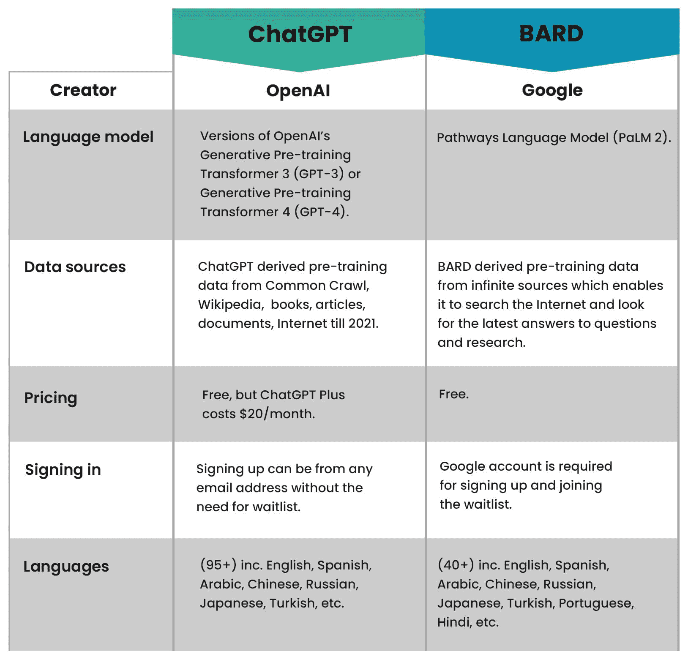
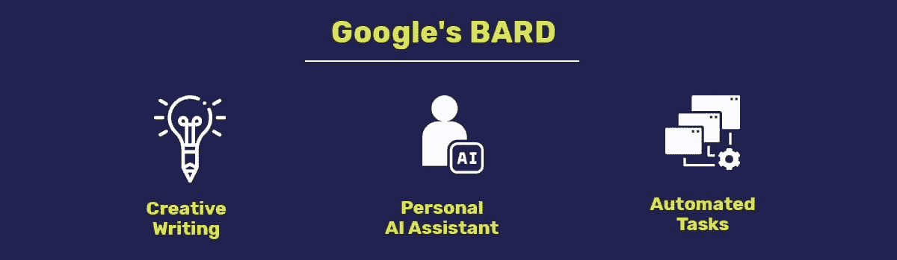

# ChatGPT 与 BARD

> 原文：[`www.kdnuggets.com/chatgpt-vs-bard`](https://www.kdnuggets.com/chatgpt-vs-bard)

人工智能（AI）由于其在各种应用中的使用，如今非常流行。其最受欢迎的应用案例是 OpenAI 的 ChatGPT（一个由 AI 驱动的聊天机器人），可以回答大量问题。ChatGPT 的一个亲密伙伴是 Google 的 BARD（更好地访问和负责任的发展），该产品于 2021 年 6 月推出。

* * *

## 我们的三大课程推荐

 1\. [Google 网络安全证书](https://www.kdnuggets.com/google-cybersecurity) - 快速开启网络安全职业生涯。

 2\. [Google 数据分析专业证书](https://www.kdnuggets.com/google-data-analytics) - 提升您的数据分析技能

 3\. [Google IT 支持专业证书](https://www.kdnuggets.com/google-itsupport) - 支持您的 IT 组织

* * *

现在让我们深入了解哪个[大型语言模型](https://www.cogitotech.com/generative-ai/)更好。

OpenAI 的 ChatGPT 使用了变换器模型进行训练。该模型可以合成大量文本以发现语言模式，并对任何类型的查询都很有用。这两种模型都能回答各种问题。关键的区别在于这些模型的训练和构建方式。它们如何利用自然语言处理生成类似人类的回应。

# ChatGPT 与 BARD：关键差异

目前，选择具有对话能力的 AI 聊天机器人有很多选择。以下对比有助于评估每个模型的优缺点，从而选择更好的一个。

# ChatGPT 与 BARD：比较

## OpenAI 的 ChatGPT

| **优点** | **缺点** |
| --- | --- |
| 擅长生成长篇内容 | 不能访问网络浏览器，因为其数据源截止到 2021 年。 |
| 提供协作体验，允许与他人共享对话。 | 响应内容冗长且难以扫描。 |
| 包含一整套插件，提供更多的应用案例和多样化的应用。 | 其事实必须经过验证，因为它对虚假信息和糟糕的推理免疫。 |

## Google 的 BARD

| **优点** | **缺点** |
| --- | --- |
| 通过 Google 搜索提供免费的互联网访问 | 易受虚假信息影响，因此输出结果不能完全相信。 |
| 高效地从 Google 搜索中提取信息。 | 来源不可靠，因此事实需要重新核实。 |
| 界面友好，响应类似人类。 | 没有插件或集成，体验较为孤立。 |

# ChatGPT 与 BARD：使用案例

1.  **客户服务：** 适合回答客户常见问题，如运输和退货程序、产品或服务以及技术支持问题。通过使用及时且准确的回复来提高响应时间，从而减轻客户支持专业人员的工作负担。

1.  **语言翻译：** 文本翻译可以应用于实时聊天、电子邮件以及各种语言的文本文件。它还可以用于提升机器翻译系统的质量，并通过实时翻译客户的问题和评论来协助多语言客户服务。

1.  **内容生成：** 可以创建诸如文章或报告的长文本的摘要。通过文本评估，可以准确创建反映其主要思想的原文摘要。ChatGPT 可以被训练生成与给定信息风格和语法类似的文本，如社交媒体帖子、电子邮件营销文案或其他类型的内容。

1.  **教育和研究：** ChatGPT 可以通过评估学生的行为提供个性化学习体验。它可以通过筛选材料来协助研究，识别重要事实。需要访问和快速检查材料的研究人员和学生可能会发现它很有用。它还可以通过即时提供反馈来帮助评估学生的草拟作业。

1.  **创意写作：** 它可以评估内容并提供关于写作风格、语气和结构等方面的评论，帮助作家提升技能。它还可以提供同义词、相关词汇或替代措辞建议。

1.  **个人 AI 助手：** 它可以帮助管理时间，确保不会忘记完成重要步骤或错过约会。

1.  **自动化任务：** 它使用 Google 的 AI 来瞬时执行各种任务，包括在餐馆预订或旅行安排。它还可以用来购买物品和定位物品。

# 结论

因此，我们可以看到 ChatGPT 和 BARD 都在不断发展，每天都有最新版本推出。这两种大型语言模型各有优缺点，但选择更好的模型将取决于你使用它的目的以及适应诸如虚假信息等问题。

**[Roger](https://www.linkedin.com/in/roger-brown-490469151/)** 拥有十年以上在机器学习和人工智能领域收集和提供训练数据集的专业经验。他在视觉搜索、虚拟助手、聊天机器人培训和转录服务等相关领域也具有专业知识。他有实际经验进行测试和质量检查输出结果。

### 更多相关内容

+   [ChatGPT 与 Google Bard：技术差异比较](https://www.kdnuggets.com/2023/03/chatgpt-google-bard-comparison-technical-differences.html)

+   [8 款开源替代 ChatGPT 和 Bard 的工具](https://www.kdnuggets.com/2023/04/8-opensource-alternative-chatgpt-bard.html)

+   [检测 ChatGPT、GPT-4、Bard 和 Claude 的十大工具](https://www.kdnuggets.com/2023/05/top-10-tools-detecting-chatgpt-gpt4-bard-llms.html)

+   [为什么数据科学家预期 Google Bard 的建议会有缺陷](https://www.kdnuggets.com/2023/02/data-scientists-expect-flawed-advice-google-bard.html)

+   [数据科学 Bard 速查表](https://www.kdnuggets.com/2023/05/bard-data-science-cheat-sheet.html)

+   [什么是 Google AI Bard？](https://www.kdnuggets.com/2023/03/google-ai-bard.html)
