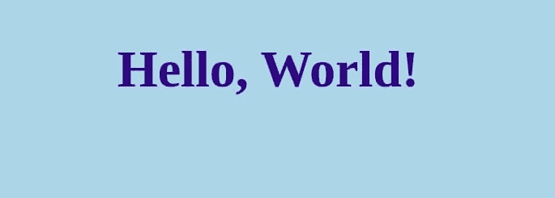
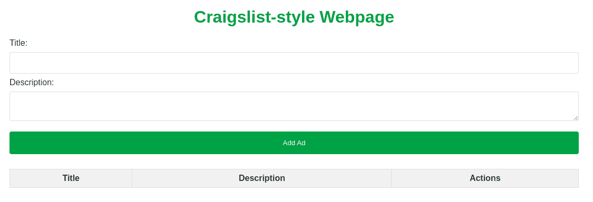
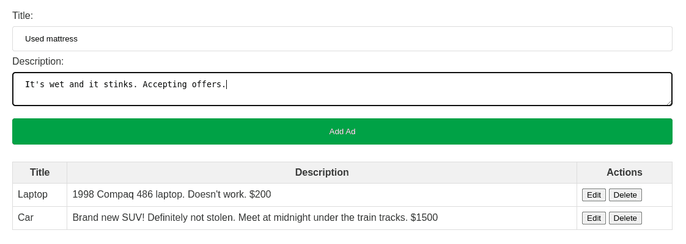
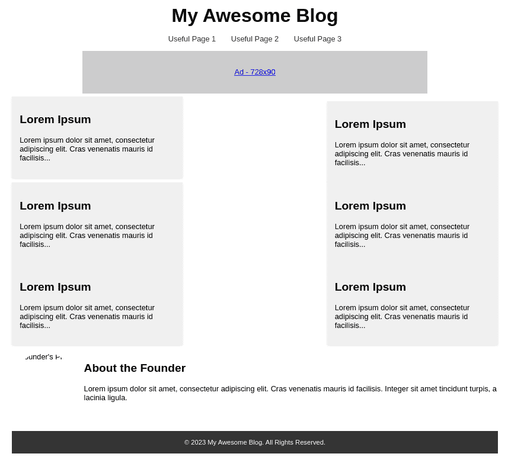

# 使用 ChatGPT 进行网页构建

> 原文：[`www.kdnuggets.com/2023/03/chatgpt-webpage-construction.html`](https://www.kdnuggets.com/2023/03/chatgpt-webpage-construction.html)

你已经认识了 ChatGPT，这是一种由 OpenAI 设计的高级语言模型，它利用机器学习来理解自然语言并生成类似人类的回应。它拥有广泛的知识库，并且凭借其对语言的复杂“理解”，能够作为任何寻找信息的人的强大助手。它可以回答各种问题，提供建议，就各种话题进行对话，并在许多领域证明了自己。

但是 ChatGPT 能创建网页吗？让我们来检验一下。

* * *

## 我们的前三个课程推荐

 1\. [谷歌网络安全证书](https://www.kdnuggets.com/google-cybersecurity) - 快速进入网络安全职业生涯。

 2\. [谷歌数据分析专业证书](https://www.kdnuggets.com/google-data-analytics) - 提升你的数据分析技能

 3\. [谷歌 IT 支持专业证书](https://www.kdnuggets.com/google-itsupport) - 支持你的组织在 IT 方面

* * *

*请注意，这是使用 ChatGPT 3.5 编写的，早于最新版本的发布。*

# 基本 HTML 网页

让我们从一些基本的 HTML 开始。鉴于[ChatGPT 已经证明自己是一个天才的编码员和编程助手](https://www.kdnuggets.com/2023/01/chatgpt-python-programming-assistant.html)，这不应该是一个难题。

这是我们用 ChatGPT 成功创建“Hello, World”HTML 页面的提示：

*创建一个简单的“Hello, World!”网页，使用 HTML*

ChatGPT 生成了以下基本 HTML，显然达到了预期效果。

```py
<!DOCTYPE html>
<html>
  <head>
    <title>Hello, World!</title>
  </head>
  <body>
    <h1>Hello, World!</h1>
  </body>
</html>
```

ChatGPT 建议我们将其放在一个扩展名为“.html”的文件中，并用浏览器打开。任务完成。

我不打算提供截图；你们都见过未格式化的 HTML 输出。

让我们请 ChatGPT 来让事情看起来更好。

*你能用 CSS 让这个页面看起来更好吗？*

ChatGPT 的输出如下：

> 这个示例使用 CSS 将网页背景颜色更改为浅蓝色，将页面上的文本居中，将标题的颜色更改为海军蓝，并将标题的字体大小增加到 4em。
> 
> 你可以玩转 CSS，给你的网页添加样式。
> 
> 将 CSS 放在单独的文件中并将其链接到你的 index.html 文件中也是一个好习惯。

看起来像这样：



ChatGPT 使用 HTML 和 CSS 创建的简单网页

这确实是一个改进，但这仍然是小菜一碟。然而，在继续之前，让我们按照 ChatGPT 的建议，将 HTML 和 CSS 分开。

*我该如何将 CSS 放到一个单独的文件中，并将其链接到我的 index.html 文件？*

> 你可以创建一个单独的 CSS 文件，并通过 HTML 文件的 `head` 部分中的链接元素将其链接到你的 HTML 文件。以下是如何操作的示例：
> 
> 1.  在与 "index.html" 文件相同的目录中创建一个名为 "styles.css" 的新文件。
> 1.  
> 1.  将你的 CSS 代码添加到 "styles.css" 文件中。
> 1.  
> 1.  在你的 "index.html" 文件中，在 `head` 部分添加以下行：
> 1.  
>     `<link rel="stylesheet" type="text/css" href="styles.css">`
>     
>     `rel` 属性指定当前文档与链接文档之间的关系，`type` 属性指定链接文档的类型，`href` 属性指定链接文档的位置。
>     
> 1.  保存这两个文件，并在你的浏览器中打开 "index.html"。现在 "styles.css" 中的样式应该已应用于网页。
> 1.  
> 你还可以包含来自在线链接的 CSS 文件，如来自 "https://stackpath.bootstrapcdn.com/bootstrap/4.5.2/css/bootstrap.min.css"。
> 
> 它也会应用于你的网页，你无需在本地目录中包含它。

# 简单的 HTML 表单

*创建一个 Craigslist 风格的网页，做到以下几点：

- 允许我添加新广告

- 允许我删除现有广告

- 允许我列出所有现有广告

- 允许我编辑现有广告*

> 创建一个 Craigslist 风格的网页将涉及使用 HTML、CSS、JavaScript 和 PHP 或 Node.js 等后端语言来处理网页的动态方面。以下是网页基本结构的示例：

```py
<!DOCTYPE html>
<html>
  <head>
    <title>Craigslist-style Webpage</title>
    <link rel="stylesheet" type="text/css" href="styles.css">
  </head>
  <body>
    <h1>Craigslist-style Webpage</h1>
    <form id="add-ad-form">
      <label for="title">Title:</label>
      <input type="text" id="title" name="title">
      <br>
      <label for="description">Description:</label>
      <textarea id="description" name="description"></textarea>
      <br>
      <button type="submit">Add Ad</button>
    </form>

    <table id="ads-table">
      <thead>
        <tr>
          <th>Title</th>
          <th>Description</th>
          <th>Actions</th>
        </tr>
      </thead>
      <tbody>
        <!-- This section will be populated with ads using JavaScript -->
      </tbody>
    </table>

    <script src="script.js"></script>
  </body>
</html>
```

没有背景功能的前端页面看起来不太好。所以我问：

*你能使用 CSS 文件使网站看起来更专业吗？我希望色彩方案为意大利的国旗颜色。*

而 ChatGPT 顺应了（“添加”按钮在你悬停时甚至变成了红色）。



ChatGPT 创建的带样式的简单 HTML 表单

但 JavaScript 呢？让我们看看 ChatGPT 是否能添加它。

*你能添加 JavaScript 以将新广告添加到列表并显示它吗？*

```py
// Get references to the form and table
const addAdForm = document.querySelector("#add-ad-form");
const adsTable = document.querySelector("#ads-table tbody");

// Handle the form submit event
addAdForm.addEventListener("submit", function(event) {
  event.preventDefault();

  // Get the values from the form inputs
  const title = document.querySelector("#title").value;
  const description = document.querySelector("#description").value;

  // Create a new table row and add the ad data
  const newRow = document.createElement("tr");
  newRow.innerHTML = `
    <td>${title}</td>
    <td>${description}</td>
    <td>
      <button>Edit</button>
      <button>Delete</button>
    </td>
  `;

  // Add the new row to the table
  adsTable.appendChild(newRow);

  // Clear the form inputs
  addAdForm.reset();
});
```

结果是：



ChatGPT 创建的带有 JavaScript 的半功能 HTML 表单

不错。通过几次提示，我们从无到丑陋的 HTML，再到更美观的 HTML，最后到实现了*某种功能*的 JavaScript。

# 尝试一些有用的东西

让我们尝试一些有用的东西。下面是创建一个简单（但可能有用）的博客主页的提示，并附有一些具体要求。

*让我们创建一个网页。我希望你编写 HTML 和 CSS 以及生成符合这些要求的博客主页所需的其他内容：

- 页面将使用 1024px 的宽度

- 页面顶部将有一个大字体的标题

- 在下面应有一行链接到博客上三个有用页面的链接

- 下面将有一个可点击的横幅广告，符合行业标准尺寸

- 下面是最新博客的一个部分，应展示以 2 行 3 列瓷砖布局显示的 6 个最新条目

- 最新博客条目下方应该有一个“关于”部分，列出有关网站创始人的信息及其照片

- 下面应该有一个典型的页脚，包括

- 使用虚拟文本填充内容

- 页面应该具有吸引力，使用现代风格

- 最新博客瓷砖上应有 CSS 悬停效果*

这是 ChatGPT 生成的 HTML 和 CSS：

```py
<!DOCTYPE html>
<html lang="en">
<head>
  <meta charset="UTF-8">
  <meta name="viewport" content="width=device-width, initial-scale=1.0">
  <title>My Blog</title>
  <style>
    body {
      font-family: Arial, sans-serif;
      max-width: 1024px;
      margin: 0 auto;
      padding: 1rem;
    }

    h1 {
      font-size: 2.5rem;
      text-align: center;
      margin-bottom: 1rem;
    }

    nav {
      display: flex;
      justify-content: center;
      margin-bottom: 1rem;
    }

    nav a {
      text-decoration: none;
      color: #333;
      margin: 0 1rem;
    }

    .banner {
      display: block;
      width: 728px;
      height: 90px;
      background-color: #ccc;
      margin: 0 auto 1rem;
      text-align: center;
      line-height: 90px;
    }

    .blogs {
      display: flex;
      flex-wrap: wrap;
      justify-content: space-between;
      margin-bottom: 1rem;
    }

    .blog {
      width: 32%;
      background-color: #f0f0f0;
      padding: 1rem;
      box-shadow: 0 2px 4px rgba(0, 0, 0, 0.1);
      transition: transform 0.3s ease;
      cursor: pointer;
    }

    .blog:hover {
      transform: translateY(-10px);
    }

    .about {
      display: flex;
      margin-bottom: 1rem;
    }

    .about img {
      width: 150px;
      height: 150px;
      object-fit: cover;
      border-radius: 50%;
      margin-right: 1rem;
    }

    .about p {
      flex: 1;
    }

    footer {
      background-color: #333;
      color: #fff;
      padding: 1rem;
      text-align: center;
      font-size: 0.875rem;
    }
 </style>
</head>

<body>
  <h1>My Awesome Blog</h1>

  <nav>
    <a href="#">Useful Page 1</a>
    <a href="#">Useful Page 2</a>
    <a href="#">Useful Page 3</a>
  </nav>

  <a href="#" class="banner">Ad - 728x90</a>

  <div class="blogs">
    <div class="blog">
      <h2>Lorem Ipsum</h2>
      <p>Lorem ipsum dolor sit amet, consectetur adipiscing elit. Cras venenatis mauris id facilisis...</p>
    </div>
    <div class="blog">
      <h2>Lorem Ipsum</h2>
      <p>Lorem ipsum dolor sit amet, consectetur adipiscing elit. Cras venenatis mauris id facilisis...</p>
    </div>
    <div class="blog">
      <h2>Lorem Ipsum</h2>
      <p>Lorem ipsum dolor sit amet, consectetur adipiscing elit. Cras venenatis mauris id facilisis...</p>
    </div>
    <div class="blog">
      <h2>Lorem Ipsum</h2>
      <p>Lorem ipsum dolor sit amet, consectetur adipiscing elit. Cras venenatis mauris id facilisis...</p>
    </div>
    <div class="blog">
      <h2>Lorem Ipsum</h2>
      <p>Lorem ipsum dolor sit amet, consectetur adipiscing elit. Cras venenatis mauris id facilisis...</p>
    </div>
    <div class="blog">
      <h2>Lorem Ipsum</h2>
      <p>Lorem ipsum dolor sit amet, consectetur adipiscing elit. Cras venenatis mauris id facilisis...</p>
    </div>
  </div>

  <div class="about">
    
    <div>
      <h2>About the Founder</h2>
      <p>Lorem ipsum dolor sit amet, consectetur adipiscing elit. Cras venenatis mauris id facilisis. Integer sit amet tincidunt turpis, a lacinia ligula.</p>
    </div>
  </div>

  <footer>
    © 2023 My Awesome Blog. All Rights Reserved.
  </footer>

</body>
</html>
```

这是最终产品：



ChatGPT 创建的简单博客主页

看起来相当不错。我是说，使用一些额外的 CSS 指导可能会让它看起来更好，但总体来说，这不是一个坏的开始。它甚至在瓷砖上有一个悬停效果，可以在左上角的瓷砖中看到（悬停时稍微抬起）。

有一点需要注意的是，我要求“以 2 行 3 列瓷砖布局显示的 6 个最新条目”，但 ChatGPT 生成了 2 *列* 的布局。

看起来，通过非常简单直接的提示，ChatGPT 确实显示出生成网页的能力。我想知道当要求它生成一些动态内容时，它会如何表现，以及它会如何指导人类将不同组件编织在一起。这是下次的测试。

**[马修·梅约](https://www.linkedin.com/in/mattmayo13/)** ([**@mattmayo13**](https://twitter.com/mattmayo13)) 是数据科学家，也是 KDnuggets 的主编，这是一个重要的数据科学和机器学习在线资源。他的兴趣包括自然语言处理、算法设计与优化、无监督学习、神经网络以及机器学习的自动化方法。马修拥有计算机科学硕士学位和数据挖掘研究生文凭。他可以通过 editor1 at kdnuggets[dot]com 联系。

### 更多相关话题

+   [视觉 ChatGPT：微软结合 ChatGPT 和 VFM](https://www.kdnuggets.com/2023/03/visual-chatgpt-microsoft-combine-chatgpt-vfms.html)

+   [ChatGPT CLI：将您的命令行界面转换为 ChatGPT](https://www.kdnuggets.com/2023/07/chatgpt-cli-transform-commandline-interface-chatgpt.html)

+   [使用 Llama 和 ChatGPT 构建多聊天后台的微服务](https://www.kdnuggets.com/building-microservice-for-multichat-backends-using-llama-and-chatgpt)

+   [使用 ChatGPT 帮助找到数据科学工作](https://www.kdnuggets.com/using-chatgpt-to-help-land-a-data-science-job)

+   [我从使用 ChatGPT 进行数据科学中学到了什么](https://www.kdnuggets.com/what-i-learned-from-using-chatgpt-for-data-science)

+   [使用 ChatGPT 生成被动收入的 4 种方法](https://www.kdnuggets.com/2023/03/4-ways-generate-passive-income-chatgpt.html)
