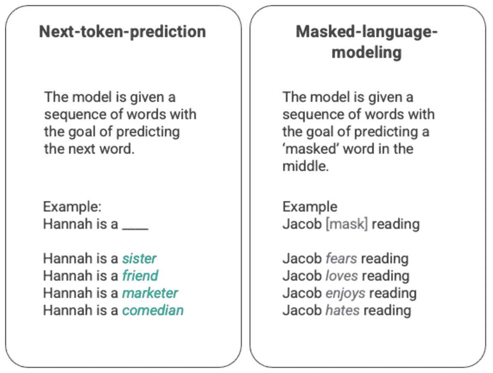
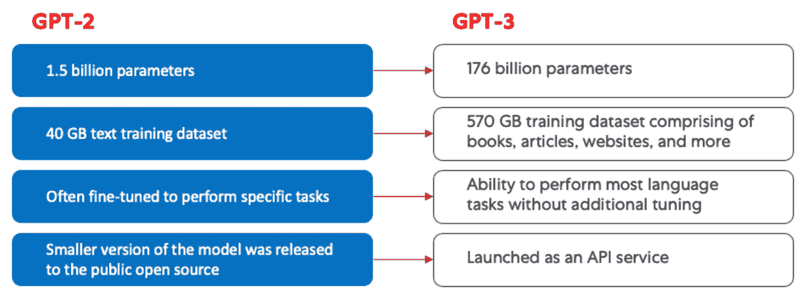
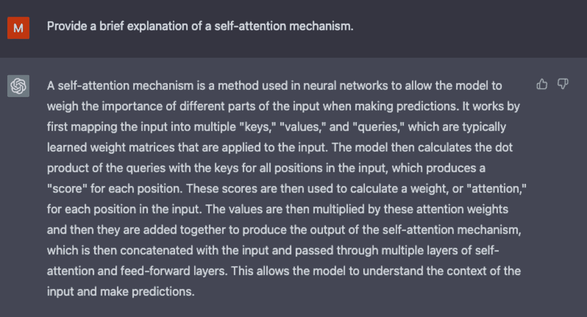
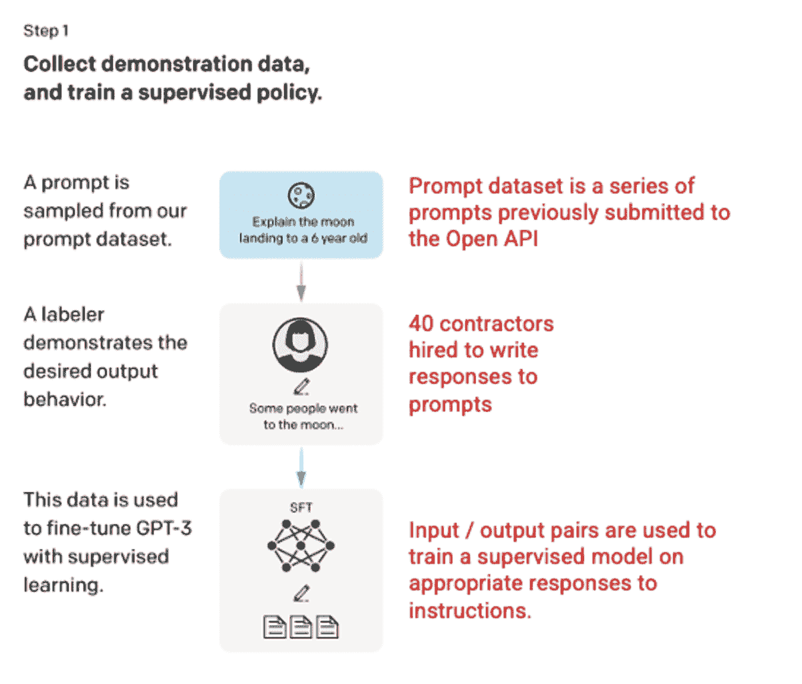
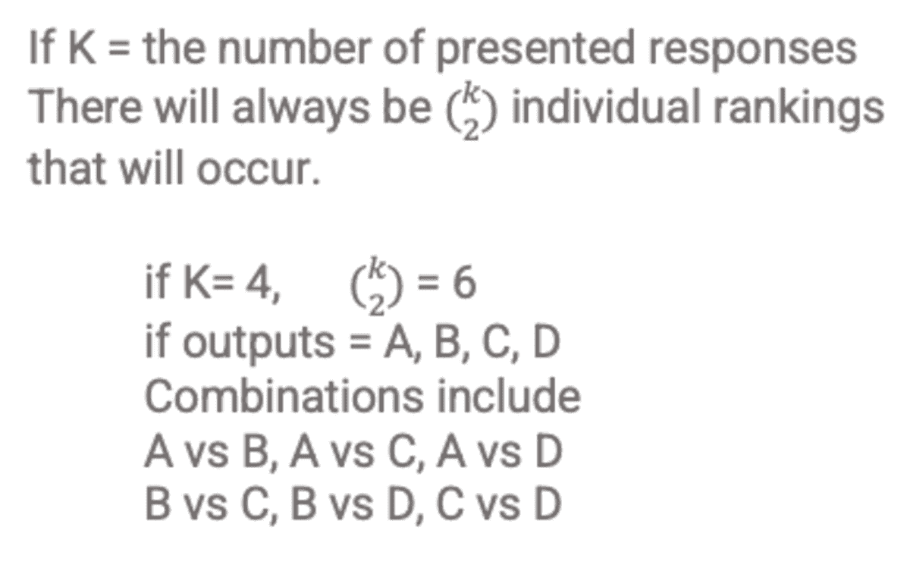
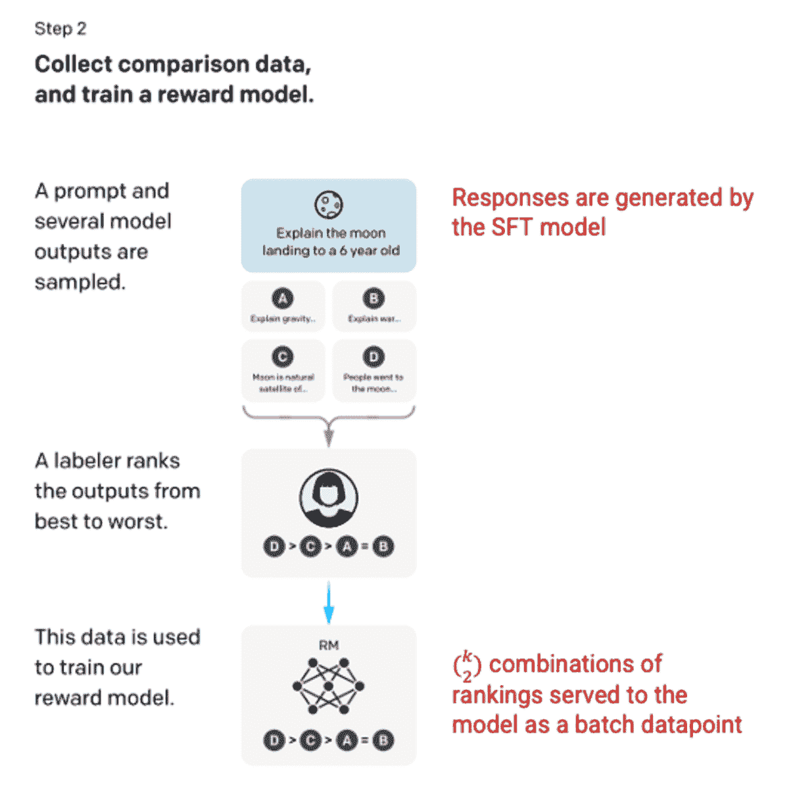
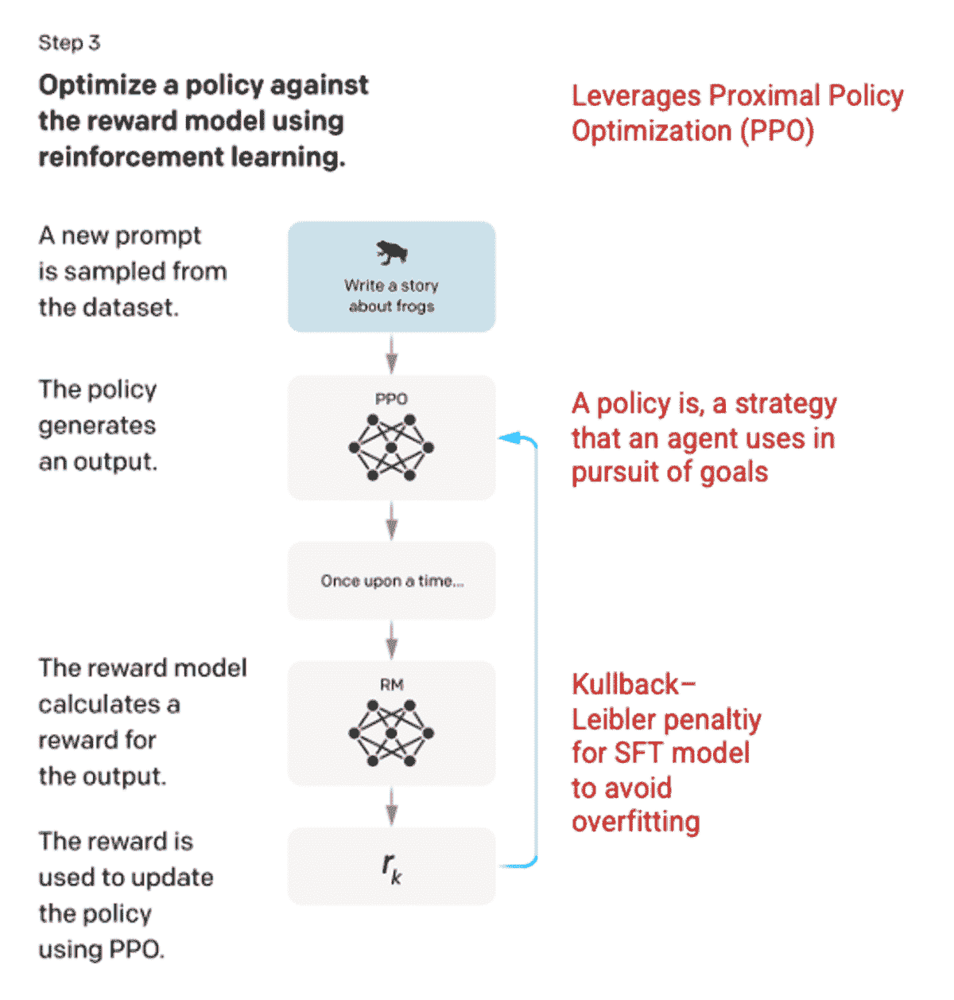
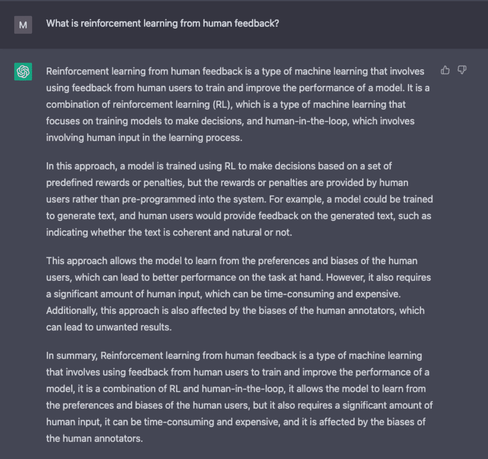
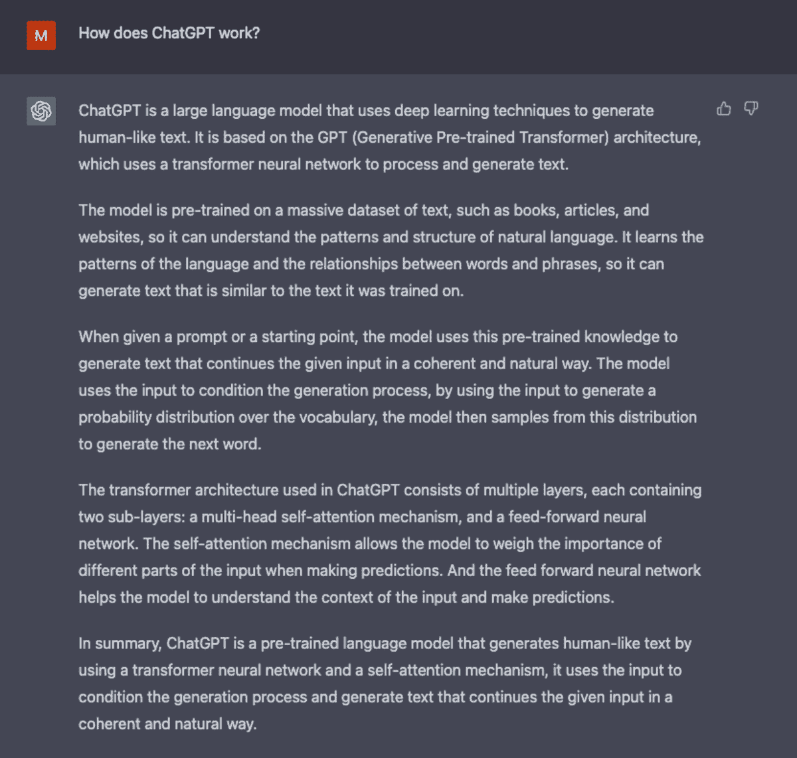

# 如何 ChatGPT 工作：机器人背后的模型

> 原文：[`www.kdnuggets.com/2023/04/chatgpt-works-model-behind-bot.html`](https://www.kdnuggets.com/2023/04/chatgpt-works-model-behind-bot.html)

图片由 [Matheus Bertelli](https://www.pexels.com/photo/man-people-woman-laptop-16094042/) 提供

这篇对支撑 ChatGPT 的机器学习模型的温和介绍将从大型语言模型的介绍开始，深入探讨使 GPT-3 能够进行训练的革命性自注意力机制，然后深入 Reinforcement Learning From Human Feedback，这一创新技术使 ChatGPT 异常出色。

# 大型语言模型

ChatGPT 是一种大型语言模型（LLM）的外推。LLM 消化大量的文本数据，并推断文本中的单词之间的关系。随着计算能力的进步，近年来这些模型不断增长。LLM 的能力随着输入数据集和参数空间的增大而提升。

语言模型的最基本训练涉及预测单词序列中的一个单词。最常见的是下一个标记预测和掩码语言建模。

由作者生成的下一个标记预测和掩码语言建模的任意示例。

在这种基本的序列技术中，通常通过长短期记忆（LSTM）模型来实现，模型根据周围的上下文填充最具统计概率的单词。这种序列建模结构有两个主要的局限性。

1.  模型无法对某些周围的单词赋予比其他单词更多的权重。在上述示例中，尽管‘reading’通常与‘hates’最为相关，但在数据库中‘Jacob’可能是如此热衷于阅读，以至于模型应该给予‘Jacob’比‘reading’更多的权重，从而选择‘love’而不是‘hates’。

1.  输入数据是单独处理并按序列处理的，而不是作为一个整体语料库。这意味着，当 LSTM 进行训练时，上下文窗口是固定的，仅扩展到序列中的若干步骤之外。这限制了单词之间关系的复杂性以及可以推导出的意义。

针对这一问题，2017 年 Google Brain 团队引入了变换器。与 LSTM 不同，变换器可以同时处理所有输入数据。通过自注意力机制，模型可以根据语言序列的任何位置对输入数据的不同部分赋予不同的权重。这一特性大大提高了 LLM 的意义注入，并使得处理更大规模的数据集成为可能。

# GPT 和自注意力

生成预训练变压器（GPT）模型首次于 2018 年由 openAI 推出，名为 GPT-1。模型在 2019 年通过 GPT-2、2020 年通过 GPT-3 继续发展，并且在 2022 年通过 InstructGPT 和 ChatGPT 取得了最新进展。在将人类反馈整合到系统之前，GPT 模型进化的最大进步是计算效率的提升，这使得 GPT-3 能够在比 GPT-2 更多的数据上进行训练，拥有更广泛的知识基础和执行更广泛任务的能力。

GPT-2（左）和 GPT-3（右）的对比。由作者生成。

所有 GPT 模型都利用了变压器架构，这意味着它们都有一个编码器来处理输入序列和一个解码器来生成输出序列。编码器和解码器都有一个多头自注意力机制，允许模型对序列的部分进行差异化加权，以推断含义和上下文。此外，编码器利用掩蔽语言模型来理解单词之间的关系，并生成更易理解的响应。

驱动 GPT 的自注意力机制通过将标记（文本片段，可以是单词、句子或其他文本分组）转换为表示标记在输入序列中重要性的向量来工作。为此，模型，

1.  为输入序列中的每个标记创建查询、键和值向量。

1.  通过计算步骤一中的查询向量与其他每个标记的键向量的点积，计算它们之间的相似性。

1.  通过将步骤 2 的输出输入到 [softmax 函数](https://deepai.org/machine-learning-glossary-and-terms/softmax-layer)中，生成归一化权重。

1.  生成最终向量，通过将步骤 3 中生成的权重与每个标记的值向量相乘，表示标记在序列中的重要性。

GPT 使用的“多头”注意力机制是自注意力的演变。模型不是一次性执行步骤 1-4，而是并行迭代多次，每次生成查询、键和值向量的新线性投影。通过这种方式扩展自注意力，模型能够掌握输入数据中的子含义和更复杂的关系。

作者生成的 ChatGPT 截图。

尽管 GPT-3 在自然语言处理方面取得了显著进展，但在与用户意图对齐方面仍然有限。例如，GPT-3 可能生成

+   **缺乏帮助**意味着它们没有遵循用户的明确指示。

+   **包含幻觉**，即反映不存在或不正确的事实。

+   **缺乏可解释性** 使得人们难以理解模型如何得出特定的决策或预测。

+   **包含有毒或偏见内容** 的提示，这些内容有害或令人反感，并传播虚假信息。

在 ChatGPT 中引入了创新的训练方法，以解决标准 LLM 的一些固有问题。

# ChatGPT

ChatGPT 是 InstructGPT 的衍生产品，它引入了一种新颖的方法，将人类反馈融入训练过程中，以更好地使模型输出符合用户意图。人类反馈的强化学习（RLHF）在[OpenAI 2022](https://arxiv.org/pdf/2203.02155.pdf)的论文《用人类反馈训练语言模型以遵循指令》中进行了深入描述，下面进行了简化。

## 步骤 1: 监督微调（SFT）模型

第一步开发涉及通过雇佣 40 名承包商来创建一个监督训练数据集，对 GPT-3 模型进行微调，在该数据集中，输入有已知的输出供模型学习。输入或提示是从实际用户输入的 Open API 中收集的。标注者随后为每个提示编写了适当的回应，从而为每个输入创建了已知的输出。然后使用这个新的监督数据集对 GPT-3 模型进行微调，创建了 GPT-3.5，也称为 SFT 模型。

为了最大化提示数据集的多样性，每个用户 ID 只能有 200 个提示，并且去除了共享长公共前缀的提示。最后，所有包含个人身份信息（PII）的提示都被移除。

在汇总 OpenAI API 的提示后，标注者还被要求创建样本提示，以填补只有最少真实样本数据的类别。感兴趣的类别包括

+   **普通提示:** 任何任意的要求。

+   **少量示例提示:** 包含多个查询/回应对的指令。

+   **基于用户的提示:** 对应于为 OpenAI API 请求的特定使用案例。

在生成回复时，标注者被要求尽力推测用户的指令是什么。本文描述了提示请求信息的三种主要方式。

1.  **直接:** “告诉我关于……”

1.  **少量示例:** 给定这两个故事示例，写另一个关于相同主题的故事。

1.  **续写:** 给定故事的开头，完成它。

从 OpenAI API 和标注者手工编写的提示中编制出的样本达到了 13,000 个输入/输出样本，用于监督模型。

图像（左）插入自**《用人类反馈训练语言模型以遵循指令》** *OpenAI 等，2022* [`arxiv.org/pdf/2203.02155.pdf`](https://arxiv.org/pdf/2203.02155.pdf)。作者在右侧以红色添加了额外的背景信息。

## 步骤 2: 奖励模型

在步骤 1 中训练了 SFT 模型之后，模型能够生成更符合用户提示的响应。下一步的改进形式是训练奖励模型，其中模型输入是一系列提示和响应，而输出是一个标量值，称为奖励。奖励模型是为了利用强化学习，在这种学习中，模型学习生成输出以最大化其奖励（见步骤 3）。

为了训练奖励模型，标注员会看到 4 到 9 个 SFT 模型输出，针对单一输入提示。他们需要对这些输出进行从最好到最差的排名，生成以下输出排名组合。

响应排名组合的示例。由作者生成。

将模型中的每个组合作为一个单独的数据点会导致过拟合（未能推断超出见过的数据）。为了解决这个问题，模型被构建为将每组排名作为一个单独的批量数据点。

图片（左）来源于** 训练语言模型以遵循人类反馈的指令 ***OpenAI 等人，2022 *[`arxiv.org/pdf/2203.02155.pdf`](https://arxiv.org/pdf/2203.02155.pdf)。作者在右侧添加了红色的附加上下文。

## 第 3 步：强化学习模型

在最后阶段，模型接收到一个随机提示并返回响应。该响应使用模型在步骤 2 中学到的“策略”生成。策略代表了机器为实现其目标而学到的策略；在这种情况下，就是最大化其奖励。基于在步骤 2 中开发的奖励模型，为提示和响应对确定一个标量奖励值。然后，奖励反馈到模型中以演变策略。

在 2017 年，Schulman *等人* 介绍了[近端策略优化（PPO）](https://towardsdatascience.com/proximal-policy-optimization-ppo-explained-abed1952457b)，这一方法用于在每次生成响应时更新模型的策略。PPO 结合了来自 SFT 模型的每个令牌 Kullback–Leibler（KL）惩罚。KL 散度衡量两个分布函数的相似性，并惩罚极端距离。在这种情况下，使用 KL 惩罚可以减少响应与步骤 1 中 SFT 模型输出之间的距离，以避免过度优化奖励模型并过于偏离人类意图数据集。

图片（左）来源于** 训练语言模型以遵循人类反馈的指令 ***OpenAI 等人，2022 *[`arxiv.org/pdf/2203.02155.pdf`](https://arxiv.org/pdf/2203.02155.pdf)。作者在右侧添加了红色的附加上下文。

过程的第 2 步和第 3 步可以重复迭代，尽管在实践中这并未广泛进行。

截图由作者生成的 ChatGPT。

## 模型评估

模型的评估是通过在训练过程中留出未见过的测试集来进行的。在测试集上，进行一系列评估以确定模型是否比其前身 GPT-3 更对齐。

**有用性：** 模型推断和遵循用户指令的能力。标注者 85 ± 3%的时间偏好 InstructGPT 的输出而非 GPT-3。

**真实性：** 模型的幻觉倾向。PPO 模型在使用[TruthfulQA](https://arxiv.org/abs/2109.07958)数据集评估时，表现出真实性和信息性的小幅增加。

**无害性：** 模型避免不当、贬低和侮辱内容的能力。使用 RealToxicityPrompts 数据集测试了无害性。该测试在三种条件下进行。

1.  指示提供尊重的回应：导致有害回应显著减少。

1.  指示提供回应，而不设置尊重性：有害性没有显著变化。

1.  指示提供有害回应：回应实际上比 GPT-3 模型更有害。

欲了解有关创建 ChatGPT 和 InstructGPT 的方法更多信息，请阅读 OpenAI 发布的原始论文**《训练语言模型以遵循带有人类反馈的指令》**，*2022 年* [`arxiv.org/pdf/2203.02155.pdf`](https://arxiv.org/pdf/2203.02155.pdf)。

截图由作者生成的 ChatGPT。

祝学习愉快！

# 来源

1.  [`openai.com/blog/chatgpt/`](https://openai.com/blog/chatgpt/)

1.  [`arxiv.org/pdf/2203.02155.pdf`](https://arxiv.org/pdf/2203.02155.pdf)

1.  [`medium.com/r/?url=https%3A%2F%2Fdeepai.org%2Fmachine-learning-glossary-and-terms%2Fsoftmax-layer`](https://deepai.org/machine-learning-glossary-and-terms/softmax-layer)

1.  [`www.assemblyai.com/blog/how-chatgpt-actually-works/`](https://www.assemblyai.com/blog/how-chatgpt-actually-works/)

1.  [`medium.com/r/?url=https%3A%2F%2Ftowardsdatascience.com%2Fproximal-policy-optimization-ppo-explained-abed1952457b`](https://towardsdatascience.com/proximal-policy-optimization-ppo-explained-abed1952457b)

**[莫莉·鲁比](https://www.linkedin.com/in/mollyliebeskind/)** 是 Mars 的一名数据科学家和内容作者。

[原文](https://towardsdatascience.com/how-chatgpt-works-the-models-behind-the-bot-1ce5fca96286)。经许可转载。

* * *

## 我们的前三个课程推荐

 1\. [谷歌网络安全证书](https://www.kdnuggets.com/google-cybersecurity) - 快速进入网络安全职业道路

 2\. [谷歌数据分析专业证书](https://www.kdnuggets.com/google-data-analytics) - 提升你的数据分析技能

 3\. [谷歌 IT 支持专业证书](https://www.kdnuggets.com/google-itsupport) - 支持你的组织 IT

* * *

### 更多相关内容

+   [Burtch Works 2023 数据科学与 AI 专业人员薪资报告…](https://www.kdnuggets.com/2023/08/burtch-works-2023-data-science-ai-professionals-salary-report.html)

+   [稳定扩散：生成式 AI 的基本直觉](https://www.kdnuggets.com/2023/06/stable-diffusion-basic-intuition-behind-generative-ai.html)

+   [入门 LLMOps：无缝互动背后的秘密武器](https://www.kdnuggets.com/getting-started-with-llmops-the-secret-sauce-behind-seamless-interactions)

+   [基于 LLM 的自主智能体背后的成长](https://www.kdnuggets.com/the-growth-behind-llmbased-autonomous-agents)

+   [视觉 ChatGPT：微软结合 ChatGPT 和 VFMs](https://www.kdnuggets.com/2023/03/visual-chatgpt-microsoft-combine-chatgpt-vfms.html)

+   [ChatGPT CLI：将你的命令行界面转变为 ChatGPT](https://www.kdnuggets.com/2023/07/chatgpt-cli-transform-commandline-interface-chatgpt.html)
